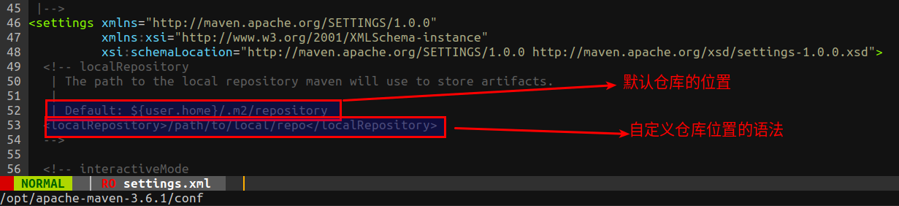

#   maven配置本地仓库
+ date: 2019-07-30 11:11:24
+ description: maven配置本地仓库
+ categories:
  - Java
+ tags:
  - maven
---
#   下载jar包规则
本地仓库是远程仓库的一个缓冲和子集，当你构建Maven项目的时候
1.  首先会从本地仓库查找资源
2.  如果没有，那么Maven会从远程仓库(可能是私服,没有私服就是中央仓库了)下载到你本地仓库,这样在你下次使用的时候就不需要从远程下载了
3.  如果你所需要的jar包版本在本地仓库没有，而且也不存在于远程仓库，Maven在构建的时候会报错，这种情况可能是有些jar包的新版本没有在Maven仓库中及时更新。

#   配置本地仓库



##	默认仓库的存储位置
Maven缺省的本地仓库路径为`${user.home}/.m2/repository`

##	自定义修改仓库的存储位置

可改变默认的 .m2 目录下的默认本地存储库文件夹
具体就是修改如下的Xml代码 
```
<localRepository>自己仓库的存放目录</localRepository>   
```
