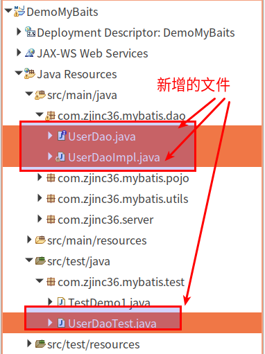

#   MyBatis中的DAO包装
+ date: 2019-07-31 21:48:53
+ description: MyBatis中的DAO包装
+ categories:
  - Java
+ tags:
  - MyBatis
---
#   传统的DAO包装
##  项目基本代码
[_MyBatis工程搭建与增删改查_](/2019/08/01/MyBatis工程搭建与增删改查/#入门案例)

##  实现传统的DAO包装
项目文件基本结构




1.  UserDao.java
```java
package com.zjinc36.mybatis.dao;

import java.util.List;

import com.zjinc36.mybatis.pojo.User;

public interface UserDao {
    //根据用户id查询用户信息
    public User getUserById(Integer id);
    //根据用户名称查找用户信息
    public List<User> getUserByUsername(String username);
    //添加用户
    public void insertUser(User user);
}
```

2.	UserDaoImpl.java
```java
package com.zjinc36.mybatis.dao;

import static org.hamcrest.CoreMatchers.nullValue;

import java.util.List;

import org.apache.ibatis.session.SqlSession;

import com.zjinc36.mybatis.pojo.User;
import com.zjinc36.mybatis.utils.MyBatisUtil;

public class UserDaoImpl implements UserDao {

    @Override
    public User getUserById(Integer id) {
        SqlSession sqlSession = MyBatisUtil.getSession();
        User user = sqlSession.selectOne("user.getUserById", id);
        sqlSession.close();
        return user;
    }

    @Override
    public List<User> getUserByUsername(String username) {
    	SqlSession sqlSession = MyBatisUtil.getSession();
        List<User> list = sqlSession.selectList("user.getUserByUsername",username);
        sqlSession.close();
        return list;
    }
    
    @Override
    public void insertUser(User user) {
    	SqlSession sqlSession = MyBatisUtil.getSession();
        sqlSession.insert("user.insertUser", user);
        sqlSession.commit();
        sqlSession.close();
    }
}
```

3.	UserDaoTest.java
```java
package com.zjinc36.mybatis.test;

import java.util.List;

import org.junit.Test;

import com.zjinc36.mybatis.dao.UserDao;
import com.zjinc36.mybatis.dao.UserDaoImpl;
import com.zjinc36.mybatis.pojo.User;

public class UserDaoTest {
    @Test
    public void testGetUserById() {
        UserDao userDao = new UserDaoImpl();
        User user = userDao.getUserById(1);
        System.out.println(user);
    }

    @Test
    public void testGetUserByUsername() {
        UserDao userDao = new UserDaoImpl();
        List<User> list = userDao.getUserByUsername("张");
        for (User user : list) {
            System.out.println(user);
        }
    }

    @Test
    public void testInsertUser() {
        UserDao userDao = new UserDaoImpl();
        User user = new User();
        user.setUsername("白鸽");
        user.setSex("2");
        user.setAddress("天津");
        userDao.insertUser(user);
    }
}

```

#   动态代理DAO包装

##  项目基本代码
[_MyBatis工程搭建与增删改查_](/2019/08/01/MyBatis工程搭建与增删改查/#入门案例)

##  实现动态代理DAO包装
动态代理只需使用接口，不需使用实现接口的实体类
1.  UserMapper.java
```java
package com.zjinc36.mybatis.mapper;

import java.util.List;

import com.zjinc36.mybatis.pojo.User;

public interface UserMapper {
	// 根据用户id查询用户信息
	public User getUserById(Integer id);

	// 根据用户名称查找用户信息
	public List<User> getUserByUsername(String username);

	// 添加用户
	public void insertUser(User user);
}

```

2.	UserMapper.xml
```xml
<?xml version="1.0" encoding="UTF-8" ?>
<!DOCTYPE mapper PUBLIC "-//mybatis.org//DTD Mapper 3.0//EN" 
    "http://mybatis.org/dtd/mybatis-3-mapper.dtd">
<!-- namespace 命名空间，用于隔离sql语句，后继有重要作用 -->
<!-- 
      在动态代理中：
      1.命名空间的值必须是接口的全路径名 如：com.zjinc36.mybatis.mapper.UserMapper
      2.接口的方法名必须与sql id   一致。如select标签下的id属性必须与UserMapper接口的对应方法名一致
      3.接口的入参 必须与 sql parameterType的类型一致。
      4.接口的返回值必须与sql resultType的类型一致
-->
<mapper namespace="com.zjinc36.mybatis.mapper.UserMapper">
    <!-- 
        在select标签中编写查询的SQL语句， 设置select标签的id属性为getUserById，id属性值必须是唯一的，不能够重复
        使用parameterType属性指明查询时使用的参数类型，resultType属性指明查询返回的结果集类型
        resultType="com.wuhaitao.mybatis.demo1.User"就表示将查询结果封装成一个User类的对象返回
        User类就是cst_customer表所对应的实体类
    -->
    <select id="getUserById" parameterType="int" resultType="com.zjinc36.mybatis.pojo.User">
        <!-- 查询语句这么写是因为，再查询时大量数据时可以节省很多时间 ，在参数上使用' #{}' 来表示 相当于JDBC的？号-->
        SELECT
            `user`.id,
            `user`.username,
            `user`.birthday,
            `user`.sex,
            `user`.address
        FROM `user`
        WHERE id = #{id}
    </select>
    <select id="getUserByUsername" parameterType="string" resultType="com.zjinc36.mybatis.pojo.User">
        <!-- 查询语句这么写是因为，再查询时大量数据时可以节省很多时间 ，在参数上使用' #{}' 来表示 相当于JDBC的？号-->
        <!-- ${} 当参数类型为普通类型时 ，其值只能为value -->
        SELECT
            `user`.id,
            `user`.username,
            `user`.birthday,
            `user`.sex,
            `user`.address
        FROM `user`
        <!-- WHERE username LIKE '%${value}%' -->
        WHERE username LIKE '%${value}%'
    </select>
    
    <!-- 插入用户 -->
    <insert id="insertUser" parameterType="com.zjinc36.mybatis.pojo.User" useGeneratedKeys="true" keyProperty="id">
        <!-- keyProperty指User中的主键属性 -->
        <!-- resultTYype  主键数据类型 -->
        <!-- order  何时执行 -->
        <!-- <selectKey keyProperty="id" resultType="int" order="AFTER">
            SELECT LAST_INSERT_ID()
        </selectKey> -->
        INSERT INTO `user` (`username`,`birthday`, `sex`, `address`) VALUES (#{username},#{birthday}, #{sex}, #{address})
    </insert>
</mapper>
```

3.	SqlMapConfig.xml中将UserMapper.xml引入
```xml
	<!-- 加载映射文件 -->
	<mappers>
		<mapper resource="mybatis/UserMapper.xml" />
	</mappers>
```

4.	测试UserMapperTest.java
```java
package com.zjinc36.mybatis.test;

import java.util.List;

import org.apache.ibatis.session.SqlSession;
import org.junit.Test;

import com.zjinc36.mybatis.mapper.UserMapper;
import com.zjinc36.mybatis.pojo.User;
import com.zjinc36.mybatis.utils.MyBatisUtil;

public class UserMapperTest {
	@Test
	public void testGetUserById() {
		SqlSession sqlSession = MyBatisUtil.getSession();
		// 获取接口的代理实现类，由getMapper()实现
		UserMapper userMapper = sqlSession.getMapper(UserMapper.class);
		User user = userMapper.getUserById(1);
		System.out.println(user);
		sqlSession.close();
	}

	@Test
	public void testGetUserByUsername() {
		SqlSession sqlSession = MyBatisUtil.getSession();
		UserMapper userMapper = sqlSession.getMapper(UserMapper.class);
		List<User> list = userMapper.getUserByUsername("白");
		for (User user : list) {
			System.out.println(user);
		}
		sqlSession.close();
	}

	@Test
	public void testInsertUser() {
		SqlSession sqlSession = MyBatisUtil.getSession();
		UserMapper userMapper = sqlSession.getMapper(UserMapper.class);
		User user = new User();
		user.setUsername("白灵涵");
		user.setSex("2");
		user.setAddress("河南");
		userMapper.insertUser(user);
		sqlSession.commit();
		sqlSession.close();
	}
}
```
