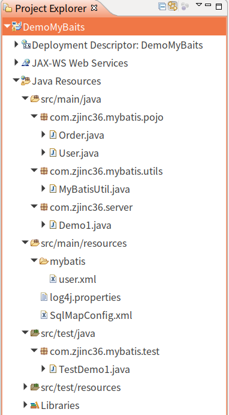

#   MyBatis工程搭建与增删改查
+ date: 2019-07-31 20:55:30
+ description: MyBatis工程搭建与增删改查
+ categories:
  - Java
+ tags:
  - MyBatis
- maven
---
>   基于maven创建工程
#   使用maven创建web工程
[_Eclipse创建maven工程_](/2019/07/31/eclipse创建maven工程/)

#  引入MyBatis需要的依赖
pom.xml
```xml
<project xmlns="http://maven.apache.org/POM/4.0.0"
	xmlns:xsi="http://www.w3.org/2001/XMLSchema-instance"
	xsi:schemaLocation="http://maven.apache.org/POM/4.0.0 http://maven.apache.org/xsd/maven-4.0.0.xsd">
	<modelVersion>4.0.0</modelVersion>
	<groupId>com.zjinc36</groupId>
	<artifactId>DemoMyBaits</artifactId>
	<version>0.0.1-SNAPSHOT</version>
	<packaging>war</packaging>
	<build>
		<plugins>
			<plugin>
				<groupId>org.apache.maven.plugins</groupId>
				<artifactId>maven-compiler-plugin</artifactId>
				<version>3.1</version>
				<configuration>
					<source>1.7</source>
					<target>1.7</target>
					<encoding>utf-8</encoding>
				</configuration>
			</plugin>
		</plugins>
	</build>

	<!-- 属性配置 -->
	<properties>
		<project.build.sourceEncoding>UTF-8</project.build.sourceEncoding>
	</properties>

	<dependencies>
		<dependency>
			<groupId>junit</groupId>
			<artifactId>junit</artifactId>
			<version>4.10</version>
			<scope>test</scope>
		</dependency>

		<!-- 添加MyBatis依赖 -->
		<dependency>
			<groupId>org.mybatis</groupId>
			<artifactId>mybatis</artifactId>
			<version>3.1.1</version>
		</dependency>

		<dependency>
			<groupId>log4j</groupId>
			<artifactId>log4j</artifactId>
			<version>1.2.16</version>
		</dependency>

		<dependency>
			<groupId>org.slf4j</groupId>
			<artifactId>slf4j-api</artifactId>
			<version>1.6.1</version>
		</dependency>

		<dependency>
			<groupId>org.slf4j</groupId>
			<artifactId>slf4j-nop</artifactId>
			<version>1.6.4</version>
		</dependency>

		<!-- https://mvnrepository.com/artifact/mysql/mysql-connector-java -->
		<dependency>
			<groupId>mysql</groupId>
			<artifactId>mysql-connector-java</artifactId>
			<version>5.1.45</version>
		</dependency>

	</dependencies>
</project>
```

#   入门案例
[_参考:Maven学习（八）- 构建MyBatis项目_](https://blog.csdn.net/yuguiyang1990/article/details/8801158)

项目基本结构




##  日志配置
log4j.properties
```
### direct log messages to stdout ###
log4j.appender.stdout=org.apache.log4j.ConsoleAppender
log4j.appender.stdout.Target=System.err
log4j.appender.stdout.layout=org.apache.log4j.PatternLayout
log4j.appender.stdout.layout.ConversionPattern=%d{ABSOLUTE} %5p %c{1}:%L - %m%n

### direct messages to file mylog.log ###
log4j.appender.file=org.apache.log4j.FileAppender
log4j.appender.file.File=/home/zjc/Log
log4j.appender.file.layout=org.apache.log4j.PatternLayout
log4j.appender.file.layout.ConversionPattern=%d{ABSOLUTE} %5p %c{1}:%L - %m%n

### set log levels - for more verbose logging change 'info' to 'debug' ###

log4j.rootLogger=info, stdout
```

##	建表语句
```SQL
create table `user` (
	`id` int(11) not null AUTO_INCREMENT,
	`username` varchar(32) not null,
	`birthday` date default null,
	`sex` char(1) default null,
	`address` varchar(256) default null,
	primary key(`id`)
) engine=innodb default charset=utf8

create table `order` (
	`id` int(11) not null AUTO_INCREMENT,
	`user_id` int(11) not null,
	`number` varchar(256) default null,
	`createtime` date default null,
	`note` char(1) default null,
	primary key(`id`)
) engine=innodb default charset=utf8
```

##	表对应的类
```java
//User.java
package com.zjinc36.mybatis.pojo;
/**
 * 
 * @author zjc
 *	`id` int(11) not null AUTO_INCREMENT,
	`username` varchar(32) not null,
	`birthday` date default null,
	`sex` char(1) default null,
	`address` varchar(256) default null,
 */


public class User {
	private Long id;
	private String username;
	private String birthday;
	private String sex;
	private String address;
	public Long getId() {
		return id;
	}
	public void setId(Long id) {
		this.id = id;
	}
	public String getUsername() {
		return username;
	}
	public void setUsername(String username) {
		this.username = username;
	}
	public String getBirthday() {
		return birthday;
	}
	public void setBirthday(String birthday) {
		this.birthday = birthday;
	}
	public String getSex() {
		return sex;
	}
	public void setSex(String sex) {
		this.sex = sex;
	}
	public String getAddress() {
		return address;
	}
	public void setAddress(String address) {
		this.address = address;
	}
	@Override
	public String toString() {
		return "User [id=" + id + ", username=" + username + ", birthday="
				+ birthday + ", sex=" + sex + ", address=" + address + "]";
	}
}
```
```
//Order.java
package com.zjinc36.mybatis.pojo;
/**
 * 
 * @author zjc
 *	`id` int(11) not null AUTO_INCREMENT,
	`user_id` int(11) not null,
	`number` varchar(256) default null,
	`createtime` date default null,
	`note` char(1) default null,
 */
public class Order {
	private Long id;
	private Long user_id;
	private String number;
	private String createtime;
	private String note;
	public Long getId() {
		return id;
	}
	public void setId(Long id) {
		this.id = id;
	}
	public Long getUser_id() {
		return user_id;
	}
	public void setUser_id(Long user_id) {
		this.user_id = user_id;
	}
	public String getNumber() {
		return number;
	}
	public void setNumber(String number) {
		this.number = number;
	}
	public String getCreatetime() {
		return createtime;
	}
	public void setCreatetime(String createtime) {
		this.createtime = createtime;
	}
	public String getNote() {
		return note;
	}
	public void setNote(String note) {
		this.note = note;
	}
	@Override
	public String toString() {
		return "Order [id=" + id + ", user_id=" + user_id + ", number=" + number
				+ ", createtime=" + createtime + ", note=" + note + "]";
	}
}
```
##	将表和对应类连接起来
SqlMapConfig.xml
用以配置数据库连接池和加载映射文件
```xml
<?xml version="1.0" encoding="UTF-8" ?>
<!DOCTYPE configuration
  PUBLIC "-//mybatis.org//DTD Config 3.0//EN"
  "http://mybatis.org/dtd/mybatis-3-config.dtd">

<configuration>
	<!-- 和spring整合后,environments将废除 -->
	<!-- 可以配置多个连接池,主要用于开发环境和测试环境 -->
	<environments default="development">
		<environment id="development">
			<!-- 使用jdbc事务管理 -->
			<transactionManager type="JDBC" />
			<!-- 数据库连接池 -->
			<dataSource type="POOLED">
				<property name="driver"
					value="com.mysql.jdbc.Driver" />
				<property name="url"
					value="jdbc:mysql://localhost:3306/mybatis?characterEncoding=utf-8" />
				<property name="username" value="root" />
				<property name="password" value="root" />
			</dataSource>
		</environment>
	</environments>
	<!-- 加载映射文件 -->
	<mappers>
		<mapper resource="mybatis/user.xml" />
	</mappers>
</configuration>
```
映射文件,用以写查表语句,也就是指定用哪个SQL语句查哪个类
```xml
<?xml version="1.0" encoding="UTF-8" ?>
<!DOCTYPE mapper
  PUBLIC "-//mybatis.org//DTD Mapper 3.0//EN"
  "http://mybatis.org/dtd/mybatis-3-mapper.dtd">

<mapper namespace="user">
	<!-- 查询所有用户 -->
	<select id="getUserById" resultType="com.zjinc36.mybatis.pojo.User" parameterType="int">
		select * from user where id=#{id2}
	</select>
</mapper>
```

##	调用查表语句
需要一个SqlSessionFactory对象,用来连接数据库,并用以使用xml形式的查表语句
```java
package com.zjinc36.mybatis.utils;

import java.io.IOException;
import java.io.InputStream;

import org.apache.ibatis.io.Resources;
import org.apache.ibatis.session.SqlSession;
import org.apache.ibatis.session.SqlSessionFactory;
import org.apache.ibatis.session.SqlSessionFactoryBuilder;

public class MyBatisUtil {
	private static SqlSessionFactory factory = null;

	private static void initialFactory() {
		String resource = "SqlMapConfig.xml";
		try {
			InputStream in = Resources.getResourceAsStream(resource);
			factory = new SqlSessionFactoryBuilder().build(in);
		} catch (IOException e) {
			e.printStackTrace();
		}
	}

	public static SqlSession getSession() {
		if(factory == null) {
			initialFactory();
		}
		return factory.openSession();
	}
}
```
具体调用写在xml映射文件中的查表语句
```java
package com.zjinc36.server;

import org.apache.ibatis.session.SqlSession;

import com.zjinc36.mybatis.pojo.User;
import com.zjinc36.mybatis.utils.MyBatisUtil;

public class Demo1 {
	public void getUserById () {
		SqlSession session = MyBatisUtil.getSession();
		User user = session.selectOne("user.getUserById", 1);
		System.out.println(user);
		session.close();
	}
}
```

##	测试
```java
package com.zjinc36.mybatis.test;

import org.junit.Test;

import com.zjinc36.server.Demo1;

public class TestDemo1 {
	@Test
	public void testGetUserById() {
		Demo1 demo1 = new Demo1();
		demo1.getUserById();
	}
}
```

#   增删改查操作
[_参考: mybatis系列一：mybatis实现增删改查_](https://blog.csdn.net/wanlong360599336/article/details/71172060)
