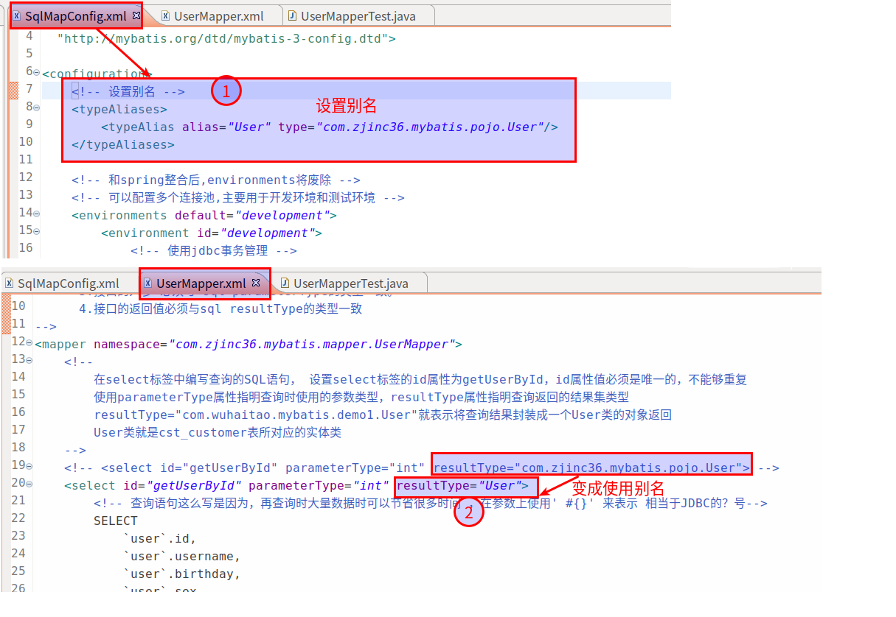
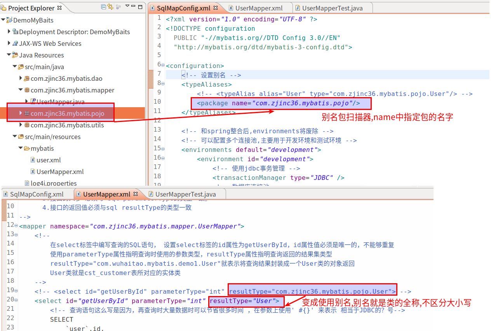

#   MyBatis配置文件详解
+ date: 2019-07-31 22:49:09
+ description: MyBatis配置文件详解
+ categories:
  - Java
+ tags:
  - MyBatis
---
>   [_参考:mybatis配置文件详解_](http://www.mybatis.org/mybatis-3/zh/configuration.html#properties)

挑几个比较重要的说
#   属性加载properties
这些属性都是`可外部配置`且`可动态替换`的，既可以在典型的 Java 属性文件中配置，亦可通过 properties 元素的子元素来传递。例如：
```xml
<!-- 先加载内部标签,后加载外部文件,名称一致时,外部会覆盖内部 -->
<properties resource="org/mybatis/example/config.properties">
  <property name="username" value="dev_user"/>
  <property name="password" value="F2Fa3!33TYyg"/>
</properties>
```

然后其中的属性就可以在整个配置文件中被用来替换需要动态配置的属性值。比如:

```xml
<dataSource type="POOLED">
  <property name="driver" value="${driver}"/>
  <property name="url" value="${url}"/>
  <property name="username" value="${username}"/>
  <property name="password" value="${password}"/>
</dataSource>
```
这个例子中的 username 和 password 将会由 properties 元素中设置的相应值来替换

#	别名配置
类型别名是为 Java 类型设置一个短的名字。 它只和 XML 配置有关，存在的意义仅在于用来减少类完全限定名的冗余

##	单个别名定义
```xml
<typeAliases>
  <typeAlias alias="Author" type="domain.blog.Author"/>
  <typeAlias alias="Blog" type="domain.blog.Blog"/>
</typeAliases>
```
当这样配置时，Blog 可以用在任何使用 domain.blog.Blog 的地方。
具体在代码中的体现


##	指定包名定义
也可以指定一个包名，MyBatis 会在包名下面搜索需要的 Java Bean，比如：
```xml
<typeAliases>
  <package name="domain.blog"/>
</typeAliases>
```
具体在代码中的体现


#	映射器
Mapper配置的几种方法：
第一种（常用）
```xml
<mapper resource=" " />
```
resource指向的是相对于类路径下的目录
如：`<mapper resource="sqlmap/User.xml" />`

第二种
```xml
<mapper url=" " />
```
使用完全限定路径
如：`<mapper url="file:///D:\workspace\mybatis1\config\sqlmap\User.xml" />`

第三种
```xml
<mapper class=" " />
```
使用mapper接口类路径
如：`<mapper class="cn.kang.mapper.UserMapper"/>`
注意：此种方法要求mapper接口名称和mapper映射文件名称相同，且放在同一个目录中。

第四种（推荐）
```xml
<package name=""/>
```
注册指定包下的所有mapper接口
如：`<package name="cn.kang.mapper"/>`
注意：此种方法要求mapper接口名称和mapper映射文件名称相同，且放在同一个目录中。

使用示例：
```xml
<mappers>
	<mapper resource="sqlmap/User.xml"/>
	<package name="cn.kang.mapper"/>
</mappers>
```
