#   maven的工程拆分与聚合
+ date: 2019-07-31 14:21:16
+ description: maven的工程拆分与聚合,依赖传递中的版本冲突问题,依赖的传递范围,重复依赖时maven是如何选择的
+ categories:
  - Java
+ tags:
  - Eclipse
- maven
---
#  工程的拆分与聚合
我们项目拆分成多个子模块之后,独立运行各个模块是无法完成软件项目的要求的,只有把它们整合起来,分工合作才能完成工作,因此需要父工程来管理各个自摸块,把它们聚合在一起

#  继承的理解
类似java的类,都是为了消除重复,父类里有的方法和属性在子类中就不需要再定义和实现了,使用的时候直接调用父类就可以了
我们把工程拆分之后,有一个父工程,子工程要用到的依赖都可以在父工程的pom.xml先定义好,将来子工程开发的时候,就不需要再引坐标了

#  具体拆分实例
[_转载:通过maven对项目进行拆分、聚合_](https://blog.csdn.net/Marvel__Dead/article/details/72601172)


对现在已有maven ssh项目进行拆分，拆分思路：将dao层的代码已经配置文件全体提取出来到一个表现上独立的工程中。同样service、action拆分。

需要创建：
>   +   ssh-parent: 父工程
>   +   ssh-dao:（子模块）
>   +   ssh-service:（子模块）
>   +   ssh-web:（子模块）

拆分完成对拆分后的项目进行聚合，提出概念父工程

## 创建父工程
1.  创建父工程

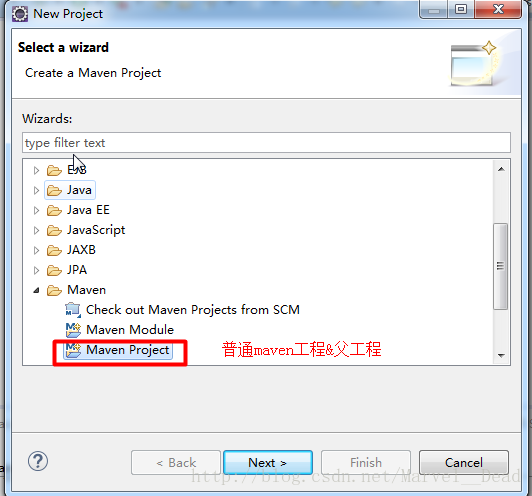

父项目用pom

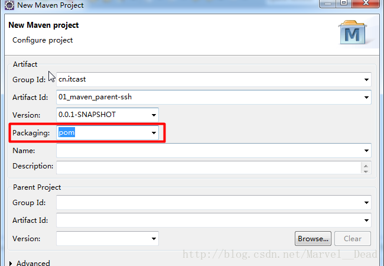


2.  创建好父工程目录结构

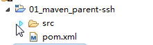

只有pom.xml，可以推断父工程不进行编码

3.  父工程要做的事情：
>   +   项目需要的依赖的信息，在父工程中定义，子模块继承过来
>   +   将各个子模块聚合到一起

4.  将创建父工程发布到本地仓库
如果不把父工程发布到本地仓库，那么，将来service、dao工程发布到本地仓库，会报错。因为它找不到依赖的父工程！！！

##  创建子模块ssh-dao
ssh-dao负责数据访问层：包含dao相关代码&配置文件


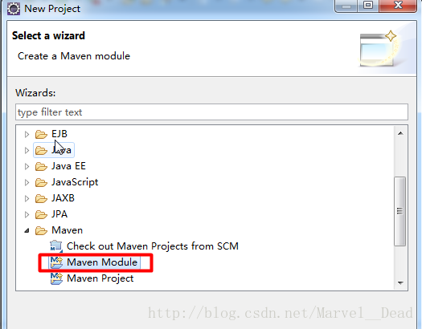

子项目war(如果是web项目的话)和jar中选择

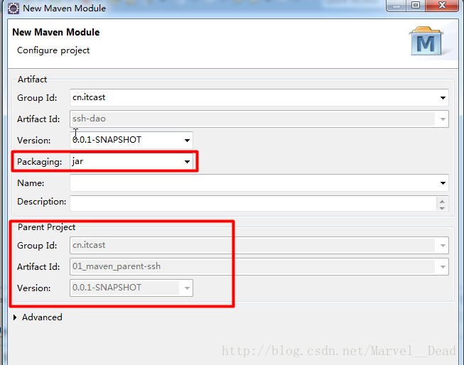


可以看到，Parent Project中GAV都有了信息，那是因为创建Maven Module时，是点在父工程上右键创建的。

将spring的配置文件拆分

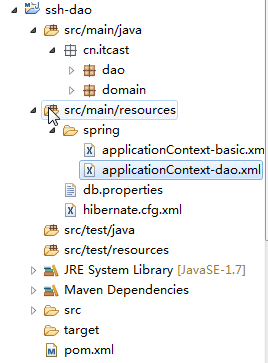


**applicationContext-basic.xml**
项目基础的信息
```xml
<?xml version="1.0" encoding="UTF-8"?>
<beans xmlns="http://www.springframework.org/schema/beans"
    xmlns:xsi="http://www.w3.org/2001/XMLSchema-instance" xmlns:jaxws="http://cxf.apache.org/jaxws"
    xmlns:soap="http://cxf.apache.org/bindings/soap" xmlns:context="http://www.springframework.org/schema/context"
    xmlns:aop="http://www.springframework.org/schema/aop" xmlns:tx="http://www.springframework.org/schema/tx"
    xsi:schemaLocation="http://www.springframework.org/schema/beans
                        http://www.springframework.org/schema/beans/spring-beans.xsd
                        http://www.springframework.org/schema/context
                        http://www.springframework.org/schema/context/spring-context.xsd
                        http://www.springframework.org/schema/aop
                        http://www.springframework.org/schema/aop/spring-aop.xsd
                        http://www.springframework.org/schema/tx
                        http://www.springframework.org/schema/tx/spring-tx.xsd
                        http://cxf.apache.org/bindings/soap
                        http://cxf.apache.org/schemas/configuration/soap.xsd
                        http://cxf.apache.org/jaxws
                        http://cxf.apache.org/schemas/jaxws.xsd">

    <!-- 加载属性文件 -->
    <context:property-placeholder location="classpath:db.properties" />

    <bean id="dataSource" class="com.mchange.v2.c3p0.ComboPooledDataSource">
        <property name="driverClass" value="${jdbc.driverClass}"></property>
        <property name="jdbcUrl" value="${jdbc.jdbcUrl}"></property>
        <property name="user" value="${jdbc.user}"></property>
        <property name="password" value="${jdbc.password}"></property>
    </bean>

    <bean id="sessionFactory"
        class="org.springframework.orm.hibernate5.LocalSessionFactoryBean">
        <property name="dataSource" ref="dataSource"></property>
        <property name="configLocations" value="classpath:hibernate.cfg.xml"></property>
    </bean>

    <!-- 配置事务管理器 -->
    <bean id="transactionManager"
        class="org.springframework.orm.hibernate5.HibernateTransactionManager">
        <property name="sessionFactory" ref="sessionFactory"></property>
    </bean>

    <!-- xml方式管理事务 -->
    <!-- 配置通知：具体增强逻辑 -->
    <tx:advice id="txAdvice">
        <tx:attributes>
            <!-- 匹配业务类中方法名称 -->
            <tx:method name="save*" />
            <tx:method name="update*" />
            <tx:method name="delete*" />
            <tx:method name="find*" read-only="true"/>
            <tx:method name="*"/>
        </tx:attributes>
    </tx:advice>

    <!-- 配置aop -->
    <aop:config>
        <!-- 配置切点：具体哪些方法要增强（真正被增强的方法）-->
        <aop:pointcut expression="execution(* cn.itcast.service.*.*(..))" id="cut"/>
        <!-- 配置切面：将增强逻辑作用到切点  （通知+切入点） -->
        <aop:advisor advice-ref="txAdvice" pointcut-ref="cut"/>
    </aop:config>
    <!-- xml方式管理事务 -->

    <!-- 注解方式管理事务 -->
    <!-- 1、开启注解驱动 2、在service类上或者方法上使用注解@Transactional-->
<!--    <tx:annotation-driven transaction-manager="transactionManager"/> -->
    <!-- 注解方式管理事务 -->
</beans>
```

**applicationContext-dao.xml**
dao层bean对象
```xml
<?xml version="1.0" encoding="UTF-8"?>
<beans xmlns="http://www.springframework.org/schema/beans"
    xmlns:xsi="http://www.w3.org/2001/XMLSchema-instance" xmlns:jaxws="http://cxf.apache.org/jaxws"
    xmlns:soap="http://cxf.apache.org/bindings/soap" xmlns:context="http://www.springframework.org/schema/context"
    xmlns:aop="http://www.springframework.org/schema/aop" xmlns:tx="http://www.springframework.org/schema/tx"
    xsi:schemaLocation="http://www.springframework.org/schema/beans
                        http://www.springframework.org/schema/beans/spring-beans.xsd
                        http://www.springframework.org/schema/context
                        http://www.springframework.org/schema/context/spring-context.xsd
                        http://www.springframework.org/schema/aop
                        http://www.springframework.org/schema/aop/spring-aop.xsd
                        http://www.springframework.org/schema/tx
                        http://www.springframework.org/schema/tx/spring-tx.xsd
                        http://cxf.apache.org/bindings/soap
                        http://cxf.apache.org/schemas/configuration/soap.xsd
                        http://cxf.apache.org/jaxws
                        http://cxf.apache.org/schemas/jaxws.xsd">
    <!-- 配置dao对象 -->
    <bean id="customerDao" class="cn.itcast.dao.impl.CustomerDaoImpl">
        <property name="sessionFactory" ref="sessionFactory"></property>
    </bean>
</beans>
```

##  创建子模块ssh-service

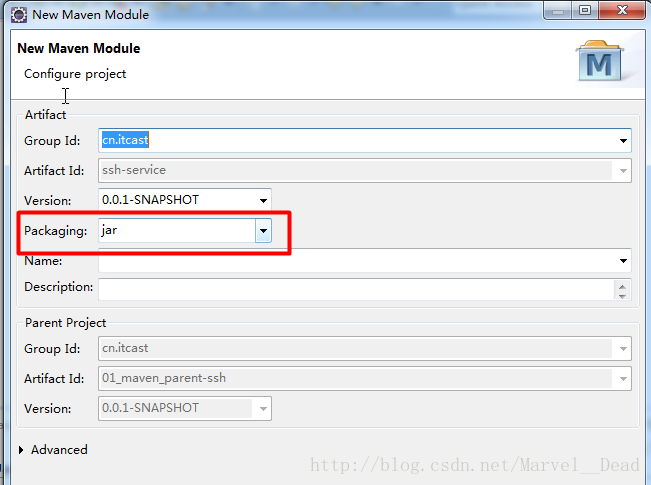

子项目war(如果是web项目的话)和jar中选择

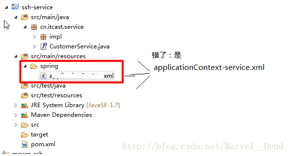


**applicationContext-service.xml**
```xml
<?xml version="1.0" encoding="UTF-8"?>
<beans xmlns="http://www.springframework.org/schema/beans"
    xmlns:xsi="http://www.w3.org/2001/XMLSchema-instance" xmlns:jaxws="http://cxf.apache.org/jaxws"
    xmlns:soap="http://cxf.apache.org/bindings/soap" xmlns:context="http://www.springframework.org/schema/context"
    xmlns:aop="http://www.springframework.org/schema/aop" xmlns:tx="http://www.springframework.org/schema/tx"
    xsi:schemaLocation="http://www.springframework.org/schema/beans
                        http://www.springframework.org/schema/beans/spring-beans.xsd
                        http://www.springframework.org/schema/context
                        http://www.springframework.org/schema/context/spring-context.xsd
                        http://www.springframework.org/schema/aop
                        http://www.springframework.org/schema/aop/spring-aop.xsd
                        http://www.springframework.org/schema/tx
                        http://www.springframework.org/schema/tx/spring-tx.xsd
                        http://cxf.apache.org/bindings/soap
                        http://cxf.apache.org/schemas/configuration/soap.xsd
                        http://cxf.apache.org/jaxws
                        http://cxf.apache.org/schemas/jaxws.xsd">
    <!-- 配置service对象 -->
    <bean id="customerService" class="cn.itcast.service.impl.CustomerServiceImpl">
        <property name="customerDao" ref="customerDao"></property>
    </bean>
</beans>
```
**service层的pom.xml**

```xml
<project xmlns="http://maven.apache.org/POM/4.0.0" xmlns:xsi="http://www.w3.org/2001/XMLSchema-instance" xsi:schemaLocation="http://maven.apache.org/POM/4.0.0 http://maven.apache.org/xsd/maven-4.0.0.xsd">
  <modelVersion>4.0.0</modelVersion>
  <parent>
    <groupId>cn.itcast</groupId>
    <artifactId>01_maven_parent-ssh</artifactId>
    <version>0.0.1-SNAPSHOT</version>
  </parent>
  <artifactId>ssh-service</artifactId>

  <dependencies>
    <dependency>
        <groupId>cn.itcast</groupId>
        <artifactId>ssh-dao</artifactId>
        <version>0.0.1-SNAPSHOT</version>
    </dependency>
    <dependency>
        <groupId>junit</groupId>
        <artifactId>junit</artifactId>
        <version>4.9</version>
    </dependency>
  </dependencies>
</project>
```
将ssh-dao工程打包到本地仓库(打包用install)；
在service工程pom.xml文件添加ssh-dao的依赖

##	创建子模块ssh-web：war

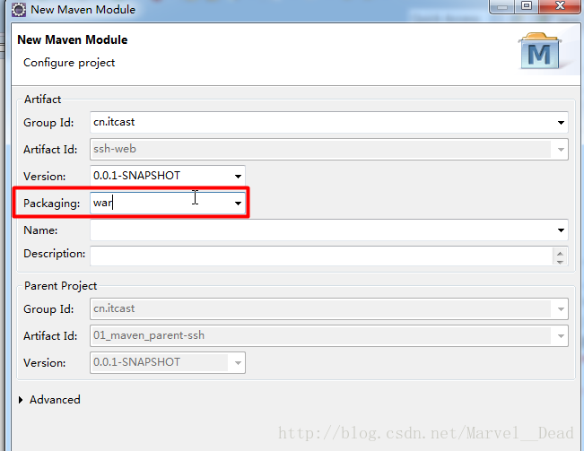

子项目war(如果是web项目的话)和jar中选择

在ssh-web项目中添加service工程依赖。pom.xml
```xml
<project xmlns="http://maven.apache.org/POM/4.0.0" xmlns:xsi="http://www.w3.org/2001/XMLSchema-instance" xsi:schemaLocation="http://maven.apache.org/POM/4.0.0 http://maven.apache.org/xsd/maven-4.0.0.xsd">
  <modelVersion>4.0.0</modelVersion>
  <parent>
    <groupId>cn.itcast</groupId>
    <artifactId>01_maven_parent-ssh</artifactId>
    <version>0.0.1-SNAPSHOT</version>
  </parent>
  <artifactId>ssh-web</artifactId>
  <packaging>war</packaging>
  <dependencies>
    <dependency>
        <groupId>cn.itcast</groupId>
        <artifactId>ssh-service</artifactId>
        <version>0.0.1-SNAPSHOT</version>
    </dependency>
  </dependencies>
</project>
```

web.xml
```xml
<?xml version="1.0" encoding="UTF-8"?>
<web-app xmlns:xsi="http://www.w3.org/2001/XMLSchema-instance"
    xmlns="http://java.sun.com/xml/ns/javaee"
    xsi:schemaLocation="http://java.sun.com/xml/ns/javaee http://java.sun.com/xml/ns/javaee/web-app_2_5.xsd"
    version="2.5">
    <display-name>01_maven_ssh</display-name>
    <welcome-file-list>
        <welcome-file>index.html</welcome-file>
        <welcome-file>index.htm</welcome-file>
        <welcome-file>index.jsp</welcome-file>
        <welcome-file>default.html</welcome-file>
        <welcome-file>default.htm</welcome-file>
        <welcome-file>default.jsp</welcome-file>
    </welcome-file-list>

    <!-- 配置Struts核心过滤器 -->
    <filter>
        <filter-name>struts</filter-name>
        <filter-class>org.apache.struts2.dispatcher.ng.filter.StrutsPrepareAndExecuteFilter</filter-class>
    </filter>
    <filter-mapping>
        <filter-name>struts</filter-name>
        <url-pattern>/*</url-pattern>
    </filter-mapping>


    <!-- 配置监听器：默认加载WEB-INF/applicationContext.xml -->
    <listener>
        <listener-class>org.springframework.web.context.ContextLoaderListener</listener-class>
    </listener>

    <!-- 通过上下文参数指定spring配置文件路径 -->
    <context-param>
        <param-name>contextConfigLocation</param-name>
        <param-value>classpath*:spring/applicationContext-*.xml</param-value>
    </context-param>

</web-app>
```


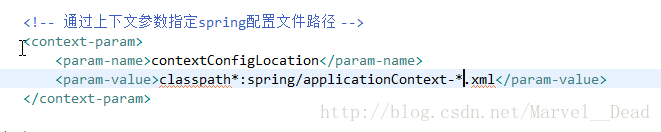


##	运行方式
1.  Maven方式
方式1：运行父工程(tomcat:run)。父工程会自动将各个子模块聚合到一起。将ssh-web打war包发布到tomcat
方式2：直接运行web工程(tomcat:run)

2.  其他方式
部署到tomcat


#  maven如何处理重复引用依赖
[_转载:maven的依赖原则_](https://blog.csdn.net/z1143709608/article/details/89974902)

当一个项目中出现重复引用依赖jar包时，maven一般有如下三种原则处理jar

maven的依赖原则
##	最短路径原则
```
A -> B -> C -> D(V1)
F -> G -> D(V2)
```
这个时候项目中就出现了两个版本的D，这时maven会采用最短路径原则，选择V2版本的D，因为V1版本的D是由A包间接依赖的，整个依赖路径长度为3，而V2版本的D是由F包间接依赖的，整个依赖路径长度为2。

##	优先声明原则
```
A -> B -> D(V1)
F -> G -> D(V2)
```
如果两个jar包版本路径深度相同，则使用优先声明的版本

##	多次直引不同版本的jar时，使用最后声明的版本
```xml
<dependency>
    <groupId>org.springframework</groupId>
    <artifactId>spring-core</artifactId>
    <version>4.3.17.RELEASE</version>
</dependency>

<dependency>
    <groupId>org.springframework</groupId>
    <artifactId>spring-core</artifactId>
    <version>4.3.20.RELEASE</version>
</dependency>
```
如果再pom文件中，同时引用了如上两个版本，则会使用4.3.20.RELEASE版本

#  依赖传递中的版本冲突问题
[_转载:Eclipse maven 解决jar包版本冲突_](https://blog.csdn.net/qq_35568099/article/details/80433861)

在使用maven进行项目依赖管理的时候，有时候会出现一种情况，多个不同的开源组件都依赖了另外一个组件，但是这个组件的版本却不一样，在maven依赖中就会看到两个版本不同的jar,通常我们可以根据实际情况排除其中一个,当然前提是这个版本没有太大的差异，兼容
## 方法一
手工添加配置：在dependency标签里使用子标签exclusions，比如A组件使用了zookeeper 3.3.3的依赖包，B组件使用了zookeeper 3.3.6的依赖包，这时候我们要排除3.3.3这个版本可以这样做：

```xml
      <dependency>
        <groupId>com.xxx</groupId>
        <artifactId>A</artifactId>
          <exclusions>
              <exclusion>
                  <groupId>org.apache.zookeeper</groupId>
                  <artifactId>zookeeper</artifactId>
              </exclusion>
          </exclusions>
      </dependency>
```

## 方法二
通过eclipse的pom编辑工具：

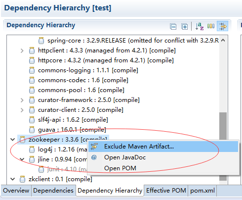


另外也可以使用命令mvn project-info-reports:dependencies  查看项目依赖情况。

#	依赖的传递范围(了解)

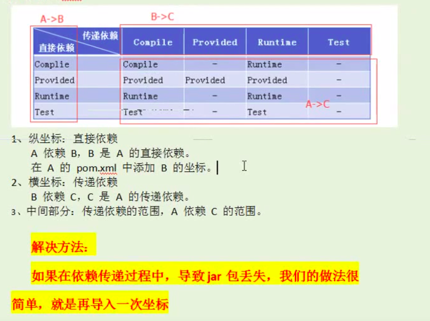


#   版本锁定
这样做的好处：统一管理项目的版本号，确保应用的各个项目的依赖和版本一致，才能保证测试的和发布的是相同的成果因此，在顶层pom中定义共同的依赖关系。同时可以避免在每个使用的子项目中都声明一个版本号，这样想升级或者切换到另一个版本时，只需要在父类容器里更新，不需要任何一个子项目的修改；如果某个子项目需要另外一个版本号时，只需要在dependencies中声明一个版本号即可。子类就会使用子类声明的版本号，不继承于父类版本号。
##	方式一:使用dependencyManagement
版本锁定（指定项目中依赖的版本）:只是起到指定依赖版本的作用，并不会导入依赖
```xml
<dependencyManagement>
    <dependencies>
        <dependency>
             <groupId>org.springframework</groupId>
             <artifactId>spring-bean</artifactId>
             <version>4.2.4.RELEASE</version>
      </dependency>
   </dependencies>
</dependencyManagement>
```
dependencyManagement其实只是一个管理jar的作用,是管理jar的版本,其他他的什么作用都没有,只是定义找到该jar的三维坐标,并不是真正的去执行下载的jar的功能.

有depencyManagement的时候,maven按如下规则寻找jar包依赖
+   在dependencies中的依赖中如果没有声明jar的版本,就到dependenciesManage中去找,找到就使用,没有就报错
+   在dependencies中声明jar的版本,则使用该版本,不管在dependenciesManage中有没有声明jar的version,都以该jar的版本为主.

版本锁定之后,子项目引入对应的jar包时,是没有版本号的
    因为,在我们项目顶层的POM文件中，我们会看到dependencyManagement元素。通过它元素来管理jar包的版本，让子项目中引用一个依赖而不用显示的列出版本号。Maven会沿着父子层次向上走，直到找到一个拥有dependencyManagement元素的项目，然后它就会使用在这个dependencyManagement元素中指定的版本号。

DepencyManagement应用场景
+   当我们的项目模块很多的时候，我们使用Maven管理项目非常方便，帮助我们管理构建、文档、报告、依赖、scms、发布、分发的方法。可以方便的编译代码、进行依赖管理、管理二进制库等等。
+   由于我们的模块很多，所以我们又抽象了一层，抽出一个itoo-base-parent来管理子项目的公共的依赖。为了项目的正确运行，必须让所有的子项目使用依赖项的统一版本，必须确保应用的各个项目的依赖项和版本一致，才能保证测试的和发布的是相同的结果。


**Dependencies**
相对于dependencyManagement，所有生命在dependencies里的依赖都会自动引入，并默认被所有的子项目继承

dependencies和dependencymanagement的区别
1.  dependencies即使在子项目中不写该依赖项，那么子项目仍然会从父项目中继承该依赖项（全部继承）
2.  dependencyManagement里只是声明依赖，并不实现引入，因此子项目需要显示的声明需要用的依赖。如果不在子项目中声明依赖，是不会从父项目中继承下来的；只有在子项目中写了该依赖项，并且没有指定具体版本，才会从父项目中继承该项，并且version和scope都读取自父pom;另外如果子项目中指定了版本号，那么会使用子项目中指定的jar版本。

##  方式二:提取常量
提取常量放入pom.xml的属性中
```xml
<properties>
　　<spring.version>4.2.4.RELEASE</spring.version>
　　<hibernate.version>5.0.7.Final</hibernate.version>
　　<struts.version>2.3.24</struts.verson>
</properties>
```
引入属性通过ognl表达式带入到依赖的版本中：例如${spring.version}


