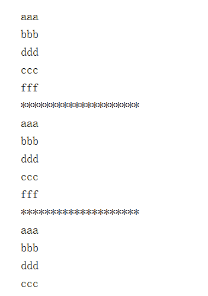
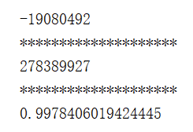
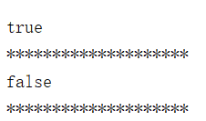
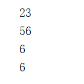
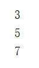

# Java8函数式接口和Consumer、Supplier、Predicate、Function说明

---

# @FunctionalInterface注解
与@Override 注解的作用类似，Java 8中专门为函数式接口引入了一个新的注解：@FunctionalInterface 。该注解可用于一个接口的定义上,`一旦使用该注解来定义接口，编译器将会强制检查该接口是否确实有且仅有一个抽象方法`，否则将会报错。但是这个注解不是必须的，只要符合函数式接口的定义，那么这个接口就是函数式接口。

# 自定义函数式接口

按照下面的格式定义，你也能写出函数式接口：
```java
 @FunctionalInterface
 修饰符 interface 接口名称 {
    返回值类型 方法名称(可选参数信息);
    // 其他非抽象方法内容
 }
```

虽然@FunctionalInterface注解不是必须的，但是自定义函数式接口最好还是都加上，一是养成良好的编程习惯，二是防止他人修改，一看到这个注解就知道是函数式接口，避免他人往接口内添加抽象方法造成不必要的麻烦。

```java
@FunctionalInterface
public interface MyFunction {
    void print(String s);
}
```

看上图是我自定义的一个函数式接口，那么这个接口的作用是什么呢？就是输出一串字符串，属于消费型接口，是模仿Consumer接口写的，只不过这个没有使用泛型，而是将参数具体类型化了，不知道Consumer没关系，下面会介绍到，其实java8中提供了很多常用的函数式接口，Consumer就是其中之一，一般情况下都不需要自己定义，直接使用就好了。那么怎么使用这个自定义的函数式接口呢？我们可以用函数式接口作为参数，调用时传递Lambda表达式。如果一个方法的参数是Lambda，那么这个参数的类型一定是函数式接口。例如：

```java
public class MyFunctionTest {
    public static void main(String[] args) {
        String text = "试试自定义函数好使不";
        // 这里Myfunction的位置传入System.out::print函数,即用System.out::print继承MyFunction
        printString(text, System.out::print);
    }

    private static void printString(String text, MyFunction myFunction) {
        myFunction.print(text);
    }
}
```

执行以后就会输出“试试自定义函数好使不”这句话，如果某天需求变了，我不想输出这句话了，想输出别的，那么直接替换text就好了。函数式编程是没有副作用的，最大的好处就是函数的内部是无状态的，既输入确定输出就确定。函数式编程还有更多好玩的套路，这就需要靠大家自己探索了。

# 常用函数式接口
这几个接口都在 java.util.function 
```java
Consumer<T>  消费型接口 消费对象
 void accept(T t);

Supplier<T>  供给型接口 生成对象
 T get();

Predicate<T>  断言型接口 进行条件判断
 boolean test(T t);

Function<R,T>  函数型接口 指定特定功能
 R apply(T t);
```

那么，下面，我们从具体的应用场景来讲讲这个接口的用法！

## Consumer接口

从字面意思上我们就可以看得出啦，consumer接口就是一个消费型的接口，通过传入参数，然后输出值，就是这么简单，Java8 的一些方法看起来很抽象，其实，只要你理解了就觉得很好用，并且非常的简单。
我们下面就先看一个例子，然后再来分析这个接口。

### Consumer实例

```java
/**
     * consumer接口测试
     */
    @Test
    public void test_Consumer() {
        //① 使用consumer接口实现方法
        Consumer<String> consumer = new Consumer<String>() {

            @Override
            public void accept(String s) {
                System.out.println(s);
            }
        };
        Stream<String> stream = Stream.of("aaa", "bbb", "ddd", "ccc", "fff");
        stream.forEach(consumer);

        System.out.println("********************");

        //② 使用lambda表达式，forEach方法需要的就是一个Consumer接口
        stream = Stream.of("aaa", "bbb", "ddd", "ccc", "fff");
        Consumer<String> consumer1 = (s) -> System.out.println(s);//lambda表达式返回的就是一个Consumer接口
        stream.forEach(consumer1);
        //更直接的方式
        //stream.forEach((s) -> System.out.println(s));
        System.out.println("********************");

        //③ 使用方法引用，方法引用也是一个consumer
        stream = Stream.of("aaa", "bbb", "ddd", "ccc", "fff");
        Consumer consumer2 = System.out::println;
        stream.forEach(consumer);
        //更直接的方式
        //stream.forEach(System.out::println);
    }

```

输出结果




### 实例分析
+   ① consumer接口分析
    *   在代码①中，我们直接创建 Consumer 接口，并且实现了一个名为 accept 的方法，这个方法就是这个接口的关键了。
    *   我们看一下 accept  方法；这个方法传入一个参数，不返回值。当我们发现 forEach 需要一个 Consumer 类型的参数的时候，传入之后，就可以输出对应的值了。
+   ② lambda 表达式作为 consumer

```java
Consumer<String> consumer1 = (s) -> System.out.println(s);//lambda表达式返回的就是一个Consumer接口
```

在上面的代码中，我们使用下面的 lambda 表达式作为 Consumer。仔细的看一下你会发现，lambda 表达式返回值就是一个 Consumer；所以，你也就能够理解为什么 forEach 方法可以使用 lamdda 表达式作为参数了吧。

+   ③ 方法引用作为 consumer

```java
Consumer consumer2 = System.out::println;
```
在上面的代码中，我们用了一个方法引用的方式作为一个 Consumer ，同时也可以传给 forEach 方法。

### 其他 Consumer 接口
除了上面使用的 Consumer 接口，还可以使用下面这些 Consumer 接口。
IntConsumer、DoubleConsumer、LongConsumer、BiConsumer，使用方法和上面一样。

### Consumer 总结

看完上面的实例我们可以总结为几点。

+   ① Consumer是一个接口，并且只要实现一个 accept 方法，就可以作为一个`消费者`输出信息。
+   ② 其实，lambda 表达式、方法引用的返回值都是 Consumer 类型，所以，他们能够作为 forEach 方法的参数，并且输出一个值。

## Supplier 接口

Supplier 接口是一个供给型的接口，其实，说白了就是一个容器，可以用来存储数据，然后可以供其他方法使用的这么一个接口，是不是很明白了，如果还是不明白，看看下面的例子，一定彻底搞懂！

### Supplier实例

```java
/**
 * Supplier接口测试，supplier相当一个容器或者变量，可以存储值
 */
@Test
public void test_Supplier() {
    //① 使用Supplier接口实现方法,只有一个get方法，无参数，返回一个值
    Supplier<Integer> supplier = new Supplier<Integer>() {
        @Override
        public Integer get() {
            //返回一个随机值
            return new Random().nextInt();
        }
    };

    System.out.println(supplier.get());

    System.out.println("********************");

    //② 使用lambda表达式，
    supplier = () -> new Random().nextInt();
    System.out.println(supplier.get());
    System.out.println("********************");

    //③ 使用方法引用
    Supplier<Double> supplier2 = Math::random;
    System.out.println(supplier2.get());
}

```
输出结果




### 实例分析

+   ① Supplier接口分析

```java
Supplier<Integer> supplier = new Supplier<Integer>() {
            @Override
            public Integer get() {
                //返回一个随机值
                return new Random().nextInt();
            }
        };

```
看一下这段代码，我们通过创建一个 Supplier 对象，实现了一个 get 方法，这个方法无参数，返回一个值；所以，每次使用这个接口的时候都会返回一个值，并且保存在这个接口中，所以说是一个容器。

+   ② lambda表达式作为 Supplier

```java
//② 使用lambda表达式，
supplier = () -> new Random().nextInt();
System.out.println(supplier.get());
System.out.println("********************");

```

上面的这段代码，我们使用 lambda 表达式返回一个 Supplier类型的接口，然后，我们调用 get 方法就可以获取这个值了。

+   ③ 方法引用作为 Supplier

```java
//③ 使用方法引用
Supplier<Double> supplier2 = Math::random;
System.out.println(supplier2.get());

```

### Supplier 实例2

我们看完第一个实例之后，我们应该有一个了解了，下面再看一个。

```java
    /**
     * Supplier接口测试2，使用需要Supplier的接口方法
     */
    @Test
    public void test_Supplier2() {
        Stream<Integer> stream = Stream.of(1, 2, 3, 4, 5);
        //返回一个optional对象
        Optional<Integer> first = stream.filter(i -> i > 4)
                .findFirst();

        //optional对象有需要Supplier接口的方法
        //orElse，如果first中存在数，就返回这个数，如果不存在，就放回传入的数
        System.out.println(first.orElse(1));
        System.out.println(first.orElse(7));

        System.out.println("********************");

        Supplier<Integer> supplier = new Supplier<Integer>() {
            @Override
            public Integer get() {
                //返回一个随机值
                return new Random().nextInt();
            }
        };

        //orElseGet，如果first中存在数，就返回这个数，如果不存在，就返回supplier返回的值
        System.out.println(first.orElseGet(supplier));
    }
```

输出结果


代码分析

```java
Optional<Integer> first = stream.filter(i -> i > 4).findFirst();
```
使用这个方法获取到一个 Optional 对象，然后，在 Optional 对象中有 orElse 方法 和 orElseGet 是需要一个 Supplier 接口的。
```java
//optional对象有需要Supplier接口的方法
        //orElse，如果first中存在数，就返回这个数，如果不存在，就放回传入的数
        System.out.println(first.orElse(1));
        System.out.println(first.orElse(7));

        System.out.println("********************");

        Supplier<Integer> supplier = new Supplier<Integer>() {
            @Override
            public Integer get() {
                //返回一个随机值
                return new Random().nextInt();
            }
        };

        //orElseGet，如果first中存在数，就返回这个数，如果不存在，就返回supplier返回的值
        System.out.println(first.orElseGet(supplier));
```

+   orElse：如果first中存在数，就返回这个数，如果不存在，就放回传入的数
+   orElseGet：如果first中存在数，就返回这个数，如果不存在，就返回supplier返回的值

### 其他 Supplier 接口

除了上面使用的 Supplier 接口，还可以使用下面这些 Supplier 接口。

+   IntSupplier
+   DoubleSupplier
+   LongSupplier
+   BooleanSupplier

使用方法和上面一样。

### Supplier 总结

+   ① Supplier 接口可以理解为一个容器，用于装数据的。
+   ② Supplier 接口有一个 get 方法，可以返回值。

## Predicate 接口

Predicate 接口是一个断言型接口(谓词型接口)，其实，这个就是一个类似于 bool 类型的判断的接口，后面看看就明白了。

### Predicate 实例

```java
/**
 * Predicate谓词测试，谓词其实就是一个判断的作用类似bool的作用
 */
@Test
public void test_Predicate() {
    //① 使用Predicate接口实现方法,只有一个test方法，传入一个参数，返回一个bool值
    Predicate<Integer> predicate = new Predicate<Integer>() {
        @Override
        public boolean test(Integer integer) {
            if(integer > 5){
                return true;
            }
            return false;
        }
    };

    System.out.println(predicate.test(6));

    System.out.println("********************");

    //② 使用lambda表达式，
    predicate = (t) -> t > 5;
    System.out.println(predicate.test(1));
    System.out.println("********************");

}
```

输出结果




### 实例分析

+   ① Predicate 接口分析

```java
//① 使用Predicate接口实现方法,只有一个test方法，传入一个参数，返回一个bool值
Predicate<Integer> predicate = new Predicate<Integer>() {
    @Override
    public boolean test(Integer integer) {
        if(integer > 5){
            return true;
        }
        return false;
    }
};

```

这段代码中，创建了一个 Predicate 接口对象，其中，实现类 test 方法，需要传入一个参数，并且返回一个 bool 值，所以这个接口作用就是判断！

```java
System.out.println(predicate.test(6));
```

再看，调用 test 方法，传入一个值，就会返回一个 bool 值。

+   ② 使用lambda表达式作为 predicate

```java
//② 使用lambda表达式，
        predicate = (t) -> t > 5;
        System.out.println(predicate.test(1));
        System.out.println("********************");
```

lambda 表达式返回一个 Predicate 接口，然后调用 test 方法！

### Predicate 接口实例2
```java
/**
 * Predicate谓词测试，Predicate作为接口使用
 */
@Test
public void test_Predicate2() {
    //① 将Predicate作为filter接口，Predicate起到一个判断的作用
    Predicate<Integer> predicate = new Predicate<Integer>() {
        @Override
        public boolean test(Integer integer) {
            if(integer > 5){
                return true;
            }
            return false;
        }
    };

    Stream<Integer> stream = Stream.of(1, 23, 3, 4, 5, 56, 6, 6);
    List<Integer> list = stream.filter(predicate).collect(Collectors.toList());
    list.forEach(System.out::println);

    System.out.println("********************");
}
```

输出结果



这段代码，首先创建一个 Predicate 对象，然后实现 test 方法，在 test 方法中做一个判断：如果传入的参数大于 5 ，就返回 true，否则返回 false；

```java
Stream<Integer> stream = Stream.of(1, 23, 3, 4, 5, 56, 6, 6);
        List<Integer> list = stream.filter(predicate).collect(Collectors.toList());
        list.forEach(System.out::println);

```
这段代码调用 Stream 的 filter 方法，filter 方法需要的参数就是 Predicate 接口，所以在这里只要大于 5 的数据就会输出。

### Predicate 接口总结
① Predicate 是一个谓词型接口，其实只是起到一个判断作用。
② Predicate 通过实现一个 test 方法做判断。


## Function 接口
Function 接口是一个功能型接口，它的一个作用就是转换作用，将输入数据转换成另一种形式的输出数据。
### Function 接口实例

```java
/**
 * Function测试，function的作用是转换，将一个值转为另外一个值
 */
@Test
public void test_Function() {
    //① 使用map方法，泛型的第一个参数是转换前的类型，第二个是转化后的类型
    Function<String, Integer> function = new Function<String, Integer>() {
        @Override
        public Integer apply(String s) {
            return s.length();//获取每个字符串的长度，并且返回
        }
    };

    Stream<String> stream = Stream.of("aaa", "bbbbb", "ccccccv");
    Stream<Integer> stream1 = stream.map(function);
    stream1.forEach(System.out::println);

    System.out.println("********************");

}
```
输出结果




### 代码分析

① Function 接口分析
```java
//① 使用map方法，泛型的第一个参数是转换前的类型，第二个是转化后的类型
        Function<String, Integer> function = new Function<String, Integer>() {
            @Override
            public Integer apply(String s) {
                return s.length();//获取每个字符串的长度，并且返回
            }
        };
```

这段代码创建了一个 Function 接口对象，实现了一个 apply 方法，这个方法有一个输入参数和一个输出参数。其中，泛型的第一个参数是转换前的类型，第二个是转化后的类型。
在上面的代码中，就是获取字符串的长度，然后将每个字符串的长度作为返回值返回。
② 重要应用 map 方法

```java
 Stream<String> stream = Stream.of("aaa", "bbbbb", "ccccccv");
        Stream<Integer> stream1 = stream.map(function);
        stream1.forEach(System.out::println);
```

在 Function 接口的重要应用不得不说 Stream 类的 map 方法了，map 方法传入一个 Function 接口，返回一个转换后的 Stream类。
### 其他 Function 接口
除了上面使用的 Function 接口，还可以使用下面这些 Function 接口。
IntFunction 、DoubleFunction 、LongFunction 、ToIntFunction 、ToDoubleFunction 、DoubleToIntFunction 等等，使用方法和上面一样。

### Function 接口总结
① Function 接口是一个功能型接口，是一个转换数据的作用。
② Function 接口实现 apply 方法来做转换。

# 总结
通过前面的介绍，已经对Consumer、Supplier、Predicate、Function这几个接口有详细的了解了，其实，这几个接口并不是很难，只是有点抽象，多加理解会发现很简单，并且特别好用！

# 参考
+   [Java8之Consumer、Supplier、Predicate和Function攻略](https://juejin.im/post/6844903904837107720)
+   [Java8-Lambda表达式-函数式接口](https://cloud.tencent.com/developer/article/1637128)
+   [「Java8系列」神奇的函数式接口](https://juejin.im/post/6844903892166148110)

