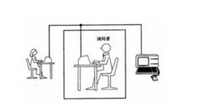
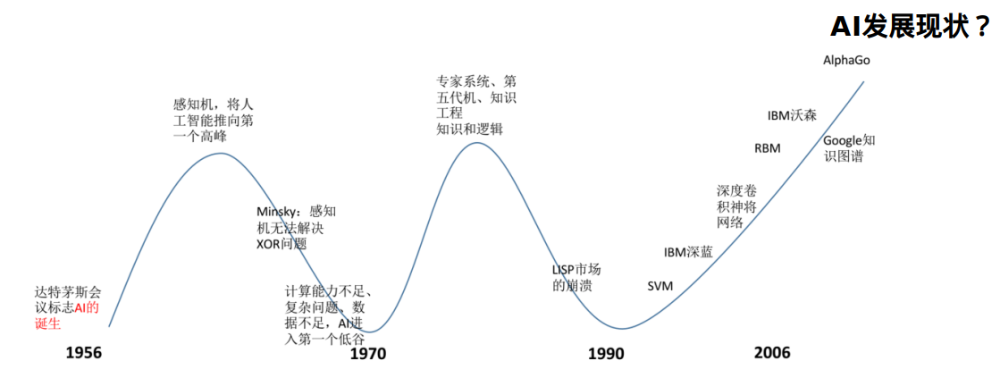

#   人工智能的基本说明
+ date: 2019-08-17 08:56:39
+ description: 人工智能的基本说明
+ categories:
  - 人工智能
+ tags:
  - 人工智能
---
#   什么是人工智能？
##  定义
人工智能（Artificial Intelligence），英文缩写为AI。它是研究、开发用于模拟、延伸和扩展人的智能的理论、方法、技术及应用系统的一门新的技术科学。人工智能是计算机科学的一个分支，它试图了解智能的实质，并生产出一种新的能以人类智能相似的方式作出反应的智能机器

##  应用场景
+   机器人
+   语音识别
+   图像识别
+   自然语言处理
+   专家系统
+   知识工程
+   机器学习

人工智能是对人的意识、思维的信息过程的模拟。人工智能不是人的智能，但能像人那样的思考，甚至超过人的智能。

#   弱人工智能、强人工智能、超人工智能
+   弱人工智能Artificial Narrow Intelligence(ANI):弱人工智能是擅长于单个方面的人工智能。
+   强人工智能Artificial General Intelligence(AGI):人类级别的人工智能。强人工智能是指在各方面都能喝人类比肩的人工智能，人类能干的脑力活它都能干。
+   超人工智能Artificial Super Intelligence(ASI):知名人工智能思想家Nick Bostrom把超级智能定义为"在几乎所有领域都比最聪明的人类大脑都聪明很多，包括科学创新、通识和社交技能"。

#   图灵测试




#   人工智能的历史
+   1956年夏天：达特茅斯会议，提出“人工智能“
+   20世纪60年代：感知机
+   20世纪70年代：专家系统、知识工程
+   20世纪80年代：日本第五代机
+   20世纪90年代：统计机器学习
+   2006年：深度学习
+   2012年：卷积神经网络





#   机器是否具有真正的智能
+   人眼中的图像


+   计算机眼中的图像


目前只能实现感知智能，尚无法实现推理智能还有很长的路要走

+   计算机无法真正理解符号、数字背后的语义
+   所有的行为都是在“猜”
+   图像、语音：原始信息，感知智能
+   语言、艺术：人工信息，推理智能


#   对抗生成网络
对抗生成网络基本思想
```
有1000张人脸
G => 生成器 => 从1000张人脸学习生成假脸
D => 判别器 => 从1000张人脸学习判断是否是假脸

形成对抗
D => 判别生成器生成的脸是否是假脸
G => 生成让D判别不出真假的脸
```
