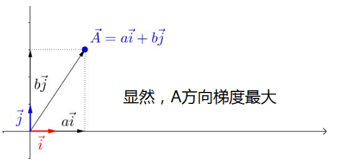
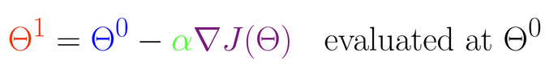
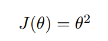

#   人工智能数学基础之数学分析 => 梯度下降算法
+ date: 2019-08-17 18:27:05
+ description: 人工智能数学基础之数学分析 => 梯度下降算法
+ categories:
  - 人工智能
+ tags:
  - 人工智能
---
#   映射与函数


#   极限


#   导数
+   导数是曲线的斜率，是曲线变化
+   快慢的反应；
+   可导一定连续，连续不一定可导

#   极值如何求解
导数为0的位置


#   常用函数求导公式


#   求sigmoid函数导数


导数为


说明
+   导数不会求着求着就没了
+   它是非线性的,非线性可以将数据映射到一个其他维度的空间上去

#   泰勒展开式


常用函数的泰勒展开
+   在某邻域内，存在一阶近似、二阶近似、.... 逼近非线性函数求解


#   梯度下降算法
##  参考
[深入浅出--梯度下降法及其实现](https://www.jianshu.com/p/c7e642877b0e)

##  原理
用最通俗的语言来介绍下：

假设你站在华山之巅，你现在想以最快速度下山，那你肯定是找一条最陡峭的路走。你环顾四周，找到了一条路线，恩，这个方向是最陡的。于是你就出发了，走了一会发现，这个方向不是最陡的路了。你就停下来，换了个最陡的方向，继续往下走。重复这个步骤，你最终到达了山脚下。

那么，你从山顶到山脚的整个下山的过程，就是梯度下降。

##  困难点
+   可以假设这座山最陡峭的地方是无法通过肉眼立马观察出来的，而是需要一个复杂的工具来测量，同时，你此时正好拥有测量出最陡峭方向的能力。所以，你每走一段距离，都需要一段时间来测量所在位置最陡峭的方向，这是比较耗时的。那么为了在太阳下山之前到达山底，就要尽可能的减少测量方向的次数。
+   这是一个两难的选择，如果测量的频繁，可以保证下山的方向是绝对正确的，但又非常耗时，如果测量的过少，又有偏离轨道的风险。
+   所以需要找到一个合适的测量方向的频率，来确保下山的方向不错误，同时又不至于耗时太多！

##  什么是梯度
###     偏微分(偏导)
看待微分的意义，可以有不同的角度，最常用的两种是：

函数图像中，某点的切线的斜率
+   函数的变化率
+   几个微分的例子：


上面的例子都是单变量的微分，当一个函数有多个变量的时候，就有了多变量的微分，即分别对每个变量进行求微分


###     梯度
梯度实际上就是多变量微分的一般化。


我们可以看到，梯度就是分别对每个变量进行微分，然后用逗号分割开，梯度是用<>包括起来，说明`梯度其实一个向量`。如果是一个二维向量(两个力的方向),显然`线性相加和(合力)是最大的,称之为方向导数`




梯度是微积分中一个很重要的概念，之前提到过梯度的意义

+   在单变量的函数中，梯度其实就是函数的微分，代表着函数在某个给定点的切线的斜率
+   在多变量函数中，梯度是一个向量，向量有方向，梯度的方向就指出了函数在给定点的上升最快的方向

这也就说明了为什么我们需要千方百计的求取梯度！我们需要到达山底，就需要在每一步观测到此时最陡峭的地方，梯度就恰巧告诉了我们这个方向。梯度的方向是函数在给定点上升最快的方向，那么梯度的反方向就是函数在给定点下降最快的方向，这正是我们所需要的。所以我们只要沿着梯度的方向一直走，就能走到局部的最低点！


##  梯度下降算法的数学解释
###     数学公式说明
上面我们花了大量的篇幅介绍梯度下降算法的基本思想和场景假设，以及梯度的概念和思想。下面我们就开始从数学上解释梯度下降算法的计算过程和思想！



此公式的意义是：J是关于Θ的一个函数，我们当前所处的位置为Θ0点，要从这个点走到J的最小值点，也就是山底。首先我们先确定前进的方向，也就是梯度的反向，然后走一段距离的步长，也就是α，走完这个段步长，就到达了Θ1这个点！


几点说明
###     α是什么含义？
α在梯度下降算法中被称作为学习率或者步长，意味着我们可以通过α来控制每一步走的距离，以保证不要步子跨的太大扯着蛋，哈哈，其实就是不要走太快，错过了最低点。同时也要保证不要走的太慢，导致太阳下山了，还没有走到山下。所以α的选择在梯度下降法中往往是很重要的！α不能太大也不能太小，太小的话，可能导致迟迟走不到最低点，太大的话，会导致错过最低点！


###     为什么要梯度要乘以一个负号？
梯度前加一个负号，就意味着朝着梯度相反的方向前进！我们在前文提到，梯度的方向实际就是函数在此点上升最快的方向！而我们需要朝着下降最快的方向走，自然就是负的梯度的方向，所以此处需要加上负号

##  梯度下降算法的实例
我们已经基本了解了梯度下降算法的计算过程，那么我们就来看几个梯度下降算法的小实例，首先从单变量的函数开始
###     单变量函数的梯度下降
我们假设有一个单变量的函数




函数的微分


初始化，起点为


学习率为


根据梯度下降的计算公式


我们开始进行梯度下降的迭代计算过程：


如图，经过四次的运算，也就是走了四步，基本就抵达了函数的最低点，也就是山底


###     多变量函数的梯度下降
我们假设有一个目标函数


现在要通过梯度下降法计算这个函数的最小值。我们通过观察就能发现最小值其实就是 (0，0)点。但是接下来，我们会从梯度下降算法开始一步步计算到这个最小值！
我们假设初始的起点为：


初始的学习率为


函数的梯度为


进行多次迭代


我们发现，已经基本靠近函数的最小值点


##  梯度下降算法的实现
###     简单说明最小二乘法
某次实验得到了四个数据点 (x ,y):(1,6)、(2,5)、(3,7)、(4,10)（下图红色的点）。


我们希望找出一条和这四个点最匹配的直线


最小二乘法采用的方法是尽量使得等号两边的平方差最小，也就是找出这个函数的最小值：


最小值可以通过对上述函数分别求偏导数,然后使他们等于零得到。


如此就得到了一个只有两个未知数的方程组，很容易就可以解出：


也就是说直线`y = 3.5 + 1.4x`是最佳的。

###     梯度下降算法的实现
下面我们将用python实现一个简单的梯度下降算法。场景是一个简单的[线性回归](https://en.wikipedia.org/wiki/Linear_regression)的例子：假设现在我们有一系列的点，如下图所示


我们将用梯度下降法来拟合出这条直线！
首先，我们需要定义一个代价函数，在此我们选用[均方误差代价函数(最小二乘法)](https://en.wikipedia.org/wiki/Least_squares)


此公式中

+   m是数据集中点的个数
+   ½是一个常量，这样是为了在求梯度的时候，二次方乘下来就和这里的½抵消了，自然就没有多余的常数系数，方便后续的计算，同时对结果不会有影响
+   y 是数据集中每个点的真实y坐标的值
+   h 是我们的预测函数，根据每一个输入x，根据Θ 计算得到预测的y值，即


我们可以根据代价函数看到，代价函数中的变量有两个，所以是一个多变量的梯度下降问题，求解出代价函数的梯度，也就是分别对两个变量进行微分


明确了代价函数和梯度，以及预测的函数形式。我们就可以开始编写代码了。但在这之前，需要说明一点，就是为了方便代码的编写，我们会将所有的公式都转换为矩阵的形式，python中计算矩阵是非常方便的，同时代码也会变得非常的简洁。

为了转换为矩阵的计算，我们观察到预测函数的形式


我们有两个变量，为了对这个公式进行矩阵化，我们可以给每一个点x增加一维，这一维的值固定为1，这一维将会乘到Θ0上。这样就方便我们统一矩阵化的计算


然后我们将代价函数和梯度转化为矩阵向量相乘的形式


###     代码实现
首先，我们需要定义数据集和学习率

```python
import numpy as np

# Size of the points dataset.
m = 20

# Points x-coordinate and dummy value (x0, x1).
X0 = np.ones((m, 1))
X1 = np.arange(1, m+1).reshape(m, 1)
X = np.hstack((X0, X1))

# Points y-coordinate
y = np.array([
    3, 4, 5, 5, 2, 4, 7, 8, 11, 8, 12,
    11, 13, 13, 16, 17, 18, 17, 19, 21
]).reshape(m, 1)

# The Learning Rate alpha.
alpha = 0.01
```

接下来我们以矩阵向量的形式定义代价函数和代价函数的梯度
```python
def error_function(theta, X, y):
    '''Error function J definition.'''
    diff = np.dot(X, theta) - y
    return (1./2*m) * np.dot(np.transpose(diff), diff)

def gradient_function(theta, X, y):
    '''Gradient of the function J definition.'''
    diff = np.dot(X, theta) - y
    return (1./m) * np.dot(np.transpose(X), diff)
```

最后就是算法的核心部分，梯度下降迭代计算
```python
def gradient_descent(X, y, alpha):
    '''Perform gradient descent.'''
    theta = np.array([1, 1]).reshape(2, 1)
    gradient = gradient_function(theta, X, y)
    while not np.all(np.absolute(gradient) <= 1e-5):
        theta = theta - alpha * gradient
        gradient = gradient_function(theta, X, y)
    return theta

```

当梯度小于1e-5时，说明已经进入了比较平滑的状态，类似于山谷的状态，这时候再继续迭代效果也不大了，所以这个时候可以退出循环！

完整的代码如下
```python
import numpy as np

# Size of the points dataset.
m = 20

# Points x-coordinate and dummy value (x0, x1).
X0 = np.ones((m, 1))
X1 = np.arange(1, m+1).reshape(m, 1)
X = np.hstack((X0, X1))

# Points y-coordinate
y = np.array([
    3, 4, 5, 5, 2, 4, 7, 8, 11, 8, 12,
    11, 13, 13, 16, 17, 18, 17, 19, 21
]).reshape(m, 1)

# The Learning Rate alpha.
alpha = 0.01

def error_function(theta, X, y):
    '''Error function J definition.'''
    diff = np.dot(X, theta) - y
    return (1./2*m) * np.dot(np.transpose(diff), diff)

def gradient_function(theta, X, y):
    '''Gradient of the function J definition.'''
    diff = np.dot(X, theta) - y
    return (1./m) * np.dot(np.transpose(X), diff)

def gradient_descent(X, y, alpha):
    '''Perform gradient descent.'''
    theta = np.array([1, 1]).reshape(2, 1)
    gradient = gradient_function(theta, X, y)
    while not np.all(np.absolute(gradient) <= 1e-5):
        theta = theta - alpha * gradient
        gradient = gradient_function(theta, X, y)
    return theta

optimal = gradient_descent(X, y, alpha)
print('optimal:', optimal)
print('error function:', error_function(optimal, X, y)[0,0])
```

运行代码，计算得到的结果如下


所拟合出的直线如下


###     小结
至此，我们就基本介绍完了梯度下降法的基本思想和算法流程，并且用python实现了一个简单的梯度下降算法拟合直线的案例！
最后，我们回到文章开头所提出的场景假设:
这个下山的人实际上就代表了反向传播算法，下山的路径其实就代表着算法中一直在寻找的参数Θ，山上当前点的最陡峭的方向实际上就是代价函数在这一点的梯度方向，场景中观测最陡峭方向所用的工具就是微分 。在下一次观测之前的时间就是有我们算法中的学习率α所定义的。
可以看到场景假设和梯度下降算法很好的完成了对应


##  牛顿法
梯度下降法中的"最快"过于盲目、有缺陷,所以进一步利用曲线二阶导的信息进行迭代求解，称为牛顿法
###     参考
[常见的几种最优化方法（梯度下降法、牛顿法、拟牛顿法、共轭梯度法等）](https://www.cnblogs.com/shixiangwan/p/7532830.html)

###     牛顿法作用
牛顿法是一种在实数域和复数域上近似求解方程的方法。方法使用函数f (x)的泰勒级数的前面几项来寻找方程f (x) = 0的根。牛顿法最大的特点就在于它的收敛速度很快。

####   牛顿法和梯度下降法的效率对比
+   从本质上去看，牛顿法是二阶收敛，梯度下降是一阶收敛，所以牛顿法就更快。如果更通俗地说的话，比如你想找一条最短的路径走到一个盆地的最底部，梯度下降法每次只从你当前所处位置选一个坡度最大的方向走一步，牛顿法在选择方向时，不仅会考虑坡度是否够大，还会考虑你走了一步之后，坡度是否会变得更大。所以，可以说牛顿法比梯度下降法看得更远一点，能更快地走到最底部。（牛顿法目光更加长远，所以少走弯路；相对而言，梯度下降法只考虑了局部的最优，没有全局思想。）
+   根据wiki上的解释，从几何上说，牛顿法就是用一个二次曲面去拟合你当前所处位置的局部曲面，而梯度下降法是用一个平面去拟合当前的局部曲面，通常情况下，二次曲面的拟合会比平面更好，所以牛顿法选择的下降路径会更符合真实的最优下降路径。


注：红色的牛顿法的迭代路径，绿色的是梯度下降法的迭代路径。

+   牛顿法的优缺点总结：
    *   优点：二阶收敛，收敛速度快；
    *   缺点：牛顿法是一种迭代算法，每一步都需要求解目标函数的Hessian矩阵的逆矩阵，计算比较复杂。


