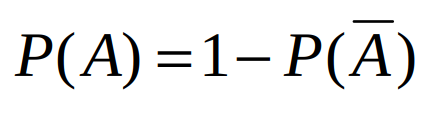

#   人工智能数学基础之概率论
+ date: 2019-08-17 18:36:15
+ description: 人工智能数学基础之概率论
+ categories:
  - 人工智能
+ tags:
  - 人工智能
---
#   大数定理
##  大数定理的定义
+   一件事发生的次数足够多,它就可信
+   大数定律(law of large numbers)，是一种描述当试验次数很大时所呈现的概率性质的定律。
+   但是注意到，大数定律并不是经验规律，而是在一些附加条件上经严格证明了的定理，它是一种自然规律因而通常不叫定理而是大数“定律”。而我们说的大数定理通常是经数学家证明并以数学家名字命名的大数定理，如伯努利大数定理

##  抛硬币实验
概率与直观
+   不断抛掷一枚硬币，得到正面与反面的频率比例是多少呢？
+   经过无数次抛掷，频率的极限趋近于X?

抛掷趋于无穷次时，正反面频率一致，根据大数定理

#   概率计算的基本公式
##  概率的计算

##  已知A、B独立时,求交和并概率

##  条件概率

##  全概率公式

##  贝叶斯公式
强调：这是一个非常重要的公式，记住它，基本就掌握了机器学习一半的内容

#   期望与方差

#   变量的分布
##  伯努利分布
有一类试验，比如抛掷硬币得到正面还是反面，项目成功或失败，产品是否有缺陷，只有两个可能结果。记这两个可能的结果为0和1，该分布就称为伯努利分布。

##  二项分布
伯努利分布重复N次，就构成了二项分布。

##  高斯分布(正态分布)
服从中心极限定律，是非常重要的分布。

#   熵
+   不是化学中的熵,是信息论中的熵,指的是传递信息需要的最小信息量
+   问题:世界杯比赛有32支球队参加，最少用多少bit信息表示出最后获胜的队伍？出最后获胜的队伍？

+   传递的信息一定发生,则`lnp(x) = ln1 = 0`,所以熵为0
+   传递的信息一定不发生,则`p(x) = 0`,所以熵为0

