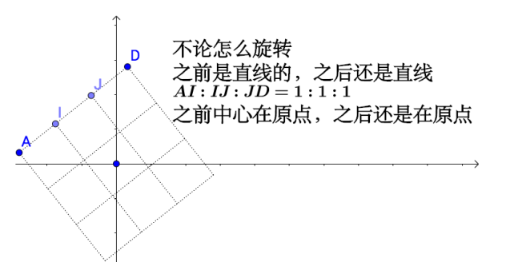
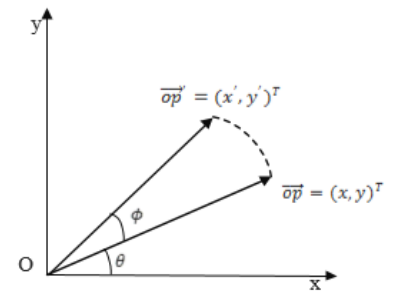

#   为什么研究线性变换
+   对于多项式来说,我们处理的更多是系数,而系数永远是线性的,所以线性代数才那么重要

#   线性变换
指旋转、推移，他们的组合是线性变换

#   行列式
+   行列式的本质：线性变换的缩放因子
+   公式  <= (高代书55定义4)

+   2*2矩阵的公式

+   3*3矩阵的公式

#   矩阵和乘法
+   矩阵的本质：线性变换！

对应的图像

#   矩阵的缩放与旋转
##  向量旋转与缩放与矩阵的关系

##  什么情况下矩阵乘法是缩放矩阵呢？
+   仅对角线有非零值的矩阵为缩放矩阵
+   但对角线以外有非零元素,则不一定不是缩放矩阵
+   对角线元素代表了每个维度的缩放强度

##  什么情况下矩阵乘法是旋转矩阵呢？
+   列向量正交且为单位向量的矩阵，也即正交阵为旋转矩阵

#   分离技术
##  数学基础 => 特征值分解
1.  矩阵能转成对角矩阵的充分必要条件:设线性变换A是n维空间V的一个线性变换,A的矩阵可以在某一组基下为对角矩阵的充分必要条件是,A有n个线性无关的特征向量 <= (高代书299页)
2.  什么情况下有逆矩阵:行列式不等于0
2.  相似矩阵:设A,B为数域P上的两个n级矩阵,如果可以找到数域P上的n级可逆矩阵X,使得B=(X^-1)AX,就说A相似与B,记作A~B <= (高代书288页)
3.  我们通过矩阵的相似变换,可以变成一个对角矩阵

4.  变成对角矩后,对角线上部分数据会明显小于其它数据,单从数据上看,这样的数据权重很小,不重要,可以舍弃,就将对角矩阵的维度降低了,因为对角矩阵对应的线性变换的特征值个数和对角线上的非零元素个数相同,所以也相当于减少了特征值的个数

##  svd/NFM分解
图像本质上是一张矩阵

而我们减少了特征值的个数可以看出图像的变化

#   总结
+   矩阵  <==>  线性变换
+   特征值 <==> 缩放强度
+   行列式 <==> 缩放强度
