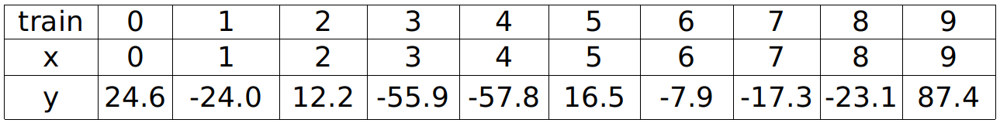
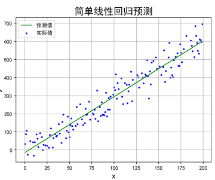
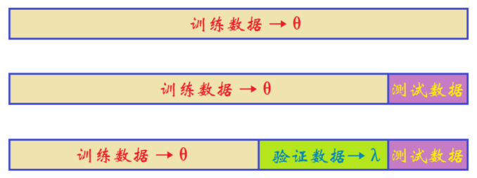
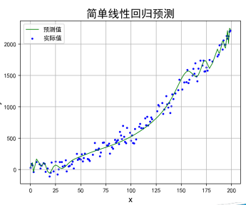
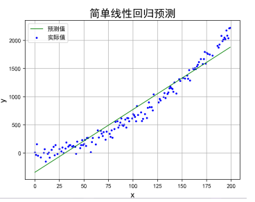
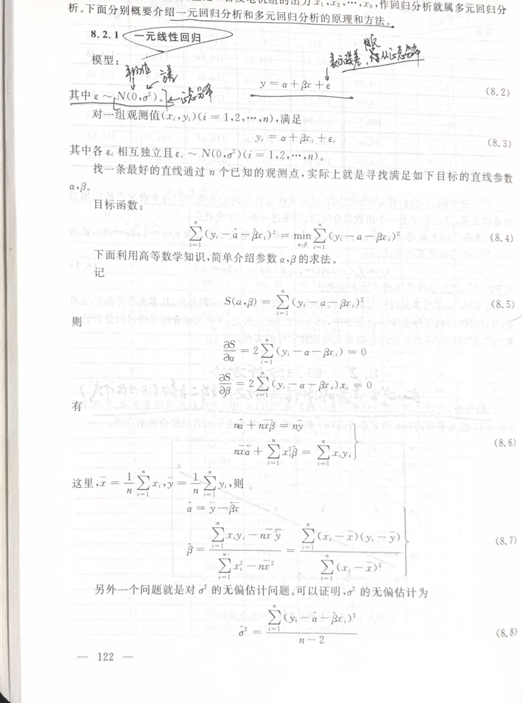
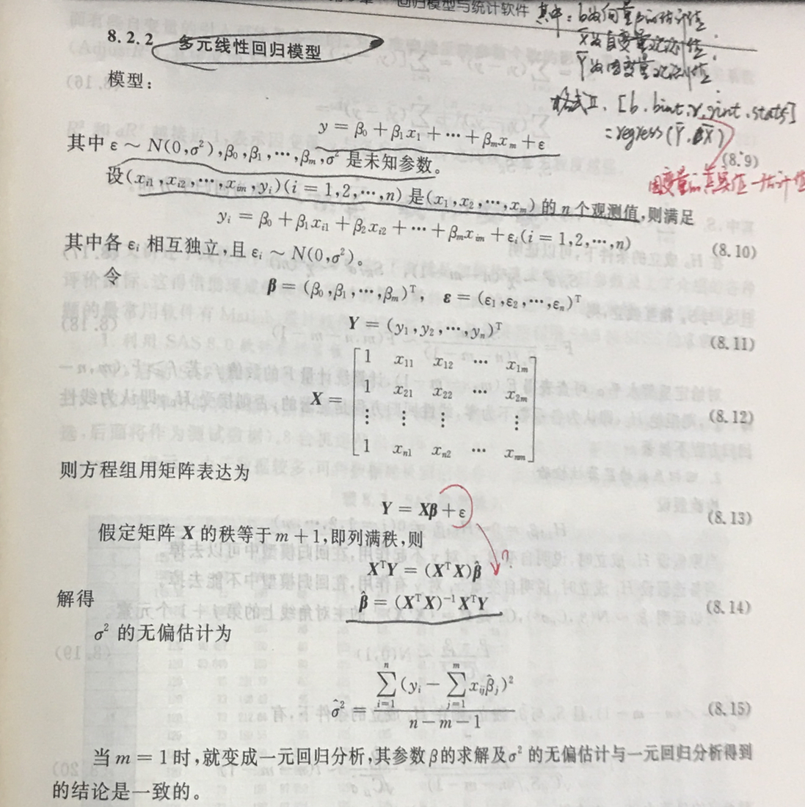
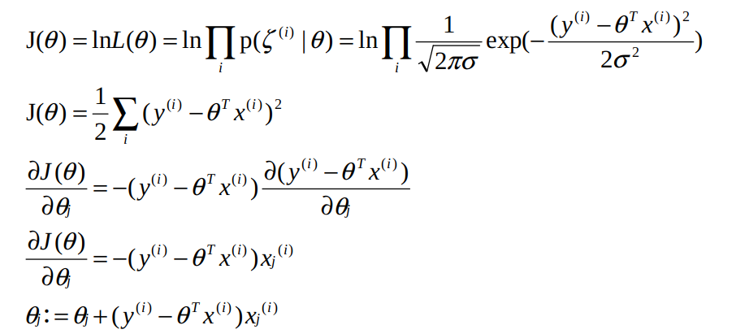

#   引出
线性回归是最基础的回归算法

思考：x与y符合什么关系呢？

+   观察到x与y的关系（模型选择），y=ax+b，建立线性回归模型
+   通过优化方法设法拟合数据，得到最优的a
+   评估该模型是否准确，查看训练集上的准确率
+   评估该模型的泛化性能，在测试集上的准确率

#   基本概念
+   训练集
+   测试集(交叉验证法、自助法等) => k折测试集 => 就是在不同区间上选取数据进行测试

+   目标函数
+   损失函数
+   优化方法
+   拟合
+   过拟合 => 就是太准确了,和样本数据几乎一样,这很大程度上会导致样本数据中的噪音也被拟合进函数了

+   欠拟合

+   准确率、泛化性能

#   一元线性回归模型

#   多元线性回归模型

#   上述直接采用极值方法求解，有什么缺点？如何解决
##  缺点
+   数据非常多的时候,根本没办法全部放到内存中

##  解决
+   可以使用梯度下降求解最小值
+   [梯度下降算法](/2019/08/18/人工智能数学基础之数学分析/#梯度下降算法)

##  优化方法
+   随机梯度下降法(SGD):只根据眼前的路径梯度下降求解的方法，称为随机梯度下降法(SGD)
+   ⼩批量随机梯度下降:实际上使用样本的过程中，出于效率和稳定性的考虑，我们使用MiniBatch-SGD方法，使用批处理平均来进行梯度更新，而不是对每一个数据都进行一次梯度更新

#   思考：目标函数一定有最小值吗？
+   不一定,但我们只需要极小值

#   准确度评估
##  对于连续数据(回归问题)
一般使用方差评估

##  对于离散数据(分类问题)
###     三个指标

+   accuracy => 准确率 => 预测对的/所有
+   precision => 精确率 => 将正类预测为正类数/(将正类预测为正类数 + 将负类预测为正类数)
+   recall => 召回率 => 将正类预测为正类数/(将正类预测为正类数 + 将正类预测为负类数)

例：训练样本有100个，其中60个为正，40个为负。现分类器对100个样本进行标记正负，各标记了50个。在正样本中，分对40个，分错10个，负样本中，分对30个，分错20个，则：

+   TP: 将正类预测为正类数 40
+   FN: 将正类预测为负类数 20
+   FP: 将负类预测为正类数 10
+   TN: 将负类预测为负类数 30

+   准确率(accuracy) = 预测对的/所有 = (TP+TN)/(TP+FN+FP+TN) = (100 - 10 - 20) / 100 = 70%
+   精确率(precision) = TP/(TP+FP) =  40 / 50 = 80%
+   召回率(recall) = TP/(TP+FN) = 40 / 60 = 2/3 = 66.6%

###     为什么这样起名?
+   召回率 (Recall)：正样本有多少被找出来了（召回了多少）。
+   精确率 (Precision)：你认为的正样本，有多少猜对了（猜的精确性如何）。

###     调和平均数
1.  所有数字取倒数
2.  计算这些倒数的算术平均数
3.  对上一步的计算结果取倒数

###     注意
+   召回率为R, 准确率为P。使用他们对算法的评估，这两个值通常情况下相互制约。
    *   宁可错杀，不可放过：低准确，高召回。
    *   宁可放过一个坏人，也绝不冤枉一个好人：高准确，低召回。
+   为了更加方便的评价算法的好坏。于是引入了F1值。F1为准确率P和召回率R的调和平均数。为什么F1使用调和平均数，而不是数字平均数。
+   举个例子：当R 接近于1, P 接近于 0 时。采用调和平均数的F1值接近于0；而如果采用算数平均数F1的值为0.5；显然采用调和平均数能更好的评估算法的性能。等效于评价R和P的整体效果

