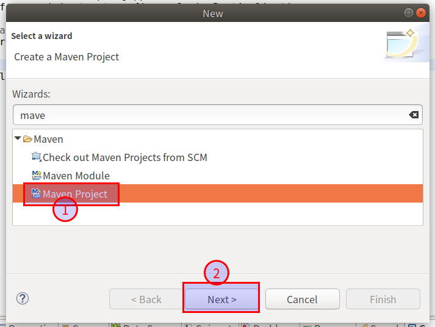
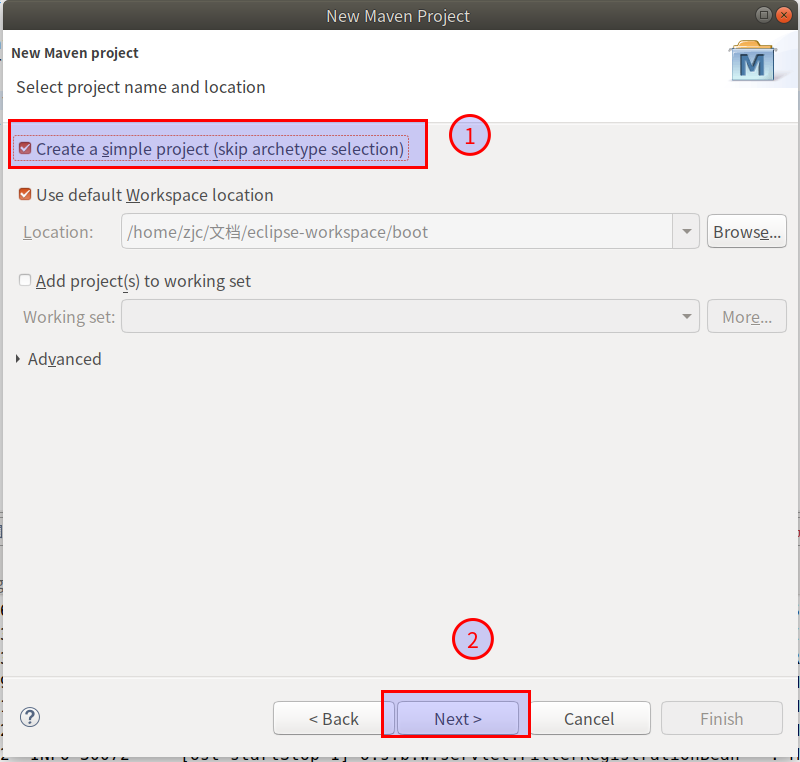
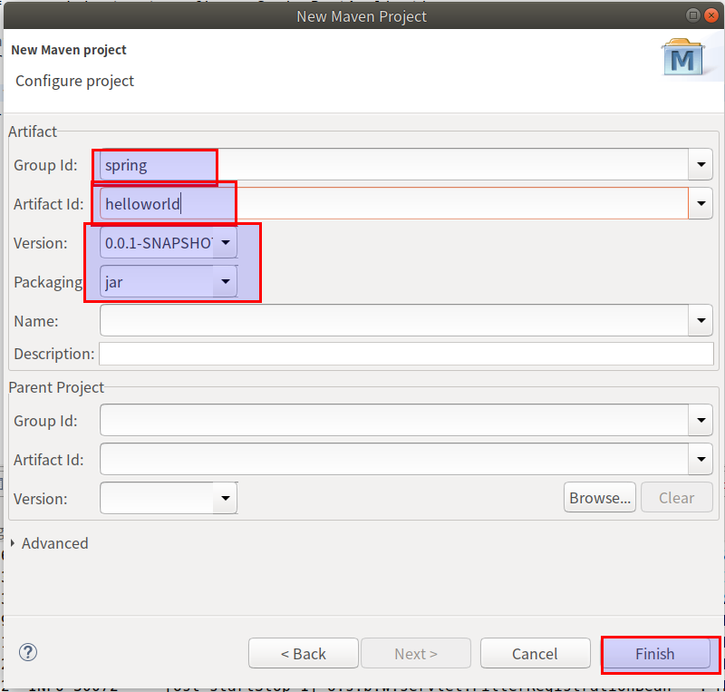
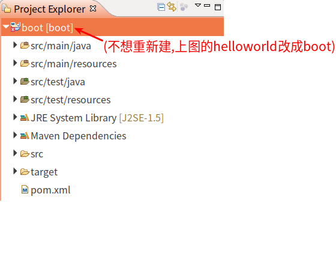
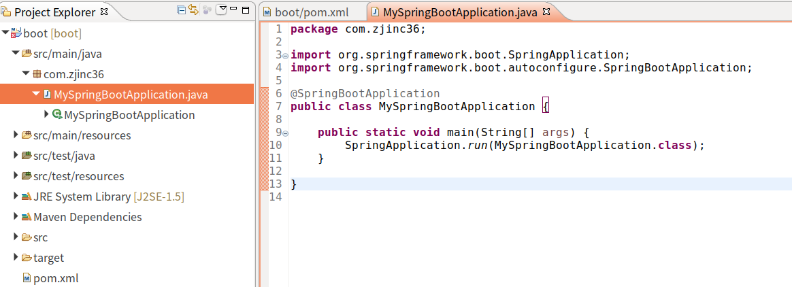
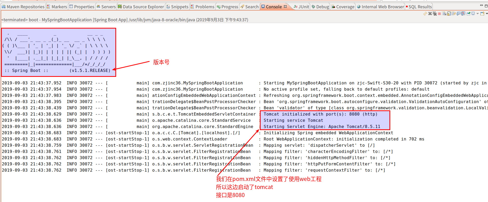
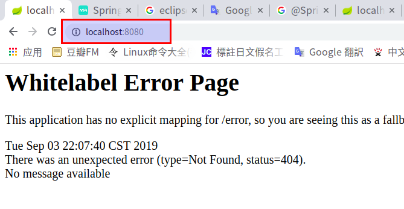

#   SpringBoot的环境搭建
+ date: 2019-09-03 22:39:41
+ description: SpringBoot的环境搭建
+ categories:
  - Java
+ tags:
  - Spring
- SpringBoot
---
#   创建maven项目










项目创建完成后的结构图




#   修改pom.xml文件
```xml
<project xmlns="http://maven.apache.org/POM/4.0.0"
	xmlns:xsi="http://www.w3.org/2001/XMLSchema-instance"
	xsi:schemaLocation="http://maven.apache.org/POM/4.0.0 http://maven.apache.org/xsd/maven-4.0.0.xsd">
	<modelVersion>4.0.0</modelVersion>
	<groupId>spring</groupId>
	<artifactId>boot</artifactId>
	<version>0.0.1-SNAPSHOT</version>

	<!-- springboot 项目要继承起步依赖 -->
	<parent>
		<groupId>org.springframework.boot</groupId>
		<artifactId>spring-boot-starter-parent</artifactId>
		<version>1.5.1.RELEASE</version>
		<relativePath />
	</parent>

	<dependencies>
		<!-- web功能的起步依赖 -->
		<dependency>
			<groupId>org.springframework.boot</groupId>
			<artifactId>spring-boot-starter-web</artifactId>
		</dependency>
	</dependencies>

</project>
```

#   创建示例代码




图片中的代码如下
```java
package com.zjinc36;

import org.springframework.boot.SpringApplication;
import org.springframework.boot.autoconfigure.SpringBootApplication;

@SpringBootApplication
public class MySpringBootApplication {

	public static void main(String[] args) {
		SpringApplication.run(MySpringBootApplication.class);
	}

}
```
需要注意两个东西(暂时不用了解为什么)
1.  @SpringBootApplication
2.  SpringApplication.run();

#   运行
`run as` -> `spring boot app`可以看到如下结果





在浏览器访问可以看到已经访问成功(页面出现错误是现在什么页面都没有)



