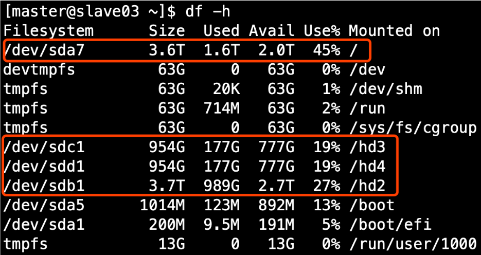

#   Hadoop存储多目录
+ date: 2019-09-07 11:57:33
+ description: Hadoop存储多目录
+ categories:
  - BigData
+ tags:
  - Hadoop
---
1）确认HDFS的存储目录，保证存储在空间最大硬盘上



2）在hdfs-site.xml文件中配置多目录，最好提前配置好，否则更改目录需要重新启动集群
```xml
<property>
    <name>dfs.datanode.data.dir</name>
    <value>file:///${hadoop.tmp.dir}/dfs/data1,file:///hd2/dfs/data2,file:///hd3/dfs/data3,file:///hd4/dfs/data4</value>
</property>
```
