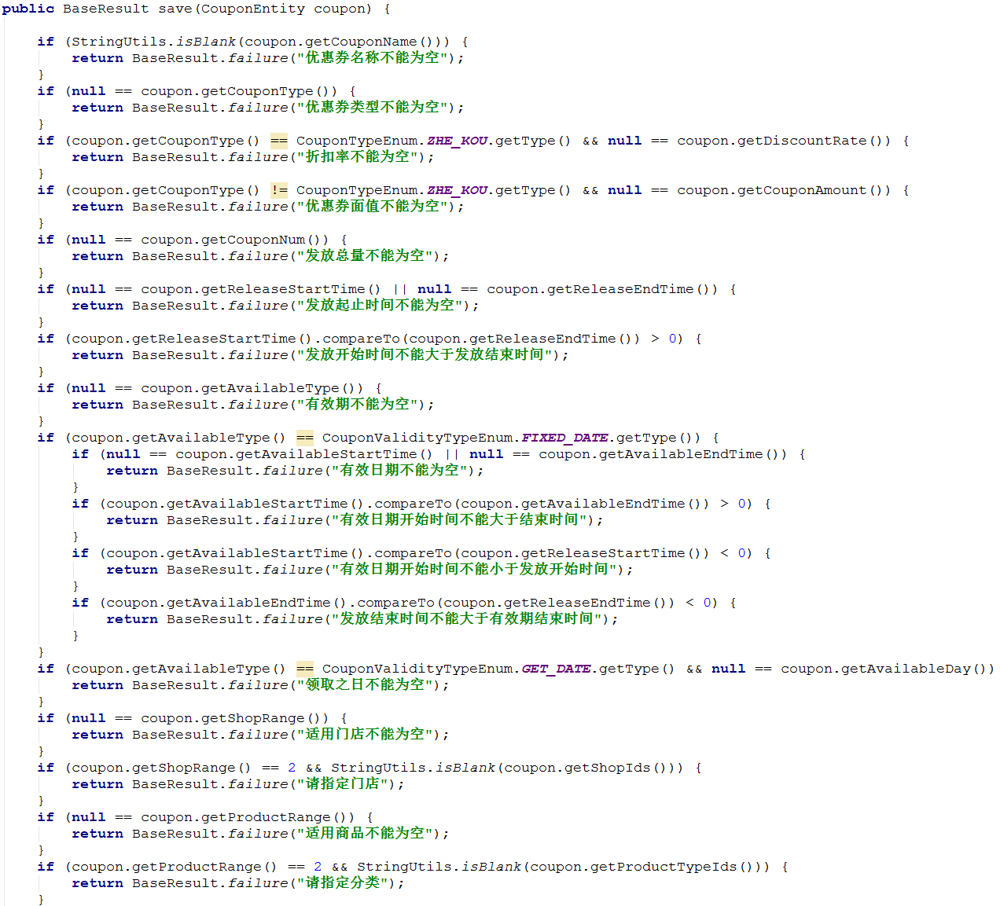

#   来源

#   背景说明
我们都知道,任何发送到服务器的数据都必须有验证,而对于验证,我们常会看见类似如下的代码

+   其实,这样的代码并没有什么不好的.而且有时候由于没有利用到框架的特性,这样的代码更利于实现业务.
+   但是,我碰到一件很闹心的事情,就是客户看代码了,且由于一知半解,指出没有利用SpringBoot的特性,直接打回来了.
+   被打回来的项目里面,表单里有近两百个输入选项,各种逻辑,并且页面转换的时候是不允许使用任何存储(数据库,session,cookie)
+   同时,这些输入项有很多业务前后相关

**具体来说**
+   需要A,B,C存在才验证B
+   验证需要快速失败,即参数A有验证甲乙丙三种,按顺序,甲失败了,乙就不继续验证了

当然,好事来说,我经过这么折腾一次,整个验证都弄清楚了

#   SpringBoot的验证Validation
##  Hibernate Validator
文档地址:[https://docs.jboss.org/hibernate/stable/validator/reference/en-US/html\_single/#preface](https://docs.jboss.org/hibernate/stable/validator/reference/en-US/html_single/#preface)
##  Spring Validator
文档地址:[https://docs.spring.io/spring/docs/5.0.5.RELEASE/spring-framework-reference/core.html#validation](https://docs.spring.io/spring/docs/5.0.5.RELEASE/spring-framework-reference/core.html#validation)

