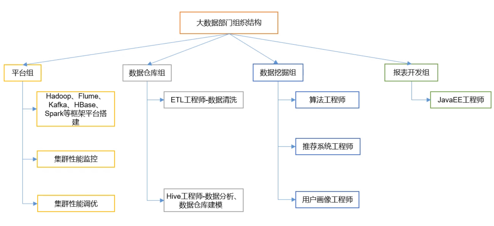
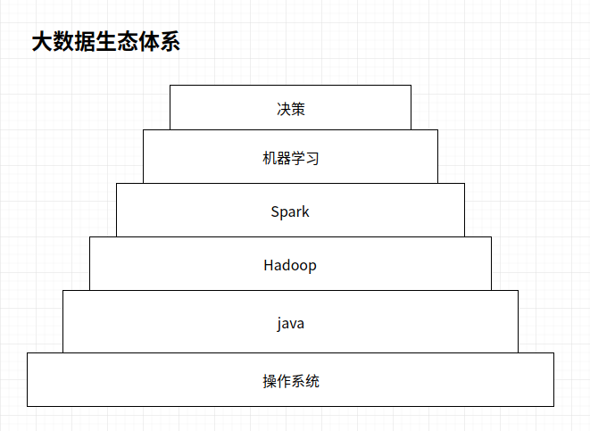
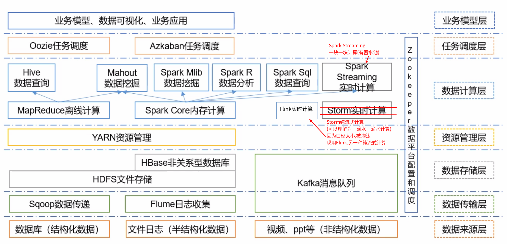

# 大数据学习大纲

---

# 大数据概念
大数据(Big Data):指无法在一定时间范围内用常规软件工具进行捕捉,管理和处理的数据集合,是需要新处理模式才能具有更强的决策力,洞察发现力和流程优化能力的海量,高增长率和多样化的信息资产

# 主要解决
海量数据的存储和海量数据的分析计算问题

# 大数据特点

1.  Volume(大量)

截至目前,人类生产的所有印刷材料的数据量是200PB,而历史上全人类总共说过的话是5EB,当前,典型个人计算机硬盘容量为TB量级,而一些大企业的数据量已经接近EB量级

2.  Velocity(高速)

这是大数据区分于传统数据挖掘的显著特征.根据IDC的"数字宇宙"的报告,预计到2020年,全球数据使用量将达到35.2ZB.在如此海量的数据面前,处理数据的效率就是企业的生命

3.  Variety(多样)

这种类型的多样性也让数据分为结构化数据和非结构化数据.相对于以往便与存储的以数据库/文本为主的结构化数据,非结构化数据越来越多,包括网络日志,音频,视频,图片,地理位置信息等,这些多类型的数据对数据的处理能力提出了更高的要求

4.  Value(价值低密度)

价值密度的高低与数据总量大小成反比.比如,在一天监控视频中,我们只关系其中的一分钟.如何快速对有价值数据"提纯"称为目前大数据背景下待解决的难题

# 大数据应用场景

1.  物流仓储:大数据分析系统助力商家精细化运营,提升销量,节约成本
2.  零售:分析用户消费习惯,为用户购买商品提供方便,从而提高商品销量
3.  旅游:深度结合大数据能力与旅游行业需求,共建旅游产业智慧管理,智慧服务和智慧营销的未来
4.  商品广告推荐:给用户推荐可能喜欢的商品
5.  保险:海量数据挖掘及风险预测,助力保险行业精准营销,提升精细化定价能力
6.  金融:多维度体现用户特征,帮助金融机构推荐优质客户,防范欺诈风险
7.  房产:大数据全面助力房地产行业,打造精准投策与营销,选出更何时的地,建造更合适的楼,卖给更合适的人
8.  人工智能

# 大数据部门组织结构

# 大数据生态体系

## 总体生态体系

## 细化

## 操作系统

Linux

## Java

### 基础篇

+   java语法基础
+   java数据类型
+   java分支循环
+   oop
+   io
+   collection

