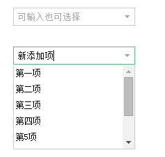

#   Jquery可输入也可选择的下拉框
+ date: 2019-11-15 22:55:42
+ description: Jquery可输入也可选择的下拉框
+ categories:
  - Javascript
+ tags:
  - Jquery
---
#   来源
[可输入也可选择的下拉框(单选或输入)](https://www.jianshu.com/p/97252c501e91)

#   代码
```html
<!DOCTYPE html>
<html lang="en">
<head>
    <meta charset="UTF-8">
    <title>自定义下拉选择框</title>
    <style type="text/css">
        *{margin:0; padding:0;}
        ul,li{list-style:none;}
        :focus{outline: none;}
        input[type=text]{border:1px solid #ccc;}
        input[type=text]:hover,input[type=text]:focus{border-color: #57bc80; box-shadow: none;}

        /* 上面的css是初始化css,底下的css才是效果代码 */
        body{padding:50px; font-size: 12px;}
        .my-select-box{position: relative;}
        .my-select-box .my-select-input{ height: 24px; line-height: 24px; padding:0 5px;
            background: url(data:image/png;base64,iVBORw0KGgoAAAANSUhEUgAAAA4AAAAICAYAAADJEc7MAAAACXBIWXMAAAsTAAALEwEAmpwYAAAAIGNIUk0AAG2YAABzjgAA4DIAAIM2AAB5CAAAxgwAADT6AAAgbL5TJ5gAAABGSURBVHjaYvz//z8DOYCJgUzA0tnZidPK8vJyRpw24pLEpwnuVHRFhDQxMDAwMPz//x+OOzo6/iPz8WFGuocqAAAA//8DAD/sORHYg7kaAAAAAElFTkSuQmCC) right center no-repeat;
            padding-right:20px !important;
            width:100%;
            box-sizing: border-box;
        }
        .my-select-box .my-select-list{position:absolute; left:0; z-index: 101; border:1px solid #ccc; border-top:none; max-height: 120px; overflow-y: auto; display: none; background: #fff; width:100%; box-sizing: border-box;}
        .my-select-box .my-select-list li{height: 22px; line-height: 22px; padding:0 3px; cursor:pointer; margin-bottom: 1px}
        .my-select-box .my-select-list li.choosed{background: #ccc; color:#fff;}
        .my-select-box .my-select-list li:hover{background: #ccc; color:#fff;}
    </style>
</head>
<body>
    <div class="my-select-box" style="width:300px;">
        <input type="text" class="my-select-input" placeholder="可输入也可选择" maxlength="20" />
        <ul class="my-select-list">
            <li data-value="1">第一项</li>
            <li data-value="2">第二项</li>
            <li data-value="3">第三项</li>
            <li data-value="4">第四项</li>
            <li data-value="5">第5项</li>
            <li data-value="6">第6项</li>
            <li data-value="7">第7项</li>
            <li data-value="8">第8项</li>
        </ul>
    </div>
    <div style="height: 30px"></div>
    <div class="my-select-box">
        <input type="text" class="my-select-input" placeholder="可输入也可选择" maxlength="20" />
        <ul class="my-select-list">
            <li data-value="1">第一项</li>
            <li data-value="2">第二项</li>
            <li data-value="3">第三项</li>
            <li data-value="4">第四项</li>
            <li data-value="5">第5项</li>
            <li data-value="6">第6项</li>
            <li data-value="7">第7项</li>
            <li data-value="8">第8项</li>
        </ul>
    </div>
    <script type="text/javascript" src="jquery-3.2.1.min.js"></script>
    <script>
        ;(function($){
            $.fn.MySelect=function(){
                this.each(function(){
                    var $box=$(this);
                    var $input=$box.find("input.my-select-input");  //输入框
                    var $list=$input.next();                          //ul装扮成下拉框
                    var inputHeight=$input.outerHeight();   //计算input输入框的高度和宽度，方便定位ul和设置ul及包裹元素的宽度
                    $list.css({"top":(inputHeight)});

                    $input.focus(function(){   //输入框获得焦点后，显示下拉选择ul
                        var $nextUl=$(this).next();
                        if($nextUl.children().length>0){
                            $(this).next().show();
                        }
                    }).bind('input propertychange',function(){  //绑定监测输入框的输入值更改
                        var $this=$(this);
                        $this.attr("data-id","");
                        var curText=$this.val();
                        var $nextUl=$(this).next();
                        if($nextUl.children().length>0){
                            $nextUl.find("li").removeClass("choosed");
                            $nextUl.find("li").each(function(i,item){
                                var txt=$(item).text();
                                if(txt===curText){
                                    var v=$(item).attr("data-value");
                                    $this.attr("data-id",v);
                                    $(item).addClass("choosed");
                                }
                            });
                        }
                    });

                    //修改成如下事件绑定，为了给动态添加的li也可以产生点击效果
                    $list.off('click', 'li').on('click', 'li', function (e) {
                        var $this = $(this);
                        var value = $this.attr("data-value") || '';
                        $input.val($this.text()).attr("data-id", value);
                        $this.addClass("choosed").siblings().removeClass("choosed");
                        $this.parent().hide();
                    });
                });

                $(document).click(function (e) {  //点击.my-select-box范围外时隐藏ul下拉框
                    var target=e.target;
                    var $target=$(target);
                    var $parent=$target.closest('.my-select-box');
                    if($parent.length<1){  //说明不是.my-select-box范围内点击，将ul隐藏
                        $(".my-select-list").hide();
                    }else if($parent.length==1){  //如果存在多个my-select-box的情况，将其余的非这项以外的都隐藏
                        var $ul=$parent.find(".my-select-list");
                        var flag=$ul.is(":hidden");
                        $(".my-select-list").hide();
                        if(!flag) $ul.show();
                    }
                });
                return this;
            }
        })(jQuery);

        $(".my-select-box").MySelect();

    </script>
</body>
</html>
```

#   效果



