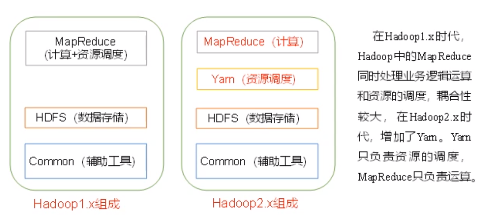
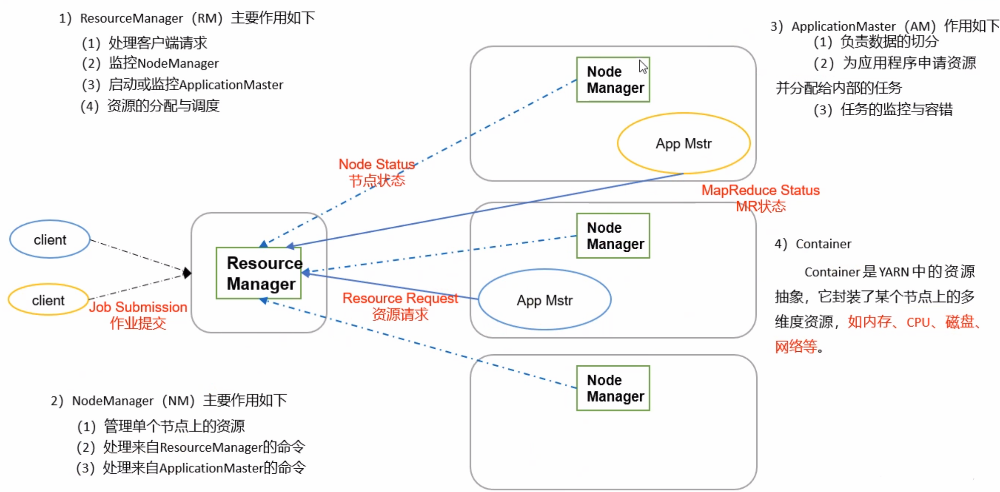
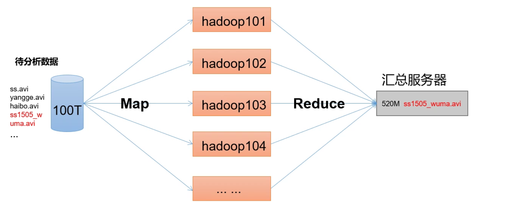
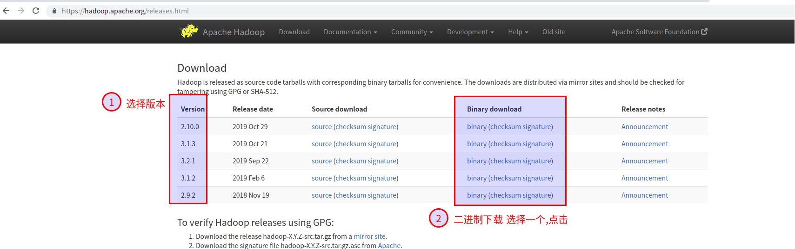
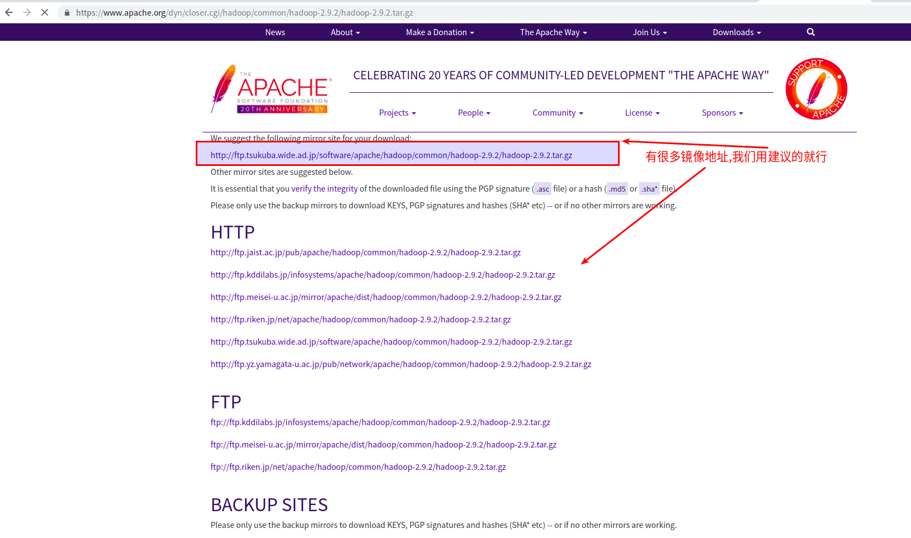
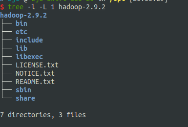
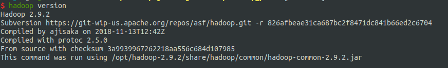

#   Hadoop安装
+ date: 2019-12-11 20:35:45
+ description: Hadoop安装
+ categories:
  - BigData
+ tags:
  - BigData
- Hadoop
---
#   Hadoop三大发行版本
Hadoop三大发行版本:Apache,Cloudera,Hortonworks
+   Apache:版本最原始(最基础)版本,对于入门学习最好
+   Cloudera:在大型互联网企业中用的较多
+   Hortonworks:文档较好

#   Hadoop的优势
1.  高可靠性:Hadoop底层维护多个数据副本,所以即使Hadoop某个计算元素或存储故障,也不会导致数据的丢失
2.  高扩展性:在集群间分配任务数据,可方便的扩展以千计的节点
3.  高效性:在MapReduce的思想下,Hadoop是并行工作的,以加快任务处理速度
4.  高容错性:能够将失败的任务重新分配

#   Hadoop1.x和Hadoop2.x区别




#   Hadoop组成
##  HDFS架构概述
1.  NameNode(nn):存储文件的元数据,如文件名,文件目录结构,文件属性(生成时间,副本数,文件权限),以及每个文件的块列表和块所在的DataNode等
2.  DataNode(dn):在本地文件系统存储文件块数据,以及数据的校验和
3.  Secondary NameNode(2nn):用来监控HDFS状态的辅助后台程序,每隔一段时间获取HDFS元数据的快照


##  YARN架构概述
YARN调度内存和CPU,即调度的是算力资源




##  MapReduce
MapReduce将计算过程分为两个阶段:Map和Reduce
1.  Map阶段并行处理数据
2.  Reduce阶段对Map结果进行汇总





#   Hadoop安装

##  下载
这是一个apache项目,自然在官网进行下载,下载方式很多,用命令wget也好,用curl也罢,这里主要说明要在哪里能找到Hadoop程序

1.  [http://apache.org/index.html](http://apache.org/index.html)


2.  找到Hadoop


3.  下载想要的版本的二进制文件



4.  点击下载




##  安装
安装很简单,解压就好,解压完后,目录下有如下文件




##  配置变量
```
1.  cd /etc/profile.d/

2.  sudo vim jdk.sh
3.  输入如下内容,并保存
export J2SDKDIR=/usr/lib/jvm/java-8-oracle
export J2REDIR=/usr/lib/jvm/java-8-oracle/jre
export PATH=$PATH:/usr/lib/jvm/java-8-oracle/bin:/usr/lib/jvm/java-8-oracle/db/bin:/usr/lib/jvm/java-8-oracle/jre/bin
export JAVA_HOME=/usr/lib/jvm/java-8-oracle
export DERBY_HOME=/usr/lib/jvm/java-8-oracle/db

4.  sudo vim hadoop.sh
5.  输入如下内容并保存
export HADOOP_HOME=/opt/hadoop-2.9.2
export PATH=$PATH:$HADOOP_HOME/bin:$HADOOP_HOME/sbin

6.  source /etc/export
```

##  测试安装
hadoop version





##  Hadoop的目录结构
```
hadoop-2.9.2
├── bin
│   ├── container-executor
│   ├── hadoop
│   ├── hadoop.cmd
│   ├── hdfs
│   ├── hdfs.cmd
│   ├── mapred
│   ├── mapred.cmd
│   ├── rcc
│   ├── test-container-executor
│   ├── yarn
│   └── yarn.cmd
├── etc
│   └── hadoop
│       ├── capacity-scheduler.xml
│       ├── configuration.xsl
│       ├── container-executor.cfg
│       ├── core-site.xml
│       ├── hadoop-env.cmd
│       ├── hadoop-env.sh
│       ├── hadoop-metrics2.properties
│       ├── hadoop-metrics.properties
│       ├── hadoop-policy.xml
│       ├── hdfs-site.xml
│       ├── httpfs-env.sh
│       ├── httpfs-log4j.properties
│       ├── httpfs-signature.secret
│       ├── httpfs-site.xml
│       ├── kms-acls.xml
│       ├── kms-env.sh
│       ├── kms-log4j.properties
│       ├── kms-site.xml
│       ├── log4j.properties
│       ├── mapred-env.cmd
│       ├── mapred-env.sh
│       ├── mapred-queues.xml.template
│       ├── mapred-site.xml.template
│       ├── slaves
│       ├── ssl-client.xml.example
│       ├── ssl-server.xml.example
│       ├── yarn-env.cmd
│       ├── yarn-env.sh
│       └── yarn-site.xml
├── include
│   ├── hdfs.h
│   ├── Pipes.hh
│   ├── SerialUtils.hh
│   ├── StringUtils.hh
│   └── TemplateFactory.hh
├── lib
│   └── native
│       ├── examples
│       ├── libhadoop.a
│       ├── libhadooppipes.a
│       ├── libhadoop.so -> libhadoop.so.1.0.0
│       ├── libhadoop.so.1.0.0
│       ├── libhadooputils.a
│       ├── libhdfs.a
│       ├── libhdfs.so -> libhdfs.so.0.0.0
│       └── libhdfs.so.0.0.0
├── libexec
│   ├── hadoop-config.cmd
│   ├── hadoop-config.sh
│   ├── hdfs-config.cmd
│   ├── hdfs-config.sh
│   ├── httpfs-config.sh
│   ├── kms-config.sh
│   ├── mapred-config.cmd
│   ├── mapred-config.sh
│   ├── yarn-config.cmd
│   └── yarn-config.sh
├── LICENSE.txt
├── NOTICE.txt
├── README.txt
├── sbin
│   ├── distribute-exclude.sh
│   ├── FederationStateStore
│   │   ├── MySQL
│   │   └── SQLServer
│   ├── hadoop-daemon.sh
│   ├── hadoop-daemons.sh
│   ├── hdfs-config.cmd
│   ├── hdfs-config.sh
│   ├── httpfs.sh
│   ├── kms.sh
│   ├── mr-jobhistory-daemon.sh
│   ├── refresh-namenodes.sh
│   ├── slaves.sh
│   ├── start-all.cmd
│   ├── start-all.sh
│   ├── start-balancer.sh
│   ├── start-dfs.cmd
│   ├── start-dfs.sh
│   ├── start-secure-dns.sh
│   ├── start-yarn.cmd
│   ├── start-yarn.sh
│   ├── stop-all.cmd
│   ├── stop-all.sh
│   ├── stop-balancer.sh
│   ├── stop-dfs.cmd
│   ├── stop-dfs.sh
│   ├── stop-secure-dns.sh
│   ├── stop-yarn.cmd
│   ├── stop-yarn.sh
│   ├── yarn-daemon.sh
│   └── yarn-daemons.sh
└── share
    ├── doc
    │   └── hadoop
    └── hadoop
        ├── common
        ├── hdfs
        ├── httpfs
        ├── kms
        ├── mapreduce
        ├── tools
        └── yarn
```
