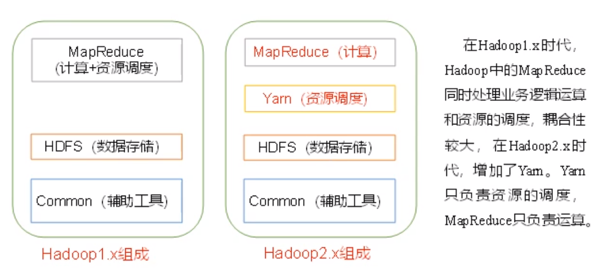

#   Hadoop概述

---

#   Hadoop三大发行版本
Hadoop三大发行版本:Apache,Cloudera,Hortonworks
+   Apache:版本最原始(最基础)版本,对于入门学习最好
+   Cloudera:在大型互联网企业中用的较多
+   Hortonworks:文档较好

#   Hadoop的优势
1.  高可靠性:Hadoop底层维护多个数据副本,所以即使Hadoop某个计算元素或存储故障,也不会导致数据的丢失
2.  高扩展性:在集群间分配任务数据,可方便的扩展以千计的节点
3.  高效性:在MapReduce的思想下,Hadoop是并行工作的,以加快任务处理速度
4.  高容错性:能够将失败的任务重新分配

#   Hadoop1.x和Hadoop2.x区别

#   Hadoop组成
##  HDFS架构概述
1.  NameNode(nn):存储文件的元数据,如文件名,文件目录结构,文件属性(生成时间,副本数,文件权限),以及每个文件的块列表和块所在的DataNode等
2.  DataNode(dn):在本地文件系统存储文件块数据,以及数据的校验和
3.  Secondary NameNode(2nn):用来监控HDFS状态的辅助后台程序,每隔一段时间获取HDFS元数据的快照

##  YARN架构概述
YARN调度内存和CPU,即调度的是算力资源

##  MapReduce
MapReduce将计算过程分为两个阶段:Map和Reduce
1.  Map阶段并行处理数据
2.  Reduce阶段对Map结果进行汇总

