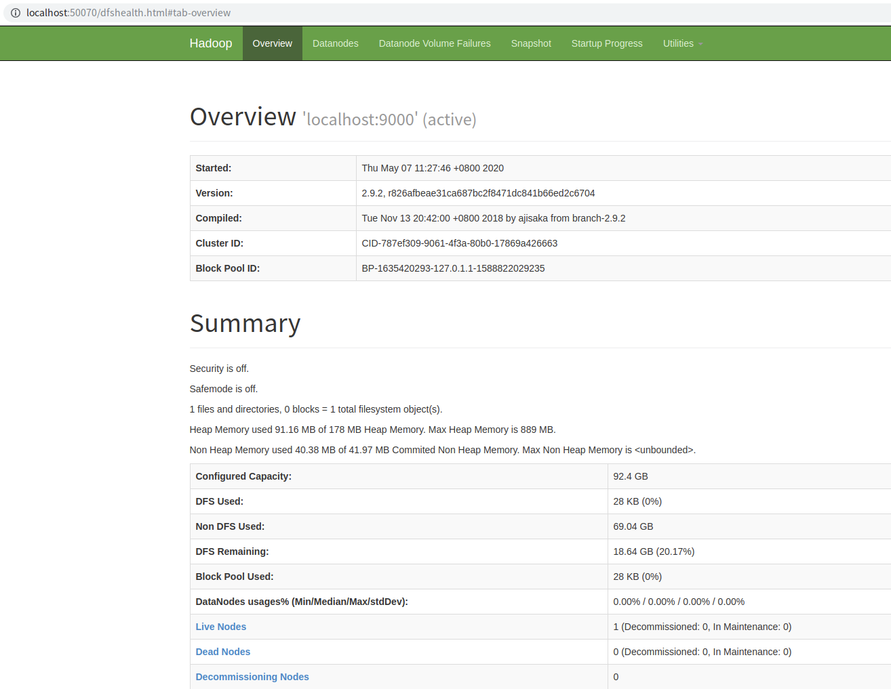
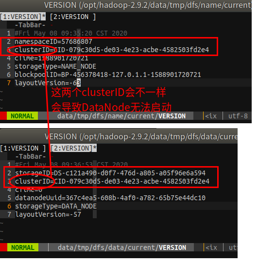
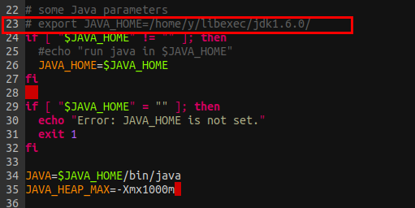
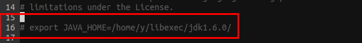
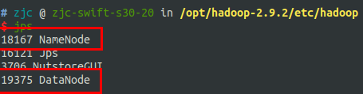
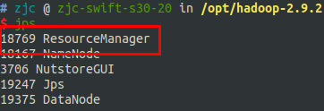
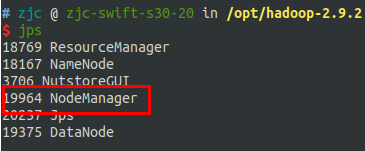
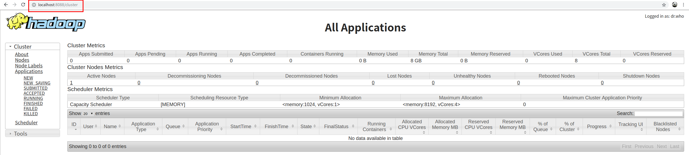
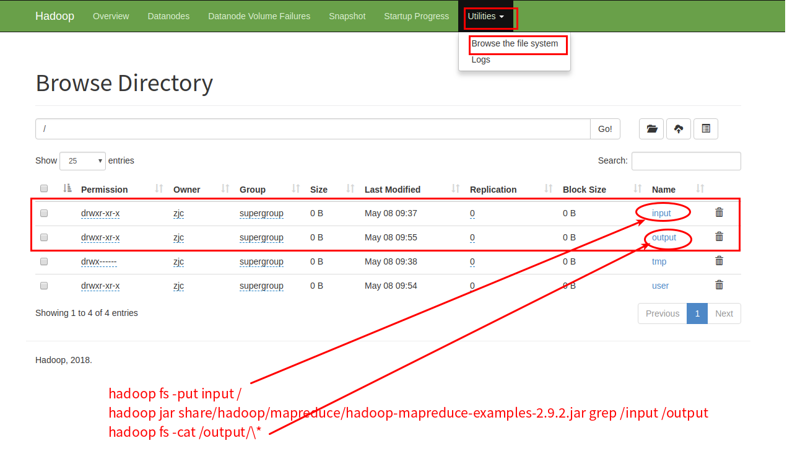

#   Hadoop运行模式
description: Hadoop运行模式
date: 2019-12-12 23:06:48
categories:
- BigData
tags:
- BigData
- Hadoop
---
#   本地运行模式

##  官方grep案例
0.  官方地址:[Hadoop: Setting up a Single Node Cluster](https://hadoop.apache.org/docs/stable/hadoop-project-dist/hadoop-common/SingleCluster.html)

1.  在hadoop文件夹下创建一个input文件夹
```
$ mkdir input
```

2.  复制配置文件目录作为输入
```
$ cp etc/hadoop/*.xml input
```

3.  查找并显示给定正则表达式的每个匹配项,输出到给定的输出目录
```
$ bin/hadoop jar share/hadoop/mapreduce/hadoop-mapreduce-examples-2.9.2.jar grep input output 'dfs[a-z.]+'
```

4.  展示输出
```
$ cat output/*
```

#   伪分布式运行模式

##  启动HDFS并运行MapReduce程序
### 分析
1.  配置集群
2.  启动并测试集群的增,删,查
3.  执行WordCount案例

### 执行步骤
1.  配置`hadoop-env.sh`
```
$ echo ${JAVA_HOME}

$ vim etc/hadoop/hadoop-env.sh
修改JAVA_HOME路径
export JAVA_HOME=/your/java/path
```

2.  配置`etc/hadoop/core-site.xml`
```XML
<configuration>
    <!-- 指定HDFS中NameNode的地址 -->
    <property>
        <name>fs.defaultFS</name>
        <value>hdfs://localhost:9000</value>
    </property>

    <!-- 指定HadHoop运行时产生文件的存储目录 -->
    <property>
        <name>hadoop.tmp.dir</name>
        <value>/opt/hadoop-2.9.2/data/tmp</value>
    </property>
</configuration>
```

3.  配置`etc/hadoop/hdfs-site.xml`
```XML
<!-- 指定HDFS副本的数量 -->
<!-- Hadoop虽然是多副本,但单一节点之多存储一份副本 -->
<configuration>
    <property>
        <name>dfs.replication</name>
        <value>1</value>
    </property>
</configuration>
```

4.  启动
    +   格式化NameNode(第一次启动时格式化,以后就不要总格式化)
```
$ bin/hdfs namenode -format
```

    +   启动NameNode
```
$ sbin/hadoop-daemon.sh start namenode
$ jps
```

    +   启动DataNode
```
$ sbin/hadoop-daemon.sh start datanode
$ jps
```

5.  web端查看HDFS文件系统[http://localhost:50070/dfshealth.html#tab-overview](http://localhost:50070/dfshealth.html#tab-overview)




6.  查看产生的Log日志
```
$ cd /opt/hadoop-2.9.2/logs
```

7.  思考:为什么不能一直格式化NameNode,格式化NameNOde要注意什么
    +   格式化只能在启动之前格式化
    +   格式化NameNOde,会产生新的集群id,导致NameNode和DataNode的集群id不一致,集群找不到已往数据.所以,格式NameNode时,一定要删除data数据和log日志,然后再格式化NameNode
        -   也就是如下两个clusterID会不一样(这里是一样的)



    +   [Hadoop多次格式化出现 WARN hdfs.DataStreamer: DataStreamer Excep](https://blog.csdn.net/yu0_zhang0/article/details/78841623)


##  启动YARN并运行MapReduce程序
1.  配置`etc/hadoop/yarn-env.sh`
```
配置JAVA_HOME
export JAVA_HOME=/usr/lib/jvm/java-8-oracle
```




2.  配置`etc/hadoop/yarn-site.xml`
```XML
<configuration>
    <!-- Reducer获取数据的方式 -->
    <property>
        <name>yarn.nodemanager.aux-services</name>
        <value>mapreduce_shuffle</value>
    </property>

    <!-- 指定YARN的ResourceManager的地址 -->
    <property>
        <name>yarn.nodemanager.env-whitelist</name>
        <value>JAVA_HOME,HADOOP_COMMON_HOME,HADOOP_HDFS_HOME,HADOOP_CONF_DIR,CLASSPATH_PREPEND_DISTCACHE,HADOOP_YARN_HOME,HADOOP_MAPRED_HOME</value>
        <!-- <value>localhost</value> -->
    </property>
</configuration>
```

3.  配置`mapred-env.sh`
```
配置JAVA_HOME
export JAVA_HOME=/usr/lib/jvm/java-8-oracle
```




4.  配置`etc/hadoop/mapred-site.xml`
    +   如果没有这个文件,则拷贝mapred-site.xml.template并重命名为mapred-site.xml
```
$ cp mapred-site.xml.template mapred-site.xml
```
    +   配置`mapred-site.xml`文件
```XML
<configuration>
    <property>
        <name>mapreduce.framework.name</name>
        <value>yarn</value>
    </property>
    <property>
        <name>mapreduce.application.classpath</name>
        <!-- <value>$HADOOP_MAPRED_HOME/share/hadoop/mapreduce/*:$HADOOP_MAPRED_HOME/share/hadoop/mapreduce/lib/*</value> -->
        <value>yarn</value>
    </property>
</configuration>
```

5.  启动集群
-   启动前必须保证NameNode和DataNode已经启动



-   启动ResourceManager
```
$ sbin/yarn-daemon.sh start resourcemanager

$ jps
```




-   启动NodeManager
```
$ sbin/yarn-daemon.sh start nodemanager

$ jps
```




6.  集群操作
+   YARN的浏览器页面查看[http://localhost:8088/cluster](http://localhost:8088/cluster)



+   举例
```
hadoop fs -put input /
hadoop jar share/hadoop/mapreduce/hadoop-mapreduce-examples-2.9.2.jar grep /input /output
hadoop fs -cat /output/\*   <- 这里*号转义是我自己终端的问题
```



+   [错误: 找不到或无法加载主类 org.apache.hadoop.mapreduce.v2.app.MRAppMaster](https://blog.csdn.net/hongxiao2016/article/details/88919176)

#   完全分布式运行模式

