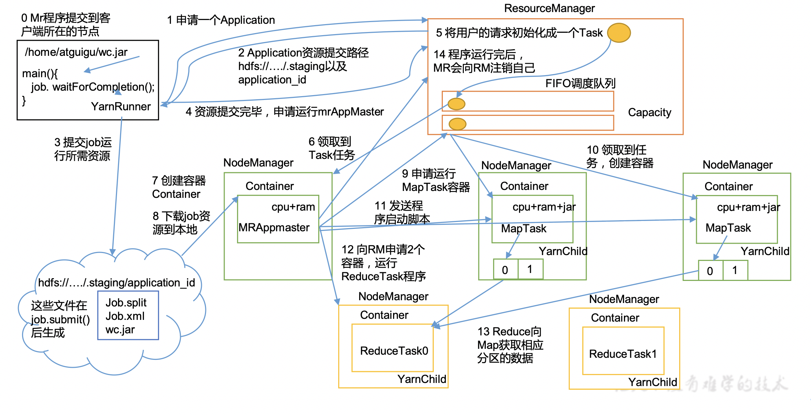

# Yarn运行机制
+ date: 2019-12-13 15:45:45
+ description: Yarn运行机制
+ categories:
  - BigData
+ tags:
  - BigData
- Hadoop
---
# Yarn运行机制

## Yarn运行机制流程图

##  具体步骤
###     作业提交
+   Client调用job.waitForCompletion方法，向整个集群提交MapReduce作业。
+   Client向RM申请一个作业id。
+   RM给Client返回该job资源的提交路径(hdfs://.../.staging/)和作业application_id。
+   Client在该路径提交jar包、切片信息和配置文件。
+   Client提交完资源后，向RM申请运行MrAppMaster。

### 作业初始化
+   当RM收到Client的请求后，将该job添加到资源调度器中，将job初始化成task。
+   某一个空闲的NM领取到该Job。
+   在该NM中创建Container，并产生MRAppmaster(一个job创建一个)，它管理该job。
+   下载之前Client提交的资源到本地。

### 任务分配
+   MRAppMaster向RM申请运行多个MapTask任务资源。
+   RM将运行MapTask任务分配给另外两个NodeManager，另外两个NodeManager分别领取任务并创建容器。

### 任务执行
+   MR向两个接收到任务的NodeManager发送程序启动脚本，这两个NodeManager分别启动MapTask，MapTask对数据分区排序。
+   MrAppMaster等待所有MapTask运行完毕后，向RM申请容器，运行ReduceTask。
+   ReduceTask向MapTask获取相应分区的数据。
+   程序运行完毕后，MR会向RM申请注销自己。

#   一些细节
##  4大组件

+   ResourceManager：总的老大：处理客户端请求，监控NodeManager，启动或监控ApplicationMaster，资源的分配与调度
+   NodeManager：单个节点的老大：管理单个节点的资源，处理来自ResourceManager、ApplicationMaster的命令
+   ApplicationMaster：单个job的老大：负责数据切分，为应用程序申请资源并分配内部的任务，任务的监控与容错
+   Container：资源抽象：如内存、cpu、磁盘、网络等

## 3种资源调度器

+   FIFO：先进先出
+   Capacity Scheduler：多FIFO队列，会对同一用户提交资源进行限定，会把任务分配给更闲的队列。
+   Fair Scheduler：多队列，按缺额排序，缺额大者优先执行

## 任务推测执行机制

+   问题：系统中有99%的Map任务都完成了，只有少数几个Map老是进度很慢，完不成。
+   办法：为拖后腿任务启动一个备份任务，同时运行。谁先运行完，则采用谁的结果。
+   前提：每个Task只能有一个备份任务，当前Job已完成的Task必须不小于0.05（5%）。
+   不适用：任务间存在严重的负载倾斜；特殊任务，比如任务向数据库中写数据。

# 参考
[hadoop-Yarn流程解析](https://juejin.im/post/5d6d0d356fb9a06b2a20596f)
