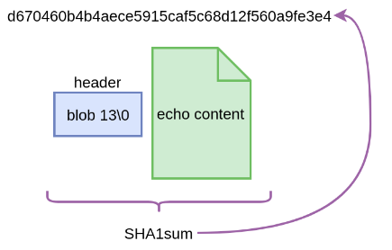
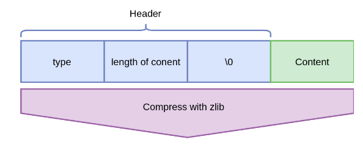
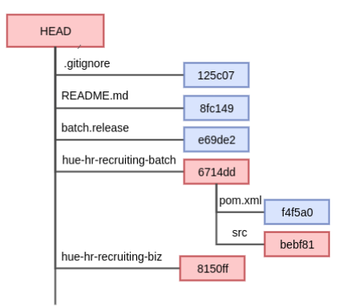
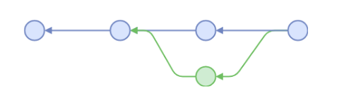
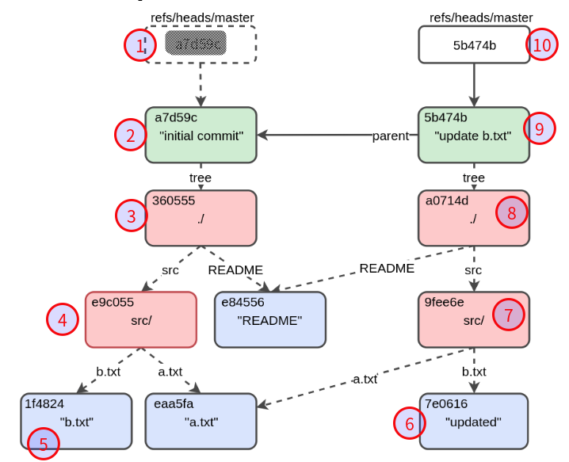

#   两种存储文件的方式
##  直接拷贝存储一份新的(快照)
直接拷贝的方式,类似如下的命令方式
```
#1
cp test.txt ~/backup/test-v1.txt

#2
cp test.txt ~/backup/test-v2.txt

#3
cp test.txt ~/backup/test-v3.txt
```
这是Git的存储方式

##  更小的存储空间
增量存储的方式,类似如下的命令方式操作
```
#1
cp test.txt .../test-initial.txt

#2
diff text.txt .../test-initial.txt > .../test-delta-v2.txt

#3
diff text.txt .../test-delta-v2.txt > .../test-delta-v3.txt
```
这是SVN的存储方式

#   如何给存储中的每一个文件命名
1.  使用时间戳命名的方式
2.  使用版本号方式
3.  使用hash值的方式

##  使用时间戳命名的方式有什么好处
+   易于推理的修改
+   容易产生名字
+   旧版本难以引用
+   分布式系统中可能会发生冲突

类似如下的命令操作
```
# cp test.txt test.txt-$(date +%s%N)

$ cp test.txt test.txt-1500621805384048282
$ cp test.txt test.txt-1500622605384048291
$ cp test.txt-1500622605384048291 test.txt
$ cp test.txt text.txt-1500622905384049812
```

##  使用版本号的方式
+   旧版本易于引用
+   需要维护一个全局计数器以生成新名称
+   难以避免分布式系统中的冲突

类似如下的命令操作
```
$ cp test.txt test.txt-v1
$ cp test.txt test.txt-v2
$ cp test.txt-v2 test.txt
$ cp test.txt text.txt-v4
```
这也是SVN的文件命名方式


##  使用hash值的方式
+   分布式系统的Hash
+   在分布式系统中一致
+   易于生成名称（SHA-1）
+   很难参考旧版本
+   文件名被丢弃(原始文件名找不到)

类似如下的命令操作
```
$ cat test.txt | git hash-object --stdin
d670460b4b4aece5915caf5c68d12f560a9fe3e4

$ cp test.txt ~/.git/object/d6/70460b4b4aece5915caf5c68d12f560a9fe3e4
```
这是Git的文件的命名方式


#   具体看看Git中如何进行构造和标识

##  引入名词Blob

### Blob的定义
+   Blob的定义:文件名为**内容的SHA-1值**的文件,具体来说,如下图,


+   更具体一点来说,应该是如下图,`文件名 == SHA-1 ( zip (类型 + 内容长度 + \0 + 内容 ) )`

### Blob的文件类型
+   我们看一下Header里面有什么东西,如下图,其中`type`用以表示该Blob文件的类型,这样就能区分下文将要说明的`Tree Object`,`Commit Object`等


+   git中如何查看Blob文件的类型
```
$ git cat-file commit HEAD
tree 414408a42cf018b7205f6ea8e1ccafd31ef3cd7a
parent 064a052c9ccf06f6a347b7a06f3e8d2496e11a65
author zhang_ji <zhang_ji@worksap.co.jp> 1500537698 +0800
committer zhang_ji <zhang_ji@worksap.co.jp> 1500537698 +0800

update POM version. refs #300039

from 17.06.hr-SNAPSHOT to 17.07.recruiting-SNAPSHOT

$ git cat-file -t 414408
tree

$ git cat-file -t 064a05
commit
```

### Blob文件的内容是什么
+   下文会说明:[Blob文件的内容](/2020/02/23/Git底层逻辑/#Blob文件的内容)

### Blob文件在哪里可以找到
+   Blob文件可以在`.git/objects`下找到
```
$ find .git/objects
.git/objects

...

.git/objects/info
.git/objects/pack
```
想知道目录的具体作用参考这里:[10.2 Git 内部原理 - Git 对象](https://git-scm.com/book/zh/v2/Git-%E5%86%85%E9%83%A8%E5%8E%9F%E7%90%86-Git-%E5%AF%B9%E8%B1%A1)

##  用Blob标识文件
每个Git管理的文件,在.git录下,都有一个文件与之对应,而这个与之对应的文件称为Blob,同时这个与之对应的文件的文件名为内容的SHA-1值

现在我们已经知道Git如何标识被跟踪的每个文件,接下去说明如何构造目录结构
##  构造目录结构

### 引入名词`Tree`
树对象:首先是一个Blob文件,比上述Blob多出来的是该文件里有内容,其中内容的每一行是一个"孩子"的信息

### 用树对象标识文件


Git中可以使用如下命令进行查看,上述图片即如下查看结果
```
$ git ls-tree HEAD
100644 blob 125c07f222601136b7b6291002e3a9f59ee99bfe    .gitignore
100644 blob 8fc149a7e3053c2b7adeb94e5bdd68bad7d48331    README.md
100644 blob e69de29bb2d1d6434b8b29ae775ad8c2e48c5391    batch.release
040000 tree 6714dd5129fa87f9bf55d9f7944a8764cf6424b1    hue-hr-recruiting-batch
040000 tree 8150ff62850cf4d154876c2c498954d029fa5bf6    hue-hr-recruiting-biz
...
```
可以看到,tree对象是一个文件,并且文件的文件名是SHA-1值,接下去我们在看看tree对象
```
$ git ls-tree 6714dd5129fa87f9bf55d9f7944a8764cf6424b1
100644 blob f4f5a0b2397e2afa2e285507d2af6014015c6b35    pom.xml
040000 tree bebf8118906f2a08c3c2f1ab54f5e9b657f03451    src
```
可以看到,tree对象表示目录,而tree对象的内容的每一行表示被标识目录里的每一个文件所对应的Blob文件的SHA-1值

##  其他元信息
我们已经知道如何标识文件,也已经知道如何构造目录信息,也就是说我们已经有办法构造一个快照了,那么当我们commit一个快照的时候
+   这个快照和前一个快照如何建立联系?
+   commit的时候写的日志信息又该怎么表示?
+   什么时候提交的?
等等这些信息又该如何处理

### 引入名词`commit`
Commit Object：Blob包含提交的元信息,也就是说,一个commit对象也是一个Blob文件,而这个Blob文件的内容包含的是提交的元信息

### 说明一下commit文件
git中可以如下进行查看某一commit的元信息
```
$ git cat-file commit HEAD
tree 414408a42cf018b7205f6ea8e1ccafd31ef3cd7a   -> 当前目录的树对象
parent 064a052c9ccf06f6a347b7a06f3e8d2496e11a65     -> 当前commit的前一个commit的SHA-1值
author zhang_ji <zhang_ji@worksap.co.jp> 1500537698 +0800   -> 作者与时间戳
committer zhang_ji <zhang_ji@worksap.co.jp> 1500537698 +0800    -> 提交者与时间戳(一般来说作者与提交者是同一个人,但万事总有例外,即作者是一个账户,提交的时候切换账户的)

update POM version. refs #300039 from 17.06.hr-SNAPSHOT to 17.07.recruiting-SNAPSHOT    -> 日志信息
```
其中parent就可以画出类似如下的版本图


##  Blob文件的内容
依据Blob文件的类型的不同而不同
+   当类型是最基本的Blob时,内容是`zip(header + 被管理文件的内容)`(这里的zip是前面图中([Blob的文件类型](/2020/02/23/Git底层逻辑/#Blob的文件类型))的`Compress with zlib`)
+   当类型是tree时,内容是header + 孩子的SHA-1值
+   当类型是commit时,内容是header + 其他元信息

#   Git引用(Git References)
##  为什么需要Git引用
### 问题
在我们上述的讨论中,我们知道
1.  当一个项目中的所有文件被git管理之后,项目中每一个文件(文件增删改都算一个新文件)都会在`.git`目录下创建一个对应的Blob
2.  项目中文件的目录结构我们使用`Tree Object`进行记录
3.  其他日志信息,commit信息(例如:commit的前一个commit)等,我们使用`Commit Object`进行记录,通过`Commit Object`的记录,我们能够一步一步进行回溯
4.  那么,就只剩最后一个问题:为了能遍历那段历史从而找到所有相关对象，我们必须记住最后一个提交的SHA-1值
5.  也就是说,最终问题为:**我们要如何记住最后一个Commit的SHA-1值**

### 解决
用一个文件来保存SHA-1值,并给文件起一个简单的名字,然后用这个名字指针来替代原始的SHA-1值

##  什么是Git引用
上述解决方案,可以知道我们需要如下东西
+   一个文件，文件内容是包含一个指向Blob的SHA-1密钥

那么,这个东西,我们称之为Git引用,可以在`.git/refs`下找到

##  在git中具体有哪些是"引用"
因为引用是放在`.git/refs`目录下的,我们看看`.git/refs`下有什么东西
```
$ find .git/refs
.git/refs
.git/refs/heads
.git/refs/heads/master
.git/refs/tags

...
```

顺便查看一下这些文件里有什么
```
$ cat .git/refs/heads/master
5b474b21cebf1385bfe8f3d1470c5d89c7c964b5        # SHA-1值,即指向Blob文件
```

总结一下,从上述目录底下和定义可以知道,以下这些都应是`Git References`
+   Branches
+   Tags
+   Remotes
+   the HEAD
更具体可以看这:[Git 内部原理 - Git 引用](https://git-scm.com/book/zh/v2/Git-%E5%86%85%E9%83%A8%E5%8E%9F%E7%90%86-Git-%E5%BC%95%E7%94%A8)

#   进行一次commit,来说明上述概念

1.  现在我们有一个引用`.git/refs/heads/master`,这个文件内指向的Blob文件是`a7d59c...`,而`a7d59c...`是一个commit
2.  `a7d59c`commit文件内包含了本次提交的树的根节点信息,指向`36055`这个Blob文件(树对象)
3.  `36055`树对象文件内容有两个SHA-1值,一个代表`e9c055`树对象,一个指向`e84556`Blob文件
4.  `e9c055`树对象文件内容也有两个SHA-1值,分别指向`1f4824`Blob文件和`eaa5fa`Blob文件
---------------------------------------------------------
5.  **修改b.txt**文件
6.  这时,由于`b.txt`的文件内容发生了变化,那么`b.txt`就是一个新文件了,此时这个新文件有一个与之对应的新的Blob文件`7e0616`
7.  由于出现新文件,那么要重新构建树对象,此时创建一个新的树对象文件,文件名为`9fee6e`,文件内容为`7e0616`和`eaa5fa`(由于a.txt文件没有修改,所以对于a.txt还是指向原来的Blob文件)
8.  接着在往上,自然仍需要重新构建树对象,此时创建一个新的树对象文件,文件名为`a0714d`,文件内容为`9fee6a`和`e84556`(因为README文件没有修改,所以仍指向原Blob文件)
9.  将这个树对象已经全部构建完成了,需要提交commit了,这个新的commit`5b474b`的tree值就是`a0714d`,parent值就是`a7d59c`,日志信息为"update b.txt"
10. 最后,将`.git/refs/heads/master`文件的值改为`5b47b`,则提交完成
