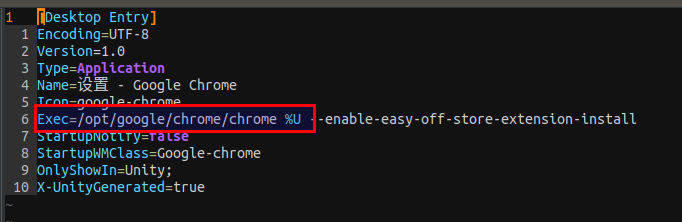

#   Ubuntu中点击外部应用的链接后跳转到Chrome却无法打开应用的问题
+ date: 2020-02-27 22:33:04
+ description: Ubuntu中点击外部应用的链接后跳转到Chrome却无法打开应用的问题
+ categories:
  - Ubuntu
+ tags:
  - Ubuntu装机日志
---
##  参考
[External links are opened as blank tabs in new browser window in Chrome
](https://askubuntu.com/questions/689449/external-links-are-opened-as-blank-tabs-in-new-browser-window-in-chrome)

##  解决方法
As unfulvio said, the issue is with `google-chrome.desktop`, and it is missing the `%U` argument .

Open file: $HOME/.local/share/applications/google-chrome.desktop

Find the line:
```
Exec=/opt/google/chrome/chrome
```
Add a space and `%U`:

```
Exec=/opt/google/chrome/chrome %U
```
Then save the file.

##  翻译过来就是
1.  打开文件
```
vim $HOME/.local/share/applications/google-chrome.desktop
```

2.  找到如下行
```
Exec=/opt/google/chrome/chrome
```

3.  在该行后面添加一个空格和`%U`
```
Exec=/opt/google/chrome/chrome %U
```




4.  保存文件即可
