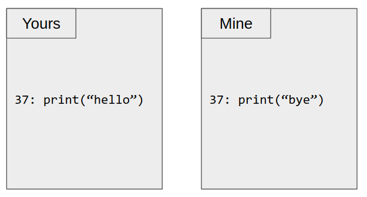
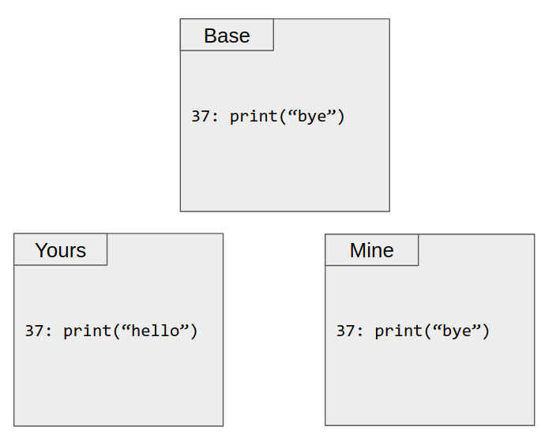
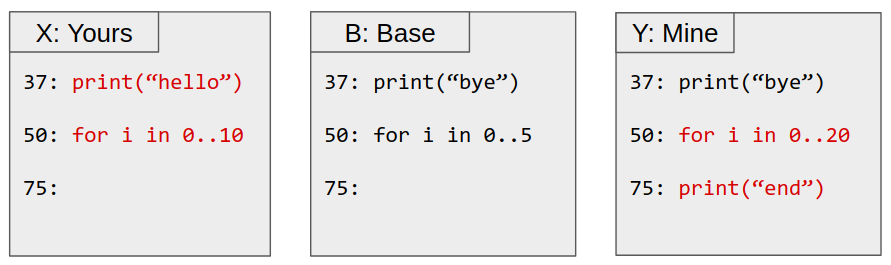
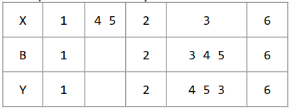

#   Git之三路合并(3-way merge)
+ date: 2020-03-01 12:33:16
+ description: Git的三路合并(3-way merge)
+ categories:
  - Git
+ tags:
  - Git
---
#   三路合并(`3-way merge`)
其实我也不知道正统是不是这样翻译,看英文单词,这个不重要,重要的是三路合并的想法,接下去对三路合并进行简要说明

##  首先先弄清楚`Diff`的时候发生了什么
1.  要比较的字符串如下
```
#   字符串一
a b c d f g h j q z

#   字符串二
a b c d e f g i j k r x y z

```

2.  查找最长的公共子序列([维基百科:LCS(最长公共子序列)](https://zh.wikipedia.org/wiki/%E6%9C%80%E9%95%BF%E5%85%AC%E5%85%B1%E5%AD%90%E5%BA%8F%E5%88%97))
```
#   使用肉眼观察,明显最长公共子序列是如下字符串(计算机中如何找出来不再此次讨论范围)
a b c d e f g i j k r x y z
```

3.  将字符串一对齐到最长的公共子序列(LCS)
```
a b c d   f g h j q       z
a b c d e f g i j k r x y z
```

4.  可以得到字符串一与最长公共子序列的不同
```
e  h i  q  k r x y
+  - +  -  + + + +
```

##  其次说说二路合并(2-way merge)
+   现在有如下两个文件,其中"你"和"我"的文件中,第37行有冲突


+   为了将"你"和"我"的文件进行合并,需要回答如下问题
    -   上述两个文件中,如何知道到底是谁修改了第37行？
    -   "你"还是"我"?
    -   亦或是"你"和"我"都进行修改了?

+   如何解决上述问题?
    -   "你"和"我"都必须记住所有更改
    -   所有差异都应手动解决。

##  最后说明什么是三路合并(3-way merge)
### 过程
在二路合并中的说明中,我们知道,有两件事需要解决,但事实上,记住所有的更改和所有差异都手动解决是非常繁琐的,如果文件非常多,甚至是不可能的,为了解决这两个"不可能",设计了如下的三路合并
+   现有如下三个文件`Base`,`Yours`,`Mine`


+   对三个文件互相比较(一般情况下,是一行一行进行比较),按**如下规则**进行合并
    -   在3个文件中都相同:
        *   不变  ->  说明`Yours`和`Mine`都没有进行修改
    -   在2个文件中相同,第3个文件不相同:
        *   输出与Base不同的内容  ->  和Base不同,说明这个文件进行了修改,在上图中,应是`Yours`进行了修改
        *   丢弃与Base相同的那个  ->  和Base相同,说明这个文件没有进行修改,在上图中,应是`Mine`,也就是这个文件比较旧
    -   在3个文件中都不同
        *   冲突  -> 说明需要合并的两个文件都比Base文件"新",而两个文件又正好改到同一行,此时,计算机肯定是没有办法判断的,就要手动进行解决

+   依照上述规则,我们试着合并下述文件

一般情况下,我们是一行一行进行比较
1.  比较37行,将`Yours`,`Mine`与`Base`进行比较,发现是`在2个文件中相同,第3个文件不相同`,所以合并之后的文件中的第37行应是`print(“hello”)`
2.  比较50行,由于在三个文件文件中都不同,说明`Yours`和`Mine`都进行了修改,这时候计算机无法判断,就有冲突(conflict),这时候需要手动解决
3.  比较75行,由于`Yours`和`Base`相同而`Mine`和`Base`不同,`在2个文件中相同,第3个文件不相同`,所以第75行应是`print(“end”)`
4.  这样我们就能得到如下的合并之后的文件
```
37: print(“bye”)

<<<<Yours
50: for i in 0..10
====
50: for i in 0..20
>>>>Mine

75: print(“end”)
```
5.  最后再将冲突解决,合并就完成了

### 再次强调一下规则
+   对三个文件进行比较(一般情况下,是一行一行进行比较),按**如下规则**进行合并
    -   在3个文件中都相同:
        *   不变  ->  说明`Yours`和`Mine`都没有进行修改
    -   在2个文件中相同,第3个文件不相同:
        *   输出与Base不同的内容  ->  和Base不同,说明这个文件进行了修改,在上图中,应是`Yours`进行了修改
        *   丢弃与Base相同的那个  ->  和Base相同,说明这个文件没有进行修改,在上图中,应是`Mine`,也就是这个文件比较旧
    -   在3个文件中都不同
        *   冲突  -> 说明需要合并的两个文件都比Base文件"新",而两个文件又正好改到同一行,此时,计算机肯定是没有办法判断的,就要手动进行解决


## 在深入一点,我们该如何对三个文件进行比较
前面说明的过程中,对文件进行比较的时候都是使用肉眼进行比较,那么具体算法上又是如何进行比较的呢?这里为了说明,就简单一点,三个文件中的每行都只有一个数字
0.  参考这里:[diff3-short](https://www.cis.upenn.edu/~bcpierce/papers/diff3-short.pdf)
1.  按照行,我们可以为每个文件创建一个多维向量如下,
```
X: [1, 4, 5, 2, 4, 6]
B: [1, 2, 3, 4, 5, 6]
Y: [1, 2, 4, 5, 3, 6]
```

2.  计算差异
```
X: [1, 4, 5, 2, 3,       6]
B: [1,       2, 3, 4, 5, 6]

B: [1, 2, 3, 4, 5,    6]
Y: [1, 2,    4, 5, 3, 6]
```

3.  以B为标准,可以得到如下矩阵


4.  输出差异

## 总结
上述过程就是所谓的`三路合并`
+   三路合并中比二路合并中多出了一个Base文件,这个文件的作用就是为了解决上述的`"你"和"我"都必须记住所有更改`的问题
+   而对于`所有差异都应手动解决`问题,我们可以通过与Base文件进行比较,最后将手动解决的行压缩到冲突这种情况,其他都能自动解决
