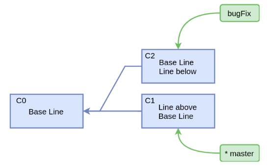

#   Git合并分支
+ date: 2020-03-01 19:57:34
+ description: Git Merge,Git Cherry-Pick,Git Rebase
+ categories:
  - Git
+ tags:
  - Git
---
>   预备知识
>   1.  [Git底层逻辑](/2020/02/23/Git底层逻辑/)
>   2.  [Git之三路合并(3-Way Merge)](/2020/03/01/Git之三路合并/)
#   Git Merge
##  当前分支图


##  进行合并
1.  执行如下命令

```
#   在master分支执行
git merge bugFix
```

2.  上述命令要将`bugFix`分支合并到`master`分支,首先要查找共同祖先,即找到C0
3.  根据三路合并的说明,说明这个C0提交的地位是三路合并中的`Base`
4.  对`<C0，C1，C4>`进行三路合并,合并完之后会有新文件产生(不管是增加内容还是减少内容)
5.  此时对文件构建`Blob`,`Tree Object`,`Commit Object`
6.  这样就得到一个包含更改的新提交

##  合并完之后的分支图


#   Git Cheery-Pick
cherry-pick 和它的名称一样，精心挑选，挑选一个我们需要的 commit 进行操作。它可以用于将在其他分支上的 commit 修改，移植到当前的分支。

##  当前分支图


##  进行合并
1.  执行如下命令

```
git cherry-pick <C4>
```

2.  计算C4引入的更改：C4-C2
3.  应用更改：C3 +（C4-C2）
4.  创建一个包含更改的新提交。

实际上是（C2，C3，C4）的三向合并,这里C2的地位是`Base`

##  合并完之后的分支图


#   Git Rebas
##  当前分支图


##  进行合并
1.  执行如下命令

```
git rebase master
```

2.  寻找共同祖先
3.  确定要选择的提交：C2，C4
4.  前换到master分支


5.  cherry-pick C2


6.  cherry-pick C4


##  合并完之后的分支图
就是上图

##   Merge和Rebase比较
###  Merge
+   提交历史被保留
+   生成一个额外的提交
+   历史不是线性的

###  Rebase
+   提交历史被重写
+   没有额外的提交
+   历史是线性的

##  Rebase需要注意
不要Rebase公共分支

#   最后强调一下
可能看这篇文章的人,并不会看预备知识的文章,所以在这里强调一下**3-way Merge 不等于 Diff-Apply**





```
$ git diff bugFix~ bugFix > x.patch

$ cat x.patch
diff --git a/x.txt b/x.txt
index 8026076..5a49123 100644
--- a/x.txt
+++ b/x.txt
@@ -1 +1,2 @@
 Base Line
+Line below

$ git apply x.patch
error: patch failed: x.txt:1
error: x.txt: patch does not apply

$ git cherry-pick bugFix
[master a25402c] bugFix: modified
 Date: Wed Jul 26 12:17:28 2017 +0800
 1 file changed, 1 insertion(+)
```


