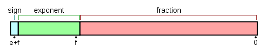
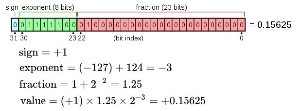
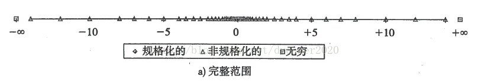

#   深入理解浮点数与浮点数的精度问题
+ date: 2020-03-09 22:06:28
+ description: 深入理解浮点数与浮点数的精度问题
+ categories:
  - 计算机组成原理
+ tags:
  - 计算机组成原理
---
#   参考
+   [单精度浮点数](https://zh.wikipedia.org/wiki/%E5%96%AE%E7%B2%BE%E5%BA%A6%E6%B5%AE%E9%BB%9E%E6%95%B8)
+   [深入理解浮点数有效位](https://blog.csdn.net/dreamer2020/article/details/24158303)

#   为什么会有精度问题
1.  在数学中,与浮点数对应的是小数
2.  数学上区间[0,1]之间的小数有无穷多个
3.  计算机中,32位浮点数最多可以表示2^32个数

所以,计算机是不可能描述得尽的,必然会有一些近似,一些精度所示

#   计算机中如何表示浮点数

##  浮点数的格式
当前，计算机中浮点数采用的是IEEE 754标准。浮点数分为单精度浮点数(32位)和双精度浮点数(64位)。浮点数的基本格式如下：

各部分含义如下：
+   sign：符号位，0表示正，1表示负
+   exponent：阶码，浮点数的幂次。一般采用移码表示。
+   fraction：浮点数的小数部分

##  二进制的浮点数转十进制
上述格式描述的浮点数的十进制值为`value = (-1)^S * (1.fraction) * 2^(exponent - 偏差)`
+   `(-1)^S`表示符号
+   `1.fraction`是二进制的小数
    -   由于除0外的所有小数都可以写成1.fractionX2^E的形式，因而，在表示浮点数时，省略掉了前面的整数部分1
+   `2^(exponent - 偏差)`表示幂次，类似于二进制的科学计数法
    -   单精度情况下`2^(exponent - 127)`
    -   双精度情况下`2^(exponent - 1023)`
    -   `exponent - 127`或者`exponent - 1023`是因为指数有正有负,单精度情况下,阶码有8位,即表示(2^8 - 1)个数,正数负数对半分,就是减去127(双精度同理)

##  非规范化小数
上面描述的是规格化的浮点数，如果`浮点数的阶码部分全0或者全1，则表示非规格化的浮点数`。
+   阶码不是全0或全1，规格化浮点数。
+   阶码全0：表示`0.fraction * 2^ (1-127)`次。注意，此时指数部分是1-127.这一类表示了接近0的小数部分。
+   阶码全1：如果小数部分全0，表示正负无穷大。如果出现1，表示不是一个数`NaN`。

##  举例说明

#   浮点数的精度
通过上面的介绍可以发现，浮点数的精度取决于二进制小数部分的精度。对于单精度浮点数，小数部分有23位，对应十进制小数见下表

|二进制小数|十进制小数|
|----|----|
|2^-23| 0.00000011920928955078125|
|2^-22| 0.0000002384185791015625|
|2^-21| 0.000000476837158203125|
|2^-20| 0.00000095367431640625|
|2^-19| 0.0000019073486328125|
|2^-18| 0.000003814697265625|

+   由于是规格化的浮点数，所以小数部分都要加上1，可以知道，单精度浮点数的小数部分最小是1.00000011920928955078125，其次是1.0000002384185791015625，注意到这两个小数之间的间隔
+   那么,要表示1.0000001和1.0000002之间的小数，则单精度浮点数无能为力，1.0000001已经是23位小数部分描述的最小值了
+   通过这样的分析可以发现，23位只能描述到小数点后第7位，即1.0000001，1.0000002，1.0000004，1.0000009对应了二进制的小数值，其他要通过上面几个的组合来表示
+   事实上，如果考虑保留前7位,而第8位的四舍五入，1.0000004，1.0000009本身的表示也是不准确的。
+   类似的分析，双精度浮点数能准确表示到小数点后第15位，第16位部分准确

#   一个整数用float来存储时保存的精度有多少
思路:
+   将整数转化为二进制科学计数法形式，然后再对应到规格化浮点数中
+   在处理小数部分时，多余的数位即为损失的精度

结论
+   一般来说，无论是整数或者小数，用float表示时，从左边第一个非0的数字算起，从高到低的7位是准确的。此后的数位是不能保证精确的。
+   相应的，从1到0x1FFFFFFFFFFFFF(53位全1，18014398509481983)均可以准确用double来表示。其他整数，只有在转化为double时小数部分不超过52位才可以精确表示。否则，会有一定的精度损失。无论整数或者小数，用double表示时，从左边第一个非0的数字起，从高到低的16位是准确的，此后的数位不一定精确。

#   浮点数分布
通过上面的分析可以发现，尽管浮点数表示的范围很广，但由于精度损失的存在，加上幂次的放大作用，一个浮点数实际上是表示了周围的一个有理数区间。如果将浮点数绘制到一个数轴上，直观上看，靠近0的部分，浮点数出现较密集。越靠近无穷大，浮点数分布越稀疏，一个浮点值代表了周围一片数据。如下图所示。从这个意义上来说，浮点数不宜直接比较相等，它们是代表了一个数据范围。实际应用中，如果要使用浮点数计算，一定要考虑精度问题。在满足精度要求的前提下，计算结果才是有效的。 

在计算精度要求情形下，例如商业计算等，应该避免使用浮点数，严格采取高精度计算。

