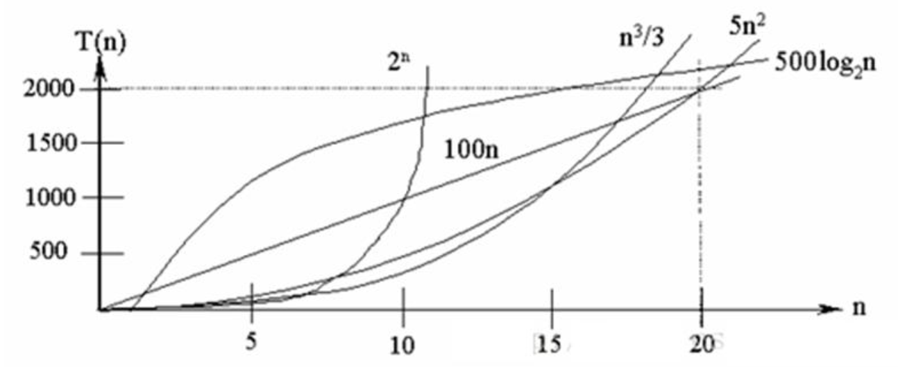
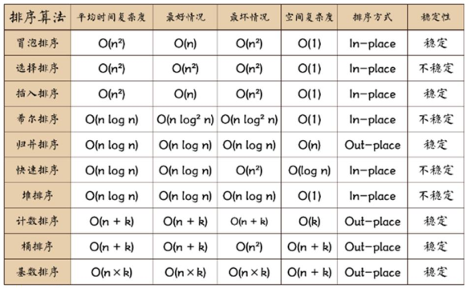

#   度量一个程序(算法)执行时间的两种方法

##  事后统计的方法
这种方法可行,但是有两个问题
1.  要想对设计的算法的运行性能进行评测,需要实际运行该程序
2.  所得时间的统计量依赖于计算机硬件,软件等环境因素

##  事前估算的方法
通过某个算法的时间复杂度来判断哪个算法更优

#   时间频度
+   时间频度:一个算法花费时间与算法中语句的执行次数成正比例,哪个算法中语句执行次数多,它花费时间就多
+   **一个算法中的语句执行次数称为语句频度或时间频度**,记为T(n)


#   时间复杂度

##  什么是时间复杂度
1.  一般情况下,算法中的基本操作语句的重复执行次数是问题规模n的某个函数,用T(n)表示,若某个辅助函数f(n),使得当n趋于无穷大时,T(n)/f(n)的极限值为不等于零的常数,则称f(n)是T(n)的同数量级函数.记作`T(n)=O(f(n))`,称为O(f(n))为算法的渐进时间复杂度,简称时间复杂度
2.  T(n)不同,但时间复杂度可能相同
    -   如:T(n)=n^2+7n+6与T(n)=3n^2+2n+2它们的T(n)不同,但时间复杂度相同,都为O(n^2)

##  计算时间复杂度的方法
计算时间复杂度的方法
+   用常数`1`代替运行时间中所有加法常数`T(n)=n^2+7n+6 => T(n)=n^2+7n+1`
+   修改后的运行次数函数中,只保留最高阶项`T(n)=n^2+7n+1 => T(n)=n^2`
+   去除最高项的系数`T(n)=n^2 => T(n)=n^2`

#   常见的时间复杂度
1.  常数阶O(1)
2.  对数阶O(log2(n))
3.  线性阶O(n)
4.  线性对数阶O(nlog2(n))
5.  平方阶O(n^2)
6.  立方阶O(n^3)
7.  k 次方阶O(n^k)
8.  指数阶O(2^n)

##  常见的时间复杂度对应的图


说明
1.  常见的算法时间复杂度由小到大一次为:`O(1) < O(log2(n)) < O(n) < O(nlog2(n)) < O(n^2) < O(n^3) < O(n^k) < O(2^n)`
2.  随着问题规模n的不断增大,上述时间复杂度不断增大,算法的执行效率越低

##  常见时间复杂度说明

### 常数阶O(1)
无论代码执行多少行,只要是没有循环等复杂结构,那这个代码的时间复杂度都是O(1)
```JAVA
int i = 1;
int j = 2;
++i;
j++;
int m = i + j;
```

### 对数阶O(log2(n))
```JAVA
int i = 1;
while (i < n) {
    i = i * 2;
}
```
在while循环里面,每次都将i乘以2,乘完之后,i距离n就越来越近.假设循环x次之后,i就大于2了,此时这个循环就退出了,也就是说2的x次方等于n,那么`x=log2(n)`也就是说当循环`log2(n)`次以后,这个代码就结束了.因此这个代码的时间复杂度为O(log2(n))

### 线性阶O(n)
```JAVA
for (i = 1; i <= n; i++) {
    j = i;
    j++;
}
```
这段代码,for循环里面的代码会执行n遍,因此它消耗的时间是随着n的变化而变化的,因此这类代码都可以用O(n)来表示它的时间复杂度

### 线性对数阶O(nlogN)
```JAVA
for (m=1; m<n; m++) {
    i = 1;
    while(i < n) {
        i = i * 2;
    }
}
```
将时间复杂度为O(log2(n))的代码循环n遍的花,它的时间复杂度就是`n*O(log2(n))`,也就是O(nlog2(n))

### 平方阶
```JAVA
for (x = 1; i <= n, i++) {
    for (i = 1; i <= n; i++) {
        j = i;
        j++;
    }
}
```
+   如果把O(n)的代码循环以便,它的时间复杂度就是O(n^2)
+   如果将其中一层循环的n改成m,那么它的时间复杂度就变成了`O(m*n)`

##   平均时间复杂度和最坏时间复杂度
1.  平均时间复杂度指所有可能的输入实例均以等概率出现的情况下,该算法的运行时间
2.  最坏情况下的时间复杂度称最坏时间复杂度,**一般讨论的时间复杂度均是最坏情况下的时间复杂度**,这样做原因是:最坏情况下的时间复杂度是算法在任何输入实例上运行时间的界限,这就保证了算法的运行时间不会比最坏情况更长
3.  平均时间复杂度和最坏时间复杂度是否一致,和算法有关:

表中涉及的相关术语解释
+   稳定:如果a原本在b前面,而a=b,排序之后a仍然在b前面
+   不稳定:如果a原本在b的前面,而a=b,排序之后,a可能会出现在b的后面
+   内排序:所有排序操作都是在内存中完成
+   外排序:由于数据太大,因此把数据放在磁盘中,而排序通过磁盘和内存的数据传输才能进行
+   时间复杂度:一个算法执行所耗费的时间
+   空间复杂度:运行完一个程序所需内存的大小
+   n:数据规模
+   k:"桶"的个数
+   In-palce:不占用额外内存
+   Out-place:占用额外内存

#   空间复杂度
1.  类似于时间复杂度,一个算法的空间复杂度(`Space Complexity`)定义为该算法所耗费的存储空间,它也是问题规模n的函数
2.  空间复杂度是对一个算法在运行时中临时占用存储空间大小的量度.有的算法需要占用的临时工作单元数与解决的问题的规模n有关,它随着n的增大而增大,当n较大时,将占用较多的存储单元,例如快速排序和规并排序算法,基数排序就属于这种情况
3.  在做算法分析时,主要讨论的是时间复杂度.从用户体验上看,更看重的程序执行的速度.一些缓存产品(redis,memcache)和算法(基数排序)本质就是**用空间换时间**

