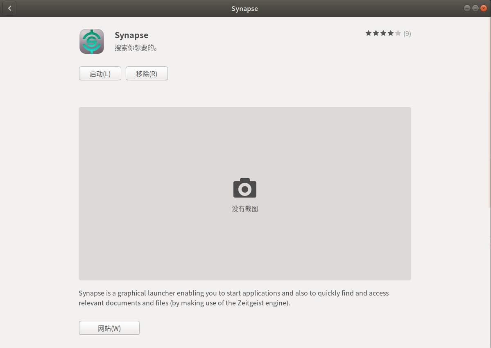

#   作用
>   +   Synapse is a graphical launcher enabling you to start applications and also to quickly find and access relevant documents and files (by making use of the Zeitgeist engine).
>   +   Synapse是一个图形启动器，使您可以启动应用程序，也可以快速查找和访问相关文档和文件（通过使用Zeitgeist引擎）。

#   效果图

搜索你想要的

#   安装
Ubuntu软件里有

