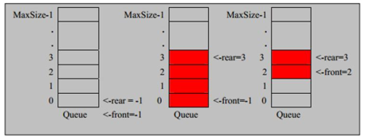
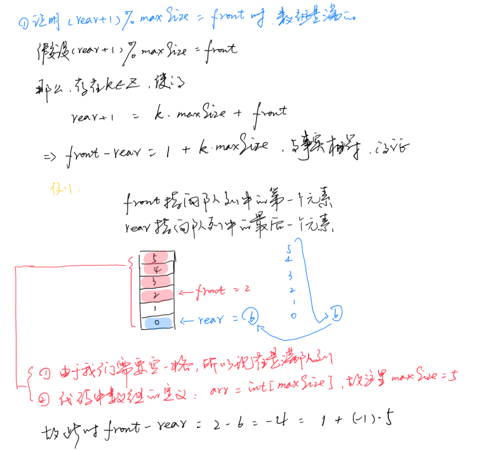

#   什么是队列
1.  队列是一个有序列表,可以用数组或是链表来实现
2.  遵循先入先出的原则

#   数组模拟队列思路

##  思路
+   队列本身是有序列表,若使用数组的结构来存储队列中的数据,则队列数组的声明如下
+   因为队列的输入,输出是分别从数组的最前和最后来处理的,因此需要两个变量`front`和`rear`分别记录队列前后端的下标,front会随着数据输出而改变,而rear则是随着数据输入而改变

+   当我们将数据存入队列是称为`addQueue`,addQueue的处理需要有如下步骤
    -   将尾指针往后移,即`rear + 1`
    -   若尾指针`rear`小于队列的最大下标`maxSize - 1`,则将数据存入rear所指的数组元素中,否则无法存入数据
+   队列空`front == rear`
+   队列满`rear == maxSize - 1`

##   代码实现
1.  队列代码的实现
```JAVA
package com.zjinc36.queue;

public class ArrayQueue {
	private int maxSize;	// 表示数组的最大容量
	private int front;	// 队列头
	private int rear;	// 队列尾
	private int[] arr;	// 该数组用于模拟队列,存放数据

	/**
	 * 构造器
	 * @param maxSize 队列长度
	 */
	public ArrayQueue(int maxSize) {
		// 指定队列长度
		this.maxSize = maxSize;

		// 初始化
		arr = new int[maxSize];
		front = -1;	// 指向队列头部,分析出 front 是指向队列头的前一个位置
		rear = -1;	// 指向队列尾部,是队列最后一个数据
	}

	/**
	 * 判断队列是否已满
	 * @return
	 */
	public boolean isFull() {
		return rear == maxSize - 1;
	}

	/**
	 * 判断队列是否为空
	 * @return
	 */
	public boolean isEmpty() {
		return rear == front;
	}

	/**
	 * 添加数据到队列(入队列)
	 * ->	这里的代码只是掩饰用,实际的生产中,这里改成泛型实用性高
	 * @param n 需要加入队列中的数据
	 */
	public void addQueue(int n) {
		if (isFull()) {
			System.out.println("队列满,不能加入数据~");
			return;
		}

		rear++;	//让rear后移
		arr[rear] = n;
	}

	/**
	 * 获取队列中的数据(出队列)
	 * @return
	 */
	public int getQueue() {
		// 队列空的时候,要抛异常
		if (isEmpty()) {
			throw new RuntimeException("队列空,不能取数据");
		}

		front++;	// front后移

		return arr[front];
	}

	/**
	 * 显示队列中的所有数据
	 */
	public void showQueue() {
		if (isEmpty()) {
			System.out.println("队列空,没有数据~");
			return;
		}

		for (int i = 0; i < arr.length; i++) {
			System.out.printf("arr[%d]=%d\n",i, arr[i]);
		}
	}

	/**
	 * 显示队列的头数据,注意不是取出数据
	 * @return
	 */
	public int headQueue() {
		if (isEmpty()) {
			throw new RuntimeException("队列空,没有数据");
		}

		return arr[front + 1];
	}
}
```

2.  测试
```JAVA
package com.zjinc36.queue;

import static org.junit.Assert.*;

import java.util.Scanner;

import org.junit.After;
import org.junit.Before;
import org.junit.Test;

public class ArrayQueueTest {
	private ArrayQueue arrayQueue;
	private Scanner scanner;

	@Before
	public void setUp () {
		// 创建一个队列
		arrayQueue = new ArrayQueue(3);
	}

	@Test
	public void test() {
		char key = ' ';	//接受用户输入
		scanner = new Scanner(System.in);
		boolean loop = true;

		// 输出一个菜单
		while (loop) {
			System.out.println("============================");
			System.out.println("s(show):显示队列");
			System.out.println("e(exit):退出程序");
			System.out.println("a(add):添加数据到队列");
			System.out.println("g(get):从队列取出数据");

			key = scanner.next().charAt(0);	//接收第一个字符
			switch (key) {
			case 's':
				arrayQueue.showQueue();
				break;
			case 'e':
				scanner.close();
				loop = false;
				break;
			case 'a':
				System.out.println("输入一个数字");
				int value = scanner.nextInt();
				arrayQueue.addQueue(value);
				break;
			case 'g':
				System.out.println("-----------------------------");
				try {
					int res = arrayQueue.getQueue();
					System.out.printf("取出的数据是%d\n", res);
				} catch (Exception e) {
					System.out.println(e.getMessage());
				}

				break;

			default:
				break;
			}
		}
	}

	@After
	public void setOut() {
		if (scanner != null) {
			scanner.close();
		}
	}
}
```

##  存在的问题
+   目前数组使用一次就不能用了

##  如何优化
+   将这个数组改造成`环形的队列`


#   数组模拟环形队列

前面代码在使用过程中发现,这个数组只能使用一次,无法充分利用数组,为此,思路是将数组看成是一个环形的

##  分析说明
对前面代码进行如下改造
1.  front变量的含义做一个调整:front指向队列的第一个元素,初始值为0
2.  rear变量的含义也做调整:rear指向队列的最后一个元素,初始值为0
3.  数组中空出一个空间不存放队列的数据(有其他用途)

那么此时
1.  队列满条件:`(rear+1)%maxSize == front`

2.  队列空条件:`rear == front`
3.  数据入队列,rear位置向前移动1,由于是环形队列,移动完后的rear指向的位置为:`(rear+1)%maxSize`
4.  数据出队列,front位置向前移动1,由于是环形队列,移动完后的front指向的位置为:`(front+1)%maxSize`
5.  队列中有效个数:`(rear+maxSize-front)%maxSize` (这里要加maxSize是因为rear-front有可能为负数,加上数组长度就能保证是正的)

##  代码
1.  环形队列实现
```JAVA
package com.zjinc36.queue;

/**
 * 用数组构建环形队列
 *
 */
public class CircleArrayQueue {
	// 数组的最大容量
	private int maxSize;
	// 指向队列第一个元素
	private int front;
	// 指向队列尾
	private int rear;
	// 该数组用以模拟队列,存放数据
	private int[] arr;

	public CircleArrayQueue(int maxSize) {
		this.maxSize = maxSize;
		arr = new int[maxSize];
	}

	/**
	 * 判断队列是否满
	 * @return
	 */
	public boolean isFull() {
		return (rear + 1) % maxSize == front;
	}

	/**
	 * 判断队列是否为空
	 * @return
	 */
	public boolean isEmpty() {
		return rear == front;
	}

	/**
	 * 将数据添加到队列
	 * @param n
	 */
	public void addQueue(int n) {
		// 判断队列是否已满
		if (isFull()) {
			System.out.println("队列已满,不能加入输入~");
			return;
		}

		arr[rear] = n;

		// 将 rear 后移一位,由于是环形队列,所以要取模
		rear = (rear + 1) % maxSize;
	}

	/**
	 * 从队列中取数据
	 * @return
	 */
	public int getQueue() {
		// 判断队列是否为空
		if (isEmpty()) {
			throw new RuntimeException("队列为空");
		}

		// 取数据,front设定上就是第一个数据的位置
		int value = arr[front];
		// 第一个数据取出后,front要向后移动一位
		// 由于是环形,所以需要
		front = (front + 1) % maxSize;

		return value;
	}

	/**
	 * 显示队列中所有数据
	 */
	public void showQueue() {
		// 遍历
		if (isEmpty()) {
			System.out.println("队列中没有数据");
			return;
		}

		for (int i = front; i < front + size(); i++) {
			System.out.printf("arr[%d]=%d\n", i%maxSize, arr[i%maxSize]);
		}
	}

	/**
	 * 计算数组中元素个数
	 * @return
	 */
	private int size() {
		return (rear + maxSize - front) % maxSize;
	}


}
```

2.  测试
```JAVA
package com.zjinc36.queue;

import static org.junit.Assert.*;

import java.util.Queue;
import java.util.Scanner;

import org.junit.Before;
import org.junit.Test;


public class CircleArrayQueueTest {
	private CircleArrayQueue circleArrayQueue;

	@Before
	public void setUp () {
		circleArrayQueue = new CircleArrayQueue(5);
	}

	@Test
	public void test() {
		char key = ' ';	//接受用户输入
		Scanner scanner = new Scanner(System.in);
		boolean loop = true;

		// 输出一个菜单
		while (loop) {
			System.out.println("============================");
			System.out.println("s(show):显示队列");
			System.out.println("e(exit):退出程序");
			System.out.println("a(add):添加数据到队列");
			System.out.println("g(get):从队列取出数据");

			key = scanner.next().charAt(0);	//接收第一个字符
			switch (key) {
			case 's':
				circleArrayQueue.showQueue();
				break;
			case 'e':
				scanner.close();
				loop = false;
				break;
			case 'a':
				System.out.println("输入一个数字");
				int value = scanner.nextInt();
				circleArrayQueue.addQueue(value);
				break;
			case 'g':
				System.out.println("-----------------------------");
				try {
					int res = circleArrayQueue.getQueue();
					System.out.printf("取出的数据是%d\n", res);
				} catch (Exception e) {
					System.out.println(e.getMessage());
				}

				break;

			default:
				break;
			}
		}
	}

}

```
