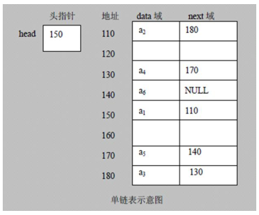
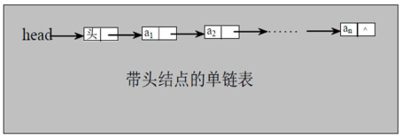

#   Java中实现链表之单链表
description: Java中实现链表之单链表
date: 2020-03-28 02:31:44
categories:
- 数据结构与算法
tags:
- 数据结构与算法(Java实现)
---
#   链表(LinkedList)介绍
1.  链表是有序列表,但是它在内存中的存储如下

2.  链表是以节点方式来存储,是链式存储
3.  每个节点包含`data`域,保存具体的数据;`next`域,指向下一个节点
4.  如上图,链表中的各个节点不一定是连续存储
5.  链表分为`带头节点的链表`和`没有带头节点`的链表,根据实际的需求来确定
6.  单链表(带头节点)的逻辑结构图如下


#   实现
使用带head头的单链表,实现对水浒英雄任务的增删改查

### 英雄类
```JAVA
package com.zjinc36.linkedlist;

import lombok.Data;

@Data
public class HeroNode {
	// 英雄编号
	private int no;

	// 英雄名字
	private String name;
	// 英雄称号
	private String nickname;
	// 指向下一个结点
	private HeroNode next;

	public HeroNode(int no, String name, String nickname) {
		super();
		this.no = no;
		this.name = name;
		this.nickname = nickname;
	}

	/**
	 * 为了显示方便,重写toString
	 */
	@Override
	public String toString() {
		return "HeroNode [no=" + no + ", name=" + name + ", nickname="
				+ nickname + "]";
	}
}
```

### 水浒英雄排行榜的单链表实现
```JAVA
package com.zjinc36.linkedlist;


public class SingleLinkedList {
	// 先初始化一个头节点,头节点不要动,不存放具体的数据
	private HeroNode head = new HeroNode(0, "", "");

	/**
	 * 添加节点到单向链表(当然这肯定是添加到末尾了)
	 * 思路:
	 * 当不考虑编号顺序时
	 * ->	1.找到当前链表的最后节点
	 * ->	2.将最后这个节点的next指向新的节点
	 * @param heroNode
	 */
	public void addNode (HeroNode heroNode) {
		// 因为head节点不能动,因此我们需要一个辅助遍历temmp
		// 不能直接使用head
		HeroNode temp = head;

		// 要在链表最后插入,所以首先要找到链表的最后
		while (true) {
			// 当next为null时,则表示没有下一个
			if (temp.getNext() == null) {
				break;
			}
			// 如果没有找到最后,将temp后移
			temp = temp.getNext();
		}
		// 当退出while循环时,temp就指向了链表的最后
		temp.setNext(heroNode);
	}

	/**
	 * 根据英雄排名,将英雄插入到指定位置
	 * -> 这里的指定位置有"英雄的序号决定"
	 * -> 如果链表中已经存在这个英雄了(序号存在),则显示添加失败
	 * @param heroNode
	 */
	public void addNodeByOrder(HeroNode heroNode) {
		// 头节点不能动,所以我们仍然通过一个辅助指针(变量)来帮助我们找到添加的位置
		HeroNode temp = head;
		boolean flag = false;	// 用于标志添加的编号是否存在,默认为false

		while (true) {
			if (temp.getNext() == null) {	// 说明temp已经在链表的最后了
				break;
			}

			// 因为单链表,所以我们需要找的是位于"添加位置的前一个节点",否则插入不了
			// ->	当前节点指向的下一个节点的编号比当前节点大,说明找到了
			// -> 	此时的temp就是"添加位置的前一个节点"
			if (temp.getNext().getNo() > heroNode.getNo()) {
				break;
			} else if (temp.getNext().getNo() == heroNode.getNo()) {	// 说明希望添加的heroNode的编号已经存在
				flag = true;	// 说明编号已经存在
				break;
			}
			temp = temp.getNext();	// 后移,遍历当前链表
		}

		if (flag) {
			System.out.printf("准备插入的英雄编号 %d 已经存在了,不能加入\n", heroNode.getNo());
		} else {
			if (temp.getNext() == null) {	// 说明temp已经在链表的最后了
				temp.setNext(heroNode);
			} else {
				// 将temp的指向交给heroNode的指向
				heroNode.setNext(temp.getNext());
				// 而temp应指向heroNode
				temp.setNext(heroNode);
			}
		}
	}

	/**
	 * 修改节点信息
	 * -> 根据编号来修改
	 * @param heroNode
	 */
	public void updateNode(HeroNode heroNode) {
		// 判断是否为空
		// -> 即头节点之后没有任何节点
		if (head.getNext() == null) {
			System.out.println("链表为空");
		}

		// 根据节点编号,找到需要修改的节点
		HeroNode temp = head.getNext();
		boolean flag = false;	// 表示是否找到该节点

		// 1.找到节点
		while (true) {
			if (temp == null) {
				break;	// 已经遍历完链表
			}

			// 找到
			if (temp.getNo() == heroNode.getNo()) {
				flag = true;
				break;
			}

			temp = temp.getNext();
		}

		// 2.修改节点
		if (flag) {		// 找到
			temp.setName(heroNode.getName());
			temp.setNickname(heroNode.getNickname());
		} else {	// 没有找到
			System.out.printf("没有找到编号%d的节点,不能修改\n", heroNode.getNo());
		}
	}


	/**
	 * 删除节点
	 * -> 根据英雄编号删除英雄
	 * @param number 英雄编号
	 */
	public void deleteNode(int number) {
		HeroNode temp = head;
		boolean flag = false;	// 标志是否找到待删除节点
		while (true) {
			if (temp.getNext() == null) {	// 已经在链表的最后了
				break;
			}

			if (temp.getNext().getNo() == number) {
				// 找到待删除节点的前一个节点
				flag = true;
				break;
			}

			temp = temp.getNext();
		}

		if (flag) {	//有找到要删除节点的前一个节点,可以删除
			// 只需要将要删除节点的前一个节点的指针指向要删除节点的后一个节点
			temp.setNext(temp.getNext().getNext());
		} else {
			System.out.printf("要删除的%d节点不存在\n", number);
		}
	}

	/**
	 * 显示链表[遍历]
	 */
	public void list() {
		// 判断链表是否为空
		if (head.getNext() == null) {
			System.out.println("链表为空");
			return;
		}

		// 因为是头节点,不能动,因此需要一个辅助变量来遍历
		HeroNode temp = head.getNext();
		while (true) {
			// 判断是否到链表最后
			if (temp == null) {
				break;
			}
			// 输出节点信息
			System.out.println(temp);
			// 将temp后移
			temp = temp.getNext();
		}
	}
}
```

### 测试
```JAVA
package com.zjinc36.linkedlist;

import static org.junit.Assert.*;

import org.junit.Before;
import org.junit.Test;

public class SingleLinkedListTest {
	// 被测试类
	private SingleLinkedList singleLinkedList;

	// "英雄"数组
	private HeroNode[] heros;

	@Before
	public void setUp () {
		// 初始化被测试类
		singleLinkedList = new SingleLinkedList();

		heros = new HeroNode[4];

		heros[0] = new HeroNode(1, "宋江", "及时雨");
		heros[1] = new HeroNode(2, "卢俊义", "玉麒麟");
		heros[2] = new HeroNode(3, "吴用", "智多星");
		heros[3] = new HeroNode(4, "林冲", "豹子头");
	}

	/**
	 * 向链表中添加节点
	 */
	@Test
	public void testAddNode() {
		// 加入节点
		singleLinkedList.addNode(heros[0]);
		singleLinkedList.addNode(heros[1]);
		singleLinkedList.addNode(heros[2]);
		singleLinkedList.addNode(heros[3]);

		// 显示链表
		singleLinkedList.list();
	}

	/**
	 * 向链表中插入节点
	 * ->	会按照链表顺序插入
	 */
	@Test
	public void testAddNodeByOrder() {
		// 加入节点
		singleLinkedList.addNodeByOrder(heros[1]);
		singleLinkedList.addNodeByOrder(heros[0]);
		singleLinkedList.addNodeByOrder(heros[3]);
		singleLinkedList.addNodeByOrder(heros[2]);

		// 显示链表
		singleLinkedList.list();
	}

	@Test
	public void testUpdateNode() {
		// 加入节点
		singleLinkedList.addNodeByOrder(heros[1]);
		singleLinkedList.addNodeByOrder(heros[0]);
		singleLinkedList.addNodeByOrder(heros[3]);
		singleLinkedList.addNodeByOrder(heros[2]);

		HeroNode heroNode = new HeroNode(2, "lujunyi", "yuqilin");
		singleLinkedList.updateNode(heroNode);

		// 显示链表
		singleLinkedList.list();
	}

	@Test
	public void testDeleteNode() {
		// 加入节点
		singleLinkedList.addNodeByOrder(heros[1]);
		singleLinkedList.addNodeByOrder(heros[0]);
		singleLinkedList.addNodeByOrder(heros[3]);
		singleLinkedList.addNodeByOrder(heros[2]);

		singleLinkedList.deleteNode(1);
		singleLinkedList.deleteNode(4);
		singleLinkedList.deleteNode(2);

		// 显示链表
		singleLinkedList.list();
	}
}
```

#   一些常见的算法
代码是基于上述代码加的

##  问题
### 获取单链表有效节点个数(不计算头节点)
```JAVA
public class SingleLinkedList {

//////////////////////////////////////
///这里是上面出现的代码
//////////////////////////////////////


///////////////////////////////////////////////////
///获取单链表有效节点个数(不计算头节点)
///////////////////////////////////////////////////
	/**
	 * 获取单链表有效节点个数(不计算头节点)
	 * @param head
	 */
	public int getLength(HeroNode head) {
		if (head.getNext() == null) {	// 空链表
			return 0;
		}

		int length = 0;

		HeroNode current = head.getNext();
		while (current != null) {
			length++;
			current = current.getNext();
		}
		return length;
	}
}
```

### 查找单链表中倒数第k个节点

####	方法一:利用到上述`获取单链表有效节点个数`时写的函数
```JAVA
public class SingleLinkedList {


//////////////////////////////////////
///这里是上面出现的代码
//////////////////////////////////////


/////////////////////////////////////////
/// 查找单链表中的倒数第k个节点
/////////////////////////////////////////
	/**
	 * 查找单链表中的倒数第k个节点
	 * 思路
	 * 1. 编写一个方法,接收head节点,同时接受一个index
	 * 2. 其中,index表示的是倒数index节点
	 * 3. 先把链表从头到尾遍历,得到链表的总长度 (我们已经有getLength)方法了
	 * 4. 得到链表长度 size = getLength(...) 之后,我们从链表的第一个开始遍历到第 size - index 个,就是我们想要的节点
	 * 5. 如果找到了,则返回该节点,否则返回null
	 */
	public HeroNode findLastIndexNode1(HeroNode heroNode, int index) {
		// 单链表为空
		if (heroNode.getNext() == null) {
			return null;
		}

		// 获取链表长度(取出头节点的链表节点个数)
		int size = getLength(heroNode);

		// 对index进行校验
		if (index <= 0) {
			throw new RuntimeException("索引" + index + "不能是负数");
		}
		if (index > size) {
			return null;
		}

		// 定义辅助变量,for循环定位到倒数的index
		HeroNode current = head.getNext();

		// 链表最后一个是倒是第1个(即:要注意最后一个不是倒数第0个)
		// -> 假设链表长度size = 4
		// -> 要取出倒数第一个 index = 3
		// -> 那么 size - index = 4 - 1 = 3
		for (int i = 0; i < (size - index); i++) {
			current = current.getNext();
		}
		return current;
	}
}
```

####	方法二:使用`快慢指针`
```JAVA
public class SingleLinkedList {

//////////////////////////////////////
///这里是上面出现的代码
//////////////////////////////////////


///////////////////////////////////////////////////
///获取单链表有效节点个数(不计算头节点)
///////////////////////////////////////////////////

/**
	 * 查找单链表中的倒数第 index 个节点
	 * -> 使用快慢指针实现
	 * 思路:
	 * 1. 可以定义两个指针,第一个指针从链表的头指针开始遍历向前走 index-1 步,第二个指针保持不动;
	 * 2. 从第 index 步开始,第二个指针也开始从链表的头指针开始遍历.
	 * 3. 由于两个指针的距离保持在 index-1 ,当第一个指针到达链表的尾节点时候,第二个指针正好是倒数第 index 个节点.
	 * @return
	 */
	public HeroNode findLastIndexNode2(HeroNode heroNode, int index) {
		// 单链表为空
		if (heroNode.getNext() == null) {
			return null;
		}

		// 对index进行校验
		if (index <= 0) {
			throw new RuntimeException("索引" + index + "不能是负数");
		}

		// 定义辅助变量,for循环定位到倒数的index
		HeroNode currentFast = head.getNext();
		HeroNode currentSlow = head.getNext();

		int count = 0;
		while (currentFast.getNext() != null) {
			if (count >= index - 1) {	// 因为此时currentSlow已经是第一个节点了,所以是(index - 1)
				currentSlow = currentSlow.getNext();
			}
			count++;
			currentFast = currentFast.getNext();
		}
		return currentSlow;
	}
}
```

### 单链表的反转
```JAVA
public class SingleLinkedList {

//////////////////////////////////////
///这里是上面出现的代码
//////////////////////////////////////


///////////////////////////////////////////////////////
/// 单链表的反转
///////////////////////////////////////////////////////

	/**
	 * 单链表的反转
	 * 思路:
	 * -> 先定义一个头节点 reverseHead = new HeroNode();
	 * -> 从头到尾遍历原来的链表,每遍历一个节点,就将其取出,并放在新的链表reverseHead的最前端
	 * @param head
	 */
	public void reversetList(HeroNode head) {
		// 如果当前链表为空,或者只有一个节点,无需反转,直接返回
		if (head.getNext() == null || head.getNext().getNext() == null) {
			return;
		}

		// 现在是有头链表,所以我们需要一个头
		HeroNode reversetHead = new HeroNode(0, "", "");
		// 当前节点
		HeroNode current = head.getNext();
		HeroNode currentNext = null;
		while (current != null) {
			// 获取旧链表当前节点的下一个节点的指针
			currentNext = current.getNext();

			// 处理"当前节点"
			// -> 由于当前节点要插入新链表的"头节点"和"第一节点"之间
			// -> 所以"当前节点"应指向"第一节点",如下
			current.setNext(reversetHead.getNext());
			// -> 此时 current 是 "当前节点" -> "第一节点" ... 这样的状态
			// -> 故只需要将"头节点"的下一个节点指向"当前节点"就行
			reversetHead.setNext(current);

			// 由于是对current进行遍历,故指针应是 旧链表 的下一个节点
			current = currentNext;
		}
		// 最后将 head 指向新链表的第一个节点
		head.setNext(reversetHead.getNext());
	}
}
```


##  测试
```JAVA
public class SingleLinkedListTest {
	// 被测试类
	private SingleLinkedList singleLinkedList;

	// "英雄"数组
	private HeroNode[] heros;

	@Before
	public void setUp () {
		// 初始化被测试类
		singleLinkedList = new SingleLinkedList();

		heros = new HeroNode[4];

		heros[0] = new HeroNode(1, "宋江", "及时雨");
		heros[1] = new HeroNode(2, "卢俊义", "玉麒麟");
		heros[2] = new HeroNode(3, "吴用", "智多星");
		heros[3] = new HeroNode(4, "林冲", "豹子头");
	}


////////////////////////////////////////
////////////////////////////////////////

/// 上面的其他代码 ///

///////////////////////////////////////
////////////////////////////////////////

	/**
	 * 测试获取链表长度
	 */
	@Test
	public void testGetLength() {
		// 加入节点
		singleLinkedList.addNodeByOrder(heros[1]);
		singleLinkedList.addNodeByOrder(heros[0]);
		singleLinkedList.addNodeByOrder(heros[3]);
		singleLinkedList.addNodeByOrder(heros[2]);

		// 显示链表
		singleLinkedList.list();

		// 显示长度
		int length = singleLinkedList.getLength(singleLinkedList.getHead());
		System.out.printf("链表长度为%d", length);
	}

	/**
	 * 获取到链表倒数第 index 个节点,方案一
	 */
	@Test
	public void testFindLastIndexNode1() {
		// 加入节点
		singleLinkedList.addNodeByOrder(heros[1]);
		singleLinkedList.addNodeByOrder(heros[0]);
		singleLinkedList.addNodeByOrder(heros[3]);
		singleLinkedList.addNodeByOrder(heros[2]);

		// 显示链表
		singleLinkedList.list();

		HeroNode head = singleLinkedList.getHead();
		HeroNode findLastIndexNode = singleLinkedList.findLastIndexNode1(head, 1);
		System.out.println(findLastIndexNode);
	}

	/**
	 * 获取到链表倒数第 index 个节点,方案二
	 */
	@Test
	public void testFildLastIndexNode2() {
		// 加入节点
		singleLinkedList.addNodeByOrder(heros[1]);
		singleLinkedList.addNodeByOrder(heros[0]);
		singleLinkedList.addNodeByOrder(heros[3]);
		singleLinkedList.addNodeByOrder(heros[2]);

		// 显示链表
		singleLinkedList.list();

		HeroNode head = singleLinkedList.getHead();
		HeroNode findLastIndexNode = singleLinkedList.findLastIndexNode2(head, 4);
		System.out.println(findLastIndexNode);
	}

	/**
	 * 链表反转
	 */
	@Test
	public void testReversetList () {
		// 加入节点
		singleLinkedList.addNode(heros[3]);
		singleLinkedList.addNode(heros[1]);
		singleLinkedList.addNode(heros[2]);
		singleLinkedList.addNode(heros[0]);

		// 显示链表
		singleLinkedList.list();

		HeroNode head = singleLinkedList.getHead();
		singleLinkedList.reversetList(head);

		singleLinkedList.list();
	}
}
```

##  问题:合并两个有序的单链表,合并后仍然有序
```JAVA
	/**
	 * 合并两个有序的单链表,合并后仍然有序
	 * @return
	 */
	@Test
	public void testMergeLinkedList () {
		HeroNode[] heros1 = new HeroNode[4];
		heros1[0] = new HeroNode(1, "宋江", "及时雨");
		heros1[1] = new HeroNode(2, "卢俊义", "玉麒麟");
		heros1[2] = new HeroNode(3, "吴用", "智多星");
		heros1[3] = new HeroNode(4, "林冲", "豹子头");
		SingleLinkedList singleLinkedList1 = new SingleLinkedList();
		singleLinkedList1.addNodeByOrder(heros1[0]);
		singleLinkedList1.addNodeByOrder(heros1[1]);
		singleLinkedList1.addNodeByOrder(heros1[2]);
		singleLinkedList1.addNodeByOrder(heros1[3]);
		singleLinkedList1.list();


		HeroNode[] heros2 = new HeroNode[4];

		heros2[0] = new HeroNode(1, "刘备", "玄德");
		heros2[1] = new HeroNode(2, "关羽", "云长");
		heros2[2] = new HeroNode(3, "张飞", "翼德");
		heros2[3] = new HeroNode(4, "赵云", "子龙");
		SingleLinkedList singleLinkedList2 = new SingleLinkedList();
		singleLinkedList2.addNodeByOrder(heros2[0]);
		singleLinkedList2.addNodeByOrder(heros2[1]);
		singleLinkedList2.addNodeByOrder(heros2[2]);
		singleLinkedList2.addNodeByOrder(heros2[3]);
		singleLinkedList2.list();


		/**
		 * 合并两个有序的单链表,合并后仍然有序
		 * @return
		 */
		HeroNode headFirst = singleLinkedList1.getHead();
		HeroNode headSecond = singleLinkedList2.getHead();
		if (headFirst.getNext() == null) {
			singleLinkedList1.list();
		}
		if (headSecond.getNext() == null) {
			singleLinkedList2.list();
		}

		HeroNode currentFirst = headFirst.getNext();
		HeroNode currentSecond = headSecond.getNext();

		// 链表
		// 链表的头节点
		HeroNode mergeListHead = new HeroNode(0, "", "");
		HeroNode currentMerge = mergeListHead;

		while (currentFirst != null && currentSecond != null) {
			if (currentFirst.getNo() <= currentSecond.getNo()) {
				currentMerge.setNext(currentFirst);
				currentFirst = currentFirst.getNext();
			} else {
				currentMerge.setNext(currentSecond);
				currentSecond = currentSecond.getNext();
			}
			currentMerge = currentMerge.getNext();
		}
		if (currentFirst != null) {
			currentMerge.setNext(currentFirst);
		}
		if (currentSecond != null) {
			currentMerge.setNext(currentSecond);
		}

		// 打印合并后的链表
		HeroNode temp = mergeListHead.getNext();
		System.out.println("===============打印合并后的链表=========================");
		while (true) {
			// 判断是否到链表最后
			if (temp == null) {
				break;
			}
			// 输出节点信息
			System.out.println(temp);
			// 将temp后移
			temp = temp.getNext();
		}
		System.out.println("====================================================");
	}
```
