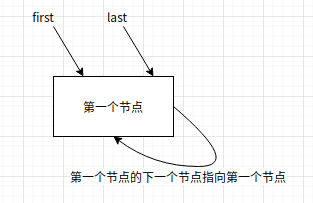

#   循环链表
>   参考维基百科:[循环链表](https://zh.wikipedia.org/wiki/%E5%BE%AA%E7%8E%AF%E9%93%BE%E8%A1%A8)

>   循环链表是一种链式存储结构，它的最后一个结点指向头结点，形成一个环。因此，从循环链表中的任何一个结点出发都能找到任何其他结点。循环链表的操作和单链表的操作基本一致，差别仅仅在于算法中的循环条件有所不同。

#   约瑟夫问题
1.  设编号为1,2,3,...,n的n个人围坐一圈
2.  约定编号为k(1<=k<=n)的人从1开始报数数到m的那个人出列
3.  然后出列的人的下一个人又从1开始报数,数到m的哪个人出列
4.  然后出列的人的下一个人又从1开始报数,数到m的哪个人出列...
5.  直到所有人都出列为止

#   使用单向环形链表解决约瑟夫问题

##  创建单向环形列表

### 1.  第一个节点构成环形链表

1.  当前只有一个节点,所以需要指定一下first指针,而first指针就指向第一个节点
2.  当前只有一个节点,所以尾指针也是指向第一个节点
3.  当前只有一个节点,为了要构成环,所以当前节点的下一个节点指向当前节点

### 2.  向上述一个节点的环形链表添加节点
1.  因为要在链表的最后增加节点,所以只需要添加在尾指针(last指针)后(即设置last.next = newNode)
2.  而要构成环形链表,最新添加的节点需要指向第一个节点(即,newNode.next = first)
3.  尾指针指向最后一个节点(last = newNode)

##  出列
 +	思路:
 +	-> 1.需要有一个first指针指向环形链表的第一个节点
 +	-> 2.需要创建一个last指针指向环形链表的最后一个节点
 +	-> 3.由于是从第k个节点开始数数,则first和last指针先移动(k - 1)次,此时first指向第k个节点
 +	-> 4.报数为m,则first和last指针同时移动 m-1次(因为自己要先数,此时为1)
 +	-> 5.移动后first指向的节点就是需要移除的节点
 +	-> 6.移除节点
 +	-> -> first = first.next
 +	-> -> last.next = first
 +	-> 7.要移除的节点没有被任何引用,会被回收


##  代码

### 小孩对象(节点对象)
```JAVA
package com.zjinc36.linkedlist.circlesinglelinkedlist;

import lombok.Data;

@Data
public class Boy {
	private int no;	//标号
	private Boy next;	//指向下一个节点,默认为null

	public Boy(int no) {
		this.no = no;
	}
}
```

### 单向环形链表解决约瑟夫问题
```JAVA
package com.zjinc36.linkedlist.circlesinglelinkedlist;

public class CircleSingleLinkedList {

	// 创建一个first节点,当前没有编号
	private Boy first = null;

	/**
	 * 添加小孩节点,构成一个环形的链表
	 * @param nums
	 */
	public void addBoy(int nums) {
		if (nums < 1) {
			System.out.println("nums的值不正确");
			return;
		}

		// 辅助指针,帮助构建环形链表
		// 这个指针是一个尾指针
		Boy last = null;

		// 使用for来创建我们的环形链表
		for (int i = 1; i <= nums; i++) {
			// 根据编号,创建小孩节点
			Boy boy = new Boy(i);

			if (i == 1) {	// 第一个节点比较特殊
				// 第一个节点构成环形链表
				// 1.目前只有一个节点,所以需要指定一下first
				first = boy;
				// 2.目前只有一个节点,所以尾指针也是指向boy
				last = boy;
				// 3.目前只有一个节点,要构成环,所以当前节点指向当前节点
				first.setNext(first);
			} else {
				// 非第一个节点构成环形链表
				// 1.因为要在链表的最后增加节点,所以只需要添加在尾指针后
				last.setNext(boy);
				// 2.而要构成环形链表,最新添加的节点需要指向第一个节点
				boy.setNext(first);
				// 3.尾指针指向最后一个节点(最新添加的节点)
				last = boy;
			}
		}
	}

	/**
	 * 遍历当前的环形链表
	 */
	public void showBoy() {
		// 判断当前是否为空
		if (first == null) {
			System.out.println("没有任何小孩~");
			return;
		}
		// 因为first不能动,所以我们用一个辅助指针
		Boy temp = first;
		while (true) {
			System.out.printf("小孩编号 %d \n", temp.getNo());
			if (temp.getNext() == first) {
				break;
			}
			temp = temp.getNext();
		}
	}

	/**
	 * 根据用户的输入,计算出小孩出圈的顺序
	 * 思路:
	 * -> 1.需要有一个first指针指向环形链表的第一个节点
	 * -> 2.需要创建一个last指针指向环形链表的最后一个节点
	 * -> 3.由于是从第k个节点开始数数,则first和last指针先移动(k - 1)次,此时first指向第k个节点
	 * -> 4.报数为m,则first和last指针同时移动 m-1次(因为自己要先数,此时为1)
	 * -> 5.移动后first指向的节点就是需要移除的节点
	 * -> 6.移除节点
	 * -> -> first = first.next
	 * -> -> last.next = first
	 * -> 7.要移除的节点没有被任何引用,会被回收
	 * @param startNo 表示从第几个节点开始数数
	 * @param countNum 表示数几下
	 * @param nums 表示最初有多少小孩在圈中
	 */
	public void countBoy(int startNo, int countNum, int nums) {
		// 先对数据进行校验
		if (first == null || startNo < 1 || startNo > nums) {
			System.out.println("参数输入有误,请重新输入");
			return;
		}
		Boy last = first;
		// 1.将first和last指向链表的第一个节点和最后一个节点
		while (true) {
			if (last.getNext() == first) {
				break;
			}
			last = last.getNext();
		}

		// 将first指针指向 startNo
		// 也就是说 first 和 last 要移动 startNo - 1 次
		for (int i = 0; i < startNo - 1; i++) {
			first = first.getNext();
			last = last.getNext();
		}

		while (true) {
			if (last == first) {	// 说明环形链表中只有一个节点
				break;
			}
			// 报数,第countNum删除
			// 即first和last指针同时移动(countNum - 1)次
			// 也就是移动后,first会指向需要删除的节点
			for (int i = 0; i < countNum - 1; i++) {
				first = first.getNext();
				last = last.getNext();
			}
			// 移除节点
			System.out.printf("删除第%d个节点\n",first.getNo());
			first = first.getNext();
			last.setNext(first);
		}
		System.out.printf("最后还在环形链表中的节点编号为%d\n", first.getNo());
	}

}
```

###	测试
```JAVA
package com.zjinc36.linkedlist.circlesinglelinkedlist;

import static org.junit.Assert.*;

import org.junit.Test;

public class CircleSingleLinkedListTest {

	@Test
	public void test() {
		CircleSingleLinkedList circleSingleLinkedList = new CircleSingleLinkedList();
		circleSingleLinkedList.addBoy(5);
		circleSingleLinkedList.showBoy();

		circleSingleLinkedList.countBoy(1, 2, 5);
	}

}
```

