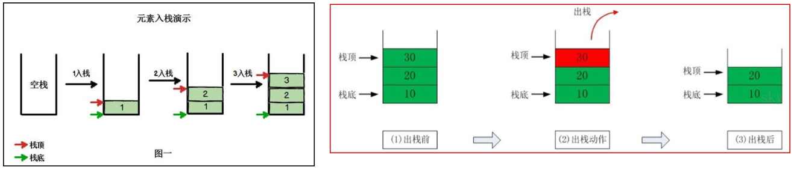

#   Java中实现栈
description: Java中实现栈
date: 2020-04-02 16:27:59
categories:
- 数据结构与算法
tags:
- 数据结构与算法(Java实现)
---
#   什么是栈
1.  栈的英文是stack
2.  栈是`先入后出(FILO-First In Last Out)`的有序列表
3.  栈是限制线性表中元素的插入和删除只能在线性表的同一端进行的一种特殊线性表
4.  允许插入和删除的一端为变化的一端,称为`栈顶(Top)`,另一端为固定的一端,称之为`栈底(Bottom)`
5.  根据栈的定义可知,最先放入栈中元素在栈底,最后放入的元素在栈顶,而删除元素刚好相反,最后放入的元素最先删除,最先放入的元素最后删除




#   栈的应用场景
1.  子程序的调用:在跳往子程序前,会先将下个指令的地址存到堆栈中,知道子程序执行完后再将地址取出,以回到原来的程序中
2.  处理递归调用:和子程序的调用类似,只是除了存储下一个指令的地址外,也将参数,区域变量等数据存入堆栈中
3.  表达式的转换[中缀表达式转后缀表达式]与求值
4.  二叉树的遍历
5.  图形的深度优化(depth - first)搜索法

#   用数组模拟栈
##  思路
+   定义一个数组stack
+   定义一个top来表示栈顶,初始化为-1
+   入栈的操作:当有数据加入到栈时,top++,同时stack[top] = data;
+   出栈的操作:先
    -   先获得栈顶的数据 value = stack[top]
    -   将top向下移动`top--`
    -   返回栈顶数据 return value

##  代码实现
### 实现
```JAVA
package com.zjinc36.stack;

import com.fasterxml.jackson.annotation.JsonFormat.Value;

public class ArrayStack {

	private int maxSize;	// 栈的大小
	private int[] stack;	// 模拟栈用数组
	private int top = -1;	// top表示栈顶,初始化为-1
	public ArrayStack(int maxSize) {
		super();
		this.maxSize = maxSize;
		stack = new int[this.maxSize];
	}

	/**
	 * 栈满
	 * @return
	 */
	public boolean isFull() {
		return top == maxSize - 1;
	}

	/**
	 * 栈空
	 * @return
	 */
	public boolean isEmpty() {
		return top == -1;
	}

	/**
	 * 入栈
	 * @param value
	 */
	public void push(int value) {
		// 先判断栈是否已满
		if (isFull()) {
			System.out.println("栈满");
			return;
		}
		top++;
		stack[top] = value;
	}

	/**
	 * 出栈
	 * @return
	 */
	public int pop() {
		// 先判断栈是否为空
		if (isEmpty()) {
			throw new RuntimeException("栈空");
		}
		int value = stack[top];
		top--;
		return value;
	}

	/**
	 * 显示栈
	 */
	public void list() {
		if (isEmpty()) {
			System.out.println("栈空");
			return;
		}
		// 需要从栈顶开始遍历
		for (int i = top; i >= 0; i--) {
			System.out.printf("stack[%d]=%d\n", i, stack[i]);
		}
	}
}
```

### 测试
```JAVA
package com.zjinc36.stack;

import static org.junit.Assert.*;

import java.util.Scanner;

import org.junit.Test;

public class ArrayStackTest {

	@Test
	public void test() {
		ArrayStack stack = new ArrayStack(4);
		String key = "";
		boolean loop = true;
		Scanner scanner = new Scanner(System.in);
		while (loop) {
			System.out.println("show:表示显示栈");
			System.out.println("exit:退出程序");
			System.out.println("push:入栈");
			System.out.println("pop:出栈");
			System.out.println("请输入你的选择");

			key = scanner.next();
			switch (key) {
			case "show":
				stack.list();
				break;
			case "push":
				System.out.println("请输入一个数");
				int value = scanner.nextInt();
				stack.push(value);
				break;
			case "pop":
				try {
					int res = stack.pop();
					System.out.printf("出栈的数据%d\n", res);
				} catch (Exception e) {
					System.out.println(e.getMessage());
				}
				break;
			case "exit":
				scanner.close();
				loop = false;
				break;
			default:
				break;
			}

			System.out.println("程序退出~~");
		}
	}

}
```
