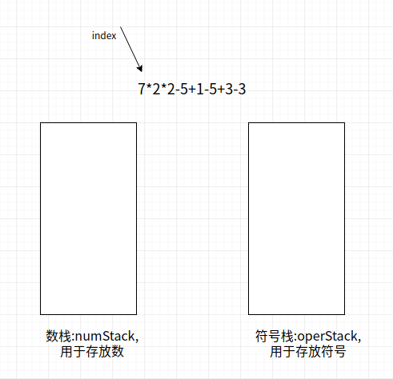

#   Java中栈的「前缀」「中缀」「后缀」表达式
description: Java中栈的「前缀」「中缀」「后缀」表达式
date: 2020-04-02 21:06:47
categories:
- 数据结构与算法
tags:
- 数据结构与算法(Java实现)
---
#   前缀表达式(波兰表达式)
##  什么是前缀表达式
1.  前缀表达式又称之为波兰式,前缀表达式的运算符位于操作数之前
2.  举例说明:`(3+4)*5-6`对应的前缀表达式就是`- * + 3 4 5 6`

##  前缀表达式的计算机求值
### 思路
1.  从右至左扫描表达式
2.  遇到数字时,将数字压入堆栈
3.  遇到运算符时,弹出栈顶的两个数,用运算符对它们做相应的计算(栈顶元素和次栈顶元素),并将结果入栈
4.  重复上述过程,直到表达式最左端
5.  最后运算得出的值即为表达式的结果

### 举例
举例说明:`(3+4)*5-6`对应的前缀表达式就是`- * + 3 4 5 6`,针对前缀表达式求值步骤如下:
1.  从右至左扫描
2.  遇到数字`6,5,4,3`,将数字压入栈
3.  遇到`+`运算符,因此弹出3和4(3为栈顶元素,4为次栈顶元素),计算出3+4的值,得7,再将7入栈
4.  接下来,是`*`运算符,因此弹出7和5,计算出`7*5=35`,将35入栈
5.  最后是`-`运算符,计算出`35-6`的值,即29,由此得出最终结果

#   中缀表达式
##  什么是中缀表达式
1.  中缀表达式就是常见的运算表达式,如`(3+4)*5-6`
2.  中缀表达式的求值是我们人最熟悉的,但是对计算机来说却不好操作(如下案例),因此,在计算结果时,往往会将中缀表达式转成其他表达式来操作(一般转成后缀表达式)

##   使用栈(中缀表达式)来实现综合计算器
计算:`7*2*2-5+1-5+3-3`

###  思路分析



+   通过一个index来遍历我们的表达式
+   如果我们发现是一个数字,就直接入数栈
+   如果发现扫描到一个符号,就分如下情况
    -   如果当前符号栈为空,就直接入栈
    -   如果当前符号栈有符号,就进行比较
        -   如果当前的操作符号优先级小于或者等于栈中的操作符,就需要从数栈中pop出两个数,从符号栈中pop出一个符号,进行运算,将得到的结果入数栈.然后将当前的操作符入符号栈
        -   如果当前的操作符的优先级大于栈中的操作符,就直接入符号栈
+   当表达式扫描完毕,就顺序的从数栈和符号栈中pop出相应的数和符号,并运行
+   最后在数栈中只有一个数字,就是表达式的结果

##  代码
### 用数组模拟栈
```JAVA
package com.zjinc36.stack;

public class ArrayStack {

	private int maxSize;	// 栈的大小
	private int[] stack;	// 模拟栈用数组
	private int top = -1;	// top表示栈顶,初始化为-1

	public ArrayStack(int maxSize) {
		super();
		this.maxSize = maxSize;
		stack = new int[this.maxSize];
	}

	/**
	 * 栈满
	 * @return
	 */
	public boolean isFull() {
		return top == maxSize - 1;
	}

	/**
	 * 栈空
	 * @return
	 */
	public boolean isEmpty() {
		return top == -1;
	}

	/**
	 * 入栈
	 * @param value
	 */
	public void push(int value) {
		// 先判断栈是否已满
		if (isFull()) {
			System.out.println("栈满");
			return;
		}
		top++;
		stack[top] = value;
	}

	/**
	 * 出栈
	 * @return
	 */
	public int pop() {
		// 先判断栈是否为空
		if (isEmpty()) {
			throw new RuntimeException("栈空");
		}
		// 获取此时栈顶的值
		int value = stack[top];
		// 将栈顶的值置为默认
		stack[top] = 0;
		top--;
		return value;
	}

	/**
	 * 显示栈
	 */
	public void list() {
		if (isEmpty()) {
			System.out.println("栈空");
			return;
		}
		// 需要从栈顶开始遍历
		for (int i = top; i >= 0; i--) {
			System.out.printf("stack[%d]=%d\n", i, stack[i]);
		}
	}

	/**
	 * 查看当前栈顶的值
	 * @return
	 */
	public int peek() {
		return stack[top];
	}

}
```

### 计算器类
```JAVA
package com.zjinc36.stack;

public class Calculator {
	// String expression = "5-3+3";
	private String expression = "";

	public Calculator(String expression) {
		super();
		this.expression = expression;
	}

	/**
	 * 进行计算
	 * 思路
	 * 1.通过一个index来遍历我们的表达式
	 * 2.如果我们发现是一个数字,就直接入数栈
	 * 3.如果发现扫描到一个符号,就分如下情况
	 * -> 3.1 如果当前符号栈为空,就直接入栈
	 * -> 3.2 如果当前符号栈有符号,就进行比较
	 * -> -> 3.3 如果当前的操作符号优先级小于或者等于栈中的操作符,就需要从数栈中pop出两个数,
	 * -> -> 	 从符号栈中pop出一个符号,进行运算,将得到的结果入数栈.然后将当前的操作符入符号栈
	 * -> -> 3.4 如果当前的操作符的优先级大于栈中的操作符,就直接入符号栈
	 * 4.当表达式扫描完毕,就顺序的从数栈和符号栈中pop出相应的数和符号,并运行
	 * 5.最后在数栈中只有一个数字,就是表达式的结果
	 */
	public void calResult() {


		// 创建两个栈,数栈和符号栈
		ArrayStack numStack = new ArrayStack(10);
		ArrayStack operStack = new ArrayStack(10);

		// 定义需要的相关变量
		int index = 0;	// 用于扫描
		int num1 = 0; 	// 先出栈的数
		int num2 = 0;	// 后出栈的数
		int oper = 0;
		int res = 0;
		char ch = ' ';	//将每次扫描的到的char保存到ch

		String keepNum = "";	//用于拼接多位数

		// 扫描数字和符号进行入栈
		while (true) {
			// 1.通过一个index来遍历我们的表达式
			ch = expression.substring(index, index+1).charAt(0);

			// 判断是数字还是字符
			// 2.如果我们发现是一个数字,就直接入数栈
			// 3.如果发现扫描到一个符号,就分如下情况
			if (isOper(ch)) {
				// 3.1 如果当前符号栈为空,就直接入栈
				// 3.2 如果当前符号栈有符号,就进行比较
				if (operStack.isEmpty()) {
					operStack.push(ch);
				} else {
					// 3.3 如果当前的操作符号优先级小于或者等于栈中的操作符,
					//	   就需要从数栈中pop出两个数,从符号栈中pop出一个符号,进行运算,
					//	   将得到的结果入数栈.然后将当前的操作符入符号栈
					// 3.4 如果当前的操作符的优先级大于栈中的操作符,就直接入符号栈
					if (priority(ch) <= priority(operStack.peek())) {
						num1 = numStack.pop();
						num2 = numStack.pop();
						oper = operStack.pop();

						res = cal(num1, num2, oper);

						// 把运算结果入数栈
						numStack.push(res);
						// 然后将当前的操作符号入符号栈
						operStack.push(ch);
					} else {
						operStack.push(ch);
					}
				}
			} else {
				// 如果是数,则直接入栈
				// -> 这里需要处理数字是不是多位数
				// 思路:
				// -> 1.当处理多位数时,不能当前字符是数就立即入栈,因为它后一位也可能是数字
				// -> 2.在处理数时,需要向expression的表达式的index后再看一位,如果是数就进行扫描,如果是符号才入栈
				// -> 3.因此,我们需要定义一个变量字符串,用于拼接

				// 处理多位数
				keepNum += ch;

				// 如果ch已经是expression的最后一位,就直接入栈
				if (index == expression.length() - 1) {
					numStack.push(Integer.parseInt(keepNum));
				} else {
					// 判断下一个字符是不是数字,如果是数字,就继续扫描,如果是运算符,则入栈
					if (isOper(expression.substring(index+1, index+2).charAt(0))) {
						numStack.push(Integer.parseInt(keepNum));
						// keepNum要记得清空
						keepNum = "";
					}
				}
			}


			// 让index + 1, 并判断是否扫描到expression最后
			index++;
			if (index >= expression.length()) {
				break;
			}
		}

		// 4.当表达式扫描完毕,就顺序的从数栈和符号栈中pop出相应的数和符号,并运行
		while (true) {
			// 如果符号栈为空,则计算到最后的结果,数栈中只有一个数字
			if (operStack.isEmpty()) {
				break;
			}

			num1 = numStack.pop();
			num2 = numStack.pop();
			oper = operStack.pop();
			res = cal(num1, num2, oper);
			numStack.push(res);
		}

		// 5.最后在数栈中只有一个数字,就是表达式的结果
		int calRes = numStack.pop();
		System.out.printf("表达式%s = %d", expression, calRes);

	}

	/**
	 * 判断是不是一个运算符
	 *
	 * @param val
	 * @return
	 */
	private boolean isOper(char val) {
		return val == '+' || val == '-' || val == '*' || val == '/';
	}

	/**
	 * 计算
	 *
	 * @param num1
	 * @param num2
	 * @param oper
	 * @return
	 */
	private int cal(int num1, int num2, int oper) {
		int res = 0; // 用于存放计算结果
		switch (oper) {
		case '+':
			res = num1 + num2;
			break;

		case '-':
			res = num2 - num1; // 注意参数的顺序
			break;

		case '*':
			res = num2 * num1;
			break;

		case '/':
			res = num2 / num1;
			break;

		default:
			break;
		}
		return res;
	}


	/**
	 * 返回运算符的优先级
	 * -> 暂时只考虑四则运算(+,-,*,/)
	 * -> 这里使用数字表示优先级
	 * -> 数字越大,则优先级越高
	 * @param oper
	 * @return
	 */
	public int priority(int oper) {
		if (oper == '*' || oper == '/') {
			return 1;
		} else if (oper == '+' || oper == '-') {
			return 0;
		} else {
			return -1;
		}
	}

}
```

### 测试结果
```JAVA
package com.zjinc36.stack;

import static org.junit.Assert.*;

import java.util.Scanner;

import org.junit.Test;

public class ArrayStackTest {

	/**
	 * 计算表达式的值
	 */
	@Test
	public void testCalculator() {
		String expression = "5-3*3";
		Calculator calculator = new Calculator(expression);
		calculator.calResult();
	}
}

```

#   后缀表达式
##  什么是后缀表达式
1.  后缀表达式又称之为逆波兰表达式,与前缀表达式相似,只是运算符位于操作数之后
2.  后缀表达式举例说明:`(3+4)*5-6`对应的后缀表达式就是`3 4 + 5 * 6 -`

再比如

|正常的表达式|逆波兰表达式|
|----|----|
| a + b                 | a b + |
| a + (b - c)           | a b c - +|
| a + (b - c) * d       | a b c - d * +|
| a + d * (b - c)       | a d b c - * +|
| a = 1 + 3             | a 1 3 + =|

##  后缀表达式的计算机求值
### 思路
1.  从左至右扫描表达式
2.  遇到数字时,将数字压入栈顶
3.  遇到运算符时,弹出栈顶的两个数,用运算符对它们做相应的运算(次栈顶元素和栈顶元素),并将结果入栈
4.  重复上述过程直到表达式最右端
5.  最后运算得出的值即为表达式的结果

### 举例
例如:`(3+4)*5-6`对应的后缀表达式就是`3 4 + 5 * 6 -`,针对后缀表达式求值步骤如下:
1.  从左至右扫描,将3和4压入堆栈
2.  遇到`+`运算符,因此弹出4和3(4为栈顶元素,3为次栈顶元素),计算出3+4的值,得7,再将7入栈
3.  将5入栈
4.  接下来是`*`运算符,因此弹出5和7,计算出`7*5=35`,将35入栈
5.  将6入栈
6.  最后是`-`运算符,计算出35-6的值,即29,由此得出最终结果

##  实现逆波兰计算器

### 目标
实现一个逆波兰计算器,要求完成如下任务
+   输入一个逆波兰表达式(后缀表达式),使用Java的栈(Stack),计算结果.
    -   这里**暂时输入的是逆波兰表达式**
    -   后面会说明如何用中缀表达式转后缀表达式
+   支持小括号和多位整数
    -   这里主要为了说明数据结构,因此计算器进行简化,只支持整数的计算

### 代码
1.  实现逆波兰表达式
```JAVA
package com.zjinc36.stack;

import java.util.ArrayList;
import java.util.List;
import java.util.Stack;

public class PolandNotation {
	private String suffixExpression;

	public PolandNotation(String suffixExpression) {
		super();
		this.suffixExpression = suffixExpression;
	}

	public void calResult() {
		// 先定义一个逆波兰表达式
		// (3+4)*5-6 => 3 4 + 5 * 6 -
		// 为了说明方便,逆波兰表达式的数字和符号使用空格隔开
//		String suffixExpression = "3 4 + 5 * 6 - ";
		List<String> suffixList = getListString(suffixExpression);
		int res = calculate(suffixList);

		System.out.println("计算的结果是 = " + res);
	}

	/**
	 * 将一个逆波兰表达式字符串进行分割后,依次将数据和运算符放入 ArrayList 中
	 * @param suffixExpression
	 * @return
	 */
	public List<String> getListString(String suffixExpression) {
		// 将 suffixExpression 分割
		String[] split = suffixExpression.split(" ");
		List<String> list = new ArrayList<String>();
		for (String element : split) {
			list.add(element);
		}

		return list;
	}

	/**
	 * 完成对逆波兰表达式的运算
	 * 思路
	 * 例如:(3+4)*5-6对应的后缀表达式就是3 4 + 5 * 6 -,针对后缀表达式求值步骤如下:
	 * 1. 从左至右扫描,将3和4压入堆栈
	 * 2. 遇到+运算符,因此弹出4和3(4为栈顶元素,3为次栈顶元素),计算出3+4的值,得7,再将7入栈
	 * 3. 将5入栈
	 * 4. 接下来是*运算符,因此弹出5和7,计算出7*5=35,将35入栈
	 * 5. 将6入栈
	 * 6. 最后是-运算符,计算出35-6的值,即29,由此得出最终结果
	 * @param suffixlist
	 * @return
	 */
	public int calculate(List<String> suffixList) {
		// 创建一个栈(这里只需要一个栈)
		Stack<String> stack = new Stack<String>();

		// 遍历 suffixList
		// 即 -> 1.从左至右扫描
		for (String item : suffixList) {
			// 这里使用正则表达式来取出数
			// 即 -> 1. 将 3 4 压入栈
			if (item.matches("\\d+")) {	// 匹配的是多位数
				// 入栈
				stack.push(item);
			} else {	// 2.遇到+运算符...
				int stackTopElement = Integer.parseInt(stack.pop());	// 栈顶元素
				int stackNextTopElement = Integer.parseInt(stack.pop());	// 次栈顶元素

				int res = 0;

				if (item.equals("+")) {
					res = stackTopElement + stackNextTopElement;
				} else if (item.equals("-")) {
					res = stackNextTopElement - stackTopElement;
				} else if (item.equals("*")) {
					res = stackTopElement * stackNextTopElement;
				} else if (item.equals("/")) {
					res = stackNextTopElement / stackTopElement;
				} else {
					throw new RuntimeException();
				}
				// 2.计算出3+4的值,得7,在将7入栈
				stack.push("" + res);	// 这里需要将数字转换成字符串
			}
		}

		// 最后留在stack中的数据是运算结果
		return Integer.parseInt(stack.pop());
	}
}
```

2.	测试
```JAVA
package com.zjinc36.stack;

import static org.junit.Assert.*;

import org.junit.Test;

public class PolandNotationTest {

	@Test
	public void testCalResult() {
		String suffixExpression = "3 4 + 5 * 6 - ";
		PolandNotation polandNotation = new PolandNotation(suffixExpression);
		polandNotation.calResult();
	}
}
```

#   中缀表达式转后缀表达式
从上述代码中可以看出,后缀表达式适合计算式进行计算,但是人却不太容易写出来,尤其是在表达式很长的情况下,因此,在开发中,我们需要将中缀表达式转成后缀表达式

##  中缀表达式转后缀表达式的思路
1.  初始化两个栈:运算符栈s1和储存中间结果的栈s2
2.  从左至右扫描中缀表达式
3.  遇到操作数(数字)时,将其压入s2
4.  遇到运算符时,比较其与s1栈顶运算符的优先级
    1.  如果s1为空,或栈顶运算符为左括号"(",则直接将此运算符入栈
    2.  否则,若优先级比栈顶运算符的高,将运算符压入s1
    3.  否则,将s1栈顶的运算符弹出并压入到s2中,再次转到步骤4与s1中新的栈顶运算符相比较
5.  遇到括号时
    1.  如果是左括号"(",则直接压入s1
    2.  如果是右括号")",则依次弹出s1栈顶的运算符,并压入s2,直到遇到左括号为止,此时将这一对括号丢弃
6.  重复步骤2至5,知道表达式的最右边
7.  将s1中剩余的运算符依次弹出并压入s2
8.  依次弹出s2中的元素并输出,结果的逆序即为中缀表达式对应的后缀表达式

##  举例说明
将中缀表达式`1+((2+3)*4)-5`转换为后缀表达式,结果为`1 2 3 + 4 * + 5 -`,过程如下:

|扫描到的元素|s2(栈底->栈顶)|s1(栈底->栈顶)|说明|
|----|----|----|----|
|1              |1                  |空                     |数字,直接入s2栈                        |
|+              |1                  |+                      |s1为空,运算符直接入s1栈                |
|(              |1                  |+ (                    |左括号,直接入s1栈                      |
|(              |1                  |+ ( (                  |左括号,直接入s1栈                      |
|2              |1 2                |+ ( (                  |数字,直接入s2栈                        |
|+              |1 2                |+ ( ( +                |s1栈顶为左括号,运算符直接入栈          |
|3              |1 2 3              |+ ( ( +                |数字                                   |
|)              |1 2 3 +            |+ (                    |右括号,弹出运算符直至遇到左括号        |
|\*             |1 2 3 +            |+ ( \*                 |s1栈顶元素为左括号,运算符直接入栈      |
|4              |1 2 3 + 4          |+ ( \*                 |数字                                   |
|)              |1 2 3 + 4 \*       |+                      |右括号,弹出运算符直至遇到左括号        |
|-              |1 2 3 + 4 \* +     |-                      |-与+优先级相同,因此弹出+,在压入-       |
|5              |1 2 3 + 5 \* + 5   |-                      |数字                                   |
|到达最右端     |1 2 3 + 5 \* + 5 - |空                     |s1中剩余的运算符                       |

##  代码实现
1.  上述思路实现代码
```JAVA
package com.zjinc36.stack;

import java.util.ArrayList;
import java.util.List;
import java.util.Stack;

import lombok.Data;

@Data
public class PolandNotation {
	private String infixExpression;

	public void calResult() {
		// 获取输入的中缀表达式,并放入List中
		List<String> infixExpressionList = convertInfixExpressionToList(infixExpression);
		System.out.println("中缀表达式对应的 List = " + infixExpressionList);

		// 将中缀表达式转成后缀表达式
		List<String> suffixExpressionList = parseSuffixExpreesionList(infixExpressionList);
		System.out.println("后缀表达式对应的 List = " + suffixExpressionList);

		int res = calculate(suffixExpressionList);
		System.out.printf("expression=%d", res);

	}

	/**
	 * 将中缀表达式转成对应的List
	 * @return
	 */
	public List<String> convertInfixExpressionToList(String s) {
		// 定义一个List,存放中缀表达式
		List<String> ls = new ArrayList<String>();

		int i = 0;	// 这是一个指针,用于遍历中缀表达式字符串
		String str;	// 对多位数的拼接
		char c;	// 每遍历到一个字符,就放入到c

		do {
			// 如果c是一个非数字,就加入到ls
			if ((c = s.charAt(i)) < 48 || (c = s.charAt(i)) > 57) {
				ls.add("" + c);
				i++;	// i需要后移
			} else {	// 如果是一个数字,就需要考虑这个数字是否是多位数
				str = "";	// 先将str置为""	'0'[48]->'9'[57]
				while (i < s.length() && (c = s.charAt(i)) >= 48 && (c = s.charAt(i)) <= 57) {
					str += c;	// 拼接
					i++;
				}
				ls.add(str);
			}
		} while (i < s.length());

		return ls;	// 返回
	}


	/**
	 * 将得到的中缀表达式对应的List转成后缀表达式对应的List
	 * 思路
	 * 1.初始化两个栈:运算符栈s1和储存中间结果的栈s2
	 * 2.从左至右扫描中缀表达式
	 * 3.遇到操作数(数字)时,将其压入s2
	 * 4.遇到运算符时,比较其与s1栈顶运算符的优先级
	 * -> -> 4.1 如果s1为空,或栈顶运算符为左括号”(“,则直接将此运算符入栈
	 * -> -> 4.2 否则,若优先级比栈顶运算符的高,将运算符压入s1
	 * -> -> 4.3 否则,将s1栈顶的运算符弹出并压入到s2中,再次转到步骤4与s1中新的栈顶运算符相比较
	 * 5.遇到括号时
	 * -> -> 5.1 如果是左括号”(“,则直接压入s1
	 * -> -> 5.2 如果是右括号”)”,则依次弹出s1栈顶的运算符,并压入s2,直到遇到左括号为止,此时将这一对括号丢弃
	 * 6.重复步骤2至5,知道表达式的最右边
	 * 7.将s1中剩余的运算符依次弹出并压入s2
	 * 8.依次弹出s2中的元素并输出,结果的逆序即为中缀表达式对应的后缀表达式
	 * @param ls
	 * @return
	 */
	public List<String> parseSuffixExpreesionList(List<String> ls) {
		// 1.初始化两个栈:运算符栈s1和储存中间结果的栈s2
		Stack<String> s1 = new Stack<String>();		// 符号栈
		// -> 理论上需要定义两个栈
		// -> 因为s2这个栈在整个转换过程中,没有pop操作,而且后面我们还需要逆序输出
		// -> 所以,我们这里不用Stack<String> s2,而是直接使用 List<String> s2
		// -> 即,不使用 Stack<String> s2 = new Stack<String>();
		ArrayList<String> s2 = new ArrayList<String>();

		// 2.从左至右扫描中缀表达式
		for (String item : ls) {
			// 3.遇到操作数(数字)时,将其压入s2
			if (item.matches("\\d+")) {
				s2.add(item);
			} else if (item.equals("(")) {
				// 5.1 如果是左括号”(“,则直接压入s1
				s1.push(item);
			} else if (item.equals(")")) {
				//5.2 如果是右括号”)”,则依次弹出s1栈顶的运算符,并压入s2,直到遇到左括号为止,此时将这一对括号丢弃
				while (!s1.peek().equals("(")) {
					s2.add(s1.pop());
				}
				s1.pop();	// 弹出"(",消除小括号
			} else {
				// 4.遇到运算符时,比较其与s1栈顶运算符的优先级
				// 4.3 当item的优先级小于等于s1栈顶运算符,将s1栈顶的运算符弹出并加入到s2中,在次转到4与s1中新的栈顶运算符相比较
				while (s1.size() != 0 && operatorPrecedence(s1.peek()) >= operatorPrecedence(item)) {
					s2.add(s1.pop());
				}

				// 4.1 如果s1为空,或栈顶运算符为左括号”(“,则直接将此运算符入栈
				// 4.2 否则,若优先级比栈顶运算符的高,将运算符压入s1
				s1.push(item);
			}
		}

		// 7.将s1中剩余的运算符依次弹出并压入s2
		while (s1.size() != 0) {
			s2.add(s1.pop());
		}

		// 注意因为是存放到List,因此按顺序输出就是对应的后缀表达式对应的List
		return s2;
	}

	/**
	 * 将一个逆波兰表达式字符串进行分割后,依次将数据和运算符放入 ArrayList 中
	 * @param suffixExpression
	 * @return
	 */
	public List<String> getListString(String suffixExpression) {
		// 将 suffixExpression 分割
		String[] split = suffixExpression.split(" ");
		List<String> list = new ArrayList<String>();
		for (String element : split) {
			list.add(element);
		}

		return list;
	}

	/**
	 * 完成对逆波兰表达式的运算
	 * 思路
	 * 例如:(3+4)*5-6对应的后缀表达式就是3 4 + 5 * 6 -,针对后缀表达式求值步骤如下:
	 * 1. 从左至右扫描,将3和4压入堆栈
	 * 2. 遇到+运算符,因此弹出4和3(4为栈顶元素,3为次栈顶元素),计算出3+4的值,得7,再将7入栈
	 * 3. 将5入栈
	 * 4. 接下来是*运算符,因此弹出5和7,计算出7*5=35,将35入栈
	 * 5. 将6入栈
	 * 6. 最后是-运算符,计算出35-6的值,即29,由此得出最终结果
	 * @param suffixlist
	 * @return
	 */
	public int calculate(List<String> suffixList) {
		// 创建一个栈(这里只需要一个栈)
		Stack<String> stack = new Stack<String>();

		// 遍历 suffixList
		// 即 -> 1.从左至右扫描
		for (String item : suffixList) {
			// 这里使用正则表达式来取出数
			// 即 -> 1. 将 3 4 压入栈
			if (item.matches("\\d+")) {	// 匹配的是多位数
				// 入栈
				stack.push(item);
			} else {	// 2.遇到+运算符...
				int stackTopElement = Integer.parseInt(stack.pop());	// 栈顶元素
				int stackNextTopElement = Integer.parseInt(stack.pop());	// 次栈顶元素

				int res = 0;

				if (item.equals("+")) {
					res = stackTopElement + stackNextTopElement;
				} else if (item.equals("-")) {
					res = stackNextTopElement - stackTopElement;
				} else if (item.equals("*")) {
					res = stackTopElement * stackNextTopElement;
				} else if (item.equals("/")) {
					res = stackNextTopElement / stackTopElement;
				} else {
					throw new RuntimeException();
				}
				// 2.计算出3+4的值,得7,在将7入栈
				stack.push("" + res);	// 这里需要将数字转换成字符串
			}
		}

		// 最后留在stack中的数据是运算结果
		return Integer.parseInt(stack.pop());
	}

	/**
	 * 返回运算符号的优先级
	 * -> 优先级用数字表示
	 * @param operation
	 * @return
	 */
	public int operatorPrecedence(String operation) {
		int result = 0;
		switch (operation) {
		case "+":
			result = 1;
			break;
		case "-":
			result = 1;
			break;
		case "*":
			result = 2;
			break;
		case "/":
			result = 2;
			break;

		default:
			System.out.println("不存在该运算符");
			break;
		}

		return result;
	}
}
```

2.  测试
```JAVA
package com.zjinc36.stack;

import static org.junit.Assert.*;

import org.junit.Test;

public class PolandNotationTest {

	@Test
	public void testCalResult() {
		String infixExpression = "1+((2+3)*4)-5";
		PolandNotation polandNotation = new PolandNotation();
		polandNotation.setInfixExpression(infixExpression);
		polandNotation.calResult();
	}
}
```

