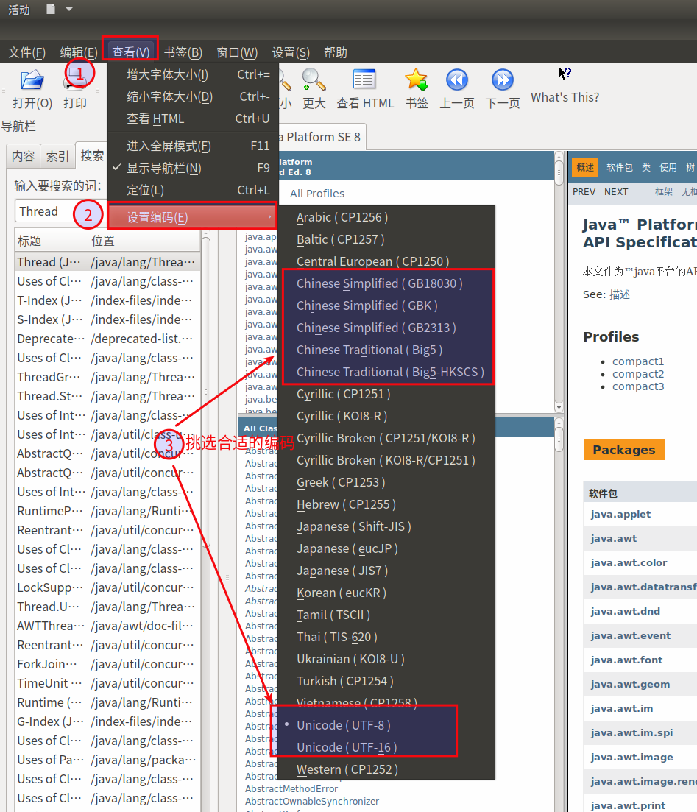

#   Ubuntu中安装kchmviewer用以打开chm文件
description: Ubuntu中安装kchmviewer用以打开chm文件
date: 2020-04-09 08:55:53
categories:
- Ubuntu
tags:
- Ubuntu装机日志
---
#   软件名称
```
KchmViewer
```

#   软件介绍
>   [http://www.ulduzsoft.com/linux/kchmviewer/](http://www.ulduzsoft.com/linux/kchmviewer/)

>   Kchmviewer is a **free**, open-source CHM (aka MS HTML help) and EPUB viewer written in C++ for Unix, Mac and Windows systems. Unlike most existing CHM viewers for Unix, it uses Trolltech Qt widget library, and could optionally be compiled for better KDE integration. It does not require KDE, but may be compiled with KDE widget support. Since version 5.0 it uses the Webkit API to show the content.
>   **The main advantage of kchmviewer is the best support for non-English languages**. Unlike other viewers, kchmviewer in most cases is able to correctly detect the chm file encoding and show it. It correctly shows the index and table of context in Russian, Spanish, Romanian, Korean, Chinese and Arabic help files, and with new search engine is able to search in any chm file no matter what language it is written.
>   kchmviewer is written by George Yunaev, and is licensed under **GNU General Public License version 3**. It uses chmlib to handle the CHM files, and some ideas from xchm.

#   作用
用以打开`.chm`文件

#   安装方法
```
sudo apt-get install kchmviewer
```
#   出现乱码如何处理




