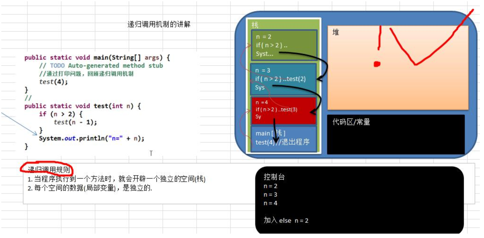

#   Java中实现递归
description: Java中实现递归
date: 2020-04-14 16:22:56
categories:
- 数据结构与算法
tags:
- 数据结构与算法(Java实现)
---
#   递归的概念
+   简单的说,递归就是方法自己调用自己,每次调用时传入不同的变量

#   递归的好处
+   递归有助于编程者解决复杂的问题,同时可以让代码变得简洁

#   递归调用规则
1.  当程序执行到一个方法时,就会开辟一个独立的空间(栈)
2.  每个空间的数据(局部变量),是独立的



代码演示
```JAVA
package com.young.recursion;

public class RecursionTest {

    public static void main(String[] args) {
        // test(10);
        int factorial = factorial(3);
        System.out.println(factorial);
    }

    //打印问题
    public static void test(int n) {
        if (n > 2) {
            test(n - 1);
        }//else {
        System.out.println("n=" + n);
        //}
    }

    //阶乘问题
    public static int factorial(int n) {
        if (n == 1) {
            return n;
        } else {
            return factorial(n - 1) * n;
        }
    }
}
```

#   递归能解决什么样的问题
1.  各种数学问题
    -   八皇后问题
    -   汉诺塔
    -   阶乘问题
    -   迷宫问题
    -   球和篮子的问题(google变成大赛)

2.  各种算法中也会使用到递归
    -   快排
    -   归并排序
    -   二分查找
    -   分治算法

3.  将用栈解决的问题,用递归代码会比较简洁

#   递归需要遵守的重要规则
1.  执行一个方法时,就创建一个新的受保护的独立空间(栈空间)
2.  方法的局部变量是独立的,不会相互影响
3.  如果方法中使用的是引用类型变量(比如数组),就会共享该引用类型的数据
4.  递归必须向退出递归的条件逼近,否则就是无限递归,会出现`StackOverflowError`错误
5.  当一个方法执行完毕,或者遇到return,就会返回,遵守谁调用就将结果返回给谁,同时当方法执行完毕或者返回时,该方法也就执行完毕

#   迷宫问题
```JAVA
public class MiGong {
	public static void main(String[] args) {
		//先创建一个二维数组，模拟迷宫地图
		int[][] map = new int[8][7];
		//使用1表示墙
		//上下全部置为1
		for (int i = 0; i < 7; i++) {
			map[0][i] = 1;
			map[7][i] = 1;
		}
		//左右全部置为1
		for (int i = 0; i < 8; i++) {
			map[i][0] = 1;
			map[i][6] = 1;
		}

		//设置挡板, 1表示
		map[3][1] = 1;
		map[3][2] = 1;

		//输出地图
		System.out.println("地图的情况");
		for (int i = 0; i < 8; i++) {
			for (int j = 0; j < 7; j++) {
				System.out.print(map[i][j] + " ");
			}
			System.out.println();
		}

        // 使用递归回溯给小球找路
        setWay(map, 1, 1);

        // 输出新的地图,小球走过,并标识过的递归
        System.out.println("小球走过,并标识过地图的情况");
        for (int i=0; i<8; i++) {
            for (int j=0; j<7; j++) {
                System.out.print(map[i][j] + " ");
            }
            System.out.println();
        }
	}


    /**
    //使用递归回溯来给小球找路
    //说明
    //1. map表示地图
    //2. i,j 表示从地图的哪个位置开始出发(1,1)
    //3. 如果小球能到map[6][5]位置，则说明通路找到. .
    //4. 约定:当map[i][j] 为0表示该点没有走过当为1表示墙; 2表示通路可以走; 3表示该点已经走过，但是走不通
    //5. 在走迷宫时，需要确定-个策略(方法)：下->右->上->左 ，如果该点走不通，再回溯

     * @param map 表示地图
     * @param i 从哪个位置开始找
     * @param j 从哪个位置开始找
     * @return 如果找到通路,就返回true, 否则返回false
     */
    public static boolean setWay(int[][] map, int i, int j) {
        //小球的位置是(6,5) 对应数组则是map[6][5]
        if(map[6][5] == 2) {
            //到map[6][5]位置,说明球已找到
            return true;
        } else {
            //判断到地图map[i][j]是0，则代表这个点还没有走过
            if (map[i][j] == 0) {
                //假设这个点是可以走通的，然后按照策略：下一>右->上->左走
                map[i][j] = 2;
                if (setWay(map, i + 1, j)) {//向下走
                    return true;
                } else if (setWay(map, i, j + 1)) { //向右走
                    return true;
                } else if (setWay(map, 1 - 1, j)) { //向上
                    return true;
                } else if (setWay(map, i, j - 1)) { //向左走
                    return true;
                }else {
                    //说明该点是走不通，已经走过，是死路
                    map[i][j] =3;
                    return false;
                }
            } else{
                //如果map[i][j] != 0 ,可能是1, 2, 3
                //当为1表示墙; 2表示通路可以走; 3表示该点已经走过
                return false;
            }
        }
    }
}

```

#   八皇后问题
##  问题介绍
八皇后问题，是一个古老而著名的问题，是回溯算法的典型案例。该问题是国际西洋棋棋手马克斯·贝瑟尔于1848年提出：在8×8格的国际象棋上摆放八个皇后，使其不能互相攻击，即任意两个皇后都不能处于同一行、同一列或同一斜线上，问有多少种摆法。

##  思路分析
1.  第一个皇后先放第一行第一列
2.  第二个皇后放在第二行第一列,然后判断是否OK,如果不OK,继续放在第二列,第三列,依次把所有列都放完,找到一个合适
3.  继续放第三个皇后,还是第一列,第二列...,知道第八个皇后也能放在一个不冲突的位置,算是找到了一个正确解
4.  当得到一个正确解时,在栈回退到上一个栈时,就会开始回溯,即将第一个皇后,放到第一列的所有正确解全部得到
5.  然后回头继续第一个皇后放第二列,后面继续循环执行1,2,3,4的步骤

##  代码实现
```JAVA
public class WolfQueen {
    /**
     * 一共有多少个皇后（此时设置为8皇后在8X8棋盘，可以修改此值来设置N皇后问题）
     */
    int max = 8;
    /**
     * 该数组保存结果，第一个皇后摆在array[0]列，第二个摆在array[1]列
     */
    int[] array = new int[max];

    public static void main(String[] args) {
        new WolfQueen().check(0);
    }

    /**
     * n代表当前是第几个皇后
     * @param n
     * 皇后n在array[n]列
     */
    private void check(int n) {
        //终止条件是最后一行已经摆完，由于每摆一步都会校验是否有冲突，所以只要最后一行摆完，说明已经得到了一个正确解
        if (n == max) {
            print();
            return;
        }
        //从第一列开始放值，然后判断是否和本行本列本斜线有冲突，如果OK，就进入下一行的逻辑
        for (int i = 0; i < max; i++) {
            array[n] = i;
            if (judge(n)) {
                check(n + 1);
            }
        }
    }

    /**
    * 判断我们放置的第n个皇后是否和前面已经摆放的皇后有冲突
    * @param n 表示第n个皇后
    * @return
    */
    private boolean judge(int n) {
        for (int i = 0; i < n; i++) {
            // array[i] == array[n]
            // -> 判断第n个皇后和前面的皇后是否在同一列
            // Math.abs(n - i) == Math.abs(array[n] - array[i]
            // -> 判断第n个皇后和前面的皇后是否在同一斜线
            // -> 这是一个一次函数
            // -> 总共数据就只有7个,所以只需满足|y1 - y2| == |x1 - x2|就能保证是一条斜线了
            if (array[i] == array[n] || Math.abs(n - i) == Math.abs(array[n] - array[i])) {
                return false;
            }
        }
        return true;
    }

    private void print()  {
        for (int i = 0; i < array.length; i++) {
            System.out.print(array[i] + 1 + " ");
        }
        System.out.println();
    }
}
```
