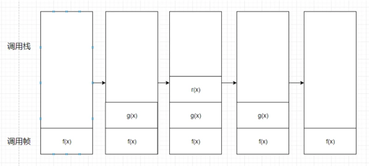
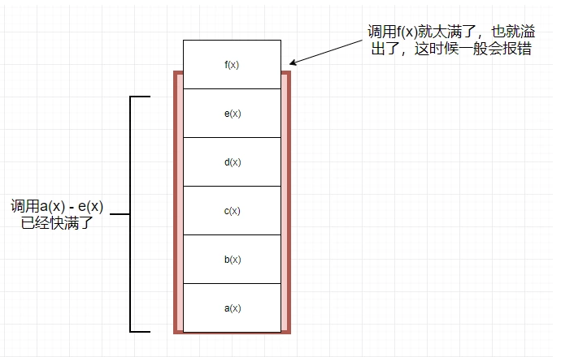

#    要说尾递归先理解尾调用
##    尾调用定义
>    来自[尾调用维基百科](https://zh.wikipedia.org/wiki/%E5%B0%BE%E8%B0%83%E7%94%A8)    在计算机学里，尾调用是指一个函数里的最后一个动作是返回一个函数的调用结果的情形，即最后一步新调用的返回值直接被当前函数的返回结果
###    代码形式上表现为
一个函数执行的最后是调用另一个函数
```
//仅举例,没有使用特定语言的语法
function f(x) {
    a(x);
    b(x);
    return g(x);    //函数执行的最后调用另一个函数
}
```
###    核心理解
就是看一个函数在调用另一个函数得时候，**本身是否可以被“释放”**

#    判断:下列那种调用时尾调用
```
// 情况一
function f(x)
{
    int a = g(x);
    return a;
}

// 情况二
function f(x)
{
    return 3+g(x);
}

// 情况三
function f(x)
{
    if (x > 0)
    {
        return g(x);
    }
    return r(x);
}
```
**答案**
+    情况一是调用函数g(x)之后，还有别的操作，所以不属于尾调用，即使语义一样，因为要得到a得结果，需要等待g(x)函数，所以f(x)无法释放。
+    情况二在调用后也有别的操作，所以不属于尾调用，同理f(x)也是无法释放，即使写在同一行。
+    情况三中，不管x取什么值，最后一步操作都是函数调用，所以属于尾调用。

#    尾调用有什么好处
##    先看普通调用的过程
```
//用如下三个函数举例
function f(x)
{
    res = g(x);
    return res+1;
}

function g(x)
{
    res = r(x);
    return res + 1;
}

function r(x)
{
    res = x + 1;
    return res + 1;
}
```



**文字描述**
函数调用
1.    调用f(x)，在内存形成一个`调用记录`，又称`调用帧（call frame）`，保存调用位置和内部变量等信息。
2.    函数f(x)内调用函数g(x)，那么在f(x)的调用帧上方会形成一个g(x)的调用帧
3.    函数g(x)内部还调用函数r(x)，所以在g(x)的调用帧上方会形成一个r(x)的调用帧
4.    函数r(x)调用结束，将结果返回给g(x)，同时函数r(x)结束并“消失”
5.    同理，g(x)调用结束并“消失”
6.    最后到f(x)，结束并消失（图中没有体现）
上述调用过程中，所有的调用帧会在一个`调用栈（call stack）`中

>    **上述过程维基百科中的描述**    在程序运行时，计算机会为应用程序分配一定的内存空间；应用程序则会自行分配所获得的内存空间，其中一部分被用于记录程序中正在调用的各个函数的运行情况，这就是函数的调用栈。常规的函数调用总是会在调用栈最上层添加一个新的堆栈帧（stack frame，也翻译为“栈帧”或简称为“帧”），这个过程被称作“入栈”或“压栈”（意即把新的帧压在栈顶）。

##    上述调用过程中有什么风险
如下图，当函数的**调用层数非常多时**，调用栈会消耗不少内存，甚至会**撑爆内存空间（栈溢出）**，造成程序严重卡顿或意外崩溃。




##    尾调用解决上述风险
```
//这是一个尾调用
function f() {
  m = 1;
  n = 2;
  return g(m + n);
}
f();

// 等同于
function f() {
  return g(3);
}
f();

// 等同于
g(3);
```

上述代码,我们可以看到，我们调用g之后，和f就没有任何关系了，函数f就结束了，所以执行到最后一步，完全可以删除 f() 的调用记录，只保留 g(3) 的调用记录，

**尾调用的意义**
如果所有函数都是尾调用，那么完全可以做到每次执行时，调用帧为一，这将大大节省内存

#    什么是尾递归
尾递归 = 尾调用 + 递归
+    递归：函数调用自身，称为递归
+    尾调用：函数最后是调用另一个函数
所以，尾递归可以总结为：一个函数在其内部最后一步调用其自身
```python
#用python举例
def tailrecsum(x, running_total=0):
    if x == 0:
        return running_total
    else:
        #tailrecsum函数得最后一步是调用另一个函数，其中这个“另一个函数”是其自身
        return tailrecsum(x - 1, running_total + x)
```

#    参考
[尾调用](https://zh.wikipedia.org/wiki/%E5%B0%BE%E8%B0%83%E7%94%A8)
[尾调用优化](http://www.ruanyifeng.com/blog/2015/04/tail-call.html)
[Tail Calls, Default Arguments, and Excessive Recycling in ES-6](http://raganwald.com/2015/02/07/tail-calls-defult-arguments-recycling.html)
[什么是尾调用](https://blog.csdn.net/longintchar/article/details/78998081)
[漫谈递归：从斐波那契开始了解尾递归](http://www.voidcn.com/article/p-qdsabmbw-xk.html)
