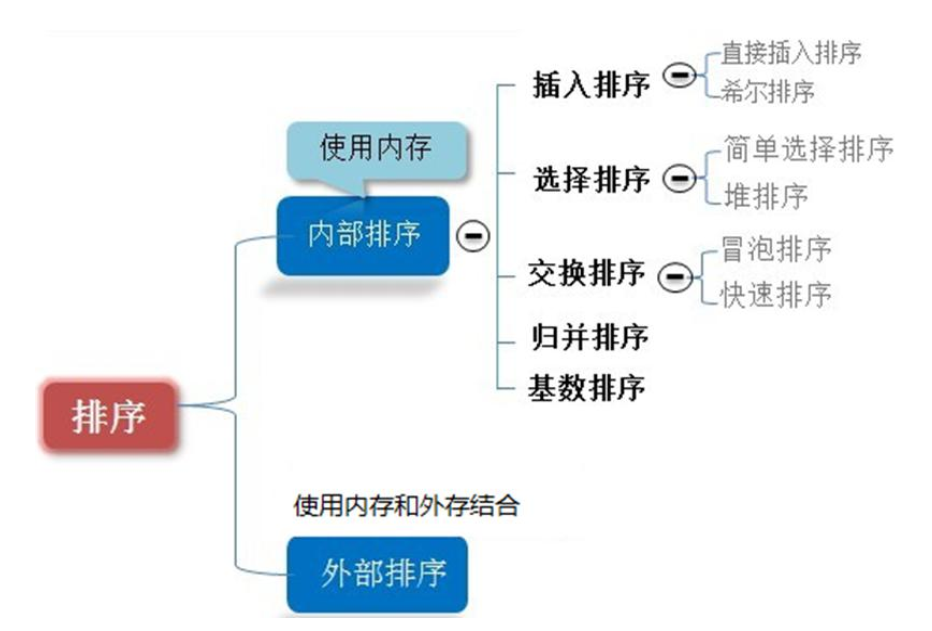

#   排序算法的与分类
description: 排序算法的与分类
date: 2020-04-15 16:58:46
categories:
- 数据结构与算法
---
#   排序算法的介绍
排序也称排序算法(Sort Algorithm),排序是将一组数据,依指定的顺序进行排列的过程

#   排序的分类：
1.  内部排序: 指将需要处理的所有数据都加载到内部存储器(内存)中进行排序。
2.  外部排序法：数据量过大，无法全部加载到内存中，需要借助外部存储(文件等)进行排序。
3.  常见的排序算法分类如下:

