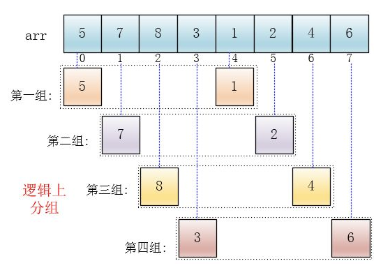
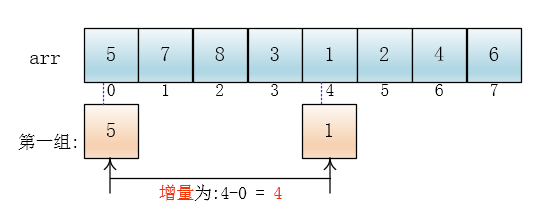
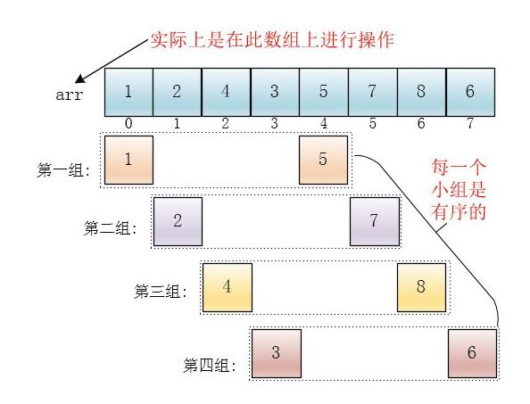
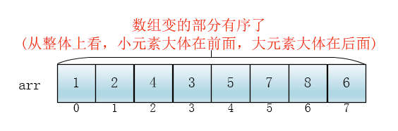
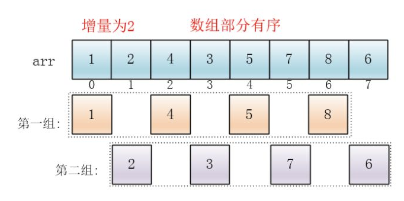
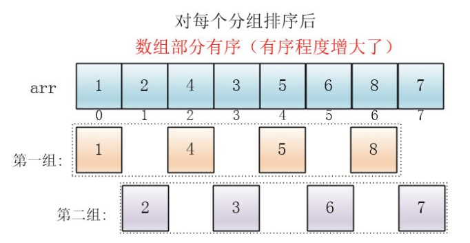
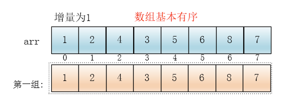

#   希尔排序法介绍
+   希尔排序是希尔(Donald Shell)与1959年提出的一种排序算法
+   希尔也是一种插入排序,是简单插入排序经过改进之后的一个更高效的版本,也称为缩小增量排序

#   希尔排序法的基本思想
+   希尔排序是把记录按下标的一定增量分组,对每组使用直接插入排序算法排序
+   随着增量逐渐减少,每组包含的关键字越来越多,当增量减至1时,整个文件恰被分成一组,算法便终止

#   希尔排序示意图
##  第一轮
1.  首先它把较大的数据集合分割成若干个小组（逻辑上分组,分割长度为`arr.length/2`），然后对每一个小组分别进行插入排序
    -   由于分割成小组,插入排序所作用的数据量比较小（每一个小组）,所以插入的效率比较高
    -   下面有颜色的是逻辑上的分组，并没有实际地进行分组操作，在数组中的位置还是原来的样子，只是将他们看成这么几个分组（逻辑上分组）


2.  可以看出，它是按下标相隔距离为`arr.length/2 = 8/2 = 4`分的组，也就是说把下标相差4的分到一组
    -   比如这个例子中a[0]与a[4]是一组、a[1]与a[5]是一组...，
    -   **这里的差值（距离）被称为增量**


3.  每个分组进行插入排序后，各个分组就变成了有序的了（整体不一定有序）

此时，整个数组变的部分有序了（有序程度可能不是很高）


##  第二轮
4.  然后缩小增量为上个增量的一半:`(arr.length/2)/2 = (8/2)/2 = 2`，继续划分分组，此时，每个分组元素个数多了，但是，数组变的部分有序了，插入排序效率同样比较高


5.  同理对每个分组进行排序（插入排序），使其每个分组各自有序


##  第三轮
6.  最后设置增量为上一个增量的一半：1，则整个数组被分为一组，此时，整个数组已经接近有序了，插入排序效率高


7.  同理，对这仅有的一组数据进行排序，排序完成

#   希尔排序代码实现

##  对有序序列在插入时采用交换法
效率差,可以忽略
```JAVA
package com.zjinc36.sort;

import java.util.Arrays;

public class ShellSort {
	private int[] arr = {8, 9, 1, 7, 2, 3, 5, 6};

	/**
	 * 希尔排序之交换式
	 */
	public void shellSortByExchangeType() {
		int temp = 0;
		int count = 0;

		// 每轮的增量
		for (int gap = arr.length / 2; gap > 0; gap /= 2) {
			// 将数组进行分组
			for (int i = gap; i < arr.length; i++) {
				// 遍历各组中所有的元素,步长gap
				for (int j = i - gap; j >= 0; j -= gap) {
					// 如果当前元素大于加上步长后的那个元素,说明交换
					if (arr[j] > arr[j + gap]) {
						temp = arr[j];
						arr[j] = arr[j + gap];
						arr[j + gap] = temp;
					}
				}
			}
			System.out.println("希尔排序第" + (++count) + "轮=" + Arrays.toString(arr));
		}
	}
}
```


##  对有序序列在插入时采用移动法
```JAVA
package com.zjinc36.sort;

import java.util.Arrays;

public class ShellSort {
	private int[] arr = {8, 9, 1, 7, 2, 3, 5, 6};

	public void shellSortByShiftType() {
		int count = 0;

		// 每轮的增量
		for (int gap = arr.length; gap > 0; gap /= 2) {
			// 理解上说是分组,但代码中实际实现并不会"创造"分组,而是如下进行操作
			// -> 从增量长度开始遍历(即跳过每个分组的第一个数)
			// -> 比如数组: 1 2 4 3 5 7 8 6
			// -> 逻辑上分组: 1  4  5  8
			// ->             2  3  7  6
			// -> 那么从 4 开始遍历
			// -> -> 比较 4 和 1,将较小的放前面,此时不需要改变
			// -> -> 接下去比较 3 和 2,将较小的放前面,此时不需要改变
			// -> -> -> 接下去比较 5 和 4,将较小的放前面,此时不需要改变
			// -> -> -> 接下去比较 7 和 3,将较小的放前面,此时不需要改变
			// -> -> -> 接下去比较 8 和 5,将较小的放前面,此时不需要改变
			// -> -> -> 接下去比较 6 和 7,将较小的放前面,由于6比7小,所以交换位置
			// -> -> -> -> -> 由于交换了位置,所以,6还要继续和前面的数字3进行比较,将较小的放前面,此时不需要改变
			for (int i = gap; i < arr.length; i++) {
				int temp = arr[i];
				// -> 2. 当增量长度
				while (i - gap >= 0 && temp < arr[i - gap]) {
					arr[i] = arr[i - gap];
					i -= gap;
				}
				// 当退出while之后,就给temp找到插入的位置
				arr[i] = temp;
			}
			System.out.println("希尔排序第" + (++count) + "轮=" + Arrays.toString(arr));
		}

	}
}
```
