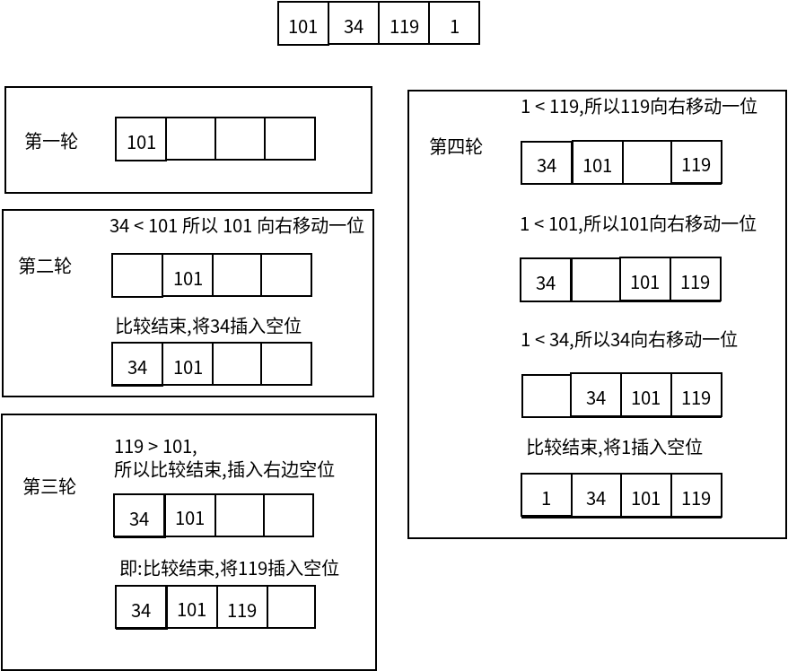

#   Java中实现插入排序
description: Java中实现插入排序
date: 2020-04-20 16:15:28
categories:
- 数据结构与算法
tags:
- 数据结构与算法(Java实现)
---
#   插入排序法介绍
+   插入式排序属于内部排序法,是对于欲排序的元素以插入的方式寻找该元素的适当位置,以达到排序的目的
+   就像是抽扑克牌,从无序的牌堆中抽取牌,插入手上有序的牌组中
```
想象一下:
==> 扑克牌中的抓牌
==> 从牌堆(无序数组)中抽牌,插入到手牌上(有序数组)
==> 要插入的牌,按顺序和手牌进行比较
==> ==> 1. 和手牌(最右边 - 0)的牌进行比较
==> ==> ==> 插入的牌较大,退出循环,然后将牌插入被比较牌的右边
==> ==> ==> 插入的牌较小,则将被比较的牌向右边移动一位
==> ==> 2. 和手牌(最右边 - 1)的牌进行比较
==> ==> ==> 插入的牌较大,退出循环,然后将牌插入被比较牌的右边(前一次循环右移了一位,所以被插入牌右边永远有空位)
==> ==> ==> 插入的牌较小,则将被比较的牌向右边移动一位
==> ==> 3. 和手牌(最右边 - 2)的牌进行比较
==> ==> ==> 插入的牌较大,退出循环,然后将牌插入被比较牌的右边(前一次循环右移了一位,所以被插入牌右边永远有空位)
==> ==> ==> 插入的牌较小,则将被比较的牌向右边移动一位
```


#   插入排序法思想
1.  把n个待排序的元素看成为一个有序表和一个无序表
2.  开始时**有序表中只包含一个元素**,无序表中包含**n-1个元素**
3.  排序过程中每次从无序表中取出第一个元素,把它的排序码依次与有序表元素的排序码进行比较,将它插入到有序表中的适当位置,使之成为新的有序表


#   代码
##  手动实现代码
```JAVA
package com.zjinc36.sort;

import java.util.Arrays;

public class InsertSort {
	private int arr[] = {101, 34, 119, 1};

	public void sort() {
		// 第一轮插入
		// 定义待插入的数
		int insertVal = arr[1];
		int insertIndex = (1 - 1);	// 即arr[1]的前面这个数的下标

		// 给 insertVal 找到插入的位置
		// -> insertIndex >= 0 保证在给insertVal找插入位置,不越界
		// -> 将需要插入有序数组的数与有序数组中的每个数字进行比较
		while (insertIndex >= 0 && insertVal < arr[insertIndex]) {
			arr[insertIndex + 1] = arr[insertIndex];
			insertIndex--;
		}

		arr[insertIndex + 1] = insertVal;

		System.out.println("第1轮插入");
		System.out.println(Arrays.toString(arr));


		// 第二轮插入
		// 定义待插入的数
		insertVal = arr[2];
		insertIndex = (2 - 1);	// 即arr[2]的前面这个数的下标

		// 给 insertVal 找到插入的位置
		// -> insertIndex >= 0 保证在给insertVal找插入位置,不越界
		// -> 将需要插入有序数组的数与有序数组中的每个数字进行比较
		while (insertIndex >= 0 && insertVal < arr[insertIndex]) {
			arr[insertIndex + 1] = arr[insertIndex];
			insertIndex--;
		}

		arr[insertIndex + 1] = insertVal;

		System.out.println("第2轮插入");
		System.out.println(Arrays.toString(arr));


		// 第三轮插入
		// 定义待插入的数
		insertVal = arr[3];
		insertIndex = (3 - 1);	// 即arr[3]的前面这个数的下标

		// 给 insertVal 找到插入的位置
		// -> insertIndex >= 0 保证在给insertVal找插入位置,不越界
		// -> 将需要插入有序数组的数与有序数组中的每个数字进行比较
		while (insertIndex >= 0 && insertVal < arr[insertIndex]) {
			arr[insertIndex + 1] = arr[insertIndex];
			insertIndex--;
		}

		arr[insertIndex + 1] = insertVal;

		System.out.println("第3轮插入");
		System.out.println(Arrays.toString(arr));
	}
}
```

##	代码手动部分改为循环
```JAVA
package com.zjinc36.sort;

import java.util.Arrays;

public class InsertSort {
	private int arr[] = {101, 34, 119, 1};
	
	public void sort() {
		for (int i = 1; i < arr.length; i++) {
			// 想象一下:
			// ==> 扑克牌中的抓牌
			// ==> 从牌堆(无序数组)中抽牌,插入到手牌上(有序数组)
			// ==> 要插入的牌,按顺序和手牌进行比较
			// ==> ==> 1. 和手牌(最右边 - 0)的牌进行比较
			// ==> ==> ==> 插入的牌较大,退出循环,然后将牌插入被比较牌的右边
			// ==> ==> ==> 插入的牌较小,则将被比较的牌向右边移动一位
			// ==> ==> 2. 和手牌(最右边 - 1)的牌进行比较
			// ==> ==> ==> 插入的牌较大,退出循环,然后将牌插入被比较牌的右边(前一次循环右移了一位,所以被插入牌右边永远有空位)
			// ==> ==> ==> 插入的牌较小,则将被比较的牌向右边移动一位
			// ==> ==> 3. 和手牌(最右边 - 2)的牌进行比较
			// ==> ==> ==> 插入的牌较大,退出循环,然后将牌插入被比较牌的右边(前一次循环右移了一位,所以被插入牌右边永远有空位)
			// ==> ==> ==> 插入的牌较小,则将被比较的牌向右边移动一位
			
			int insertVal = arr[i];	// 要插入的牌
			int insertIndex = (i - 1);	// 手牌数组的最大长度
			
			// 给 insertVal(要插入的牌) 找到插入的位置
			// ==> insertIndex >= 0 保证在给insertVal找插入位置,不越界
			// ==> 将需要插入有序数组的数与有序数组中的每个数字进行比较
			// ==> insertVal < arr[insertIndex] 判断要插入的牌比手牌上哪一张牌小
			while (insertIndex >= 0 && insertVal < arr[insertIndex]) {
				// 插入的牌较小,则将被比较的牌向右边移动一位,当前位置被空出来
				arr[insertIndex + 1] = arr[insertIndex];
				insertIndex--;
			}	
			// 插入的牌较大,退出循环,然后将牌插入被比较牌的右边(前一次循环右移了一位,所以被插入牌右边永远有空位)
			arr[insertIndex + 1] = insertVal;
			
			System.out.println("第" + i + "轮插入");
			System.out.println(Arrays.toString(arr));	
		}
	}
}
```
