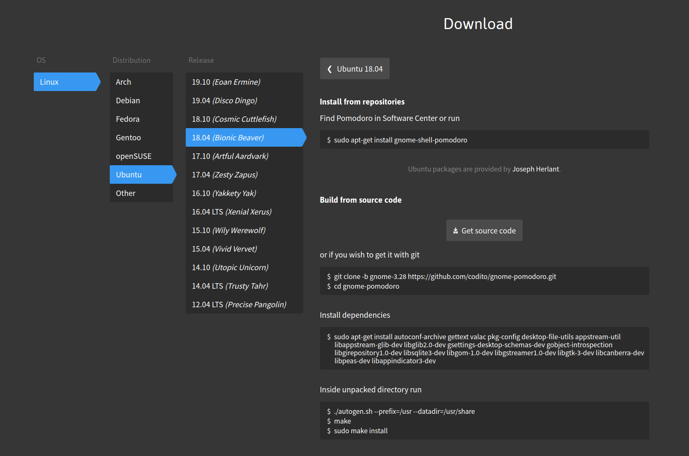
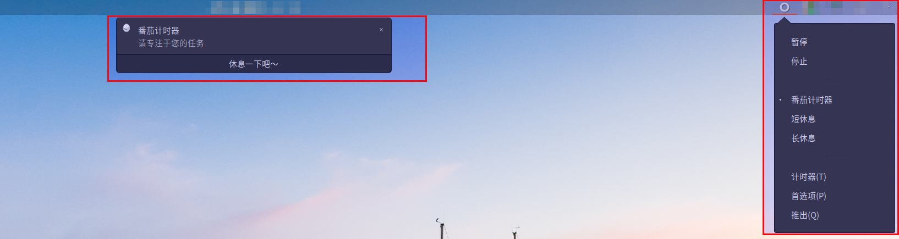
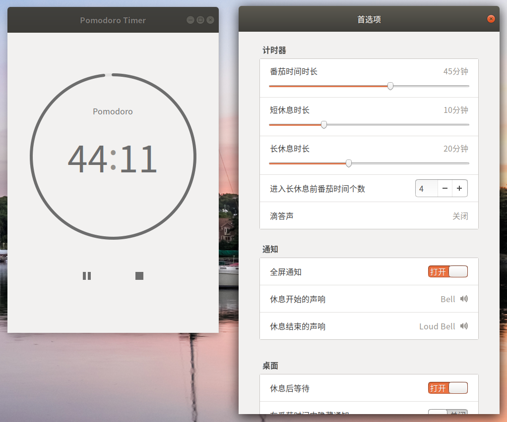

#   Ubuntu中安装番茄工作法软件gnome-shell-pomodoro
description: Ubuntu中安装番茄工作法软件gnome-shell-pomodoro
date: 2020-04-21 11:17:05
categories:
- Ubuntu
tags:
- Ubuntu装机日志
---
#   作用
>   This GNOME app helps to manage time according to Pomodoro Technique. It intends to improve productivity and quality of work by reminding you to take short breaks.
>   Pomodoro Technique is based on two principles:
>   +   focusing on work for limited time, about half an hour,
>   +   clearing your mind during breaks.
>   This workflow can improve focus, physical health and mental agility depending on how you spend your breaks and how strictly you follow the routine.

#   安装
##  最好去官网看
+   官网地址:[https://gnomepomodoro.org/](https://gnomepomodoro.org/)
+   



##  Ubuntu18.04安装
```
sudo apt-get install gnome-shell-pomodoro
```

#   安装后软件运行效果图







