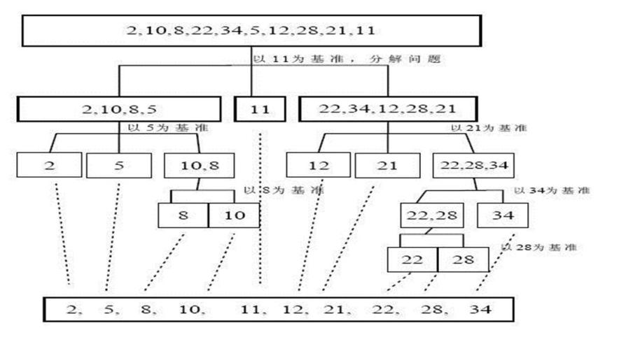

#   快速排序算法介绍
快速排序算法(QuickSort)是对冒泡排序的一种改进

##  基本思想是
+   通过一趟排序将要排序的数据分割成独立的两部分,其中一部分的所有数据都比另外一部分的所有数据都要小
+   然后按照此方法对这两部分数据分别进行快速排序,这个排序过程可以递归进行,以此达到整个数据变成有序序列

#   快速排序图解


#   代码实现
1.  算法实现,这里以中间值为枢纽值
```JAVA
package com.zjinc36.sort;

import java.util.Arrays;

public class QuickSort {
	/**
	 * 快速排序
	 * @param arr 待排序数组
	 * @param left 数组的最左边下标
	 * @param right 数组的最右边下标
	 * @return
	 */
	public void quickSort(int[] arr, int left, int right) {
		// 左下标
		int l = left;
		// 右下标
		int r = right;

		// 中轴值
		int pivot = arr[(left + right) / 2];

		int temp = 0;	// 临时变量,作为交换时使用

		while (l < r) {
			// 当while退出时,此时l下标对应的值大于中轴值
			while (arr[l] < pivot) {
				l += 1;
			}
			// 当while退出时,此时r下标对应的值小于中轴值
			while (arr[r] > pivot ) {
				r -= 1;
			}

			// 如果 l >= r 说明pivot的左右两的值,已经按照左边全是小于等于pivot值,右边全部是大于等于pivot值
			if (l >= r) {
				break;
			}

			// 交换pivot两边的值
			temp = arr[l];
			arr[l] = arr[r];
			arr[r] = temp;

			// 如果交换完之后,发现 arr[l] == pivot 值
			// 是因为前面写的代码中,当arr[l] == pivot的时候,r的规模并不会减少,即无法向循环的退出条件靠近
			if (arr[l] == pivot) {
				r--;
			}
			// 和上述同理
			// 需要减小l的规模
			if (arr[r] == pivot ) {
				l++;
			}

			// 如果 l == r,则必须l++和r--,否则会出现栈溢出,即要向循环的退出条件靠近
			if (l == r) {
				l++;
				r--;
			}

			// 向左递归
			if (left < r) {
				quickSort(arr, left, r);
			}

			// 向右递归
			if (right > l) {
				quickSort(arr, l, right);
			}
		}
	}
}
```

2.	测试
```JAVA
package com.zjinc36.sort;

import static org.junit.Assert.*;

import java.util.Arrays;

import org.junit.Test;

public class QuickSortTest {

	@Test
	public void test() {
//		int[] arr = {-9, 78, 0, 23, -567, 70, -1};
		int[] arr = {78, 23, 23};
		QuickSort quickSort = new QuickSort();
		quickSort.quickSort(arr, 0, arr.length - 1);
		System.out.println(Arrays.toString(arr));
	}

}
```
