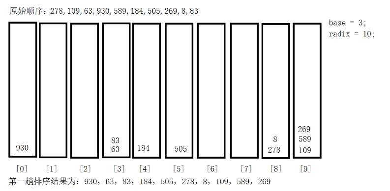
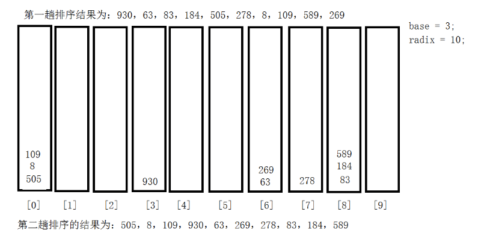
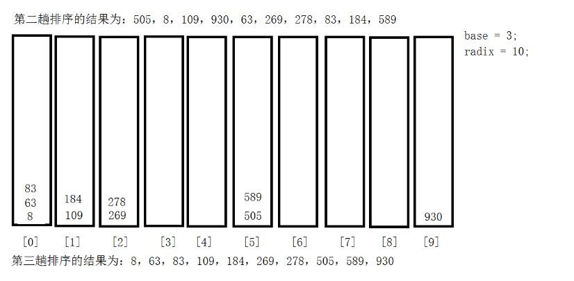

#   基数排序(桶排序)介绍
1.  基数排序(radix sort)属于"分配式排序(distribution sort)",又称"桶子法(bucket sort或bin sort)",顾名思义,它是通过键值的各个位的值,将要排序的元素分配至某些"桶"中,达到排序的作用
2.  基数排序法属于稳定的排序,基数排序法是效率高的稳定性排序法
3.  基数排序(Radix Sort)是桶排序的扩展
4.  基数排序是1887年赫夫曼何乐礼发明的.它是这样实现的:将整数按位分割成不同的数字,然后按每个位数分别比较

#   基数排序基本思想
将所有待比较数值统一为同样的数位长度,数位较短的数前面补零.然后,从最低位开始,依次进行一次排序.这样从最低位排序一直到最高位排序完成以后,数列就变成一个有序序列

1.  按照个位数字的值,放入对应的桶中,比如278的个位是8,则放入8这个桶,其他同理,排序完成之后,重新组成一组,桶中有多个数据时,按照先进先出原则取出来


2.  接下去排十位数,比如930的十位数是3,就放入3这个桶,其他同理,排序完成之后,重新组成一组,桶中有多个数据时,按照先进先出原则取出来


3.  接下去排百位数,比如505的百位数是5,就放入5这个桶,其他同理,排序完成之后,重新组成一组,桶中有多个数据时,按照先进先出原则取出来



#   代码实现
##  手动实现上述逻辑
```JAVA
package com.zjinc36.sort;

import java.util.Arrays;

public class RadixSort {
	public void radixSort(int[] arr) {
		// 1.得到数组中最大的数的位数
		int max = arr[0];
		for (int i = 1; i < arr.length; i++) {
			if (arr[i] > max) {
				max = arr[i];
			}
		}

		// 2. 得到最大的数是几位数
		int maxLength = (max + "").length();

		// 3.定义一个二维数组,表示10个桶,每个桶就是一个一维数组
		// 说明
		// -> 二维数组包含10个一维数组
		// -> 为了防止在放入数的时候,数据溢出,则每个一维数组(桶),大小定为arr.length
		// -> 基数排序是使用空间换时间的经典算法
		int[][] bucket = new int[10][arr.length];

		// 为了记录每个桶中,实际存放了多少个数据,我们定义一个一维数组来记录各个桶的每次放入数据个数
		// bucketElementCounts[0],记录的就是bucket[0]桶的放入数据个数
		int[] bucketElementCounts = new int[10];


		// 第一轮
		for (int j = 0; j < arr.length; j++) {
			// 取出每个元素的个位的值
			int digitOfElement = arr[j] / 1 % 10;
			// 放入对应的桶中
			bucket[digitOfElement][bucketElementCounts[digitOfElement]] = arr[j];
			bucketElementCounts[digitOfElement]++;
		}

		// 按照这个桶的顺序(一维数组的下标依次取出数据,放入原来数组)
		int index = 0;
		// 遍历每一桶,并将桶中的数据放入到原数组
		for (int k = 0; k < bucketElementCounts.length; k++) {
			// 如果桶中有数据,我们才放入到原数组
			if (bucketElementCounts[k]!= 0) {
				// 循环该桶即第k个桶(即第k个一维数组),放入
				for (int l = 0; l < bucketElementCounts[k]; l++) {
					// 取出元素放入到arr
					arr[index++] = bucket[k][l];
				}
			}
			// 第i+1轮处理后,需要将每个bucketElementCounts[k]=0!!!!
			bucketElementCounts[k] = 0;
		}
		System.out.println("第一轮,对个位的排序处理arr = " + Arrays.toString(arr));


		// 第二轮
		for (int j = 0; j < arr.length; j++) {
			// 取出每个元素的个位的值
			int digitOfElement = arr[j] / 10 % 10;
			// 放入对应的桶中
			bucket[digitOfElement][bucketElementCounts[digitOfElement]] = arr[j];
			bucketElementCounts[digitOfElement]++;
		}

		// 按照这个桶的顺序(一维数组的下标依次取出数据,放入原来数组)
		index = 0;
		// 遍历每一桶,并将桶中的数据放入到原数组
		for (int k = 0; k < bucketElementCounts.length; k++) {
			// 如果桶中有数据,我们才放入到原数组
			if (bucketElementCounts[k]!= 0) {
				// 循环该桶即第k个桶(即第k个一维数组),放入
				for (int l = 0; l < bucketElementCounts[k]; l++) {
					// 取出元素放入到arr
					arr[index++] = bucket[k][l];
				}
			}
			// 第i+1轮处理后,需要将每个bucketElementCounts[k]=0!!!!
			bucketElementCounts[k] = 0;
		}

		System.out.println("第二轮,对个位的排序处理arr = " + Arrays.toString(arr));


		// 第三轮
		for (int j = 0; j < arr.length; j++) {
			// 取出每个元素的个位的值
			int digitOfElement = arr[j] / 100 % 10;
			// 放入对应的桶中
			bucket[digitOfElement][bucketElementCounts[digitOfElement]] = arr[j];
			bucketElementCounts[digitOfElement]++;
		}

		// 按照这个桶的顺序(一维数组的下标依次取出数据,放入原来数组)
		index = 0;
		// 遍历每一桶,并将桶中的数据放入到原数组
		for (int k = 0; k < bucketElementCounts.length; k++) {
			// 如果桶中有数据,我们才放入到原数组
			if (bucketElementCounts[k]!= 0) {
				// 循环该桶即第k个桶(即第k个一维数组),放入
				for (int l = 0; l < bucketElementCounts[k]; l++) {
					// 取出元素放入到arr
					arr[index++] = bucket[k][l];
				}
			}
			// 第i+1轮处理后,需要将每个bucketElementCounts[k]=0!!!!
			bucketElementCounts[k] = 0;
		}

		System.out.println("第三轮,对个位的排序处理arr = " + Arrays.toString(arr));

	}
}
```

##  添加循环
```JAVA
package com.zjinc36.sort;

import java.util.Arrays;

public class RadixSort {
	public void radixSort(int[] arr) {
		// 1.得到数组中最大的数的位数
		int max = arr[0];
		for (int i = 1; i < arr.length; i++) {
			if (arr[i] > max) {
				max = arr[i];
			}
		}

		// 2. 得到最大的数是几位数
		int maxLength = (max + "").length();

		// 3.定义一个二维数组,表示10个桶,每个桶就是一个一维数组
		// 说明
		// -> 二维数组包含10个一维数组
		// -> 为了防止在放入数的时候,数据溢出,则每个一维数组(桶),大小定为arr.length
		// -> 基数排序是使用空间换时间的经典算法
		int[][] bucket = new int[10][arr.length];

		// 为了记录每个桶中,实际存放了多少个数据,我们定义一个一维数组来记录各个桶的每次放入数据个数
		// bucketElementCounts[0],记录的就是bucket[0]桶的放入数据个数
		int[] bucketElementCounts = new int[10];

		// 第一轮
		for (int i = 0, n = 1; i < maxLength; i++, n *= 10) {
			for (int j = 0; j < arr.length; j++) {
				// 取出每个元素的个位的值
				int digitOfElement = arr[j] / n % 10;
				// 放入对应的桶中
				bucket[digitOfElement][bucketElementCounts[digitOfElement]] = arr[j];
				bucketElementCounts[digitOfElement]++;
			}

			// 按照这个桶的顺序(一维数组的下标依次取出数据,放入原来数组)
			int index = 0;
			// 遍历每一桶,并将桶中的数据放入到原数组
			for (int k = 0; k < bucketElementCounts.length; k++) {
				// 如果桶中有数据,我们才放入到原数组
				if (bucketElementCounts[k] != 0) {
					// 循环该桶即第k个桶(即第k个一维数组),放入
					for (int l = 0; l < bucketElementCounts[k]; l++) {
						// 取出元素放入到arr
						arr[index++] = bucket[k][l];
					}
				}
				// 第i+1轮处理后,需要将每个bucketElementCounts[k]=0!!!!
				bucketElementCounts[k] = 0;
			}
            System.out.println("第" + (i + 1) + "轮,对个位的排序处理arr = " + Arrays.toString(arr));
		}
	}
}
```

##  测试
```JAVA
package com.zjinc36.sort;

import static org.junit.Assert.*;

import org.junit.Test;

public class RadixSortTest {

	@Test
	public void test() {
		int arr[] = {53, 3, 542, 748, 14, 214};
		RadixSort radixSort = new RadixSort();
		radixSort.radixSort(arr);
	}

}

```

#   基数排序说明
1.  基数排序是对传统桶排序的扩展,速度很快
2.  基数排序是经典的空间换时间的方式,占内存很大,当对海量数据排序时,容易造成OutOfMemoryError
3.  基数排序是稳定的(假定在待排序的记录序列中,存在多个具有相同的关键字的记录,若经过排序,这些记录的相对次序保持不变,即在原序列中,r[i]=r[j],且r[i]在r[j]之前,而在排序后的序列中,r[i]仍在r[j]之前,则称这种排序算法是稳定的,否则称为不稳定的)
4.  有负数的数组,我们不用基数排序来进行排序,入股要支持负数,参考[https://code.i-harness.com/zh-CN/q/e98fa9](https://code.i-harness.com/zh-CN/q/e98fa9)
