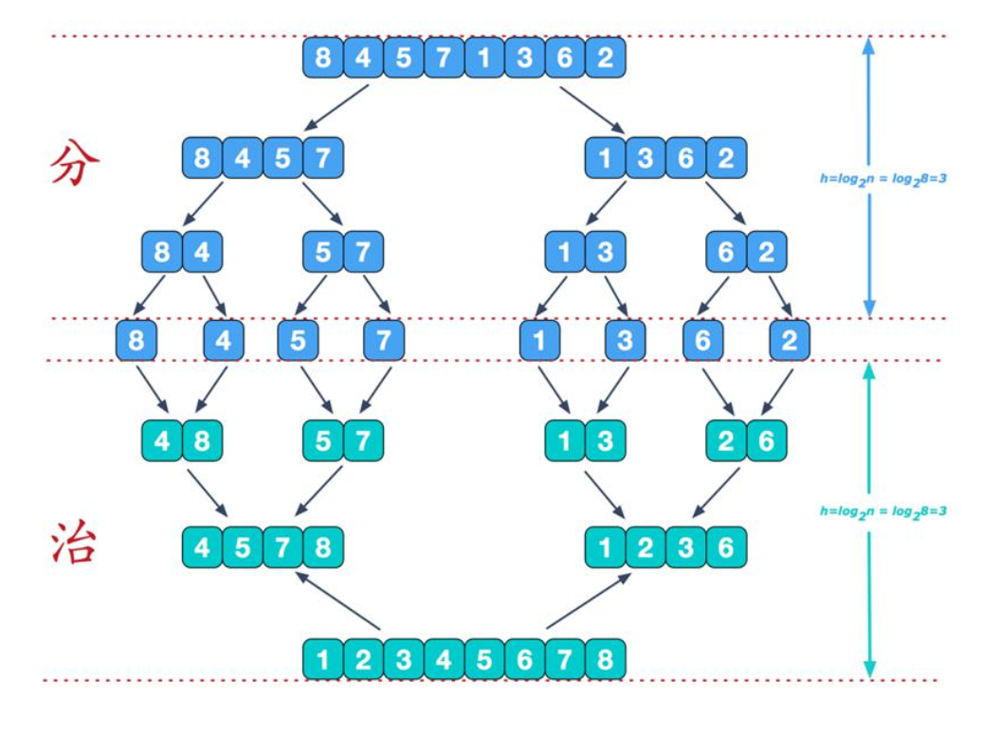
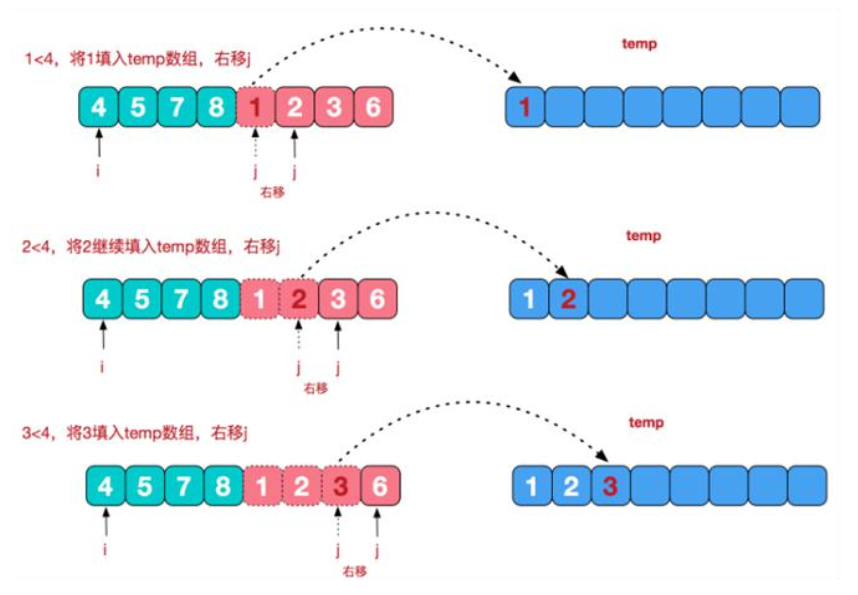
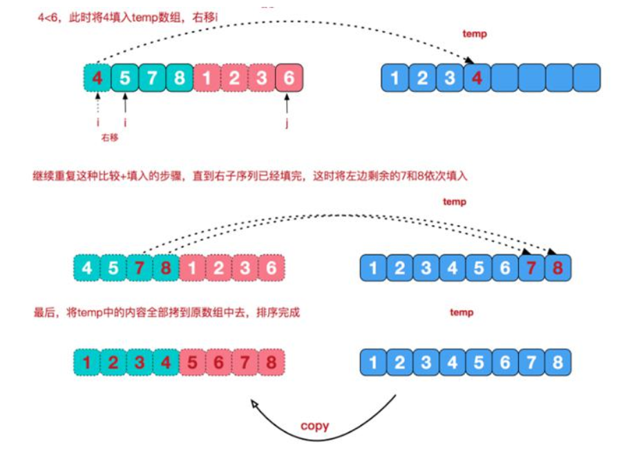
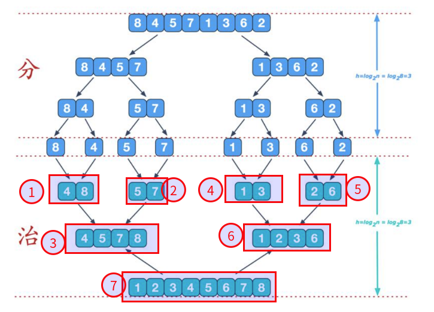

#   Java中实现归并排序
description: Java中实现归并排序
date: 2020-04-24 11:55:52
categories:
- 数据结构与算法
tags:
- 数据结构与算法(Java实现)
---
#   归并排序介绍
归并排序(MERGE-SORT)是利用归并思想实现的排序方法,该算法采用经典的分治(divide-and-conquer)策略(分治法将问题分(divide)成一些小的问题,然后递归求解,而治(conquer)阶段则将分的阶段得到的各答案"修补"在一起,即分而治之)

#   归并排序思想图示



##  具体的治阶段
我们将两个已经有序的自序列合并成一个有序序列,比如上图中的最后一次合并,我们将[4,5,7,8]和[1,2,3,6]两个已经有序的子序列,合并最终序列[1,2,3,4,5,6,7,8],以下是实现步骤



##  代码
1.  归并排序代码
```JAVA
package com.zjinc36.sort;

import java.util.Arrays;

public class MergeSort {
	public void sort() {
		int arr[] = {8, 4, 5, 7, 1, 3, 6, 2};
		int[] temp = new int[arr.length];
		mergeSort(arr, 0, arr.length - 1, temp);
		System.out.println(Arrays.toString(arr));
	}

	public void mergeSort(int[] arr, int left, int right, int[] temp) {
		if (left < right) {
			// 递归这里实现规模减少
			int mid = (left + right) / 2;

			// 向左递归分解
			mergeSort(arr, left, mid, temp);

			// 向右递归分解
			mergeSort(arr, mid + 1, right, temp);

			// 合并
			merge(arr, left, mid, right, temp);
		}
	}

	/**
	 * 将逻辑上两个待合并的数组合并为一个数组
	 * @param arr 排序的原始数组
	 * @param left 有序序列的最左边索引
	 * @param mid 中间索引
	 * @param right 右边索引
	 * @param temp 做中转的数组
	 */
	public void merge(int[] arr, int left, int mid, int right, int[] temp) {
		int i = left;	// 初始化i,左边有序序列的初始索引
		int j = mid + 1;	// 初始化j,右边有序序列的初始索引
		int t = 0;	// 执行temp数组的当前索引

		// (一)
		// 先把左右两边(有序)的数组按照规则填充到temp数组
		// 直到左右两边的有序序列中有一边处理完毕为止
		while (i <= mid && j <= right) {
			// 如果左边的有序序列的当前元素小于等于右边有序序列的当前元素
			// 即将左边的当前元素填充到 temp 数组
			if (arr[i] <= arr[j]) {
//				temp[t] = arr[i];
//				t++;
//				i++;
				temp[t++] = arr[i++];
			} else {	// 反之,则将右边有序序列的当前元素填充到temp数组
				temp[t++] = arr[j++];
			}
		}

		// (二)
		// 把剩余数据的一边的数据依次填充到temp
		while (i <= mid) {	// 左边的有序序列还有剩余的元素,就全部填充到temp
			temp[t++] = arr[i++];
		}
		while (j <= right) {	// 右边的有序序列还有剩余的元素,就全部填充到temp
			temp[t++] = arr[j++];
		}

		// (三)
		// 将temp数组的元素拷贝到arr
		// 注意,并不是每次都拷贝所有
		t = 0;
		int tempLeft = left;
		while (tempLeft <= right) {
			arr[tempLeft++] = temp[t++];
		}
	}
}
```

2.  对照图解,代码的执行顺序如下


2.  测试
```JAVA
package com.zjinc36.sort;

import static org.junit.Assert.*;

import org.junit.Test;

public class MergeSortTest {

	@Test
	public void test() {
		MergeSort mergeSort = new MergeSort();
		mergeSort.sort();
	}

}
```
