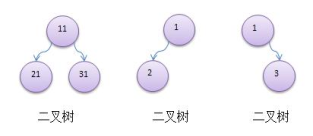
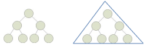
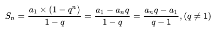
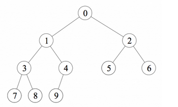
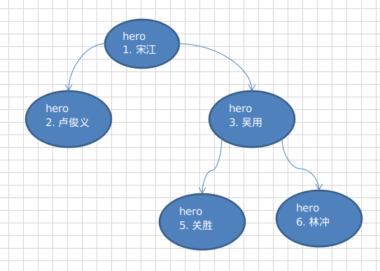
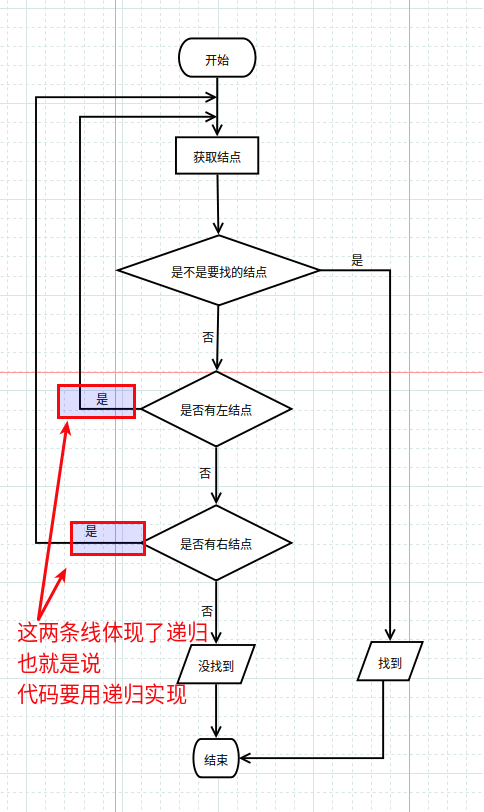
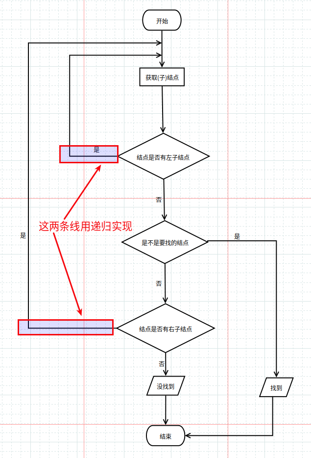
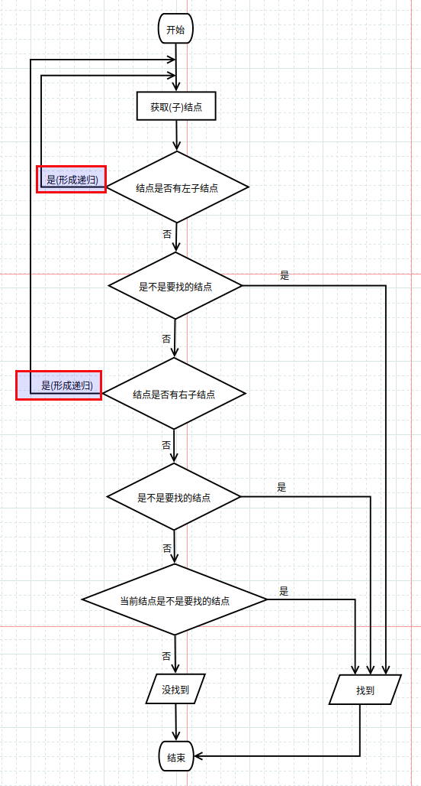

#   二叉树的相关概念及在Java中实现二叉树的遍历、查找和删除
description: 二叉树的相关概念及在Java中实现二叉树的遍历、查找和删除
date: 2020-04-27 11:58:02
categories:
- 数据结构与算法
tags:
- 数据结构与算法(Java实现)
---
#   为什么需要树这种数据结构
##  数组存储方式的分析
+   优点:通过下标方式访问元素,速度快.对于有序数组,还可以使用二分查找提高检索速度
+   缺点:如果要检索具体某个值,或者按一定顺序插入值,则会整体移动,效率低

##  链式存储方式的分析
+   优点:在一定程度上对数组存储方式有优化,插入一个数值节点只需要将插入节点链接到链表中即可,删除效率也很好
+   缺点:在进行检索时,效率仍然较低,检索某个值时,需要从头节点开始遍历

##  树存储方式分析
能提高数据存储,读取的效率,比如利用二叉树排序(Binary Sort Tree),既可以保证数据的检索速度,同时可以保证数据的插入,删除,修改的速度


#   树的常用术语
1. 	空树:不包含任何结点的二叉树
2. 	单点树:只包含一个结点的二叉树
3. 	父结点
4. 	子结点
5. 	边:父结点到子结点的连线
6. 	祖先/子孙关系
7. 	兄弟结点:父结点相同的两个结点互为兄弟结点
8. 	树叶结点(叶子结点):对于二叉树,两棵子树都为空的结点(没有子结点的结点)
9. 	分支结点:树中除了树叶以外的结点
10. 路径:从祖先结点找到该结点的路线(从一个结点到其子结点有一条长度为1的路径,每个结点到自身有一条长度为0的路径)
11. 度数:一个结点的子结点个数称为该结点的度数
12. 层(规定二叉树根的层数为0) <==> 貌似也有规定为1的情况
13. 树的高度(也称深度):最大层数,也是树里最长路径的长度
14. 森林(多棵子树构成森林)


#   二叉树的概念
1.  树有很多种，每个结点最多只有两个子结点的一种形式称为二叉树
2.  二叉树的子结点分为左结点和右结点
3.  示意图


## 	满二叉树
+ 	定义: 所有分支结点的度数为2
+ 	==> 这个定义出自【机械工业出版社《数据结构与算法（Python语言描述）》--北京大学 裘宗燕著】一书第179页

**注意**
1. 	国内定义：一个二叉树，如果每一个层的结点数都达到最大值，则这个二叉树就是满二叉树。 也就是说，如果一个二叉树的层数为`k` ，且结点总数是`(2^(k+1)) -1`，则它就是满二叉树。

`(2^(k+1)) -1`可由等比数列前n项和公式得到

网上经常看到公式是`(2^k) -1`,是因为将根结点算作第一层,本质上没区别

2. 	国外定义：满二叉树的结点要么是叶子结点，度为0，要么是分支结点,度为2，不存在度为1的结点。


## 	扩充二叉树
将一个二叉树扩充成一个满二叉树,此时这个满二叉树即为扩充二叉树

+ 原树的结点称为内部结点
+ 新增的结点称为外部结点

**注意**:空树的扩充二叉树为空树

## 	完全二叉树
树的高度为h,第0层到第h-1层的结点都满(即:对于所有0 <= i <= h-1,第i层有2^i个结点),最后一层在最左边连续排列,空位都在右边



#   二叉树遍历的说明
使用前序,中序和后序对二叉树进行遍历
1.  前序遍历:先输出父结点,再遍历左子树和右子树
2.  中序遍历:先遍历左子树,再输出父结点,在遍历右子树
3.  后序遍历:先遍历左子树,再遍历右子树,最后输出父结点

小结:看输出父结点的顺序,就确定前序,中序还是后序

##  遍历如下二叉树


##  代码实现
1.  英雄对象
```JAVA
package com.zjinc36.tree;

import lombok.Data;

@Data
public class HeroNode {
	private int no;
	private String name;
	private HeroNode left;	// 默认null
	private HeroNode right;	// 默认null
	public HeroNode(int no, String name) {
		super();
		this.no = no;
		this.name = name;
	}

	@Override
	public String toString() {
		return "HeroNode[no=]" + no + ", name=" + name + "]";
	}

	/**
	 * 前序遍历
	 */
	public void preOrder() {
		System.out.println(this);	// 先输出父结点

		// 递归向左子树前序遍历
		if (this.left != null) {
			this.left.preOrder();
		}

		// 递归向右子树谦虚遍历
		if (this.right != null) {
			this.right.preOrder();
		}
	}

	/**
	 * 中序遍历
	 */
	public void infixOrder() {
		// 递归向左子树中序遍历
		if (this.left != null) {
			this.left.infixOrder();
		}
		// 输出父结点
		System.out.println(this);

		// 递归向右子树中序遍历
		if (this.right != null) {
			this.right.infixOrder();
		}
	}

	/**
	 * 后序遍历
	 */
	public void postOrder() {
		if (this.left != null) {
			this.left.postOrder();
		}
		if (this.right != null) {
			this.right.postOrder();
		}
		System.out.println(this);
	}
}
```

2.  二叉树
```JAVA
package com.zjinc36.tree;

import lombok.Data;

@Data
public class BinaryTree {
	private HeroNode root;

	/**
	 * 前序遍历
	 */
	public void preOrder() {
		if (this.root != null) {
			this.root.preOrder();
		} else {
			System.out.println("二叉树为空,无法遍历");
		}
	}

	/**
	 * 中序遍历
	 */
	public void infixOrder() {
		if (this.root != null) {
			this.root.infixOrder();
		} else {
			System.out.println("二叉树为空,无法遍历");
		}
	}

	/**
	 * 后序遍历
	 */
	public void postOrder() {
		if (this.root != null) {
			this.root.postOrder();
		} else {
			System.out.println("二叉树为空,无法遍历");
		}
	}
}
```

3.  测试
```JAVA
package com.zjinc36.tree;

import static org.junit.Assert.*;

import org.junit.Test;

public class BinaryTreeTest {

	@Test
	public void test() {
		// 先创建一棵二叉树
		BinaryTree binaryTree = new BinaryTree();

		// 创建需要的结点
		HeroNode heroNode1 = new HeroNode(1, "宋江");
		HeroNode heroNode2 = new HeroNode(2, "卢俊义");
		HeroNode heroNode3 = new HeroNode(3, "吴用");
		HeroNode heroNode4 = new HeroNode(4, "林冲");
		HeroNode heroNode5 = new HeroNode(5, "关胜");

		// 现在我们先手动创建二叉树
		heroNode1.setLeft(heroNode2);
		heroNode1.setRight(heroNode3);
		heroNode3.setRight(heroNode4);
		heroNode3.setLeft(heroNode5);

		binaryTree.setRoot(heroNode1);

		// 测试
		System.out.println("前序遍历");
		binaryTree.preOrder();

		System.out.println("中序遍历");
		binaryTree.infixOrder();

		System.out.println("后序遍历");
		binaryTree.postOrder();
	}

}
```

#   二叉树查找指定结点

##  要求
1.  编写前序查找,中序查找,后序查找的方法
2.  并分别使用三种查找方式,查找"关胜"的结点

##  思路分析

### 前序查找思路
1.  先判断当前结点是否等于要查找的
2.  如果相等,则返回当前结点
3.  如果不等,则判断当前结点的左子结点是否为空,如果不为空,则递归前序查找
4.  如果左递归前序查找能找到结点,则返回,否则继续判断当前结点的右子结点是否为空,如果不空,则继续向右递归前序查找


### 中序查找思路
1.  判断当前结点的左子结点是否为空,如果不为空,则递归中序查找
2.  如果找到,则返回,如果没有找到,就和当前结点比较,如果是则返回当前结点,否则继续进行右递归中序查找
3.  如果右递归中序查找能找到,就返回,否则返回null


### 后序查找思路
1.  判断当前结点的左子结点是否为空,如果不为空,则递归后序查找
2.  如果找到,则返回,如果没有找到,就判断当前结点的右子结点是否为空,如果不为空,则右递归进行后续查找,如果找到,就返回
3.  和当前结点进行比较,如果是则返回,否则返回null



##  代码
1.  英雄对象
```JAVA
package com.zjinc36.tree;

import static org.hamcrest.CoreMatchers.nullValue;

import lombok.Data;

@Data
public class HeroNode {
	private int no;
	private String name;
	private HeroNode left;	// 默认null
	private HeroNode right;	// 默认null
	public HeroNode(int no, String name) {
		super();
		this.no = no;
		this.name = name;
	}

	@Override
	public String toString() {
		return "HeroNode[no=]" + no + ", name=" + name + "]";
	}

	/**
	 * 前序遍历查找
	 * @param no 查找的序号
	 * @return 如果找到就返回该结点,如果没有找到返回null
	 */
	public HeroNode preOrderSearch(int no) {
		System.out.println("进入前序遍历");
		// 比较当前节点是不是
		if (this.no == no) {
			return this;
		}

		// 判断当前结点的左子结点是否为空,如果不为空,则递归前序查找
		// 如果左递归前序查找能找到结点,则返回
		HeroNode resNode = null;
		if (this.left != null) {
			resNode = this.left.preOrderSearch(no);
		}
		if (resNode != null) {	// 说明左子树找到
			return resNode;
		}
		if (this.right != null) {
			resNode = this.right.preOrderSearch(no);
		}
		return resNode;
	}

	/**
	 * 中序遍历查找
	 * @param no 查找的序号
	 * @return 如果找到就返回该结点,如果没有找到返回null
	 */
	public HeroNode infixOrderSearch(int no) {
		// 判断当前结点的左子结点是否为空,如果不为空,则递归中序查找
		HeroNode resNode = null;

		if (this.left != null) {
			resNode = this.left.infixOrderSearch(no);
		}
		if (resNode != null) {
			return resNode;
		}
		System.out.println("进入中序查找");

		// 如果找到,则返回,如果没有找到,就和当前结点比较,如果是则返回当前结点
		if (this.no == no) {
			return this;
		}
		// 否则继续进行右递归的中序查找
		if (this.right != null) {
			resNode = this.right.infixOrderSearch(no);
		}
		return resNode;
	}

	/**
	 * 后序遍历查找
	 * @param no 查找的序号
	 * @return 如果找到就返回该结点,如果没有找到返回null
	 */
	public HeroNode postOrderSearch(int no) {
		// 判断当前结点的左子结点是否为空,如果不为空,则递归后序查找
		HeroNode resNode = null;
		if (this.left != null) {
			resNode = this.left.postOrderSearch(no);
		}
		if (resNode != null) {	// 说明在左子树找到
			return resNode;
		}

		// 如果左子树没有找到,则向右子树递归进行后序遍历查找
		if (this.right != null) {
			resNode = this.right.postOrderSearch(no);
		}
		if (resNode != null) {
			return resNode;
		}

		System.out.println("进入后序查找");

		// 如果左右子树都没有找到,就比较当前结点是不是
		if (this.no == no) {
			return this;
		}

		return resNode;
	}
}

```

2.  二叉树
```JAVA
package com.zjinc36.tree;

import lombok.Data;

@Data
public class BinaryTree {
	private HeroNode root;

	/**
	 * 前序遍历查找
	 * @param no 查找的序号
	 * @return 如果找到就返回该结点,如果没有找到返回null
	 */
	public HeroNode preOrderSearch(int no) {
		if (root != null) {
			return root.preOrderSearch(no);
		} else {
			return null;
		}
	}

	/**
	 * 中序遍历查找
	 * @param no 查找的序号
	 * @return 如果找到就返回该结点,如果没有找到返回null
	 */
	public HeroNode infixOrderSearch(int no) {
		if (root != null) {
			return root.infixOrderSearch(no);
		} else {
			return null;
		}
	}

	/**
	 * 后序遍历查找
	 * @param no 查找的序号
	 * @return 如果找到就返回该结点,如果没有找到返回null
	 */
	public HeroNode postOrderSearch(int no) {
		if (root != null) {
			return root.postOrderSearch(no);
		} else {
			return null;
		}
	}

}

```

3.  测试
```JAVA
package com.zjinc36.tree;

import static org.junit.Assert.*;

import org.junit.Test;

public class BinaryTreeTest {

	/**
	 * 测试查找
	 */
	@Test
	public void searchTest() {
		// 先创建一棵二叉树
		BinaryTree binaryTree = new BinaryTree();

		// 创建需要的结点
		HeroNode heroNode1 = new HeroNode(1, "宋江");
		HeroNode heroNode2 = new HeroNode(2, "卢俊义");
		HeroNode heroNode3 = new HeroNode(3, "吴用");
		HeroNode heroNode4 = new HeroNode(4, "林冲");
		HeroNode heroNode5 = new HeroNode(5, "关胜");

		// 现在我们先手动创建二叉树
		heroNode1.setLeft(heroNode2);
		heroNode1.setRight(heroNode3);
		heroNode3.setRight(heroNode4);
		heroNode3.setLeft(heroNode5);

		binaryTree.setRoot(heroNode1);

		// 测试
		System.out.println("前序遍历查找");
		HeroNode resNode = binaryTree.preOrderSearch(5);
		if (resNode != null) {
			System.out.printf("找到了,信息为 no = %d name = %s", resNode.getNo(), resNode.getName());
		} else {
			System.out.println("没有找到");
		}

//		System.out.println("中序遍历查找");
//		resNode = binaryTree.infixOrderSearch(5);
//		if (resNode != null) {
//			System.out.printf("找到了,信息为 no = %d name = %s", resNode.getNo(), resNode.getName());
//		} else {
//			System.out.println("没有找到");
//		}
//
//		System.out.println("后序遍历查找");
//		resNode = binaryTree.postOrderSearch(5);
//		if (resNode != null) {
//			System.out.printf("找到了,信息为 no = %d name = %s", resNode.getNo(), resNode.getName());
//		} else {
//			System.out.println("没有找到");
//		}
	}

}
```

#   二叉树删除指定结点
##  要求
1.  如果删除的结点是叶子结点,则删除该结点
2.  如果删除的结点是非叶子结点,则删除该子树(注意这里,先从最简单的开始)

##  思路分析
### 首先处理
考虑树是否是空树,如果只有一个root结点,则等价于将二叉树置空

### 接下去进行下面步骤
1.  因为我们的二叉树是单向的,所以我们是判断当前结点的子结点是否需要删除结点,而不能去判断当前这个结点是不是需要删除
2.  如果当前结点的左子结点不为空,并且左子结点就是要删除的结点,就将this.left = null;并且返回(结束递归删除)
3.  如果当前结点的右子结点不为空,并且右子结点就是要删除的结点,就将this.right = null;并且就返回(结束递归删除)
4.  如果第2和第3步没有删除结点,那么我们就需要向左子树进行递归删除
5.  如果第4步也没有删除结点,则应当向右子树进行递归删除

##  代码
1.  英雄对象
```JAVA
package com.zjinc36.tree;

import static org.hamcrest.CoreMatchers.nullValue;

import lombok.Data;

@Data
public class HeroNode {
	private int no;
	private String name;
	private HeroNode left;	// 默认null
	private HeroNode right;	// 默认null
	public HeroNode(int no, String name) {
		super();
		this.no = no;
		this.name = name;
	}

	@Override
	public String toString() {
		return "HeroNode[no=]" + no + ", name=" + name + "]";
	}

	/**
	 * 前序遍历
	 */
	public void preOrder() {
		System.out.println(this);	// 先输出父结点

		// 递归向左子树前序遍历
		if (this.left != null) {
			this.left.preOrder();
		}

		// 递归向右子树谦虚遍历
		if (this.right != null) {
			this.right.preOrder();
		}
	}

	/**
	 * 递归删除结点
	 * -> 如果删除的结点是叶子结点,则删除该结点
	 * -> 如果删除的结点是非叶子结点,则删除该子树(注意这里,先从最简单的开始)
	 * @param no 需要删除的序号
	 */
	public void delNode(int no) {
		if (this.left != null && this.left.no == no) {
			this.left = null;
			return;
		}
		if (this.right != null && this.right.no == no) {
			this.right = null;
			return;
		}

		if (this.left != null) {
			this.left.delNode(no);
		}

		if (this.right != null) {
			this.right.delNode(no);
		}
	}
}

```

2.  二叉树删除功能
```JAVA
package com.zjinc36.tree;

import static org.hamcrest.CoreMatchers.nullValue;

import lombok.Data;

@Data
public class BinaryTree {
	private HeroNode root;

	/**
	 * 前序遍历
	 */
	public void preOrder() {
		if (this.root != null) {
			this.root.preOrder();
		} else {
			System.out.println("二叉树为空,无法遍历");
		}
	}

	/**
	 * 删除结点
	 * -> 如果删除的结点是叶子结点,则删除该结点
	 * -> 如果删除的结点是非叶子结点,则删除该子树(注意这里,先从最简单的开始)
	 * @param no 需要删除的序号
	 */
	public void delNode(int no) {
		if (root != null) {
			// 如果只有一个root结点,这里立即判断root是不是就是要删除结点
			if (root.getNo() == no) {
				root = null;
			} else {
				// 递归删除
				root.delNode(no);
			}
		} else {
			System.out.println("空树,不能删除");
		}
	}

}

```

3.  测试
```JAVA
package com.zjinc36.tree;

import static org.junit.Assert.*;

import org.junit.Test;

public class BinaryTreeTest {

	/**
	 * 测试删除
	 */
	@Test
	public void delSearch() {
		// 先创建一棵二叉树
		BinaryTree binaryTree = new BinaryTree();

		// 创建需要的结点
		HeroNode heroNode1 = new HeroNode(1, "宋江");
		HeroNode heroNode2 = new HeroNode(2, "卢俊义");
		HeroNode heroNode3 = new HeroNode(3, "吴用");
		HeroNode heroNode4 = new HeroNode(4, "林冲");
		HeroNode heroNode5 = new HeroNode(5, "关胜");

		// 现在我们先手动创建二叉树
		heroNode1.setLeft(heroNode2);
		heroNode1.setRight(heroNode3);
		heroNode3.setRight(heroNode4);
		heroNode3.setLeft(heroNode5);

		binaryTree.setRoot(heroNode1);

		// 测试
		System.out.println("删除前,遍历");
		binaryTree.preOrder();

		int no = 5;
		System.out.printf("删除结点 no = %d", no);
		binaryTree.delNode(no);

		System.out.println("删除后,遍历");
		binaryTree.preOrder();

	}

}
```

##  更改删除规则
如果要删除的结点是非叶子结点,现在我们不希望将该非叶子结点为根结点的子树删除,需要执行规则
1.  如果该非叶子结点A只有一个子结点B,则子结点B替代结点A
2.  如果该非叶子结点A有左子结点B和右子结点C,则让左子结点B替代结点A
