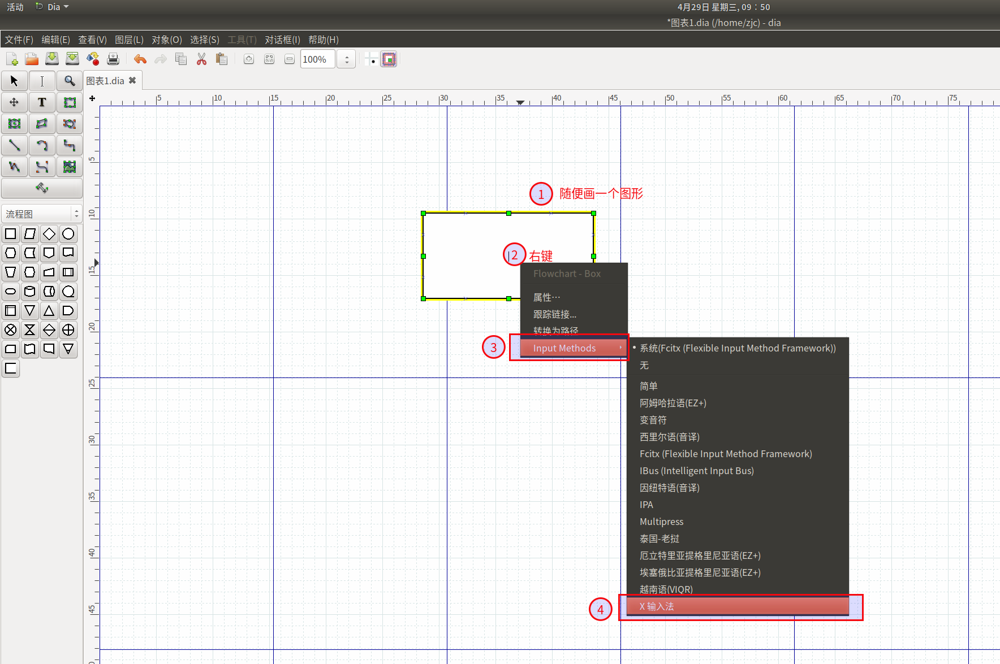

#   Ubuntu中安装流程图工具Dia
+   description: Ubuntu中安装流程图工具Dia
+   date: 2020-04-29 09:44:24
+   categories:
    - Ubuntu
+   tags:
    - Ubuntu装机日志

---

#   参考
[ubuntu安装dia](https://www.cnblogs.com/yibeimingyue/p/11843963.html)
[完美解决Dia无法输入中文的问题](https://www.jianshu.com/p/9a7d736126d1)
[解决Dia在Linux上的输入法问题](https://jlice.top/p/7k91v/)

#	作用
跨平台流程工具Dia。

#	安装
1.	打开终端(快捷键：ctrl+alt+t)
2.	输入命令
```
$ sudo apt-get install dia
```
3.	输入`y`，等待，安装完成。


#	卸载此工具：
1.	输入命令
```
$ sudo apt-get autoremove dia.
```
2.	输入`y`，等待，卸载完成。

#	问题:无法输入中文
##  方案一
假入无法输入中文，修改一个选项：
1.  随便画一个图
2.  右键
3.	选择`Input Methods`
4.	点击`x input method`




此时有可能发现还是无法使用中文输入，原因可能是因为打开.dia文件的时候，直接右键打开了。所以，此时应该在命令行输入：
```
$ dia
```
打开dia软件之后，再打开所要打开的.dia文件。


##  方案二
上述方案就是每次打开都必须设置一次,接下去我们要跳过这一个步骤
### 从桌面文件直接打开
修改`/usr/share/applications/dia.desktop`文件
```
把Exec=dia %F 改为Exec=env GTK_IM_MODULE=xim dia %F
```
这个设置解决了从启动栏的快捷方式中启动Dia后，输入中文的问题。

### 从终端打开
+   启动命令dia 前边增加`env GTK_IM_MODULE=xim`，即用`env GTK_IM_MODULE=xim dia`来启动Dia
+   为了避免每次启动都要输入这么一长串，我们设置别名alias，
```
执行命令`alias dia="env GTK_IM_MODULE=xim dia"`，以后再启动Dia时还是使用dia就可以了。
```
