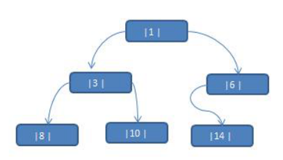
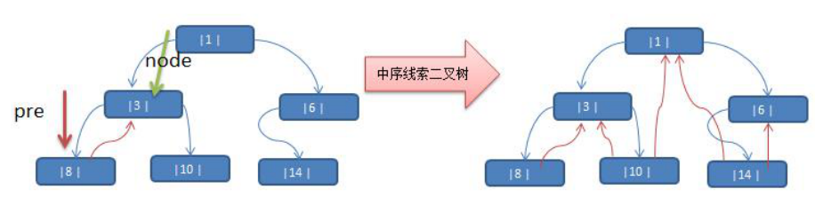

#   Java中实现线索化二叉树与线索化二叉树的遍历
+ date: 2020-05-02 17:51:38
+ description: Java中实现线索化二叉树与线索化二叉树的遍历
+ categories:
  - 数据结构与算法
+ tags:
  - 数据结构与算法(Java实现)
---
#   什么是二叉树线索化
+   线索化的实质就是将二叉链表中的空指针改为指向前驱或后继的线索。
+   由于前驱和后继信息只有在遍历该二叉树时才能得到，所以，线索化的过程就是在遍历的过程中修改空指针的过程

#   为什么要对二叉树线索化
+   二叉树是一种非线性结构，遍历二叉树几乎都是通过递归或者用栈辅助实现非递归的遍历。
+   用二叉树作为存储结构时，取到一个节点，只能获取节点的左孩子和右孩子，不能直接得到节点的任一遍历序列的前驱或者后继。
+   为了保存这种在遍历中需要的信息，我们利用二叉树中指向左右子树的空指针来存放节点的前驱和后继信息

#   线索二叉树基本介绍
1.  n 个结点的二叉链表中含有 `n+1 `个空指针域。利用二叉链表中的空指针域，存放指向该结点在某种遍历次序下的前驱和后继结点的指针（这种附加的指针称为"线索"）
    +   n+1 ==>【公式 `2n-(n-1)=n+1` ==> 总共n个节点,所以有2n个指针,除了第一个节点,其余每个节点需要占用一个指针,所以是(n-1)】  
2.  这种加上了线索的二叉链表称为线索链表，相应的二叉树称为线索二叉树(Threaded BinaryTree)。根据线索性质的不同，线索二叉树可分为前序线索二叉树、中序线索二叉树和后序线索二叉树三种
3.  一个结点的前一个结点，称为前驱结点
4.  一个结点的后一个结点，称为后继结点

#   案例
应用案例说明：将下面的二叉树，进行中序线索二叉树。

中序遍历的结果：{8, 3, 10, 1, 14, 6},所以3的前驱结点为8,后继结点为10,其余同理


当然,当二叉树线索化后，Node 结点的 属性 left 和 right 就有有如下情况:
1.  left 有可能指向的是左子树，也有可能指向前驱节点.
2.  right 有可能指向的是右子树，也有可能指向后继节点.

##  中序遍历的方式实现线索化二叉树
1.  英雄结点
```JAVA
package com.zjinc36.tree;

import lombok.Data;

@Data
/**
 * 这里HeroNode2中的2没有任何意义
 * 纯粹是代码多了,又没实际意义,名字很难取
 */
public class HeroNode2 {
    private int no;
    private String name;
    private HeroNode2 left; // 默认null
    private HeroNode2 right;    // 默认null
    
    // 说明
    // 1. 如果leftType == 0 表示指向的是左子树,如果1则表示指向的是前驱结点
    // 2. 如果rightType == 0 表示指向的是右子树,如果1则表示指向的是后继结点
    private int leftType;
    private int rightType;
    
    public HeroNode2(int no, String name) {
        super();
        this.no = no;
        this.name = name;
    }
    
    @Override
    public String toString() {
        return "HeroNode[no=]" + no + ", name=" + name + "]";
    }
}

```

2.  二叉树线索化
```JAVA
package com.zjinc36.tree;

import lombok.Data;

/**
 * 定义ThreadedBinaryTree实现了线索化功能的二叉树
 */
@Data
public class ThreadedBinaryTree {
    private HeroNode2 root;

    // 为了实现线索化,需要创建一个指针,指向当前结点的前驱结点
    // 在递归进行线索化时,pre总是保留前一个结点
    private HeroNode2 pre = null;

    // 重载threadNodes方法
    public void threadedNodes() {
        this.threadedNodes(root);
    }
    
    // 编写对二叉树进行中序线索化的方法
    public void threadedNodes(HeroNode2 node) {
        // 如果node==null,不能线索化
        if (node == null) {
            return;
        }

        // 1. 先线索化左子树
        threadedNodes(node.getLeft());
        
        // 2. 线索化当前结点(重点)
        // 先处理当前结点的前驱结点
        if (node.getLeft() == null) {
            // 让当前结点的左指针指向前驱结点
            node.setLeft(pre);
            // 修改当前结点的左指针的类型
            node.setLeftType(1);
        }
        // 处理后继结点
        // ==> 处理当前结点的后继结点是前一结点的指针指向当前结点时才进行处理
        // ==> 因为如果直接处理"node.getRight() == null"
        // ==> 那么无法知道node.setRight(?)要填什么
        if (pre != null && pre.getRight() == null) {
            // 让前驱结点的右指针指向当前结点
            pre.setRight(node);
            // 修改前驱结点的右指针类型
            pre.setRightType(1);
        }
        // !!!每处理一个结点后,让当前结点是下一个结点的前驱结点
        pre = node;
        
        // 3. 再线索化右子树
        threadedNodes(node.getRight());
    }
}
```

3.  测试
```JAVA
package com.zjinc36.tree;

import static org.junit.Assert.*;

import org.junit.Before;
import org.junit.Test;

public class ThreadedBinaryTreeTest {

    @Before
    public void setUp() throws Exception {
    }

    @Test
    public void test() {
        //测试一把中序线索二叉树的功能
        HeroNode2 root = new HeroNode2(1, "tom");
        HeroNode2 node2 = new HeroNode2(3, "jack");
        HeroNode2 node3 = new HeroNode2(6, "smith");
        HeroNode2 node4 = new HeroNode2(8, "mary");
        HeroNode2 node5 = new HeroNode2(10, "king");
        HeroNode2 node6 = new HeroNode2(14, "dim");
        //二叉树， 后面我们要递归创建, 现在简单处理使用手动创建
        root.setLeft(node2);
        root.setRight(node3);
        node2.setLeft(node4);
        node2.setRight(node5);
        node3.setLeft(node6);
        //测试中序线索化
        ThreadedBinaryTree threadedBinaryTree = new ThreadedBinaryTree();
        threadedBinaryTree.setRoot(root);
        threadedBinaryTree.threadedNodes();
        //测试: 以 10 号节点测试
        HeroNode2 leftNode = node5.getLeft();
        HeroNode2 rightNode = node5.getRight();
        System.out.println("10 号结点的前驱结点是 =" + leftNode); //3
        System.out.println("10 号结点的后继结点是=" + rightNode); //1
    }
}
```

##  线索化二叉树的中序遍历
###     说明
+   说明： 对前面的中序线索化的二叉树， 进行遍历
+   分析： 因为线索化后，各个结点指向有变化，因此原来的遍历方式不能使用，这时需要使用新的方式遍历线索化二叉树，各个节点**可以通过线型方式遍历，因此无需使用递归方式**，这样也提高了遍历的效率。遍历的次序应当和中序遍历保持一致。

###     代码
1.  英雄结点 ==> 和前面相同
2.  遍历线索化二叉树 ==> 看threadedList()函数,其余和前面一样
```JAVA
package com.zjinc36.tree;

import lombok.Data;

/**
 * 定义ThreadedBinaryTree实现了线索化功能的二叉树
 */
@Data
public class ThreadedBinaryTree {
    private HeroNode2 root;

    // 为了实现线索化,需要创建一个指针,指向当前结点的前驱结点
    // 在递归进行线索化时,pre总是保留前一个结点
    private HeroNode2 pre = null;

    // 重载threadNodes方法
    public void threadedNodes() {
        this.threadedNodes(root);
    }
    
    // 编写对二叉树进行中序线索化的方法
    public void threadedNodes(HeroNode2 node) {
        // 如果node==null,不能线索化
        if (node == null) {
            return;
        }

        // 1. 先线索化左子树
        threadedNodes(node.getLeft());
        
        // 2. 线索化当前结点(重点)
        // 先处理当前结点的前驱结点
        if (node.getLeft() == null) {
            // 让当前结点的左指针指向前驱结点
            node.setLeft(pre);
            // 修改当前结点的左指针的类型
            node.setLeftType(1);
        }
        // 处理后继结点
        // ==> 处理当前结点的后继结点是前一结点的指针指向当前结点时才进行处理
        // ==> 因为如果直接处理"node.getRight() == null",那么无法知道node.setRight(?)要填什么
        if (pre != null && pre.getRight() == null) {
            // 让前驱结点的右指针指向当前结点
            pre.setRight(node);
            // 修改前驱结点的右指针类型
            pre.setRightType(1);
        }
        // !!!每处理一个结点后,让当前结点是下一个结点的前驱结点
        pre = node;
        
        // 3. 再线索化右子树
        threadedNodes(node.getRight());
    }
    
    /**
     *   中序遍历线索化二叉树
     */
    public void threadedList() {
        // 定义一个变量,存储当前遍历的结点,从root开始
        HeroNode2 node = root;
        
        // 说明
        // 1. 如果leftType == 0 表示指向的是左子树,如果1则表示指向的是前驱结点
        // 2. 如果rightType == 0 表示指向的是右子树,如果1则表示指向的是后继结点
        while (node != null) {
            
            // 1. 找到起始结点
            // ==> 有左子树,则向左边寻找
            while(node.getLeftType() == 0) {
                node = node.getLeft();
            }
            // ==> 打印起始结点
            System.out.println(node);
            
            // 2. 判断是否有后继结点
            // ==> 2.1 有后继结点则一直输出
            while(node.getRightType() == 1) {
                // 获取到当前结点的后继结点并打印
                node = node.getRight();
                System.out.println(node);
            }
            
            // ==> 2.2 无后继结点表示线索断了
            // ==> 但我们观察可以发现,每当线索断了,对于中序遍历,都是右子树还没遍历
            // ==> 那么,我们将当前结点替换成右子结点进行上述相同的操作
            // ==> ==> 找到起始结点
            // ==> ==> 顺着线索(后继结点)摸下去
            // ==> 这样就能将线索接起来
            node = node.getRight();
        }
    }
}
```
3.  测试
```JAVA
package com.zjinc36.tree;

import static org.junit.Assert.*;

import org.junit.Before;
import org.junit.Test;

public class ThreadedBinaryTreeTest {

    @Before
    public void setUp() throws Exception {
    }

    @Test
    public void test() {
        //测试一把中序线索二叉树的功能
        HeroNode2 root = new HeroNode2(1, "tom");
        HeroNode2 node2 = new HeroNode2(3, "jack");
        HeroNode2 node3 = new HeroNode2(6, "smith");
        HeroNode2 node4 = new HeroNode2(8, "mary");
        HeroNode2 node5 = new HeroNode2(10, "king");
        HeroNode2 node6 = new HeroNode2(14, "dim");
        //二叉树， 后面我们要递归创建, 现在简单处理使用手动创建
        root.setLeft(node2);
        root.setRight(node3);
        node2.setLeft(node4);
        node2.setRight(node5);
        node3.setLeft(node6);
        //测试中序线索化
        ThreadedBinaryTree threadedBinaryTree = new ThreadedBinaryTree();
        threadedBinaryTree.setRoot(root);
        threadedBinaryTree.threadedNodes();
        
        //测试: 以 10 号节点测试
//      HeroNode2 leftNode = node5.getLeft();
//      HeroNode2 rightNode = node5.getRight();
//      System.out.println("10 号结点的前驱结点是 =" + leftNode); //3
//      System.out.println("10 号结点的后继结点是=" + rightNode); //1
        
        // 测试遍历
        threadedBinaryTree.threadedList();
    }
}

```
