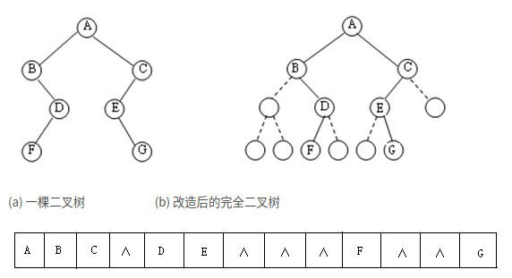

#   Java中实现顺序存储二叉树
description: Java中实现顺序存储二叉树
date: 2020-05-02 16:03:40
categories:
- 数据结构与算法
tags:
- 数据结构与算法(Java实现)
---
#   基本说明
+ 	二叉树的顺序存储，就是用一组连续的存储单元存放二叉树中的结点
+ 	从数据存储上看,数据存储方式和树的存储方式可以相互转换,即**数组可以转换成树,树也可以转换成数组**

# 	存储方式
用编号的方法从树根起，自上层至下层，每层自左至右地给所有结点编号

## 	好用在哪
完全二叉树和满二叉树采用顺序存储比较合适, 树中结点的序号可以唯一地反映出结点之间的逻辑关系，这样既能够最大可能地节省存储空间，又可以利用数组元素的下标值确定结点在二叉树中的位置，以及结点之间的关系


## 	不好用在哪
对于一般的二叉树，如果仍按从上至下和从左到右的顺序将树中的结点顺序存储在一维数组中，则数组元素下标之间的关系不能够反映二叉树中结点之间的逻辑关系,只有增添一些并不存在的空结点，使之成为一棵完全二叉树的形式，然后再用一维数组顺序存储,这种存储对于需增加许多空结点才能将一棵二叉树改造成为一棵完全二叉树的存储时，会造成空间的大量浪费



#   案例
## 	问题
1.  现有一数组为`arr:[1, 2, 3, 4, 5, 6]`
2.  将这个数组看成一个顺序存储的二叉树,对这个二叉树以前序遍历,中序遍历,后序遍历的方式完成结点的遍历

##  前序中序后序遍历的区别
+   前序遍历:先输出父结点,再遍历左子树和右子树
+   中序遍历:先遍历左子树,再输出父结点,再遍历右子树
+   后序遍历:先遍历左子树,再遍历右子树,最后输出父结点
小结:看输出父结点的顺序,就确定前序,中序还是后序


## 	顺序存储二叉树的特点
1.  顺序二叉树通常只考虑完全二叉树
2.  第n个元素的左子结点`2*n + 1`
3.  第n个元素的右子结点`2*n + 2`
4.  第n个元素的父结点为`(n - 1) / 2`
5.  `n`表示二叉树的第n个元素(按0开始编号)

## 	代码
```JAVA
package com.zjinc36.tree;
/**
 * 需求:给你一个数组{1,2,3,4,5,6,7},要求以二叉树前序遍历的方式进行道历。前序遍历的结果应当为1,2,4,5,3,6,7
 * 1)顺序存储通常只考虑完全二叉树
 * 2)第n个元素的左子节点为2*n+1
 * 3)第n个元素的右子节点为2*n+2
 * 4)第n个元素的父节点为(n-1)12
 * 5)n:表示二叉树中的第几个元素(按0开始编号如图所示)
 */
public class ArrBinaryTree {
	private int[] arr;	//存储数据节点的数组

	public ArrBinaryTree(int[] arr) {
		this.arr = arr;
	}

	/**
	 * 重载前序遍历
	 */
	public void preOrder() {
		this.preOrder(0);
	}
	/**
	 * 重载中序遍历
	 */
	public void inOrder() {
		this.inOrder(0);
	}
	/**
	 * 重载后序遍历
	 */
	public void postOrder() {
		this.postOrder(0);
	}

	/**
	 * 编写一个方法,完成顺序存储二叉树的前序遍历
	 * @param index 数组的下标
	 */
	public void preOrder(int index) {
		// 如果数组为空,或者arr.length=0
		if (arr == null || arr.length == 0) {
			System.out.println("数组为空,不能进行二叉树的前序遍历");
		}
		// 输出当前这个元素
		System.out.println(arr[index]);

		// 向左递归遍历
		if (index * 2 + 1 < arr.length) {
			this.preOrder(2*index + 1);
		}
		// 向右递归遍历
		if (index * 2 + 2 < arr.length) {
			this.preOrder(2*index + 2);
		}
	}

	/**
	 * 编写一个方法,完成顺序存储二叉树的中序遍历
	 * @param index 数组的下标
	 */
	public void inOrder (int index) {
		// 如果数组为空,或者arr.length=0
		if (arr == null || arr.length == 0) {
			System.out.println("数组为空,不能进行二叉树的中序遍历");
		}

		// 遍历左子树
		if (index * 2 + 1 < arr.length) {
			this.inOrder(2 * index + 1);
		}

		System.out.println(arr[index]);

		// 遍历右子树
		if (index * 2 + 2 < arr.length) {
			this.inOrder(2 * index + 2);
		}
	}

	/**
	 * 编写一个方法,完成顺序存储二叉树的后序遍历
	 * @param index 数组的下标
	 */
	public void postOrder(int index) {
		// 如果数组为空,或者arr.length=0
		if (arr == null || arr.length == 0) {
			System.out.println("数组为空,不能进行二叉树的中序遍历");
		}

		// 遍历左子树
		if (index * 2 + 1 < arr.length) {
			this.postOrder(index * 2 + 1);
		}
		// 遍历右子树
		if (index * 2 + 2 < arr.length) {
			this.postOrder(index * 2 + 2);
		}
		System.out.println(arr[index]);
	}
}
```

#	测试
```JAVA
package com.zjinc36.tree;

import org.junit.Test;

public class ArrBinaryTreeTest {
	@Test
	public void test() {
		int[] arr = {1,2,3,4,5,6,7};
		ArrBinaryTree arrBinaryTree = new ArrBinaryTree(arr);
		System.out.println("====前序遍历====");
		arrBinaryTree.preOrder();
		System.out.println("====中序遍历====");
		arrBinaryTree.inOrder();
		System.out.println("====后序遍历====");
		arrBinaryTree.postOrder();
	}
}
```

# 	参考
[顺序存储二叉树](https://blog.csdn.net/zycxnanwang/article/details/52644280)
