#   堆的基本介绍与堆排序的Java实现
+ date: 2020-05-02 18:03:40
+ description: Java中实现堆排序
+ categories:
  - 数据结构与算法
+ tags:
  - 数据结构与算法(Java实现)
---
#   参考
[什么是堆？看这一篇就够了！](https://juejin.im/post/5f19b8875188252e382a6e16#heading-2)

#   堆的基本介绍
+   堆是一颗完全二叉树
    *   每个结点的值都大于或等于其左右孩子结点的值，称为大顶堆, 注意 : 没有要求结点的左孩子的值和右孩子的值的大小关系。
    *   每个结点的值都小于或等于其左右孩子结点的值，称为小顶堆

+   从堆的特点可知，下图中，1，2 是大顶堆，3 是小顶堆， 4 不是堆（不是完全二叉树）


#   插入堆元素
```JAVA
//插入一个元素时，将其插入堆的尾部，让后向上冒泡
public static void heapInsert(int[] arr,int index)
{
    while (index!=0)
    {
        int parent=(index-1)/2;
        if (arr[parent]<arr[index])
            swap(arr,index,parent);
        else
            break;
        index=parent;
    }
}
```

#   堆化
往堆中插入元素后（如下图示），我们需要继续满足堆的特性，所以需要不断调整元素的位置直到满足堆的特点为止（堆中节点的值都大于等于（或小于等于）其子节点的值）,我们把这种调整元素以让其满足堆特点的过程称为堆化（heapify）,**建堆的时间复杂度：O(n)**
```JAVA
public class Heap {
    private int[] arr;       // 堆是完全二叉树，底层用数组存储
    private int capacity;    // 堆中能存储的最大元素数量
    private int n;          // 当前堆中元素数量

    public Heap(int count) {
        capacity = count;
        arr = new int[capacity+1];
        n = 0;
    }

    public void insert(int value) {
        if (n >= capacity) {
            // 超过堆大小了，不能再插入元素
            return;
        }
        n++;
        // 先将元素插入到队尾中
        arr[n] = value;

        int i = n;
        // 由于我们构建的是一个大顶堆，所以需要不断调整以让其满足大顶堆的条件
        while (i/2 > 0 && arr[i] > arr[i/2]) {
            swap(arr, i, i/2);
            i = i / 2;
        }
    }
}
```


#   删除堆元素
##  删除堆元素会遇到数组空洞问题
假设我们要操作的堆是大顶堆，则删除堆顶元素后，要找到原堆中第二大的元素以填补堆顶元素，而第二大的元素无疑是在根节点的左右子节点上，假设是左节点，则用左节点填补堆顶元素之后，左节点空了，此时需要从左节点的左右节点中找到两者的较大值填补左节点...，不断迭代此过程，直到调整完毕，调整过程如下图示：
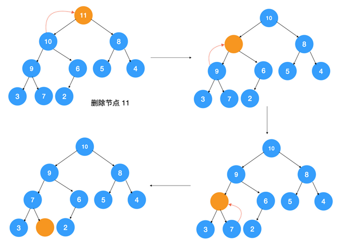
如上图所示，在最终调整后的堆中，出现了数组空洞，对应的数组如下
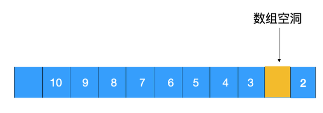

##  如何解决数组空洞问题
我们可以用最后一个元素覆盖堆顶元素，然后再自上而下地调整堆，让其满足大顶堆的要求，这样即可解决数组空洞的问题。
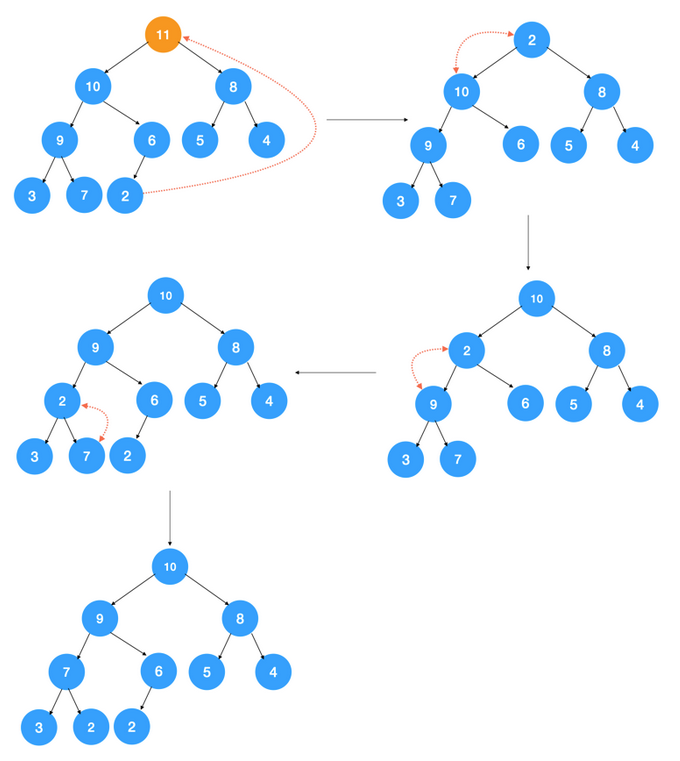

##  删除堆元素的代码实现
```JAVA
/**
 * 移除堆顶元素
 */
public void removeTopElement() {
    if (n == 0) {
        // 堆中如果没有元素，也就是不存在移除堆顶元素的情况了
        return;
    }
    int count = n;
    arr[1] = arr[count];
    --count;
    heapify(1, count);
}

/**
 * 自上而下堆化以满足大顶堆的条件
 */
public void heapify(int index, int n) {

    while (true) {
        int maxValueIndex = index;
        if (2 * index <= n && arr[index] < arr[2 * index]) {
            // 左节点比其父节点大
            maxValueIndex = 2 * index;
        }

        if (2 * index + 1 <= n && arr[maxValueIndex] < arr[2 * index + 1]) {
            // 右节点比左节点或父节点大
            maxValueIndex = 2 * index + 1;
        }

        if (maxValueIndex == index) {
            // 说明当前节点值为最大值，无需再往下迭代了
            break;
        }
        swap(arr, index, maxValueIndex);
        index = maxValueIndex;
    }
}

/**
 * 交换数组第 i 和第 j 个元素
 */
public static void swap(int[] arr, int i, int j)
{
    int temp = arr[i];
    arr[i] = arr[j];
    arr[j] = temp;
}
```
##  删除堆元素的时间复杂度
时间复杂度和插入堆中元素一样，也是树的高度，所以为 O(logn)。

#   堆排序
+   堆排序是利用堆这种数据结构而设计的一种排序算法，堆排序是一种选择排序，它的最坏，最好，平均时间复杂度均为 O(nlogn)，它也是不稳定排序。

##  基本思路
1.  将无序序列构建成一个堆，根据升序降序需求选择大顶堆或小顶堆;
2.  将堆顶元素与末尾元素交换，将最大元素"沉"到数组末端;
3.  重新调整结构，使其满足堆定义，然后继续交换堆顶元素与当前末尾元素，反复执行调整+交换步骤，直到整个序列有序

##  图解
**步骤一**:构造初始堆。将给定无序序列构造成一个大顶堆（一般升序采用大顶堆，降序采用小顶堆)。原始的数组 [4, 6, 8, 5, 9]
1.  假设给定无序序列结构如下
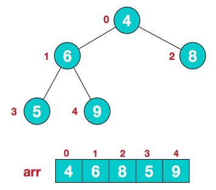
2.  此时我们从最后一个非叶子结点开始（叶结点自然不用调整，最后一个非叶子结点arr.length/2-1=5/2-1=1，也就是下面的 6 结点），从左至右，从下至上进行调整
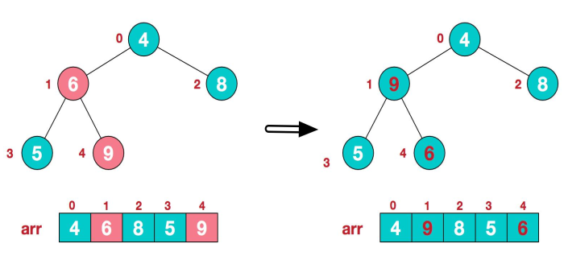
3.  找到第二个非叶节点 4，由于[4,9,8]中 9 元素最大，4 和 9 交换
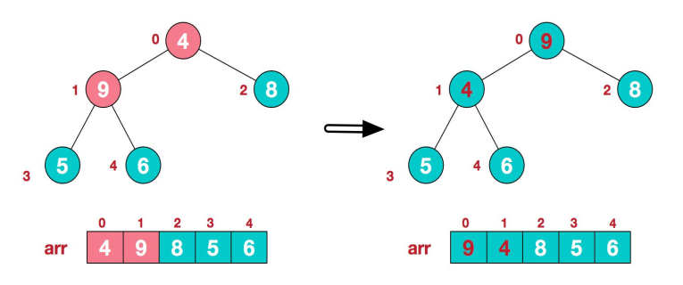
4.  这时，交换导致了子根[4,5,6]结构混乱，继续调整，[4,5,6]中 6 最大，交换 4 和 6
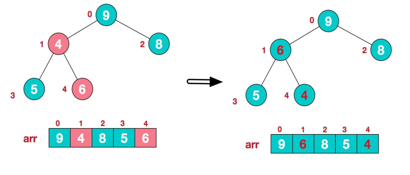
5.  此时，我们就将一个无序序列构造成了一个大顶堆

**步骤二**:将堆顶元素与末尾元素进行交换，使末尾元素最大。然后继续调整堆，再将堆顶元素与末尾元素交换，得到第二大元素。如此反复进行交换、重建、交换。
1.  将堆顶元素 9 和末尾元素 4 进行交换
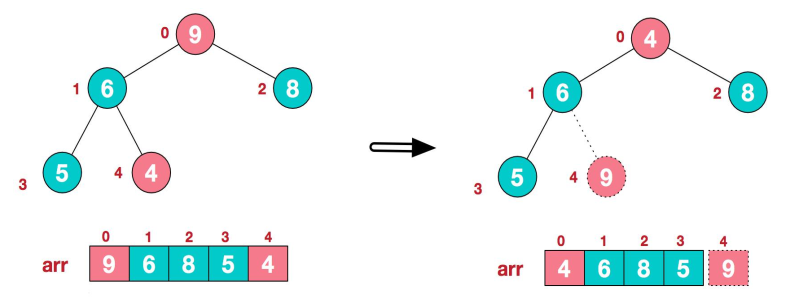
2.  重新调整结构，使其继续满足堆定义
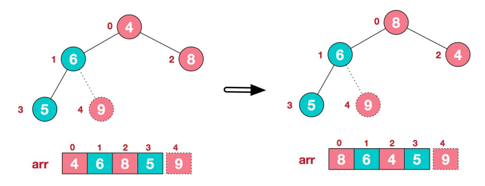
3.  再将堆顶元素 8 与末尾元素 5 进行交换，得到第二大元素 8
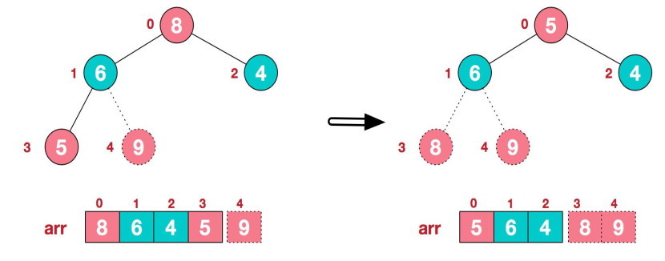
4.  后续过程，继续进行调整，交换，如此反复进行，最终使得整个序列有序
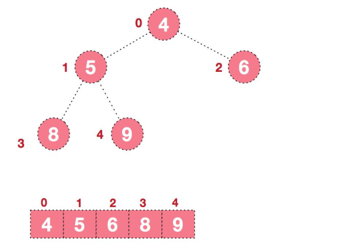

##  代码实现
###     方式一:使用递归实现
```JAVA
package com.zjinc36.tree;

import java.util.Arrays;

public class HeapSort {
    private int[] arr;

    public HeapSort(int[] arr) {
        this.arr = arr;
    }

    /**
     * 堆排序的主要入口方法，共两步。
     */
    public void sort() {
        // 第一步：将数组堆化
        // 从最后一个分支结点(非叶子结点)开始
        // beginIndex = (arr.length / 2)- 1
        // 叶子节点可以看作已符合堆要求的节点，根节点就是它自己且自己以下值为最大。
        int len = arr.length - 1;
        int beginIndex = (arr.length >> 1) - 1; // ==> (arr.length / 2)- 1
        for (int i = beginIndex; i >= 0; i--) {
            maxHeapify(i, len);
        }

        // 第二步：对堆化数据排序
        // 每次都是移出最顶层的根节点A[0]，与最尾部节点位置调换，同时遍历长度 - 1
        // 然后从新整理被换到根节点的末尾元素，使其符合堆的特性
        // 直至未排序的堆长度为 0
        for (int i = len; i > 0; i--) {
            swap(0, i);
            maxHeapify(0, i - 1);
        }
    }

    /**
     * 调整索引为 index 处的数据，使其符合堆的特性。
     *
     * @param index 需要堆化处理的数据的索引
     * @param len   未排序的堆（数组）的长度
     */
    private void maxHeapify(int index, int len) {
        int li = (index << 1) + 1; // 左子节点索引 ==> (index * 2) + 1
        int ri = li + 1; // 右子节点索引
        int cMax = li; // 假设树的最大值的索引为左子节点
        if (li > len) { // 左子节点索引超出计算范围，直接返回。
            return;
        }
        if (ri <= len && arr[ri] > arr[li]) { // 先判断右子结点是否大于左子结点
            cMax = ri;
        }
        if (arr[cMax] > arr[index]) { // 在判断左右子结点的最大值是否大于父结点
            swap(cMax, index); // 如果父节点被子节点调换，
            maxHeapify(cMax, len); // 则需要继续判断换下后的父节点是否符合堆的特性。
        }
    }

    private void swap(int i, int j) {
        int temp = arr[i];
        arr[i] = arr[j];
        arr[j] = temp;
    }

    /**
     * 测试用例
     */
    public static void main(String[] args) {
        int[] arr = new int[] { 4, 9, 8, 5, 10, 11, 2, 7, 1, 6, 3 };
        new HeapSort(arr).sort();
        System.out.println(Arrays.toString(arr));
    }
}

```

###     方式二:使用循环实现
```JAVA
package com.zjinc36.tree;

import java.util.Arrays;

public class HeapSort2 {
    public static void main(String[] args) {
        
        System.out.println("堆排序!!");
        int arr[] = { 4, 6, 8, 5, 9, 3, 10, 2, 7, 11, 1 };
        // 将无序序列构建成一个堆， 根据升序降序需求选择大顶堆或小顶堆
        // 这里构建大顶堆
        for (int i = arr.length / 2 - 1; i >= 0; i--) {
            adjustHeap(arr, i, arr.length);
        }

        // 1. 将堆顶元素与末尾元素交换， 将最大元素"沉"到数组末端;
        // 2. 排除数组末尾已经排序的数,对剩余的数构建一个大顶堆
        // 3. 然后继续交换堆顶元素与当前末尾元素
        // 4. 反复执行调整+交换步骤， 直到整个序列有序
        int temp = 0;
        for (int j = arr.length - 1; j > 0; j--) {
            //将堆顶元素与末尾元素交换， 将最大元素"沉"到数组末端;
            temp = arr[j];
            arr[j] = arr[0];
            arr[0] = temp;
            // 排除数组末尾已经排序的数,对剩余的数构建一个大顶堆
            adjustHeap(arr, 0, j);
        }
        System.out.println("数组=" + Arrays.toString(arr));
    }

    /**
     * 将一个二叉树(数组),调整成一个大顶堆 ==> 将以i为父结点的树调整为大顶堆
     * 
     * @param arr    待调整的数组
     * @param i      表示非叶子结点在数组中的索引
     * @param length 表示对多少个元素继续调整,length是在逐渐减少
     */
    public static void adjustHeap(int arr[], int i, int length) {
        int temp = arr[i]; // 先取出当前元素的值,保存在临时变量
        // 开始调整
        for (int k = i * 2 + 1; k < length; k = k * 2 + 1) {
            // 比较左子结点与右子结点哪个大
            if (k + 1 < length && arr[k] < arr[k + 1]) { // 说明左子结点的值小于右子结点的值
                k++; // 将k指向右子结点
            }

            // 比较左右子结点中较大的数与父结点中的数哪个大
            if (arr[k] > temp) {
                arr[i] = arr[k]; // 左右子结点中较大的数与父结点的数进行交换
                // 将k赋值给i是为了下一轮for循环中,i指向左右结点中被替换的那一个
                // 而k在下一轮for循环中,指向i所指向结点的左子结点
                i = k;
            } else {
                break;
            }
        }

        // 当for循环结束后,我们已经将i为父结点的树的最大值,放在了最顶
        arr[i] = temp; // 将temp值放到调整后的位置
    }
}
```
