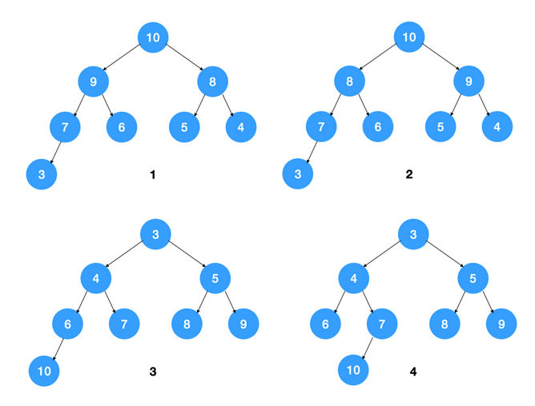

# 堆（二叉堆）

堆的基本介绍与堆排序的Java实现

---

# 参考

[什么是堆？看这一篇就够了！](https://juejin.im/post/5f19b8875188252e382a6e16#heading-2)

# 堆的基本介绍

也习惯叫做“二叉堆”，理由如下，
- “二叉”：基于二叉树的结构，底层逻辑是一棵完全二叉树，
  - 完全二叉树：除了最后一层，其他层的节点都被完全填满；最后一层的节点从左到右依次排列，没有空隙（例如，若最后一层有 4 个节点，则它们必须占据左起前 4 个位置）。
  - 二叉特性：树中每个节点最多有两个子节点（左子节点和右子节点），符合 “二叉树” 的定义。
- “堆” 体现的是节点间的值的关系约束，具体分为两种，
  - 大顶堆：每个父节点的值 大于等于 其左右子节点的值（堆顶为整个堆的最大值）。
  - 小顶堆：每个父节点的值 小于等于 其左右子节点的值（堆顶为整个堆的最小值）。

# 判断下图，是什么数据结构



从堆的特点可知，下图中，1，2 是大顶堆，3 是小顶堆， 4 不是堆（不是完全二叉树）


# 插入堆元素

```JAVA
//插入一个元素时，将其插入堆的尾部，让后向上冒泡
public static void heapInsert(int[] arr,int index)
{
    while (index!=0)
    {
        int parent=(index-1)/2;
        if (arr[parent]<arr[index])
            swap(arr,index,parent);
        else
            break;
        index=parent;
    }
}
```

# 堆化

往堆中插入元素后（如下图示），我们需要继续满足堆的特性，所以需要不断调整元素的位置直到满足堆的特点为止（堆中节点的值都大于等于（或小于等于）其子节点的值）,我们把这种调整元素以让其满足堆特点的过程称为堆化（heapify）,**建堆的时间复杂度：O(n)**

```java
public class Heap {
    private int[] arr;       // 堆是完全二叉树，底层用数组存储
    private int capacity;    // 堆中能存储的最大元素数量
    private int n;          // 当前堆中元素数量

    public Heap(int count) {
        capacity = count;
        arr = new int[capacity+1];
        n = 0;
    }

    public void insert(int value) {
        if (n >= capacity) {
            // 超过堆大小了，不能再插入元素
            return;
        }
        n++;
        // 先将元素插入到队尾中
        arr[n] = value;

        int i = n;
        // 由于我们构建的是一个大顶堆，所以需要不断调整以让其满足大顶堆的条件
        while (i/2 > 0 && arr[i] > arr[i/2]) {
            swap(arr, i, i/2);
            i = i / 2;
        }
    }
}
```


# 删除堆元素

## 删除堆元素会遇到数组空洞问题

假设我们要操作的堆是大顶堆，则删除堆顶元素后，要找到原堆中第二大的元素以填补堆顶元素，而第二大的元素无疑是在根节点的左右子节点上，假设是左节点，则用左节点填补堆顶元素之后，左节点空了，此时需要从左节点的左右节点中找到两者的较大值填补左节点...，不断迭代此过程，直到调整完毕，调整过程如下图示：


如上图所示，在最终调整后的堆中，出现了数组空洞，对应的数组如下


## 如何解决数组空洞问题

我们可以用最后一个元素覆盖堆顶元素，然后再自上而下地调整堆，让其满足大顶堆的要求，这样即可解决数组空洞的问题。


## 删除堆元素的代码实现

```java
/**
 * 移除堆顶元素
 */
public void removeTopElement() {
    if (n == 0) {
        // 堆中如果没有元素，也就是不存在移除堆顶元素的情况了
        return;
    }
    int count = n;
    arr[1] = arr[count];
    --count;
    heapify(1, count);
}

/**
 * 自上而下堆化以满足大顶堆的条件
 */
public void heapify(int index, int n) {

    while (true) {
        int maxValueIndex = index;
        if (2 * index <= n && arr[index] < arr[2 * index]) {
            // 左节点比其父节点大
            maxValueIndex = 2 * index;
        }

        if (2 * index + 1 <= n && arr[maxValueIndex] < arr[2 * index + 1]) {
            // 右节点比左节点或父节点大
            maxValueIndex = 2 * index + 1;
        }

        if (maxValueIndex == index) {
            // 说明当前节点值为最大值，无需再往下迭代了
            break;
        }
        swap(arr, index, maxValueIndex);
        index = maxValueIndex;
    }
}

/**
 * 交换数组第 i 和第 j 个元素
 */
public static void swap(int[] arr, int i, int j)
{
    int temp = arr[i];
    arr[i] = arr[j];
    arr[j] = temp;
}
```
## 删除堆元素的时间复杂度
时间复杂度和插入堆中元素一样，也是树的高度，所以为 O(logn)。

#  堆排序

+ 堆排序是利用堆这种数据结构而设计的一种排序算法，堆排序是一种选择排序，它的最坏，最好，平均时间复杂度均为 O(nlogn)，它也是不稳定排序。

## 基本思路

1.  将无序序列构建成一个堆，根据升序降序需求选择大顶堆或小顶堆;
2.  将堆顶元素与末尾元素交换，将最大元素"沉"到数组末端;
3.  重新调整结构，使其满足堆定义，然后继续交换堆顶元素与当前末尾元素，反复执行调整+交换步骤，直到整个序列有序

## 图解

**步骤一**:构造初始堆。将给定无序序列构造成一个大顶堆（一般升序采用大顶堆，降序采用小顶堆）。原始的数组 [4, 6, 8, 5, 9]

- 假设给定无序序列结构如下


- 此时我们从最后一个非叶子结点开始（叶结点自然不用调整，最后一个非叶子结点arr.length/2-1=5/2-1=1，也就是下面的 6 结点），从左至右，从下至上进行调整


- 找到第二个非叶节点 4，由于[4,9,8]中 9 元素最大，4 和 9 交换


- 这时，交换导致了子根[4,5,6]结构混乱，继续调整，[4,5,6]中 6 最大，交换 4 和 6


- 此时，我们就将一个无序序列构造成了一个大顶堆

**步骤二**:将堆顶元素与末尾元素进行交换，使末尾元素最大。然后继续调整堆，再将堆顶元素与末尾元素交换，得到第二大元素。如此反复进行交换、重建、交换。

- 将堆顶元素 9 和末尾元素 4 进行交换


- 重新调整结构，使其继续满足堆定义


- 再将堆顶元素 8 与末尾元素 5 进行交换，得到第二大元素 8


- 后续过程，继续进行调整，交换，如此反复进行，最终使得整个序列有序


## 代码实现

### 方式一:使用递归实现

```java
package com.zjinc36.tree;

import java.util.Arrays;

public class HeapSort {
    private int[] arr;

    public HeapSort(int[] arr) {
        this.arr = arr;
    }

    /**
     * 堆排序的主要入口方法，共两步。
     */
    public void sort() {
        // 第一步：将数组堆化
        // 从最后一个分支结点(非叶子结点)开始
        // beginIndex = (arr.length / 2)- 1
        // 叶子节点可以看作已符合堆要求的节点，根节点就是它自己且自己以下值为最大。
        int len = arr.length - 1;
        int beginIndex = (arr.length >> 1) - 1; // ==> (arr.length / 2)- 1
        for (int i = beginIndex; i >= 0; i--) {
            maxHeapify(i, len);
        }

        // 第二步：对堆化数据排序
        // 每次都是移出最顶层的根节点A[0]，与最尾部节点位置调换，同时遍历长度 - 1
        // 然后从新整理被换到根节点的末尾元素，使其符合堆的特性
        // 直至未排序的堆长度为 0
        for (int i = len; i > 0; i--) {
            swap(0, i);
            maxHeapify(0, i - 1);
        }
    }

    /**
     * 调整索引为 index 处的数据，使其符合堆的特性。
     *
     * @param index 需要堆化处理的数据的索引
     * @param len   未排序的堆（数组）的长度
     */
    private void maxHeapify(int index, int len) {
        int li = (index << 1) + 1; // 左子节点索引 ==> (index * 2) + 1
        int ri = li + 1; // 右子节点索引
        int cMax = li; // 假设树的最大值的索引为左子节点
        if (li > len) { // 左子节点索引超出计算范围，直接返回。
            return;
        }
        if (ri <= len && arr[ri] > arr[li]) { // 先判断右子结点是否大于左子结点
            cMax = ri;
        }
        if (arr[cMax] > arr[index]) { // 在判断左右子结点的最大值是否大于父结点
            swap(cMax, index); // 如果父节点被子节点调换，
            maxHeapify(cMax, len); // 则需要继续判断换下后的父节点是否符合堆的特性。
        }
    }

    private void swap(int i, int j) {
        int temp = arr[i];
        arr[i] = arr[j];
        arr[j] = temp;
    }

    /**
     * 测试用例
     */
    public static void main(String[] args) {
        int[] arr = new int[] { 4, 9, 8, 5, 10, 11, 2, 7, 1, 6, 3 };
        new HeapSort(arr).sort();
        System.out.println(Arrays.toString(arr));
    }
}

```

### 方式二:使用循环实现

```java
package com.zjinc36.tree;

import java.util.Arrays;

public class HeapSort2 {
    public static void main(String[] args) {
        
        System.out.println("堆排序!!");
        int arr[] = { 4, 6, 8, 5, 9, 3, 10, 2, 7, 11, 1 };
        // 将无序序列构建成一个堆， 根据升序降序需求选择大顶堆或小顶堆
        // 这里构建大顶堆
        for (int i = arr.length / 2 - 1; i >= 0; i--) {
            adjustHeap(arr, i, arr.length);
        }

        // 1. 将堆顶元素与末尾元素交换， 将最大元素"沉"到数组末端;
        // 2. 排除数组末尾已经排序的数,对剩余的数构建一个大顶堆
        // 3. 然后继续交换堆顶元素与当前末尾元素
        // 4. 反复执行调整+交换步骤， 直到整个序列有序
        int temp = 0;
        for (int j = arr.length - 1; j > 0; j--) {
            //将堆顶元素与末尾元素交换， 将最大元素"沉"到数组末端;
            temp = arr[j];
            arr[j] = arr[0];
            arr[0] = temp;
            // 排除数组末尾已经排序的数,对剩余的数构建一个大顶堆
            adjustHeap(arr, 0, j);
        }
        System.out.println("数组=" + Arrays.toString(arr));
    }

    /**
     * 将一个二叉树(数组),调整成一个大顶堆 ==> 将以i为父结点的树调整为大顶堆
     * 
     * @param arr    待调整的数组
     * @param i      表示非叶子结点在数组中的索引
     * @param length 表示对多少个元素继续调整,length是在逐渐减少
     */
    public static void adjustHeap(int arr[], int i, int length) {
        int temp = arr[i]; // 先取出当前元素的值,保存在临时变量
        // 开始调整
        for (int k = i * 2 + 1; k < length; k = k * 2 + 1) {
            // 比较左子结点与右子结点哪个大
            if (k + 1 < length && arr[k] < arr[k + 1]) { // 说明左子结点的值小于右子结点的值
                k++; // 将k指向右子结点
            }

            // 比较左右子结点中较大的数与父结点中的数哪个大
            if (arr[k] > temp) {
                arr[i] = arr[k]; // 左右子结点中较大的数与父结点的数进行交换
                // 将k赋值给i是为了下一轮for循环中,i指向左右结点中被替换的那一个
                // 而k在下一轮for循环中,指向i所指向结点的左子结点
                i = k;
            } else {
                break;
            }
        }

        // 当for循环结束后,我们已经将i为父结点的树的最大值,放在了最顶
        arr[i] = temp; // 将temp值放到调整后的位置
    }
}
```

# 二叉堆算法在实际项目中的应用场景

二叉堆算法凭借其**高效获取最值**（O(1)时间获取堆顶）和**动态调整元素优先级**（O(log n)时间插入/删除）的特性，在实际项目中有着广泛应用。以下是几个典型场景：


## 优先队列（Priority Queue）实现

优先队列是二叉堆最经典的应用，它能保证每次取出的元素都是当前队列中优先级最高的（如最大值或最小值）。

- **实际场景**：
  - **任务调度系统**：操作系统中，高优先级的任务（如实时进程）需要优先执行，可通过大顶堆存储任务（优先级高的任务在堆顶），调度器每次从堆顶取任务执行。
  - **医院急诊排队**：病情危急的患者优先级更高，用小顶堆（假设优先级数值越小越紧急）管理，确保优先处理最紧急的患者。
  - **消息队列**：某些消息队列（如RabbitMQ的优先级队列）支持按消息优先级投递，底层通过二叉堆维护消息顺序。

优先队列说白了就是一个“有脾气的排队系统”——普通排队是“先来后到”，但它是“谁重要谁先上”。而二叉堆就是实现这个“有脾气排队”的最常用工具，就像用一个高效的“排序机器”维护队伍顺序。


### 举个生活例子：医院急诊的优先队列
假设医院急诊有个排队系统，规则是：病情越重（优先级越高），越先看病。  
- 病人A（发烧，优先级3）先来，排在队里。  
- 病人B（骨折，优先级5）来了，因为5>3，直接排到A前面。  
- 病人C（心梗，优先级10）来了，10>5，排到最前面。  
- 此时医生看完C，剩下的B自动顶到最前面，接着是A。  

这个过程里，每次有新病人来，都要插到“比他优先级低”的人前面；每次处理完当前最急的，剩下的里最急的自动补位——这就是优先队列的核心逻辑。

### 用二叉堆实现这个队列，到底咋干活？

二叉堆在这里就像一个“智能排号机”，用最简单的方式维护“谁最该先上”：  

1. **存数据**：把所有病人（元素）按“优先级”放进一个堆里（比如大顶堆，优先级高的在堆顶）。  
   - 堆顶永远是当前“最该先处理”的（比如心梗病人C，优先级10）。  

2. **新来一个人（插入元素）**：  
   - 先把新人放到队伍最后（堆的最后一个位置）。  
   - 然后让他“往上挤”：和前面的人比优先级，只要比前面的高，就换位置，直到挤不动（比如B来了，先放最后，再和A比，挤到A前面；C来了，再和B比，挤到最前面）。  

3. **处理完一个人（取出堆顶）**：  
   - 把当前最急的（堆顶）拉走处理（比如C看完病走了）。  
   - 把队伍最后一个人（比如A）临时拉到堆顶“填坑”。  
   - 然后让他“往下蹲”：和后面的人比优先级，只要后面有比他急的，就换位置，直到蹲到合适的位置（比如C走后，A临时到堆顶，发现B比他急，就和B换位置，B成新堆顶）。  


### 为啥非得用二叉堆？

如果不用堆，用普通数组实现这个队列：  
- 新来个人，得从队头查到队尾，找合适的位置插入（可能要扫一遍所有元素），慢！  
- 处理完一个人，得再扫一遍找下一个最急的，更慢！  

而二叉堆的“往上挤”和“往下蹲”操作，每次最多只需要比较“层数”次（比如100个人，最多比7次），速度快得多。这就像你在楼梯上挤位置，最多爬几层就到地方了，不用每层都看一遍。


### 小结

优先队列就是“按优先级插队的队列”，而二叉堆是实现它的“高效工具”——通过堆顶存最急的，插入时“往上挤”，删除时“往下蹲”，保证每次操作都很快，不用费劲扫整个队伍。  

## 堆排序（Heap Sort）

堆排序是一种基于二叉堆的高效排序算法，时间复杂度为O(n log n)，且是原地排序（无需额外大量空间）。

- **实际场景**：
  - **大数据量排序**：当需要对内存中的数组进行排序，且对空间开销敏感时（如嵌入式设备），堆排序是常用选择。例如，对一个存储用户积分的数组排序，用大顶堆依次弹出最大值并放入数组尾部，最终得到升序数组。
  - **避免最坏情况**：相比快速排序在极端数据下可能退化到O(n²)，堆排序的时间复杂度更稳定，适合对排序稳定性要求较高的场景（如金融数据排序）。


## Top-K问题（求前K个最值）

在海量数据中，求最大的K个元素（或最小的K个元素），直接排序会因数据量过大导致效率低下，而二叉堆能高效解决。

- **实际场景**：
  - **热门商品统计**：电商平台需要实时展示“销量Top10商品”，可维护一个大小为10的小顶堆。新商品销量加入时，若大于堆顶（当前第10名），则替换堆顶并调整堆，最终堆中元素即为Top10（小顶堆顶是第10名，保证堆内都是更大的元素）。
  - **搜索引擎热搜榜**：实时计算“搜索次数Top50关键词”，用小顶堆（大小50）动态更新，比全量排序更高效（尤其数据量超百万级时）。


## 中位数查找（动态维护数据流的中位数）

中位数是有序列表中间的元素，对于动态流入的数据（如实时监测的传感器数据），需高效获取当前中位数，二叉堆是最优方案之一。

- **实际场景**：
  - **实时数据监控**：某工厂的温度传感器实时上传数据，需实时计算当前温度的中位数（反映数据集中趋势）。可维护两个堆：
    - 大顶堆存储较小的一半数据（堆顶是这部分的最大值）；
    - 小顶堆存储较大的一半数据（堆顶是这部分的最小值）。
  - 新数据加入时，根据大小放入对应堆并调整平衡（保证两堆大小差不超过1），中位数即为大顶堆顶（若总数据为奇数）或两堆顶的平均值（若为偶数）。


## Dijkstra算法（最短路径问题）

Dijkstra算法用于求解图中从起点到其他节点的最短路径，优化版本中使用小顶堆（优先队列）存储待处理节点，提高效率。

- **实际场景**：
  - **导航软件路径规划**：如高德地图计算从A到B的最短路径，每次从堆中选取当前距离起点最近的节点（小顶堆顶），并更新其邻接节点的距离，重复直到到达终点。
  - **网络路由算法**：路由器在选择数据包传输路径时，需优先选择跳数少或延迟低的路径，底层可用二叉堆快速筛选最优路径。


# 总结
二叉堆的核心价值在于**高效维护“最值”和动态调整元素优先级**，因此在需要频繁获取/更新最值的场景（如调度、排序、Top-K问题）中表现突出。实际项目中，许多语言的标准库已内置基于二叉堆的实现（如Java的`PriorityQueue`、Python的`heapq`模块），开发者可直接调用，无需重复造轮子。
