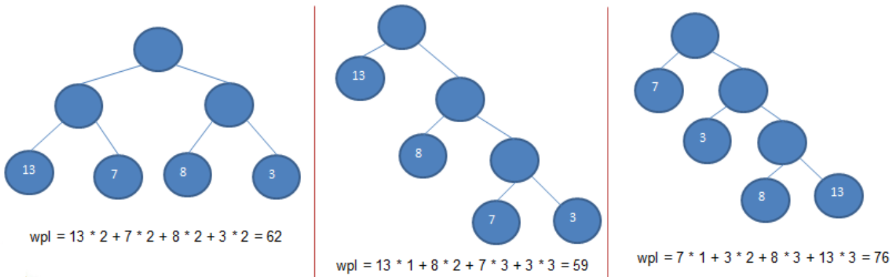
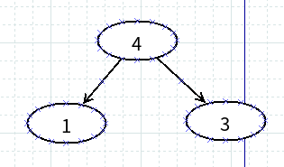
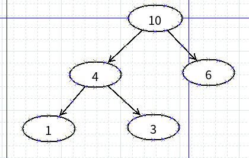
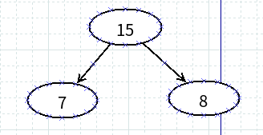
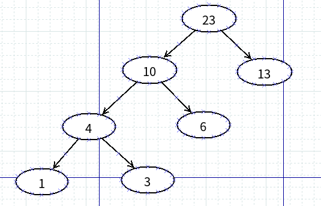
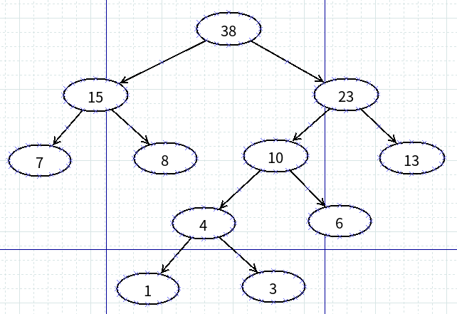
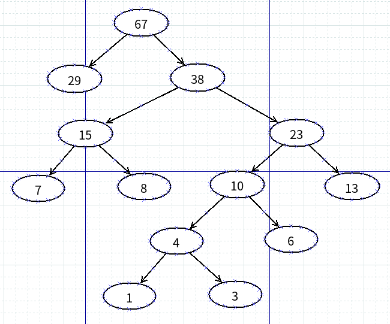

#   赫夫曼树_最优二叉树与赫夫曼树的JAVA实现
+ date: 2020-05-03 15:50:28
+ description: 赫夫曼树_最优二叉树与赫夫曼树的JAVA实现
+ categories:
  - 数据结构与算法
+ tags:
  - 数据结构与算法(Java实现)
---
#   基础概念
1.  路径和路径长度：在一棵树中，从一个结点往下可以达到的孩子或孙子结点之间的通路，称为路径。通路中分支的数目称为路径长度。若规定根结点的层数为 1，则从根结点到第 L 层结点的路径长度为 L-1
2.  结点的权及带权路径长度：若将树中结点赋给一个有着某种含义的数值，则这个数值称为该结点的权。结点的带权路径长度为：从根结点到该结点之间的路径长度与该结点的权的乘积
3.  树的带权路径长度： 树的带权路径长度规定为所有叶子结点的带权路径长度之和， 记为`WPL(weighted pathlength)`

#   什么是赫夫曼树
1.  定义:给定 n 个权值作为 n 个叶子结点，构造一棵二叉树，若该树的带权路径长度(wpl)达到最小，称这样的二叉树为最优二叉树，也称为哈夫曼树(Huffman Tree),还有的书翻译为霍夫曼树 ==> **WPL 最小的就是赫夫曼树**。
2.  赫夫曼树是带权路径长度最短的树，权值较大的结点离根较近(权值越大的结点离根结点越近的二叉树才是最优二叉树)
3.  下面第二图是赫夫曼树




#   赫夫曼树创建思路图解
给你一个数列 {13, 7, 8, 3, 29, 6, 1}，要求转成一颗赫夫曼树

##  构成赫夫曼树的步骤
1.  从小到大进行排序, 将每一个数据，每个数据都是一个节点，每个节点可以看成是一颗最简单的二叉树
2.  取出根节点权值最小的两颗二叉树
3.  组成一颗新的二叉树, 该新的二叉树的根节点的权值是前面两颗二叉树根节点权值的和
4.  再将这颗新的二叉树， 以根节点的权值大小再次排序， 不断重复 1-2-3-4 的步骤，直到数列中，所有的数据都被处理，就得到一颗赫夫曼树

##  构成赫夫曼树的图解
+   将`{13, 7, 8, 3, 29, 6, 1}`排序变成`{1, 3, 6, 7, 8, 13, 29}`
+   取出根结点权值最小的两棵二叉树 ==> `1,3`
+   组成一棵新的二叉树,根结点的权值是前面两棵二叉树的根结点权值的和 ==> 即`1 + 3 = 4`



+   经过上一步,数列变成`{4, 6, 7, 8, 13, 29}`
+   取出根结点权值最小的两棵二叉树 ==> `4, 6`
+   组成一棵新的二叉树,根结点的权值是前面两棵二叉树的根结点权值的和 ==> 即`4 + 6 = 10`



+   经过上一步,数列变成`{10, 7, 8, 13, 29}`,排序后变成`{7, 8, 10, 13, 29}`
+   取出根结点权值最小的两棵二叉树 ==> `7, 8`
+   组成一棵新的二叉树,根结点的权值是前面两棵二叉树的根结点权值的和 ==> 即`7 + 8 = 15`



+   经过上一步,数列变成`{15, 10, 13, 29}`,排序后变成`{10, 13, 15, 29}`
+   取出根结点权值最小的两棵二叉树 ==> `10, 13`
+   组成一棵新的二叉树,根结点的权值是前面两棵二叉树的根结点权值的和 ==> 即`10 + 13 = 23`



+   经过上一步,数列变成`{23, 15, 29}`,排序后变成`{15, 23, 29}`
+   取出根结点权值最小的两棵二叉树 ==> `15, 23`
+   组成一棵新的二叉树,根结点的权值是前面两棵二叉树的根结点权值的和 ==> 即`15 + 23 = 38`



+   经过上一步,数列变成`{38, 29}`,排序后变成`{29, 38}`
+   取出根结点权值最小的两棵二叉树 ==> `29, 38`
+   组成一棵新的二叉树,根结点的权值是前面两棵二叉树的根结点权值的和 ==> 即`29 + 38 = 67`




#   实现上述赫夫曼树
1.  创建结点类
```JAVA
/**
 * 创建结点类 
 * => 为了让 Node 对象持续排序 Collections 集合排序 
 * => 让 Node 实现 Comparable 接口
 */
class Node implements Comparable<Node> {
    int value; // 结点权值
    Node left; // 指向左子结点
    Node right; // 指向右子结点

    public Node(int value) {
        this.value = value;
    }

    /**
     * 前序遍历自身的子树
     */
    public void preOrder() {
        System.out.println(this);
        if (this.left != null) {
            this.left.preOrder();
        }
        if (this.right != null) {
            this.right.preOrder();
        }
    }

    @Override
    public String toString() {
        return "Node [value=" + value + "]";
    }

    @Override
    public int compareTo(Node o) {
        // 表示从小到大排序
        return this.value - o.value;
    }
}
```

2.  实现赫夫曼树
```JAVA
package com.zjinc36.tree;

import java.util.ArrayList;
import java.util.Collections;
import java.util.List;

public class HuffmanTree {
    /**
     * 测试
     */
    public static void main(String[] args) {
        int arr[] = { 13, 7, 8, 3, 29, 6, 1 };
        Node root = createHuffmanTree(arr);
        root.preOrder();
    }

    /**
     * 创建一棵赫夫曼树
     * @param  int[] arr  要创建的数组
     * @return 返回赫夫曼树的根结点
     */
    public static Node createHuffmanTree(int[] arr) {
        // 第一步为了操作方便
        // 1. 遍历 arr 数组
        // 2. 将 arr 的每个元素构成成一个 Node
        // 3. 将 Node 放入到 ArrayList 中
        List<Node> nodes = new ArrayList<Node>();
        for (int value : arr) {
            Node node = new Node(value);
            nodes.add(node);
        }
        
        // 构成赫夫曼树的步骤
        // => 从小到大进行排序, 将每一个数据，每个数据都是一个节点，每个节点可以看成是一颗最简单的二叉树
        // => 取出根节点权值最小的两颗二叉树
        // => 组成一颗新的二叉树, 该新的二叉树的根节点的权值是前面两颗二叉树根节点权值的和
        // => 再将这颗新的二叉树， 以根节点的权值大小再次排序， 不断重复 1-2-3-4 的步骤，直到数列中，所有的数据都被处理，就得到一颗赫夫曼树
        
        while (nodes.size() > 1) {
            // (0) 从小到大进行排序
            Collections.sort(nodes);    
            // (1) 取出权值最小的结点（二叉树）
            Node leftNode = nodes.get(0);   // 取出根节点权值最小的两颗二叉树
            // (2) 取出权值第二小的结点（二叉树）
            Node rightNode = nodes.get(1);
            // (3) 构建一颗新的二叉树
            Node parentNode = new Node(leftNode.value + rightNode.value);
            parentNode.left = leftNode;
            parentNode.right = rightNode;
            // (4) 从 ArrayList 删除处理过的二叉树
            nodes.remove(leftNode);
            nodes.remove(rightNode);
            // (5) 将 parent 加入到 nodes
            nodes.add(parentNode);
            // (0) 从小到大进行排序
            // ... 循环
        }

        // 返回赫夫曼树的根结点
        return nodes.get(0);
    }
}
```
