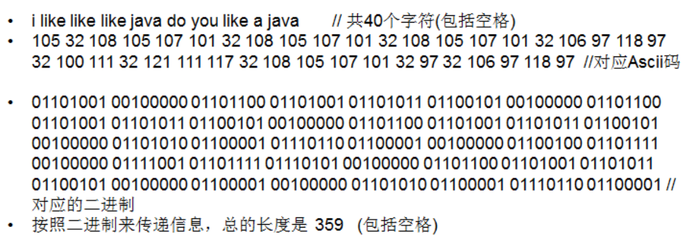
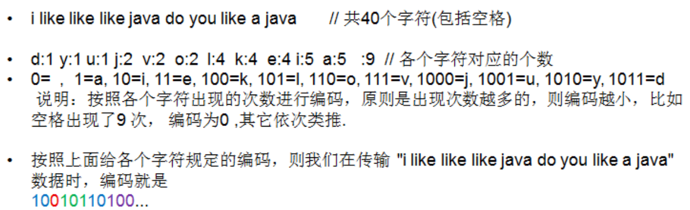
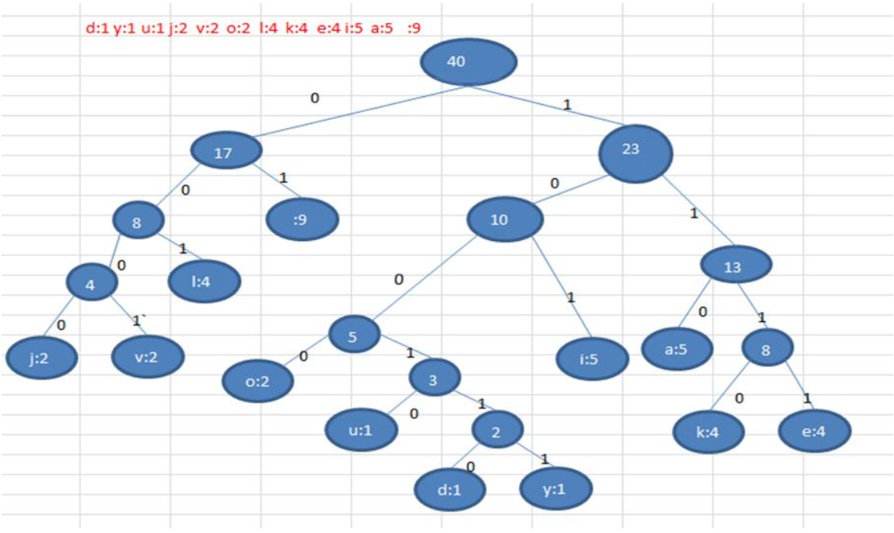
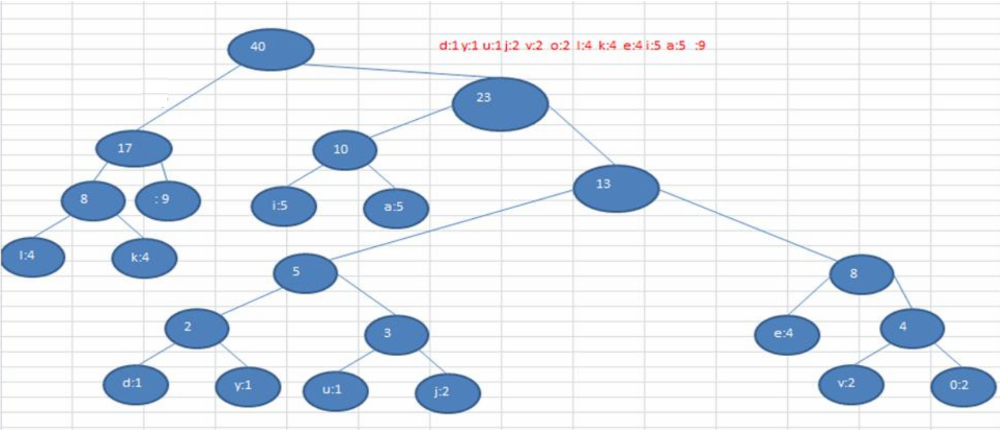

#   赫夫曼编码与解码

---

#   基本介绍

1. 赫夫曼编码也翻译为 哈夫曼编码(Huffman Coding)， 又称霍夫曼编码， 是一种编码方式, 属于一种程序算法
2. 赫夫曼编码是赫哈夫曼树在电讯通信中的经典的应用之一。
3. 赫夫曼编码广泛地用于数据文件压缩。 其压缩率通常在 20%～90%之间
4. 赫夫曼码是可变字长编码(VLC)的一种。 Huffman 于 1952 年提出一种编码方法， 称之为最佳编码

#   通信领域中信息的处理方式 

##  1-定长编码

###     说明



###     缺点

没有进行压缩

##  2-变长编码

###     说明



###     缺点
>   前缀编码：设计长短不等的编码，必须是任一字符的编码都不是另一个字符编码的前缀，这种编码称为前缀编码

变长编码的编码长短不等,却无法保证任一字符的编码都不是另一个字符编码的前缀,也就是说变长编码不是前缀编码,这就会导致我们使用码表翻译编码时,并不能翻译出唯一结果的字符


##  3-赫夫曼编码
###     说明
- 传输的字符串:`i like like like java do you like a java`
- `d:1 y:1 u:1 j:2 v:2 o:2 l:4 k:4 e:4 i:5 a:5 空格:9` // 各个字符对应的个数
- 按照上面字符出现的次数构建一颗赫夫曼树, 次数作为权值

```
构成赫夫曼树的步骤：
- 从小到大进行排序,将每一个数据，每个数据都是一个节点，每个节点可以看成是一颗最简单的二叉树
- 取出根节点权值最小的两颗二叉树
- 组成一颗新的二叉树,该新的二叉树的根节点的权值是前面两颗二叉树根节点权值的和
- 再将这颗新的二叉树，以根节点的权值大小 再次排序，不断重复 1-2-3-4 的步骤，直到数列中，所有的数据都被处理，就得到一颗赫夫曼树
```




- 根据赫夫曼树， 给各个字符,规定编码 (前缀编码)， 向左的路径为 0 向右的路径为 1 ， 编码如下:

```
o: 1000 u: 10010 d: 100110 y: 100111 i: 101 
a : 110 k: 1110 e: 1111 j: 0000 v: 0001
l: 001  (空格): 01
```

- 按照上面的赫夫曼编码， 我们的"i like like like java do you like a java" 字符串对应的编码为 (注意这里我们使用的无损压缩)

```
// 通过赫夫曼编码处理 长度为 133
1010100110111101111010011011110111101001101111011110100001100001110011001111000011001111000100100100110111101111011100100001100001110
```

- 长度为：133
  - 原来长度是 359 , 压缩了 `(359-133) / 359 = 62.9%`
  - 此编码满足前缀编码, 即字符的编码都不能是其他字符编码的前缀。不会造成匹配的多义性
  - 赫夫曼编码是无损处理方案

### 注意事项

注意, 这个赫夫曼树根据排序方法不同，也可能不太一样，这样对应的赫夫曼编码也不完全一样，但是 wpl 是一样的，都是最小的,后生成的赫夫曼编码的长度是一样，比如: 如果我们让每次生成的新的二叉树总是排在权值相同的二叉树的最后一个，则生成的二叉树为:




# 数据压缩(编码)代码实现(利用赫夫曼树)

结点

```JAVA
package com.zjinc36.tree.huffmancode;

/**
 * 创建结点类 
 * => 为了让 Node 对象持续排序 Collections 集合排序 
 * => 让 Node 实现 Comparable 接口
 */
public class Node implements Comparable<Node> {
    Byte data; // 存放数据
    int weight; // 结点权值,表示字符出现的次数
    Node left; // 指向左子结点
    Node right; // 指向右子结点

    public Node(Byte data, int weight) {
        this.data = data;
        this.weight = weight;
    }

    /**
     * 前序遍历自身的子树
     */
    public void preOrder() {
        System.out.println(this);
        if (this.left != null) {
            this.left.preOrder();
        }
        if (this.right != null) {
            this.right.preOrder();
        }
    }

    @Override
    public String toString() {
        return "Node [data = " + data + " weight=" + weight + "]";
    }

    @Override
    public int compareTo(Node o) {
        // 表示从小到大排序
        return this.weight - o.weight;
    }
}
```

赫夫曼编码

```JAVA
package com.zjinc36.tree.huffmancode;

import java.util.ArrayList;
import java.util.Arrays;
import java.util.Collections;
import java.util.HashMap;
import java.util.List;
import java.util.Map;

/**
 * 我们已经生成了 赫夫曼树, 下面我们继续完成任务
 * 1) 生成赫夫曼树对应的赫夫曼编码 , 如下表:
 * =01 a=100 d=11000 u=11001 e=1110 v=11011 i=101 y=11010 j=0010 k=1111 l=000 o=0011
 * 2) 使用赫夫曼编码来生成赫夫曼编码数据 ,即按照上面的赫夫曼编码， 将"i like like like java do you like a java"
 * 字符串生成对应的编码数据, 形式如下.
 * 10101000101111111100100010111111110010001011111111001001010011011100011100000110111010001111001010
 * 00101111111100110001001010011011100
 */
public class HuffmanCode {
    /**
     * 测试
     * @param args
     */
    public static void main(String[] args) {
        String content = "i like like like java do you like a java";
        // 将所有字符转成ASCII码
        byte[] contentBytes = content.getBytes();
        for (byte b : contentBytes) {
            System.out.print(b + " ");
        }
        System.out.println();
        System.out.println("=========================");
        System.out.println(contentBytes.length); // 40 byte[]
        System.out.println("=========================");
        // contentBytes里保存的ASCII码如下
        // 105 32 108 105 107 101 32 108 105 107 101 32 108 105 107 101 32 106 97 
        // 118 97 32 100 111 32 121 111 117 32 108 105 107 101 32 97 32 106 97 118 97 
        byte[] huffmanCodesBytes = huffmanZip(contentBytes);
        System.out.println("压缩后的结果是:" + Arrays.toString(huffmanCodesBytes));
        System.out.println("压缩后的长度是:" + huffmanCodesBytes.length);
    }

    /**
     * 赫夫曼压缩
     * => 将分步骤的所有方法封装起来，便于我们的调用.
     * @param bytes 原始的字符串对应的字节数组
     * @return 是经过赫夫曼编码处理后的字节数组(压缩后的数组)
     */
    private static byte[] huffmanZip(byte[] bytes) {
        List<Node> nodes = getNodes(bytes);
        // 根据 nodes (里面所有的数字)创建的赫夫曼树
        Node huffmanTreeRoot = createHuffmanTree(nodes);
        // 对应的赫夫曼编码(根据赫夫曼树)
        Map<Byte, String> huffmanCodes = getCodes(huffmanTreeRoot);
        // 根据生成的赫夫曼编码， 压缩得到压缩后的赫夫曼编码字节数组
        byte[] huffmanCodeBytes = zip(bytes, huffmanCodes);
        return huffmanCodeBytes;
    }
    
    /**
     * 四.将经过赫夫曼树编码过后的编码,按每8位一分割变成一个字符数组
     * 举例：
     * => String content = "i like like like java do you like a java"; ==> byte[] contentBytes = content.getBytes(); 
     * => 返回的是字符串 "1010100010111111110010001011111111001000101111111100100101001101110001110000011011101000111100101000
     *         101111111100110001001010011011100"
     * => 对应的 byte[] huffmanCodeBytes,即 8 位对应一个 byte,放入到 huffmanCodeBytes huffmanCodeBytes[0] =
     *         10101000(补码) 
     * => byte huffmanCodeBytes[1] = -88
     * @param bytes        这时原始的字符串对应的 byte[]
     * @param huffmanCodes 生成的赫夫曼编码 map
     * @return 返回赫夫曼编码处理后的 byte[] 
     */
    private static byte[] zip(byte[] bytes, Map<Byte, String> huffmanCodes) {
        // 利用 huffmanCodes 将 bytes 转成 赫夫曼编码对应的字符串
        StringBuilder stringBuilder = new StringBuilder();
        // 遍历 bytes 数组
        for (byte b : bytes) {
            stringBuilder.append(huffmanCodes.get(b));
        }
        System.out.println("测试 stringBuilder~~~=" + stringBuilder.toString());
        // 将 "1010100010111111110..." 转成 byte[]
        // 统计返回 byte[] huffmanCodeBytes 长度
//      int len;
//      if (stringBuilder.length() % 8 == 0) {
//          len = stringBuilder.length() / 8;
//      } else {
//          len = stringBuilder.length() / 8 + 1;
//      }
        int len = (stringBuilder.length() + 7) / 8;
        // 创建 存储压缩后的 byte 数组
        byte[] huffmanCodeBytes = new byte[len];
        // 记录是第几个 byte
        int index = 0;
        // 因为是每 8 位对应一个byte,所以步长 +8
        for (int i = 0; i < stringBuilder.length(); i += 8) {
            String strByte;
            if (i + 8 > stringBuilder.length()) { // 不够 8 位
                strByte = stringBuilder.substring(i);
            } else {
                strByte = stringBuilder.substring(i, i + 8);
            }
            // 将 strByte 转成一个 byte,放入到 huffmanCodeBytes
            // 用二进制进行解析
            // 推导 10101000(补码) => 10101000(补码) - 1 => 10100111(反码) => 11011000(原码) = -88(十进制)
            huffmanCodeBytes[index] = (byte) Integer.parseInt(strByte, 2);
            index++;
        }
        return huffmanCodeBytes;
    }
    
    /**
     * 三.为了调用方便，我们重载 getCodes
     * @param root
     * @return
     */
    private static Map<Byte, String> getCodes(Node root) {
        if (root == null) {
            return null;
        }
        // 处理 root 的左子树
        getCodes(root.left, "0", new StringBuilder());
        // 处理 root 的右子树
        getCodes(root.right, "1", new StringBuilder());
        return huffmanCodes;
    }
    
    /**
     * 将赫夫曼编码表存放在 Map<Byte,String> 形式
     * 生成的赫夫曼编码表 {32=01, 97=100, 100=11000, 117=11001, 101=1110,118=11011, 105=101,121=11010,106=0010,107=1111,108=000,111=0011}
     */
    static Map<Byte, String> huffmanCodes = new HashMap<Byte, String>();
    
    /**
     * 三.将传入的 node 结点的所有叶子结点的赫夫曼编码得到，并放入到 huffmanCodes 集合
     * 
     * @param node          传入结点
     * @param code          路径： 左子结点是 0, 右子结点 1
     * @param stringBuilder 用于拼接路径
     */
    private static void getCodes(Node node, String code, StringBuilder stringBuilder) {
        StringBuilder sb = new StringBuilder(stringBuilder);
        sb.append(code);
        if (node != null) {
            // 判断当前结点是否是叶子结点
            // 如果不是叶子结点,则说明该结点有左右子结点
            if (node.data == null) {    // 非叶子结点
                // 向左递归
                getCodes(node.left, "0", sb);
                // 向右递归
                getCodes(node.right, "1", sb);
            } else {
                // 是叶子结点
                // 说明不需要继续递归
                // 只需要将当前的递归得到的sb值保存就行
                huffmanCodes.put(node.data, sb.toString());
            }
        }
    }

    /**
     * 二.创建赫夫曼树 => 可以通过 List 创建对应的赫夫曼树
     * 
     * @param nodes
     * @return
     */
    private static Node createHuffmanTree(List<Node> nodes) {
        while (nodes.size() > 1) {
            // 排序, 从小到大
            Collections.sort(nodes);
            // 取出第一颗最小的二叉树
            Node leftNode = nodes.get(0);
            // 取出第二颗最小的二叉树
            Node rightNode = nodes.get(1);
            // 创建一颗新的二叉树,它的根节点 没有 data, 只有权值
            Node parent = new Node(null, leftNode.weight + rightNode.weight);
            parent.left = leftNode;
            parent.right = rightNode;
            // 将已经处理的两颗二叉树从 nodes 删除
            nodes.remove(leftNode);
            nodes.remove(rightNode);
            // 将新的二叉树， 加入到 nodes
            nodes.add(parent);
        }
        // nodes 最后的结点， 就是赫夫曼树的根结点
        return nodes.get(0);
    }

    /**
     * 一.将字符串的每个字符转成对应的ASCII码数组,并记录获取权重
     * 105 32 108 105 107 101 32 108 105 107 101 32 108 105 107 101 32 106 97 118
     *  97 32 100 111 32 121 111 117 32 108 105 107 101 32 97 32 106 97 118 97 
     * 变成如下形式
     *  [Node[date = 97 ,weight = 5], Node[date = 32,weight = 9]......]
     * @param bytes 接受字节数组
     * @return 返回的就是List形式 [Node[date = 97 ,weight = 5], Node[date = 32,weight = 9]......]
     */
    private static List<Node> getNodes(byte[] bytes) {
        // 1 创建一个 ArrayList
        ArrayList<Node> nodes = new ArrayList<Node>();
        // 遍历 bytes , 统计 每一个 byte 出现的次数->map[key,value]
        Map<Byte, Integer> counts = new HashMap<>();
        for (byte b : bytes) {
            Integer count = counts.get(b);
            if (count == null) { // Map 还没有这个字符数据,第一次
                counts.put(b, 1);
            } else {
                counts.put(b, count + 1);
            }
        }
        // 把每一个键值对转成一个 Node 对象， 并加入到 nodes 集合
        // 遍历 map
        for (Map.Entry<Byte, Integer> entry : counts.entrySet()) {
            nodes.add(new Node(entry.getKey(), entry.getValue()));
        }
        return nodes;
    }
}
```

#   赫夫曼解压缩(解码)代码实现
```JAVA
package com.zjinc36.tree.huffmancode;

import java.util.ArrayList;
import java.util.Arrays;
import java.util.Collections;
import java.util.HashMap;
import java.util.List;
import java.util.Map;

/**
 * 我们已经生成了 赫夫曼树, 下面我们继续完成任务
 * 1) 生成赫夫曼树对应的赫夫曼编码 , 如下表:
 * =01 a=100 d=11000 u=11001 e=1110 v=11011 i=101 y=11010 j=0010 k=1111 l=000 o=0011
 * 2) 使用赫夫曼编码来生成赫夫曼编码数据 ,即按照上面的赫夫曼编码， 将"i like like like java do you like a java"
 * 字符串生成对应的编码数据, 形式如下.
 * 10101000101111111100100010111111110010001011111111001001010011011100011100000110111010001111001010
 * 00101111111100110001001010011011100
 */
public class HuffmanCode {
    /**
     * 测试
     * @param args
     */
    public static void main(String[] args) {
        String content = "i like like like java do you like a java";
        // 将所有字符转成ASCII码
        byte[] contentBytes = content.getBytes();
        for (byte b : contentBytes) {
            System.out.print(b + " ");
        }
        System.out.println();
        System.out.println("=========================");
        System.out.println(contentBytes.length); // 40 byte[]
        System.out.println("=========================");
        // contentBytes里保存的ASCII码如下
        // 105 32 108 105 107 101 32 108 105 107 101 32 108 105 107 101 32 106 97 
        // 118 97 32 100 111 32 121 111 117 32 108 105 107 101 32 97 32 106 97 118 97 
        byte[] huffmanCodesBytes = huffmanZip(contentBytes);
        System.out.println("压缩后的结果是:" + Arrays.toString(huffmanCodesBytes));
        System.out.println("压缩后的长度是:" + huffmanCodesBytes.length);
        
        System.out.println("=======================");

        byte[] sourceBytes = decode(huffmanCodes, huffmanCodesBytes);
        System.out.println("原来的字符串=" + new String(sourceBytes));

    }

///////////////////////////////////////////////////////////////////////////////////////////
/////赫夫曼解压缩//////////////////////////////////////////////////////////////////////////
//////////////////////////////////////////////////////////////////////////////////////////
    
    
    /**
     * 赫夫曼解压缩
     * @param huffmanCodes 赫夫曼编码表
     * @param huffmanBytes 字符串对应的byte数组信息
     * @return
     */
    private static byte[] decode(Map<Byte, String> huffmanCodes, byte[] huffmanBytes) {
        // 1. 先得到 huffmanBytes 对应的二进制的字符串 ， 形式 1010100010111...
        StringBuilder stringBuilder = new StringBuilder();
        // 将 byte 数组转成二进制的字符串
        for (int i = 0; i < huffmanBytes.length; i++) {
            byte b = huffmanBytes[i];
            // 判断是不是最后一个字节
            boolean flag = (i == huffmanBytes.length - 1);
            stringBuilder.append(byteToBitString(!flag, b));
        }
        // System.out.println(stringBuilder.toString());

        // 把字符串按照指定的赫夫曼编码进行
        // 对赫夫曼编码表进行反向(和编码相反)，因为反向查询a->100 100->a
        Map<String, Byte> map = new HashMap<String, Byte>();
        for (Map.Entry<Byte, String> entry : huffmanCodes.entrySet()) {
            map.put(entry.getValue(), entry.getKey());
        }

        // 创建集合,用以存放byte
        List<Byte> list = new ArrayList<>();
        // i 可以理解成就是索引,扫描stringBuilder
        for (int i = 0; i < stringBuilder.length(); ) {
            int count = 1;  //小的计数器
            boolean flag = true;
            Byte b = null;
            while (flag) {
                // 递增的取出key
                String key = stringBuilder.substring(i, i + count); // i不动,让count移动,指定匹配到一个字符
                b = map.get(key);
                if (b == null) {    // 说明没有匹配到
                    count++;
                } else {
                    // 匹配到
                    flag = false;
                }
            }
            list.add(b);
            i += count; //i 直接移动到count
        }
        // 当for循环结束后,我们list中就存放了所有字符"i like like like java do you like a java"
        // 把list中的数据放入到byte[] 并返回
        byte b[] = new byte[list.size()];
        for (int i = 0; i < b.length; i++) {
            b[i]= list.get(i); 
        }
        return b;
    }
    
    /**
    * 将一个 byte 转成一个8位二进制的字符串
    * @param b 传入的 byte
    * @param flag 标志是否需要补高位如果是 true，表示需要补高位，如果是 false 表示不补, 如果是最后一个字节， 无需补高位
    *             为什么需要补高位?
    *               => 因为我们是8位二进制进行编码,那么我们解码解出来也需要是8位的二进制数
    *               => 但是Integer.toBinaryString(temp),如果是高位全部是0的话就不会输出
    *               => 比如 10 这个数,通过Integer.toBinaryString(10)获取二进制码,只会显示 1010
    *               => => 所以正数需要补高位
    *               => => 负数不需要补高位,因为负数的符号位是1,所以不会被省略
    *               => => 最后一个字节， 无需补高位,因为最后一个字节本身就可能无法满足8位
    * @return 是该 b 对应的二进制的字符串（注意是按补码返回）
    */
    private static String byteToBitString(boolean flag, byte b) {
//      int a= 10;
//      for (int i=0; i < 32; i++) {  // 整数有32位,所以要做32次循环
//          // 0x80000000 表示最高位为1的数字
//          int t = (a & 0x80000000 >>> i) >>> (31 - i);
//          System.out.print(t);
//      }
//      // 使用变量保存b
        int temp = b;   // 将b转成int
        if (flag) {
            temp |= 256;    //按位或256 : 1 0000 0000 | 0000 0001 => 1 0000 0001
        }
        String str = Integer.toBinaryString(temp);  // 返回的是temp对应的二进制的补码
        if (flag) {
            return str.substring(str.length() - 8);
        } else {
            return str;
        }
    }
    

///////////////////////////////////////////////////////////////////////////////////////////
/////赫夫曼压缩////////////////////////////////////////////////////////////////////////////
//////////////////////////////////////////////////////////////////////////////////////////
    /**
     * 赫夫曼压缩
     * => 将分步骤的所有方法封装起来，便于我们的调用.
     * @param bytes 原始的字符串对应的字节数组
     * @return 是经过赫夫曼编码处理后的字节数组(压缩后的数组)
     */
    private static byte[] huffmanZip(byte[] bytes) {
        List<Node> nodes = getNodes(bytes);
        // 根据 nodes (里面所有的数字)创建的赫夫曼树
        Node huffmanTreeRoot = createHuffmanTree(nodes);
        // 对应的赫夫曼编码(根据赫夫曼树)
        Map<Byte, String> huffmanCodes = getCodes(huffmanTreeRoot);
        // 根据生成的赫夫曼编码， 压缩得到压缩后的赫夫曼编码字节数组
        byte[] huffmanCodeBytes = zip(bytes, huffmanCodes);
        return huffmanCodeBytes;
    }
    
    /**
     * 将经过赫夫曼树编码过后的编码,按每8位一分割变成一个字符数组
     * 举例：
     * => String content = "i like like like java do you like a java"; ==> byte[] contentBytes = content.getBytes(); 
     * => 返回的是字符串 "1010100010111111110010001011111111001000101111111100100101001101110001110000011011101000111100101000
     *         101111111100110001001010011011100"
     * => 对应的 byte[] huffmanCodeBytes,即 8 位对应一个 byte,放入到 huffmanCodeBytes huffmanCodeBytes[0] =
     *         10101000(补码) 
     * => byte huffmanCodeBytes[1] = -88
     * @param bytes        这时原始的字符串对应的 byte[]
     * @param huffmanCodes 生成的赫夫曼编码 map
     * @return 返回赫夫曼编码处理后的 byte[] 
     */
    private static byte[] zip(byte[] bytes, Map<Byte, String> huffmanCodes) {
        // 利用 huffmanCodes 将 bytes 转成 赫夫曼编码对应的字符串
        StringBuilder stringBuilder = new StringBuilder();
        // 遍历 bytes 数组
        for (byte b : bytes) {
            stringBuilder.append(huffmanCodes.get(b));
        }
        System.out.println("测试 stringBuilder~~~=" + stringBuilder.toString());
        // 将 "1010100010111111110..." 转成 byte[]
        // 统计返回 byte[] huffmanCodeBytes 长度
//      int len;
//      if (stringBuilder.length() % 8 == 0) {
//          len = stringBuilder.length() / 8;
//      } else {
//          len = stringBuilder.length() / 8 + 1;
//      }
        int len = (stringBuilder.length() + 7) / 8;
        // 创建 存储压缩后的 byte 数组
        byte[] huffmanCodeBytes = new byte[len];
        // 记录是第几个 byte
        int index = 0;
        // 因为是每 8 位对应一个byte,所以步长 +8
        for (int i = 0; i < stringBuilder.length(); i += 8) {
            String strByte;
            if (i + 8 > stringBuilder.length()) { // 不够 8 位
                strByte = stringBuilder.substring(i);
            } else {
                strByte = stringBuilder.substring(i, i + 8);
            }
            // 将 strByte 转成一个 byte,放入到 huffmanCodeBytes
            // 用二进制进行解析
            // 推导 10101000(补码) => 10101000(补码) - 1 => 10100111(反码) => 11011000(原码) = -88(十进制)
            huffmanCodeBytes[index] = (byte) Integer.parseInt(strByte, 2);
            index++;
        }
        return huffmanCodeBytes;
    }
    
    /**
     * 为了调用方便，我们重载 getCodes
     * @param root
     * @return
     */
    private static Map<Byte, String> getCodes(Node root) {
        if (root == null) {
            return null;
        }
        // 处理 root 的左子树
        getCodes(root.left, "0", new StringBuilder());
        // 处理 root 的右子树
        getCodes(root.right, "1", new StringBuilder());
        return huffmanCodes;
    }
    
    /**
     * 将赫夫曼编码表存放在 Map<Byte,String> 形式
     * 生成的赫夫曼编码表 {32=01, 97=100, 100=11000, 117=11001, 101=1110,118=11011, 105=101,121=11010,106=0010,107=1111,108=000,111=0011}
     */
    static Map<Byte, String> huffmanCodes = new HashMap<Byte, String>();
    
    /**
     * 功能： 将传入的 node 结点的所有叶子结点的赫夫曼编码得到， 并放入到 huffmanCodes 集合
     * 
     * @param node          传入结点
     * @param code          路径： 左子结点是 0, 右子结点 1
     * @param stringBuilder 用于拼接路径
     */
    private static void getCodes(Node node, String code, StringBuilder stringBuilder) {
        StringBuilder sb = new StringBuilder(stringBuilder);
        sb.append(code);
        if (node != null) {
            // 判断当前结点是否是叶子结点
            // 如果不是叶子结点,则说明该结点有左右子结点
            if (node.data == null) {    // 非叶子结点
                // 向左递归
                getCodes(node.left, "0", sb);
                // 向右递归
                getCodes(node.right, "1", sb);
            } else {
                // 是叶子结点
                // 说明不需要继续递归
                // 只需要将当前的递归得到的sb值保存就行
                huffmanCodes.put(node.data, sb.toString());
            }
        }
    }
    
    /**
     * 将字符串对应的字符数组
     * 105 32 108 105 107 101 32 108 105 107 101 32 108 105 107 101 32 106 97 118
     *  97 32 100 111 32 121 111 117 32 108 105 107 101 32 97 32 106 97 118 97 
     * 变成如下形式
     *  [Node[date = 97 ,weight = 5], Node[date = 32,weight = 9]......]
     * @param bytes 接受字节数组
     * @return 返回的就是List形式 [Node[date = 97 ,weight = 5], Node[date = 32,weight = 9]......]
     */
    private static List<Node> getNodes(byte[] bytes) {
        // 1 创建一个 ArrayList
        ArrayList<Node> nodes = new ArrayList<Node>();
        // 遍历 bytes , 统计 每一个 byte 出现的次数->map[key,value]
        Map<Byte, Integer> counts = new HashMap<>();
        for (byte b : bytes) {
            Integer count = counts.get(b);
            if (count == null) { // Map 还没有这个字符数据,第一次
                counts.put(b, 1);
            } else {
                counts.put(b, count + 1);
            }
        }
        // 把每一个键值对转成一个 Node 对象， 并加入到 nodes 集合
        // 遍历 map
        for (Map.Entry<Byte, Integer> entry : counts.entrySet()) {
            nodes.add(new Node(entry.getKey(), entry.getValue()));
        }
        return nodes;
    }
    
    /**
     * 创建赫夫曼树 => 可以通过 List 创建对应的赫夫曼树
     * 
     * @param nodes
     * @return
     */
    private static Node createHuffmanTree(List<Node> nodes) {
        while (nodes.size() > 1) {
            // 排序, 从小到大
            Collections.sort(nodes);
            // 取出第一颗最小的二叉树
            Node leftNode = nodes.get(0);
            // 取出第二颗最小的二叉树
            Node rightNode = nodes.get(1);
            // 创建一颗新的二叉树,它的根节点 没有 data, 只有权值
            Node parent = new Node(null, leftNode.weight + rightNode.weight);
            parent.left = leftNode;
            parent.right = rightNode;
            // 将已经处理的两颗二叉树从 nodes 删除
            nodes.remove(leftNode);
            nodes.remove(rightNode);
            // 将新的二叉树， 加入到 nodes
            nodes.add(parent);
        }
        // nodes 最后的结点， 就是赫夫曼树的根结点
        return nodes.get(0);
    }
}
```
